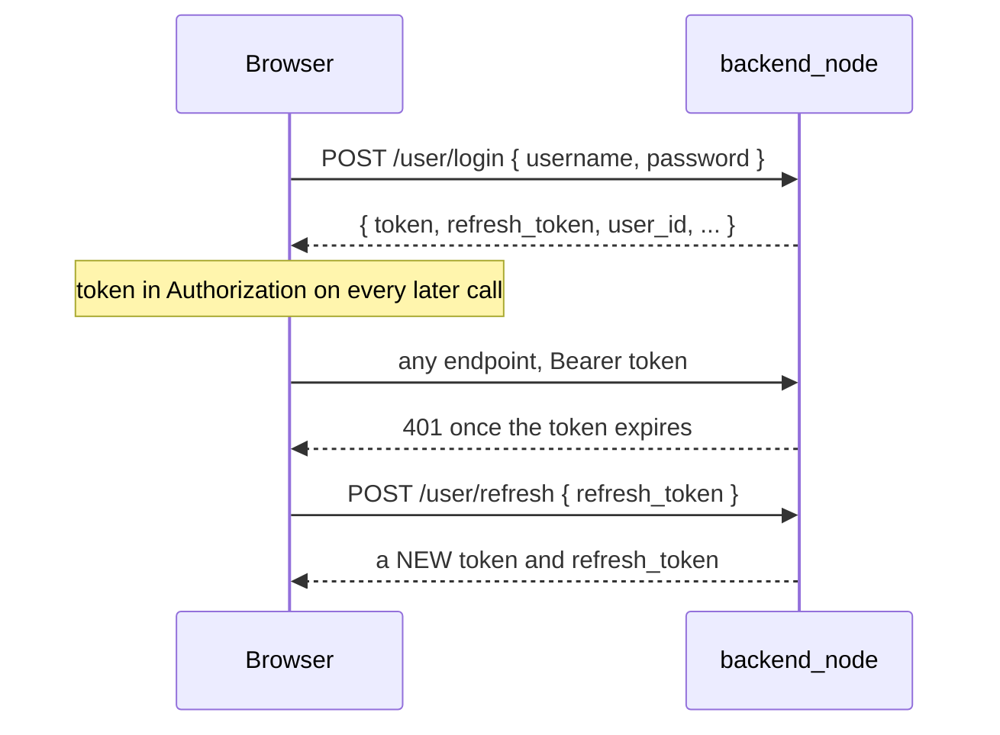
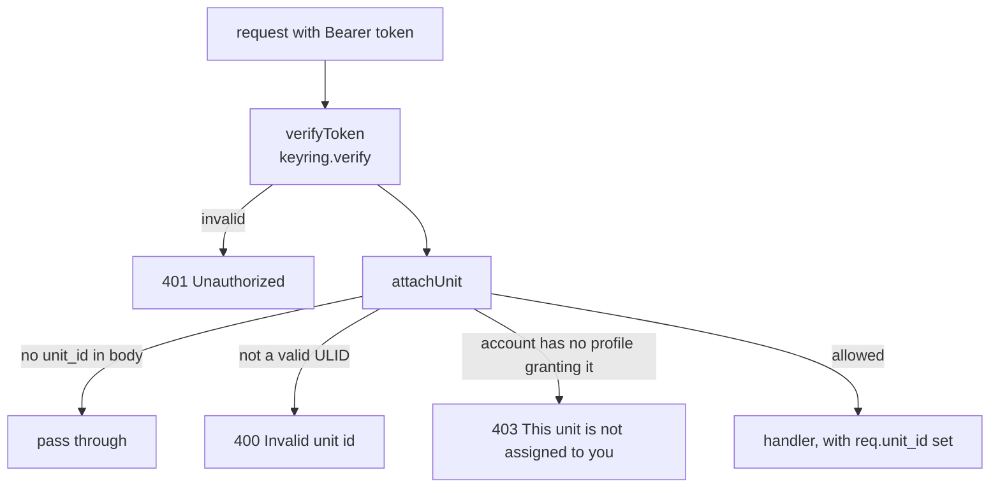

# API Reference

<RoleBadge role="developer" />

The HTTP surface of `backend_node` (Express), with request and response bodies. For the MQTT
payloads these endpoints wrap, see [Message Contracts](/development/message-contracts). For the
state machines behind them, see [State and Behavior](/development/state-and-behavior).

::: info This is read out of the handlers, not generated from a schema
There is no OpenAPI document. Shapes below come from the route handlers in
`ros-web-ui/source/dependencies/ROS-dashboard-backend/scripts/` (`backend_node`, `admin_api.js`,
`enroll_api.js`, `sync_api.js`). When a handler changes, this page changes in the same commit.
:::

## Conventions

### Base URLs

| Deployment | Base | Notes |
| --- | --- | --- |
| Production | `https://msd.nglobal.jp/services/rosbackend` | Apache proxies to `localhost:5000` |
| Dev | `http://<server-ip>:5001` | No proxy in front of it |
| Unit-local | `http://<unit-ip>:5002` | That unit's own `backend_local` |

### Authentication

```http
Authorization: Bearer <access token>
Content-Type: application/json
```

Tokens are HS256 JWTs verified against a **keyring** (`/run/secrets/jwt_keyring`), not a single
secret. The active key signs new tokens; recently rotated keys are still accepted for a grace window,
so rotating does not invalidate every session at once. See
[Maintenance](/setup/maintenance#rotating-secrets) for the operational side and
[Architecture](/development/architecture#trust-domains) for the trust boundaries.



| Token `typ` | Accepted by | Rejected by |
| --- | --- | --- |
| absent (legacy access) | everything | nothing |
| `refresh` | `/user/refresh` only | `verifyToken`, with `401` |
| `admin` | `/admin/api/*` | `verifyToken`, with `401`, because it carries no `user_id` |

`/user/refresh` is deliberately **not** behind `verifyToken`: the whole point is to be reachable
when the access token is already dead. Authorisation comes from the refresh token's own signature.
The old refresh token is not invalidated when a new pair is issued.

### How `unit_id` is resolved

Any endpoint that addresses a robot reads `unit_id` from the **request body** (or the query string
for `GET`). It is then validated and authorised by the `attachUnit` middleware, chained directly off
`verifyToken`:



Access is granted through **rental profiles**, never directly: an account sees a unit only if it is
a member of an active profile that includes that unit. Chaining `attachUnit` inside `verifyToken`
rather than registering it globally means no route can be added that addresses a unit without being
authorised for it.

### Response envelopes

```json
// success
{ "success": true, "msg": "Command executed successfully.", "details": { /* robot feedback */ } }

// failure
{ "success": false, "msg": "Human-readable reason" }

// list
{ "success": true, "data": [ /* rows */ ] }
```

| Status | Meaning |
| --- | --- |
| `200` | Handled. **Check `success`**: a robot that declined a command returns `200` with `success: false`, because the request itself was well formed |
| `201` | Resource created |
| `202` | Accepted, still pending (enrolment) |
| `400` | Malformed or invalid input |
| `401` | Missing, expired or wrong-type token |
| `403` | Authenticated, but not allowed this unit or this action |
| `404` | No such resource |
| `409` | Conflict: duplicate name, or an enrolment identity mismatch |
| `500` | Unhandled server error |
| `504` | The robot never answered within 30 s |

::: warning Robot-command endpoints can block for up to 30 seconds
Every endpoint marked **robot** below publishes over MQTT and holds the HTTP request open until the
matching `system_feedback` arrives. Timeout is `DEFAULT_TIMEOUT` = 30000 ms, and the command is
resent every 1500 ms in the meantime. A `504` means the robot is unreachable or not answering, which
is a different fact from a `500`.
:::

## Auth and accounts (`/user`)

| Method | Path | Body | Success |
| --- | --- | --- | --- |
| `POST` | `/user/register` | `{ username, email, full_name, password }` | `201` |
| `POST` | `/user/login` | `{ username, password }` | `200` with the token pair |
| `POST` | `/user/refresh` | `{ refresh_token }` | `200` with a new pair |
| `POST` | `/user/logout` | `{ force?: boolean }` | `200` |
| `POST` | `/user/check-username` | `{ username }` | `200` with availability |
| `POST` | `/user/check-email` | `{ email }` | `200` with availability |

```json
// POST /user/login  ->  200
{
  "success": true,
  "msg": "Login user success",
  "username": "operator1",
  "full_name": "Operator One",
  "user_id": "01JZ7YV5CQUSER00000000000",
  "token": "eyJhbGciOiJIUzI1NiIs...",
  "refresh_token": "eyJhbGciOiJIUzI1NiIs..."
}
```

A wrong username and a wrong password both return `401` with the same message, deliberately.

::: info `/user/register` is refused on a unit
A unit's `backend_local` answers `403 Accounts are created in the cloud, not on a unit.` Accounts are
cloud state; a unit caches them, it does not mint them.
:::

## Unit listing

| Method | Path | Body |
| --- | --- | --- |
| `GET` | `/unit/all` | none |

```json
{
  "success": true,
  "data": [
    {
      "id": "01JZ8P9WZ0UNIT00000000000",
      "unit_name": "Unit 03",
      "topic_root": "/unit_01JZ8P9WZ0UNIT00000000000",
      "profile_name": "Nakayama rental A",
      "created_at": "2026-07-14T08:12:00.000Z"
    }
  ]
}
```

Only units reachable through an **active** profile the account belongs to are listed. A suspended
profile drops out, which is how a finished rental stops showing up. `topic_root` ships ready-made so
the browser never has to know how an address is spelled.

## Unit control and operation (`/api`)

All of these take `unit_id` in the body in addition to the fields listed. All are **robot**
endpoints unless noted.

### Session and liveness

| Method | Path | Body | Notes |
| --- | --- | --- | --- |
| `POST` | `/api/hardware/ping` | `{ unit_id, session_id, claim, release, page, force_takeover }` | The lease, watchdog heartbeat and all telemetry. See [the ping payload](/development/message-contracts#the-ping-payload) |
| `POST` | `/api/unit/heartbeat` | `{ unit_id }` | **Not** a robot endpoint. Only touches the per-unit container's idle timer, so it returns immediately |
| `GET` | `/api/unit/shutdown-status` | `?unit_id=` | Poll a unit's shutdown and verification state |
| `POST` | `/api/unit/force-stop` | `{ unit_id }` | Administrative force-stop |

```json
// POST /api/hardware/ping
{
  "unit_id": "01JZ8P9WZ0UNIT00000000000",
  "session_id": "8b1c3f2a-6d55-4a1e-9f30-2c7a1b4e8d90",
  "claim": true,
  "release": false,
  "page": "navigation",
  "force_takeover": false
}
```

`user_id` and `origin` are **not** accepted from the body. The backend fills them from the verified
JWT and from its own `DEPLOYMENT_MODE`, so neither can be spoofed client-side.

### Hardware lifecycle

| Method | Path | Body |
| --- | --- | --- |
| `POST` | `/api/hardware/check` | `{ unit_id }` |
| `POST` | `/api/hardware/init` | `{ unit_id }` |
| `POST` | `/api/hardware/stop` | `{ unit_id }` |
| `POST` | `/api/hardware/idle` | `{ unit_id }` |

### Driving

| Method | Path | Body | Effect |
| --- | --- | --- | --- |
| `POST` | `/api/manual` | `{ unit_id, enable }` | Toggle W-A-S-D manual override |
| `POST` | `/api/autopilot` | `{ unit_id, enable }` | Toggle autopilot |
| `POST` | `/api/emergency_stop` | `{ unit_id, enable }` | `true` activates, `false` releases |
| `POST` | `/api/lidar` | `{ unit_id, enable, use_own_map }` | Lidar control |

Enabling manual override cancels any running autonomous goal and releases the emergency-pause lock;
velocities themselves are published to `mux/key_vel` over rosbridge, not through this endpoint.
Disabling zeroes the robot.

::: info Autopilot has side effects beyond the robot
`enable: false` also releases the backend's container retention immediately, rather than waiting for
the next verifier tick. Both directions pin the backend's view of the flag for a short window so a
ping already in flight cannot answer with the old value and silently undo the change.
:::

### Navigation

| Method | Path | Body |
| --- | --- | --- |
| `POST` | `/api/navigation/init` | `{ unit_id, map_id, map_path? }` |
| `POST` | `/api/navigation/deactivate` | `{ unit_id }` |
| `POST` | `/api/navigation/pointstamped` | `{ unit_id, x, y, z }` |

```json
// POST /api/navigation/pointstamped
{ "unit_id": "01JZ8P9WZ0UNIT00000000000", "x": 3.1416, "y": -1.2, "z": 0.0 }
```

`x`, `y` and `z` must all be numbers or the request is `400`. They are rounded to four decimal
places before being sent to the robot. `map_id` on `init` is the map's ULID; the backend looks the
homebase up from `maps_data` and attaches it to the robot command automatically.

### Mapping

| Method | Path | Body | Notes |
| --- | --- | --- | --- |
| `POST` | `/api/mapping` | `{ unit_id, start \| pause \| stop, map_name?, homebase_* }` | Exactly one of `start`, `pause`, `stop` must be true |
| `POST` | `/api/mapping/discard` | `{ unit_id }` | |
| `GET` | `/api/mapping/progress/:request_id` | none | Poll the save progress. **No auth** |

```json
// POST /api/mapping  { "unit_id": "...", "stop": true, "map_name": "Warehouse ground floor" }
// -> 200, immediately
{
  "success": true,
  "request_id": "0b0d1f4e-6a2c-4c7e-9a51-1f1b6f7a2f10",
  "map_ulid": "01JZ8QK2H0000000000000MAP",
  "msg": "Map save initiated. Track progress via /api/mapping/progress/:request_id"
}
```

::: warning `stop` is the one command that does not wait for the robot
Saving a map takes longer than the 30 s feedback timeout, so this returns straight away and the
dashboard opens an SSE stream for the outcome. `start` and `pause` use the normal wait-for-feedback
path. If `map_name` is empty, a `YYYY-MM-DD_HH-MM-SS` display name is generated; the **filename** is
always a fresh ULID. `homebase_*`, when present, lands in the same request that creates the map row
— there is no separate follow-up call.
:::

::: info A map is written to two media servers, one of them optional
The robot stores the finished map on its own media server (required) and the cloud's (best effort)
in the same `stop`. `mapping start` refuses outright if the required target is not reachable, but
only warns if the optional one is not — the map is saved on the robot regardless, and the cloud copy
follows through sync. See [Message Contracts § mapping](/development/message-contracts#mapping) for
the exact `outcome` values the progress stream reports, and
[State and Behavior § Map storage](/development/state-and-behavior#map-storage) for the state
machine behind it.
:::

### Area coverage

| Method | Path | Body |
| --- | --- | --- |
| `POST` | `/api/boustrophedon/init` | `{ unit_id, use_autocover?, polygon?, areas?, exclusions? }` |
| `POST` | `/api/boustrophedon/pause` | `{ unit_id, pause }` |
| `POST` | `/api/boustrophedon/deactivate` | `{ unit_id, use_autocover? }` |

```json
// POST /api/boustrophedon/init
{
  "unit_id": "01JZ8P9WZ0UNIT00000000000",
  "use_autocover": false,
  "areas": [
    [ { "x": 0.0, "y": 0.0 }, { "x": 4.0, "y": 0.0 }, { "x": 4.0, "y": 3.0 } ]
  ],
  "exclusions": [
    [ { "x": 1.0, "y": 1.0 }, { "x": 2.0, "y": 1.0 }, { "x": 2.0, "y": 2.0 } ]
  ]
}
```

`use_autocover` must be a boolean or the request is `400`, and the value passed to `deactivate` must
**match** the one passed to `init`, or the robot stops the wrong feature instance.

### Auto Align

| Method | Path | Body |
| --- | --- | --- |
| `POST` | `/api/autoalign/start` | `{ unit_id }` |
| `POST` | `/api/autoalign/status` | `{ unit_id }` |
| `POST` | `/api/autoalign/reset` | `{ unit_id }` |

## Maps (`/api`)

| Method | Path | Body | Notes |
| --- | --- | --- | --- |
| `GET` | `/api/maps_data` | none | Every map this account can see |
| `GET` | `/api/maps/:mapId` | none | One map |
| `POST` | `/api/maps_data/check` | `{ map_name }` | Name availability |
| `PUT` | `/api/maps_data/rename/:mapId` | `{ new_map_name }` | |
| `PUT` | `/api/maps_data/homebase/:mapId` | `{ x, y, z, ox, oy, oz, ow }` | Position plus orientation quaternion |
| `DELETE` | `/api/maps_data` | `{ map_id, map_name }` | Removes the row **and** the files |

```json
// GET /api/maps_data -> data[]
{
  "id": "01JZ8QK2H0000000000000MAP",
  "map_name": "Warehouse ground floor",
  "unit_id": "01JZ8P9WZ0UNIT00000000000",
  "unit_name": "Unit 03",
  "created_by": "01JZ7YV5CQUSER00000000000",
  "created_by_username": "operator1",
  "modified_by": "01JZ7YV5CQUSER00000000000",
  "modified_by_username": "operator1",
  "created_at": "2026-07-14T08:12:00.000Z",
  "modified_at": "2026-08-02T11:40:12.000Z",
  "file_size_pgm": 1048576,
  "file_size_yaml": 143,
  "file_size_image": 220114,
  "homebase_x": 1.25, "homebase_y": -0.5, "homebase_z": 0.0,
  "homebase_ox": 0.0, "homebase_oy": 0.0, "homebase_oz": 0.0, "homebase_ow": 1.0
}
```

::: info Every table uses `created_at` / `modified_at`
The timestamp columns were unified across `ROS_DB` on 2026-08-01, and the API field names changed
with them. Anything still reading `date_created` or similar is talking to a pre-migration schema.
:::

## Routes, areas and playlists (`/api`)

All three follow the same shape: create returns `201` with the new ULID, a duplicate name in the
same map returns `409`, and any write stamps `modified_by` / `modified_at` on the parent map before
replying, so a client that refetches on success cannot read its own change as stale.

### Routes

| Method | Path | Body |
| --- | --- | --- |
| `GET` | `/api/routes/:map_id` | none |
| `POST` | `/api/routes` | `{ route_name, map_id, route_points }` |
| `PUT` | `/api/routes/:id` | `{ route_name }` |
| `DELETE` | `/api/routes/:id` | none |

```json
// POST /api/routes -> 201
{ "success": true, "msg": "Route saved successfully", "data": { "route_id": "01JZ..." } }
```

### Areas

| Method | Path | Body |
| --- | --- | --- |
| `GET` | `/api/areas/:map_id` | none |
| `POST` | `/api/areas` | `{ area_name, map_id, area_type, polygon_points }` |
| `PUT` | `/api/areas/:id` | `{ area_name }` |
| `DELETE` | `/api/areas/:id` | none |

```json
// POST /api/areas
{
  "area_name": "Aisle 4",
  "map_id": "01JZ8QK2H0000000000000MAP",
  "area_type": "cover",
  "polygon_points": [ { "x": 0.0, "y": 0.0 }, { "x": 4.0, "y": 0.0 }, { "x": 4.0, "y": 3.0 } ]
}
```

`area_type` is `cover` or `no_cover`; anything else is `400`. Points are ROS coordinates.

### Playlists

| Method | Path | Body |
| --- | --- | --- |
| `GET` | `/api/playlists/:map_id` | none |
| `POST` | `/api/playlists` | `{ playlist_name, map_id, items }` |
| `PUT` | `/api/playlists/:id` | `{ playlist_name?, items? }` |
| `DELETE` | `/api/playlists/:id` | none |

```json
// one entry of items[]
{
  "area_id": "01JZ...",
  "area_name": "Aisle 4",
  "area_type": "cover",
  "polygon_points": [ { "x": 0.0, "y": 0.0 }, { "x": 4.0, "y": 0.0 } ]
}
```

::: info Playlist items snapshot their polygon
`area_id` may be `null`, and the geometry is copied into the item rather than referenced. A playlist
still runs correctly after its source area is renamed or deleted.
:::

::: info Renaming is not the same rule everywhere
Inline rename on routes, areas and playlists strips spaces and auto-suffixes a duplicate as `(1)`,
`(2)`, and so on. Map rename **rejects** a duplicate outright instead. The two are deliberately
different: a map name is a filesystem-adjacent identity, a route name is a label.
:::

## Unit-local endpoints (`/local`)

Served by a **unit's own** `backend_local`, never by the cloud backend.

| Method | Path | Purpose |
| --- | --- | --- |
| `GET` | `/local/robot-token` | Issue a token scoped to this unit's own services |
| `GET` | `/local/status` | This unit's live status |
| `POST` | `/local/sync` | Trigger a sync cycle against the cloud |

::: warning Two things that are easy to get wrong here
`/local/robot-token` **rejects** tokens minted by the cloud. That is the whole point: a cloud-signed
credential is not valid in the unit's trust domain, which is why `camera_client` has to ask for one
of these before the unit's own signalling server will accept it.

`/local/status` reads `device.json` **live**, not the environment the process started with, so a
freshly enrolled unit reports its real identity without a restart.
:::

## Enrolment (`/enroll`)

Used by `scripts/enroll.py` on first boot and by the admin console to approve a pending unit. Full
payloads and the security model are in
[Message Contracts](/development/message-contracts#enrolment); the operator-facing flow is in
[Unit Setup](/setup/unit-setup#the-unit-enrols-itself).

| Method | Path | Purpose |
| --- | --- | --- |
| `POST` | `/enroll/claim` | Robot announces itself, receives a claim code |
| `POST` | `/enroll/status` | Robot polls, and collects its credential once approved |
| `POST` | `/enroll/token` | Routine re-mint from the device secret, every boot |

None are behind `verifyToken`: a robot calling them has nothing to authenticate with yet. What
guards them is a per-IP rate limit (`ENROLL_RATE_MAX`, 30/min), a hard pool cap
(`ENROLL_PENDING_CAP`, 200), the fact that a pending row grants nothing until an admin acts, and the
nonce.

## Sync (`/sync`)

Keeps a unit's local cache and the cloud's copy consistent. Runs on **both** sides: a unit's
`sync_agent.js` calls the cloud's `/sync/*`, and the cloud can pull from a unit the same way.

| Method | Path | Body |
| --- | --- | --- |
| `POST` | `/sync/handshake` | negotiate state |
| `POST` | `/sync/pull` | `{ since }` |
| `POST` | `/sync/push` | `{ payload, clock_offset_ms }` |
| `POST` | `/sync/ack` | `{ up_to }` |
| `GET` / `PUT` | `/sync/file/:mapId/:kind` | raw map file body |
| `GET` / `PUT` | `/sync/route-file/:routeId/:kind` | raw route file body |

`clock_offset_ms` exists because the two sides do not share a clock. File transfers send raw bytes,
not JSON, and an empty upload is rejected with `400`.

::: warning `migrate_sync.js` has to run on both sides
The sync tables must exist on the unit and on the cloud. Running the migration on one side only
produces a handshake that succeeds and a sync that quietly transfers nothing.
:::

## Admin console (`/admin/api`)

Everything the admin console UI uses. All of it requires an admin-scoped token from
`POST /admin/api/login`, which is a separate audience from operator accounts.

### Admin accounts

| Method | Path | Purpose |
| --- | --- | --- |
| `POST` | `/admin/api/login` | Admin login |
| `GET` / `PATCH` | `/admin/api/me` | Current admin's profile |
| `POST` | `/admin/api/me/password` | Change own password |
| `GET` / `POST` | `/admin/api/admins` | List / create admin accounts |
| `PATCH` | `/admin/api/admins/:id/password` \| `/status` | Manage an admin |
| `DELETE` | `/admin/api/admins/:id` | Remove an admin |

### User accounts

| Method | Path | Purpose |
| --- | --- | --- |
| `GET` / `POST` | `/admin/api/users` | List / create user accounts |
| `PATCH` | `/admin/api/users/:id/password` \| `/status` | Manage a user |

### Enrolment approval

| Method | Path | Purpose |
| --- | --- | --- |
| `GET` | `/admin/api/pending-units` | List units awaiting approval |
| `POST` | `/admin/api/pending-units/:id/register` | Approve as a **new** unit |
| `POST` | `/admin/api/pending-units/:id/adopt` | Adopt onto an **existing** unit's ULID (hardware swap) |
| `DELETE` | `/admin/api/pending-units/:id` | Reject a pending claim |

### Units

| Method | Path | Purpose |
| --- | --- | --- |
| `GET` / `POST` | `/admin/api/units` | List / manually register |
| `PATCH` / `DELETE` | `/admin/api/units/:id` | Update metadata / remove |
| `DELETE` | `/admin/api/units/:id/device` | Clear the cached device identity, forcing re-enrolment |
| `DELETE` | `/admin/api/units/:id/data` | Delete a unit's stored data |
| `POST` | `/admin/api/units/:id/swap` | Swap hardware onto this unit id |
| `POST` | `/admin/api/units/:id/transfer` | Transfer a unit between profiles |
| `POST` | `/admin/api/units/:id/enrollment-code` | Mint a single-use enrolment voucher |

### Rental profiles

| Method | Path | Purpose |
| --- | --- | --- |
| `GET` / `POST` | `/admin/api/profiles` | List / create |
| `GET` / `PATCH` / `DELETE` | `/admin/api/profiles/:id` | Manage one |
| `POST` / `DELETE` | `/admin/api/profiles/:id/units[/:unitId]` | Grant / revoke unit access |
| `POST` / `DELETE` | `/admin/api/profiles/:id/members[/:userId]` | Add / remove a member |

::: info Profiles are the only access mechanism
A unit existing and being enrolled does not make it visible to any account. Units are shared,
fleet-wide resources; access runs entirely through profiles, and a suspended profile removes access
without touching either the unit or the account.
:::

### Backups

| Method | Path | Purpose |
| --- | --- | --- |
| `GET` | `/admin/api/backups` | List archives |
| `POST` | `/admin/api/profiles/:id/backups` | Create a profile-scoped archive |
| `POST` | `/admin/api/units/:id/backups` | Create a unit-scoped archive |
| `GET` | `/admin/api/backups/:id/download` | Download |
| `POST` | `/admin/api/backups/upload` | Upload |
| `POST` | `/admin/api/backups/:id/plan` | Preview a restore: remapping and conflicts |
| `POST` | `/admin/api/backups/:id/restore` | Restore, additively |
| `DELETE` | `/admin/api/backups/:id` | Delete an archive |

::: warning Always run `plan` before `restore`
Restores are additive and a unit named in an archive may no longer exist. `plan` reports exactly
that: which units would be remapped, and what would conflict. A profile-scoped archive always
creates a new profile on restore; a unit-scoped archive binds to a live profile.
:::

## Related

- [Message Contracts](/development/message-contracts): the MQTT payloads behind the robot endpoints
- [State and Behavior](/development/state-and-behavior)
- [Architecture](/development/architecture)
- [Contributing](/development/contributing)
