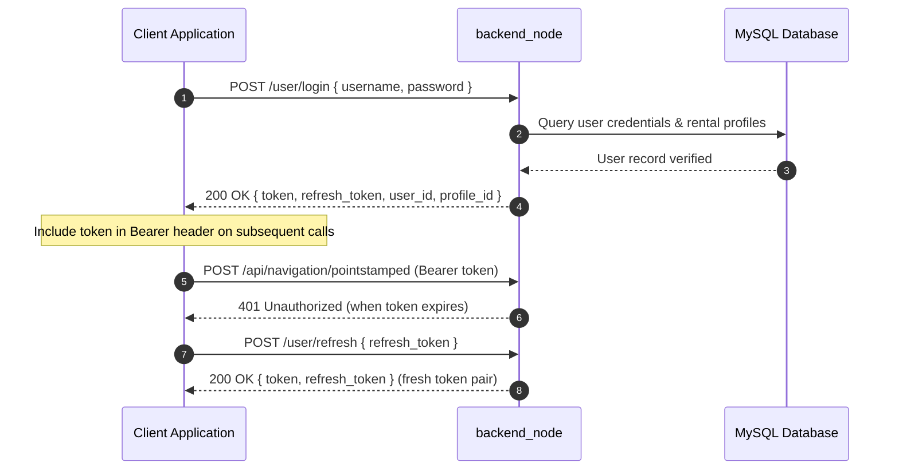
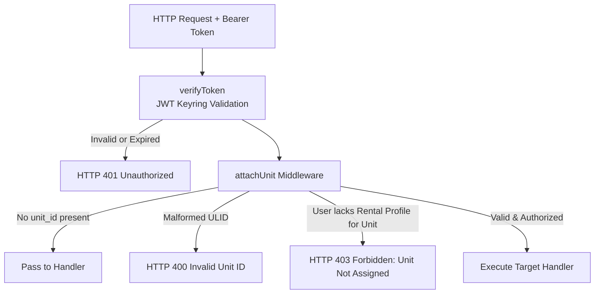

# API Reference

<RoleBadge role="developer" />

This document is the complete REST API reference for `backend_node` (Express API server), detailing all endpoints, authentication mechanisms, request parameters, response structures, and HTTP status codes.

For MQTT payloads wrapped by these endpoints, see [Message Contracts](/development/message-contracts). For finite state machines, see [State and Behavior](/development/state-and-behavior). For system architecture, see [Architecture](/development/architecture).

## API Conventions

### Base URLs

| Environment | Base URL | Routing Description |
| --- | --- | --- |
| **Production Server** | `https://msd.nglobal.jp/services/rosbackend` | Reverse-proxied via Apache2 to `localhost:5000` |
| **Development Server** | `http://<server-ip>:5001` | Direct HTTP access to development backend container |
| **Unit Local Server** | `http://<unit-ip>:5002` | Direct HTTP access to Jetson SBC onboard `backend_local` |

### Authentication and Authorization

All protected routes require an HTTP `Authorization` header carrying a JSON Web Token (JWT):

```http
Authorization: Bearer <access_token>
Content-Type: application/json
```

Tokens are cryptographically signed using HS256 and validated against a shared keyring (`/srv/msd/secrets/jwt_keyring`). The active secret key signs new tokens, while recently rotated keys remain valid during a transition grace period.



| Token Claim `typ` | Scope & Acceptance | Rejection Rules |
| --- | --- | --- |
| **Standard Operator** (absent or `operator`) | Full access to assigned robot fleet operations and maps. | Rejected if expired or signed with invalid secret. |
| `refresh` | Exclusively accepted on `/user/refresh`. | Rejected by standard API middleware with HTTP 401. |
| `admin` | Accepted on administrative routes (`/admin/api/*`). | Rejected by standard robot operator routes because it lacks user context. |

### Unit Authorization Middleware (`attachUnit`)

Whenever a request addresses a specific robot, the `unit_id` field in the request body (or query parameter) is processed through the `attachUnit` middleware:



## Standard Response Envelopes

### Success Response
```json
{
  "success": true,
  "msg": "Command executed successfully.",
  "details": {
    "status": true,
    "message": "Goal published to move_base"
  }
}
```

### Error Response
```json
{
  "success": false,
  "msg": "Robot rejected command: emergency stop active."
}
```

### Array / List Response
```json
{
  "success": true,
  "data": [
    {
      "id": 1,
      "ulid": "01JZ8QK2H0000000000000MAP",
      "display_name": "Main Warehouse Floor",
      "created_at": "2026-08-15T10:30:00Z"
    }
  ]
}
```

## Authentication Endpoints

### 1. User Login
`POST /user/login`

Authenticates an operator account and issues access/refresh tokens.

- **Request Body**:
```json
{
  "username": "operator1",
  "password": "SecurePassword123"
}
```
- **Response (200 OK)**:
```json
{
  "success": true,
  "token": "eyJhbGciOiJIUzI1NiIs...",
  "refresh_token": "eyJhbGciOiJIUzI1NiIs...",
  "user_id": "01JZ7YV5CQUSER00000000000",
  "role": "operator",
  "profile_id": 4
}
```

### 2. Token Refresh
`POST /user/refresh`

Exchanges a valid refresh token for a fresh token pair.

- **Request Body**:
```json
{
  "refresh_token": "eyJhbGciOiJIUzI1NiIs..."
}
```
- **Response (200 OK)**:
```json
{
  "success": true,
  "token": "eyJhbGciOiJIUzI1NiIs...",
  "refresh_token": "eyJhbGciOiJIUzI1NiIs..."
}
```

## Unit Management and Fleet Operations

### 1. List Accessible Units
`GET /api/units`

Returns all enrolled robots assigned to the authenticated user's active rental profile.

- **Headers**: `Authorization: Bearer <token>`
- **Response (200 OK)**:
```json
{
  "success": true,
  "data": [
    {
      "unit_id": "01JZ8P9WZ0UNIT00000000000",
      "unit_name": "Unit 01",
      "model": "MSD700",
      "status": "online",
      "is_in_use": false,
      "active_page": "navigation",
      "battery": 94.2
    }
  ]
}
```

### 2. Robot Heartbeat Ping
`POST /api/units/ping`

Transmits liveness heartbeat, updates operating lease, and returns current telemetry.

- **Headers**: `Authorization: Bearer <token>`
- **Request Body**:
```json
{
  "unit_id": "01JZ8P9WZ0UNIT00000000000",
  "session_id": "8b1c3f2a-605d-4871-bc01-e28a9b3d1f04",
  "claim": true,
  "release": false,
  "page": "navigation",
  "force_takeover": false
}
```
- **Response (200 OK)**:
```json
{
  "success": true,
  "data": {
    "status": true,
    "robot_activity": "navigation_point_published",
    "battery": 91.0,
    "uptime": 128.5,
    "hw_status": "ready",
    "manual_override": false,
    "autopilot": false,
    "in_use": false,
    "origin_conflict": false
  }
}
```

### 3. Emergency Stop / Pause
`POST /api/hardware/emergency`

Toggles hardware emergency stop or motion pause.

- **Headers**: `Authorization: Bearer <token>`
- **Request Body**:
```json
{
  "unit_id": "01JZ8P9WZ0UNIT00000000000",
  "action": "activate"
}
```
- **Response (200 OK)**:
```json
{
  "success": true,
  "msg": "Emergency stop state updated."
}
```

## Navigation and Mission Dispatch

### 1. Initialize Navigation Mode
`POST /api/navigation/init`

Launches the navigation stack on the robot with a specified map.

- **Headers**: `Authorization: Bearer <token>`
- **Request Body**:
```json
{
  "unit_id": "01JZ8P9WZ0UNIT00000000000",
  "map_id": "01JZ8QK2H0000000000000MAP"
}
```

The map must be one this unit recorded, inside a rental the caller is on. A map that is visible to
the caller but belongs to a **different** robot is refused here with `404` and
`"That map does not belong to this unit"`. Before 2026-09-10 it was forwarded: the robot then tried
to fetch map files it had never uploaded, navigation never came up, and the failure surfaced only in
the unit's logs while the dashboard had already shown a successful start.

### 2. Dispatch Waypoint Goal
`POST /api/navigation/pointstamped`

Sends a single target destination coordinate to the robot's navigation stack.

- **Headers**: `Authorization: Bearer <token>`
- **Request Body**:
```json
{
  "unit_id": "01JZ8P9WZ0UNIT00000000000",
  "X": 5.25,
  "Y": -3.10,
  "Z": 0.0
}
```

### 3. Start Boustrophedon Area Coverage
`POST /api/boustrophedon/init`

Launches autonomous boustrophedon sweep coverage over defined polygon boundaries.

- **Headers**: `Authorization: Bearer <token>`
- **Request Body**:
```json
{
  "unit_id": "01JZ8P9WZ0UNIT00000000000",
  "areas": [
    [
      { "x": 0.0, "y": 0.0 },
      { "x": 12.0, "y": 0.0 },
      { "x": 12.0, "y": 6.0 },
      { "x": 0.0, "y": 6.0 }
    ]
  ],
  "exclusions": [
    [
      { "x": 4.0, "y": 2.0 },
      { "x": 6.0, "y": 2.0 },
      { "x": 6.0, "y": 4.0 },
      { "x": 4.0, "y": 4.0 }
    ]
  ]
}
```

## Mapping (SLAM) Operations

### 1. Start Mapping Session
`POST /api/mapping/start`

Initiates SLAM (gmapping) mode on the target unit.

- **Request Body**: `{ "unit_id": "01JZ8P9WZ0UNIT00000000000" }`

### 2. Stop Mapping and Save Map
`POST /api/mapping/stop`

Saves the active occupancy grid, generates thumbnail metadata, and uploads assets.

- **Request Body**:
```json
{
  "unit_id": "01JZ8P9WZ0UNIT00000000000",
  "display_map_name": "Warehouse Sector 4",
  "homebase_x": 0.0,
  "homebase_y": 0.0
}
```
- **Response (200 OK)**:
```json
{
  "success": true,
  "request_id": "9b1deb4d-3b7d-4bad-9bdd-2b0d7b3dcb6d",
  "map_ulid": "01JZ8QK2H0000000000000MAP"
}
```

## Map and Route Data Management

### 1. List Maps
`GET /api/maps_data?unit_id=<unit ULID>`

`unit_id` is optional on the wire and mandatory in practice for anything an operator sees. Without
it the response is every map in the caller's rental scope, which is what the archive and admin
views want. With it the list is narrowed to the maps that robot recorded, which is what the
Database page needs: a rental can hold several robots, and a map recorded by a sibling cannot be
navigated on this one. Passing a unit the caller has no active rental on is a `403`, not an empty
list. `GET /api/maps/:mapId` takes the same parameter and applies the same scope.

- **Response (200 OK)**:
```json
{
  "success": true,
  "data": [
    {
      "id": "01JZ8QK2H0000000000000MAP",
      "map_name": "Warehouse Ground Floor",
      "unit_id": "01JZ7K3M9QA0B1C2D3E4F5G6H7",
      "unit_name": "unit1",
      "created_by_username": "operator1",
      "modified_by_username": "operator1",
      "created_at": "2026-08-10T14:20:00Z",
      "modified_at": "2026-08-10T14:20:00Z",
      "homebase_x": 0.0,
      "homebase_y": 0.0
    }
  ]
}
```

::: warning Map names are only unique per (unit, rental)
Two robots on one rental may each hold a map called `hazard test`, and they are different maps with
different ULIDs. Do not deduplicate a map list by name: dropping the second entry drops a real map
and keeps a neighbouring robot's, and opening that name then resolves to a ULID the robot cannot
load. Deduplicate by `id`, and scope by `unit_id`.
:::

### 2. Save Custom Waypoint Route
`POST /api/routes`

- **Request Body**:
```json
{
  "profile_id": 4,
  "map_id": "01JZ8QK2H0000000000000MAP",
  "route_name": "Inspection Loop Alpha",
  "route_type": "round-trip",
  "waypoints": [
    { "x": 1.0, "y": 2.0, "yaw": 0.0 },
    { "x": 5.0, "y": 2.0, "yaw": 1.57 }
  ]
}
```

## Auto Align System

`POST /api/autoalign/start`

Initiates particle filter convergence validation and automatic orientation alignment against reference geometry.

- **Request Body**: `{ "unit_id": "01JZ8P9WZ0UNIT00000000000" }`
- **Response (200 OK)**:
```json
{
  "success": true,
  "msg": "Auto align algorithm initiated."
}
```

## Related Documentation

- [Message Contracts](/development/message-contracts): MQTT and ROS topic serialization formats.
- [State and Behavior](/development/state-and-behavior): Detailed state machines and failure transitions.
- [Database Schema](/development/database-schema): MySQL tables and entity relationship models.
