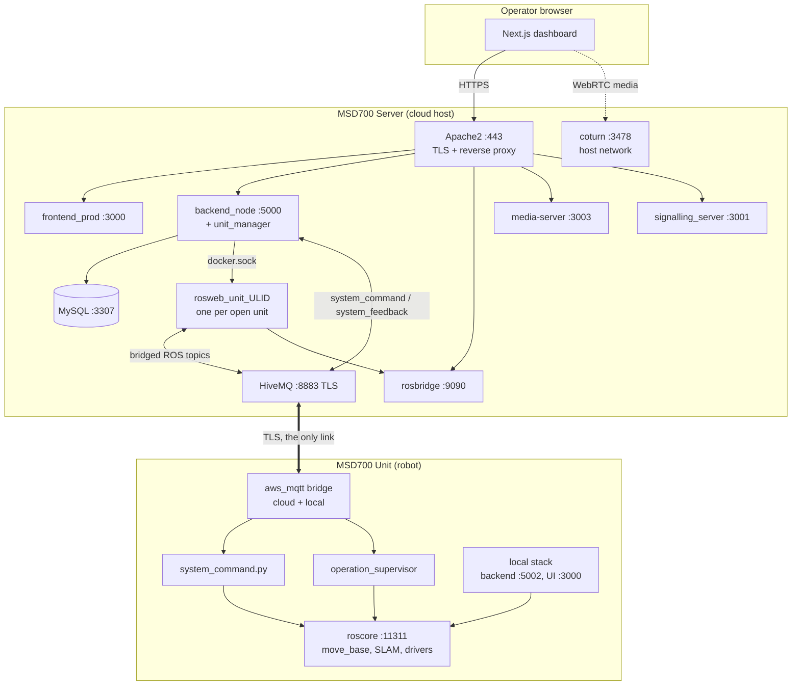
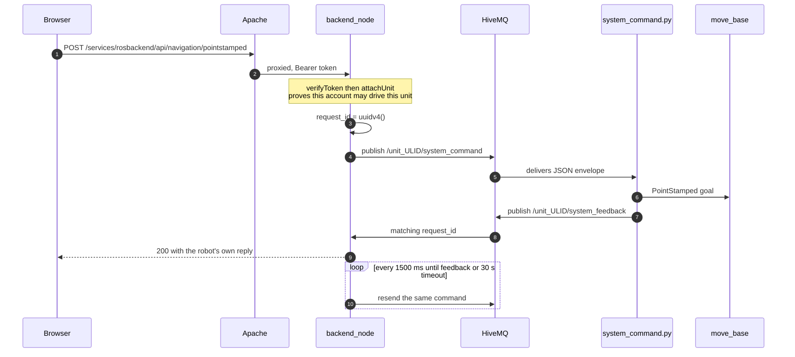
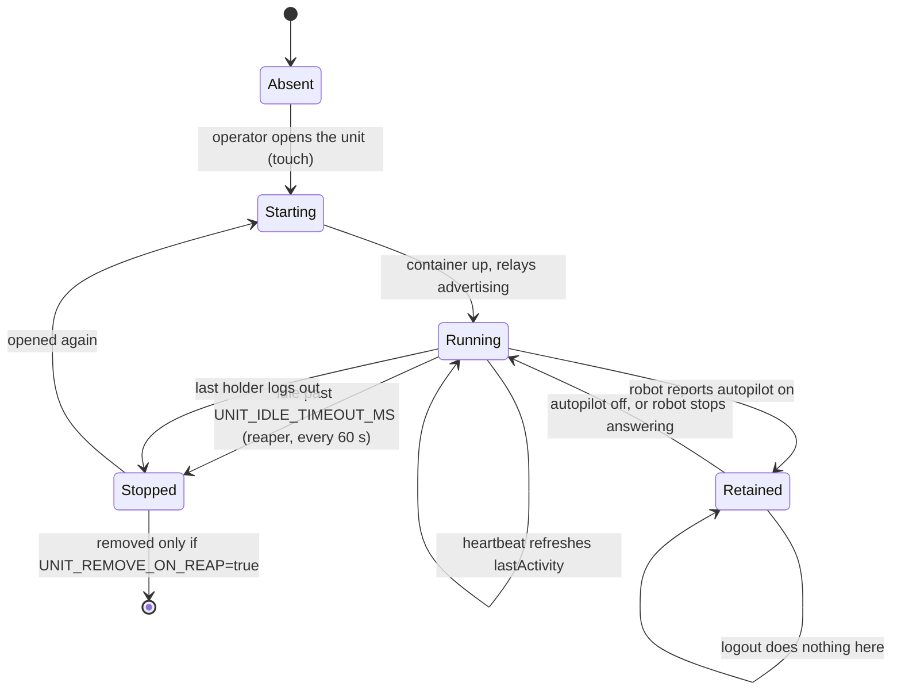
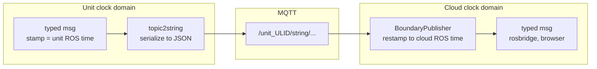
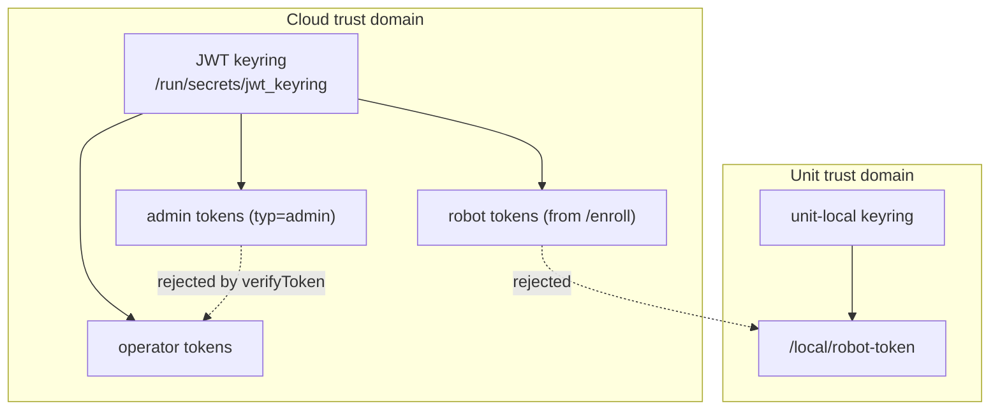
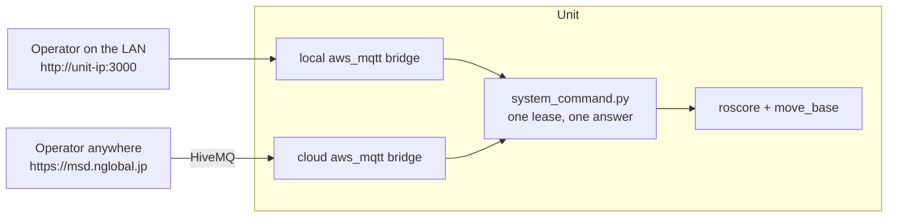

# Architecture

<RoleBadge role="developer" />

How MSD700 is put together, and why the seams are where they are. See
[Repository Structure](/development/repository-structure) for where each piece lives in source,
[Message Contracts](/development/message-contracts) for the exact payloads that cross each seam,
[State and Behavior](/development/state-and-behavior) for the state machines that consume them, and
[System Setup](/setup/system-setup) for the deployment-time view of the same components.

## The two-machine model

Everything follows from one decision: a **Unit** (the robot) runs the entire server stack itself,
and a **Server** (the cloud) runs the same stack for the whole fleet. They are not client and
server in the usual sense. They are two peers that hold the same kinds of data, joined by a single
MQTT link.

| | MSD700 Unit | MSD700 Server |
| --- | --- | --- |
| Runs | ROS 1 Noetic bringup, navigation, SLAM, drivers, **plus** its own backend, rosbridge, MySQL, MQTT broker, media server, dashboard | backend, rosbridge, MySQL, MQTT broker, media server, signalling server, dashboard, TURN relay |
| Owns | live robot state, the operating lease, the map files it recorded | accounts, rental profiles, unit registry, the fleet-wide copy of maps and routes |
| Survives | total loss of internet | a robot being switched off |
| Cannot do alone | assign its own identity (needs one cloud enrolment, ever) | move a robot |

The consequence worth internalising: **local is a cache of the cloud, not a silo.** A unit works
offline indefinitely once enrolled, but its identity and its accounts come from the cloud, and its
maps sync back to the cloud when the link returns.

## Components

| Component | Responsibility | Where it lives |
| --- | --- | --- |
| **Frontend** (`ROS-dashboard-next-ts`) | Operator dashboard (Next.js). Built twice from one codebase: `frontend_prod` / `frontend_dev` on the Server, and a `frontend_local` build baked into every Unit. | `ros-web-ui/source/dependencies/ROS-dashboard-next-ts` |
| **backend_node** (`ROS-dashboard-backend`) | Express API: auth, CRUD for maps/routes/areas/playlists, unit control endpoints, admin console API, enrolment, cross-device sync. Also an MQTT client in its own right, and the host of `unit_manager.js`. | `ros-web-ui/source/dependencies/ROS-dashboard-backend` |
| **unit_manager.js** | Starts and stops one Docker container per unit on demand, over the mounted Docker socket. Reaps idle ones. | inside `backend_node`'s process |
| **rosbridge** | WebSocket bridge from ROS topics and services to the browser: live map, robot pose, laser scan, plans. | part of the `nakayama_cloud` / `nakayama_cloud_dev` container (`rosbridge_suite`) |
| **HiveMQ (MQTT)** | The only channel between a Unit and the cloud. TLS, one broker for prod (`8883`), one for dev (`8884`). | `hivemq` / `hivemq_dev` containers |
| **MySQL** | Accounts, profiles, units, map and route metadata, backup manifests, sync journals. | `db` / `db_dev` containers |
| **media-server** | Serves map images (`.pgm`, `.yaml`, thumbnails) and receives uploaded map data. A Unit runs its own; a finished map is uploaded to **both** the Unit's copy (required) and the cloud's (best effort) in the same operation — see [State and Behavior § Map storage](/development/state-and-behavior#map-storage). | `ros-web-ui/source/dependencies/media-server` |
| **signalling_server** | WebRTC signalling for the live camera feed. Peer negotiation only; the video itself is peer to peer. | `ros-web-ui/source/dependencies/signalling_server` |
| **coturn** | TURN/STUN relay for WebRTC when no direct peer path exists. **Production only**, `network_mode: host`. | `docker-compose.yml` service `coturn` |
| **Apache2** | TLS termination and reverse proxy. Maps every service onto a clean `/services/...` path so no browser code ever names a port. | host, not a container |
| **ROS packages** | `msd700_robot` (navigation, SLAM, coverage, drivers) plus `ros-web-ui`'s `msd700_webui_*` packages (MQTT bridge, `topic2string`, `system_command`, `operation_supervisor`, camera client). | `msd700_robot/`, `ros-web-ui/source/` |

## System topology

Three things this diagram is trying to make obvious:

- **Apache is the only public surface.** Every port in the Server box is bound on localhost or
  reached through a `/services/...` path. The one exception is MQTT, which robots dial directly on
  `8883` because its TLS certificate is issued for the public hostname.
- **`backend_node` talks to robots over MQTT, not over ROS.** Commands and their acknowledgements
  ride `system_command` / `system_feedback` as an MQTT request/response pair. The ROS side of the
  cloud exists to feed the browser's map canvas, not to carry commands.
- **The per-unit container is a bridge, not a robot.** `rosweb_unit_<ULID>` runs the cloud-side
  relays that turn a unit's MQTT strings back into typed ROS messages, so rosbridge has something
  for the browser to subscribe to.

## Two channels, two failure modes

A unit is reachable over two independent paths, and they fail separately. Telling them apart is the
single most useful diagnostic skill in this system.

| Channel | Carries | Broken means |
| --- | --- | --- |
| **MQTT** (HiveMQ, TLS, internet) | Commands, feedback, pose, map, scan, plans, all of it as strings | The unit shows offline. Nothing works. |
| **rosbridge** (WebSocket, through Apache) | The browser's subscription to the cloud-side typed topics | The unit shows online and commands succeed, but the map canvas stays blank. |

A third, softer failure sits underneath both: the unit is online and rosbridge is connected, but
**nobody has opened that unit recently enough for its per-unit container to still be running**, so
the cloud-side relays that rosbridge subscribes to do not exist. Same blank canvas, different cause.

## Command path, end to end

What happens between clicking a point on the map and the robot moving:

Two properties fall out of this shape:

- **The HTTP response is the robot's answer, not the server's.** `backend_node` holds the request
  open until the matching `system_feedback` arrives, keyed by `request_id`. A `504` means the robot
  never answered, which is a genuinely different fact from a `500`.
- **Commands are retried, pings are not.** Every command is resent every 1500 ms until it is
  acknowledged, because MQTT drops messages. Pings are excluded on purpose: a lost ping is the exact
  signal the safety watchdog exists to observe, so masking it would disable the watchdog.

## The per-unit container lifecycle

`unit_manager.js` runs inside `backend_node` and manages one container per unit through the mounted
Docker socket (`/var/run/docker.sock`, docker-out-of-docker).

| Knob | Default | Effect |
| --- | --- | --- |
| `UNIT_MANAGER_ENABLED` | `true` on cloud, `false` when `DEPLOYMENT_MODE=local` | Whole feature on or off |
| `UNIT_IMAGE` | `ros-noetic-webui-app-v2:latest` (prod), `:dev` (dev) | Which image a unit container runs |
| `UNIT_IDLE_TIMEOUT_MS` | `1800000` (30 min) | How long a container survives with no activity |
| `UNIT_REAP_INTERVAL_MS` | `60000` | How often the reaper looks |
| `UNIT_REMOVE_ON_REAP` | `false` | Stop only, or stop and remove |
| `UNIT_MODE` | `prod` | Picks the container suffix, broker port and ROS master port |

Container naming is derived, not stored: `rosweb_unit_<ULID>_nakayama` in prod,
`rosweb_unit_<ULID>_nakayama_dev` in dev. The restart policy is `unless-stopped`, which is chosen
so that an explicit stop by the reaper sticks while a host reboot still brings active units back.

::: warning Retention is not the same as being held
A container whose robot is on autopilot is moved into a **retained** set. Retained containers are
skipped by the reaper *and* excluded from the logout teardown, because the operator who walks away
is precisely the one whose departure must not end the run. Retention is released by the robot
reporting autopilot off, never by a logout.
:::

## MQTT is a clock-domain boundary

The Unit's roscore and the cloud's roscore are two different ROS masters with two different clocks.
Every geometric message that crosses the broker is restamped to the receiving side's local ROS clock
on ingress, through a shared `BoundaryPublisher`.

Skip the restamp and you get `TF_OLD_DATA` warnings at best. At worst, if `/use_sim_time` disagrees
between the two masters, you get silent staleness: a map and a pose that both look plausible and are
both minutes old, with no error anywhere.

::: danger The related failure to recognise on sight
`/use_sim_time` stuck `true` on a master with no `/clock` publisher freezes navigation and mapping
outright, with TF errors mentioning "simulated time". Restarting the bringup does not fix it,
because the stale parameter lives on the ROS master rather than in any node. See
[Troubleshooting](/setup/troubleshooting).
:::

## Trust domains

There are three token issuers in this system and they do not accept each other's tokens.

- **Operator tokens** are HS256, verified against a keyring rather than a single secret. The active
  key signs; recently rotated keys are still accepted for a grace window, so a rotation does not log
  the fleet out. Refresh tokens (`typ=refresh`) are rejected everywhere except `/user/refresh`, and
  admin tokens (`typ=admin`) are rejected by the operator middleware because they carry no `user_id`.
- **Robot tokens** are minted by `/enroll/token` from the device secret, live 12 hours, and are
  re-minted on every boot.
- **Unit-local tokens** come from that unit's own `backend_local`. A cloud-signed token is rejected
  by unit-local services on purpose. This is why `camera_client` asks `/local/robot-token` for a
  credential the unit's own signalling server will accept, rather than reusing `token.cred`.
  `system_command.py` follows the same rule for its two media-server uploads: a fresh, per-target
  credential minted on every attempt, never cached, since caching one across the 12-hour token
  lifetime is what let a robot that had been up for more than a day fail every upload with a `401`.

## Local and cloud, per unit

Every unit runs both MQTT bridges unconditionally: one to its own Mosquitto broker on `127.0.0.1:1883`,
one to the cloud's HiveMQ. This is not a mode you opt into.

Both surfaces reach the same robot, so "who is driving" has to have exactly one answer. That answer
is the **operating lease**, held on the robot rather than in either backend, because the robot is the
only party that survives a backend restart, a closed browser and a reconnect. See
[State and Behavior](/development/state-and-behavior#the-operating-lease) for the rules.

## Related

- [Message Contracts](/development/message-contracts): every payload that crosses these seams
- [State and Behavior](/development/state-and-behavior): the state machines behind them
- [API Reference](/development/api-reference): the HTTP surface
- [Repository Structure](/development/repository-structure)
- [System Setup](/setup/system-setup): the deployment-time view
