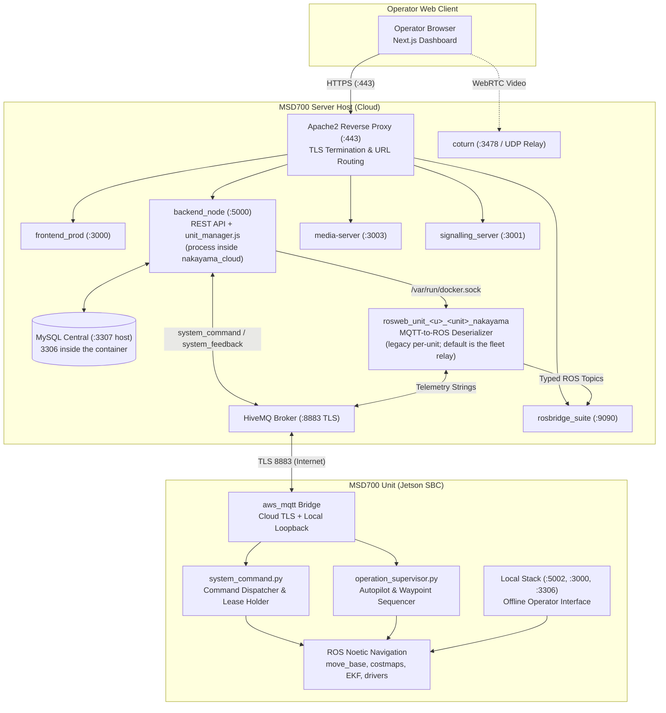
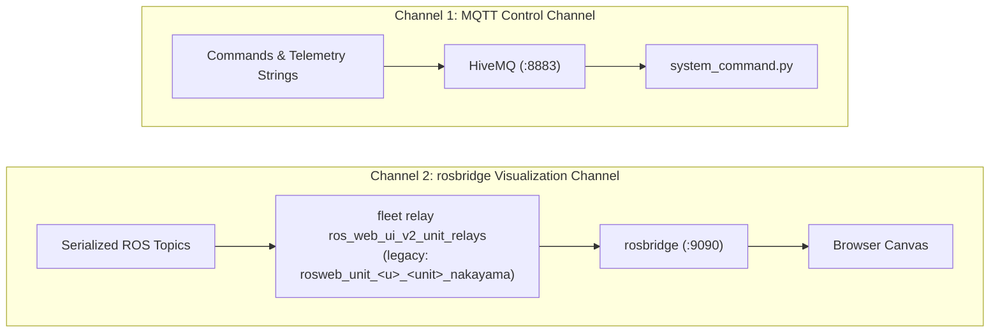
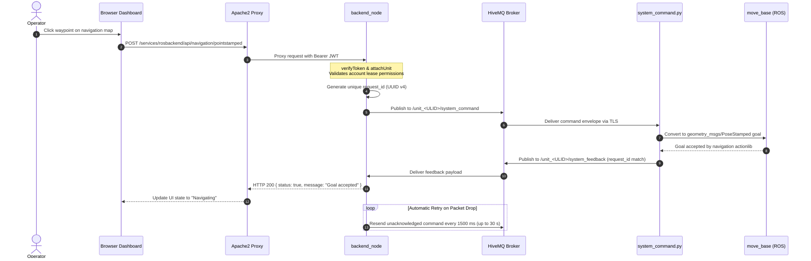
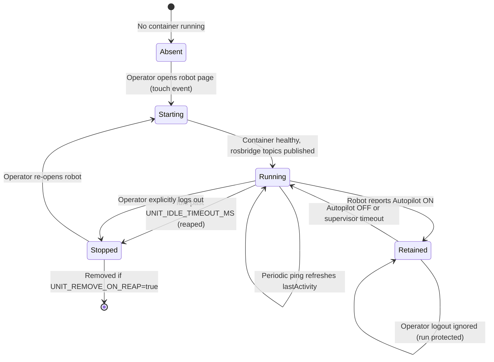
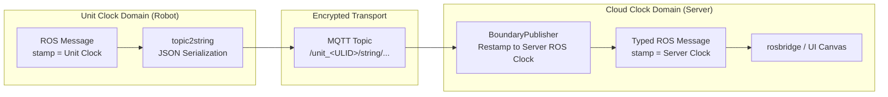
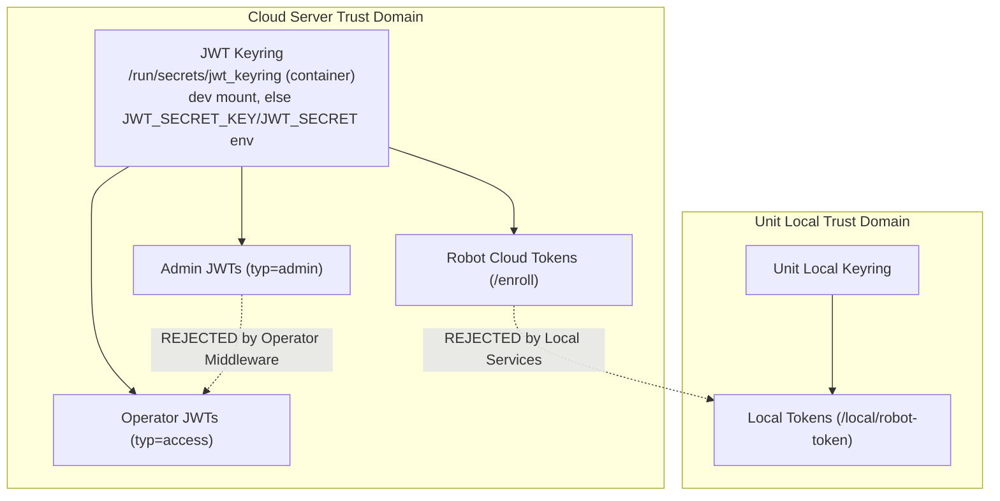
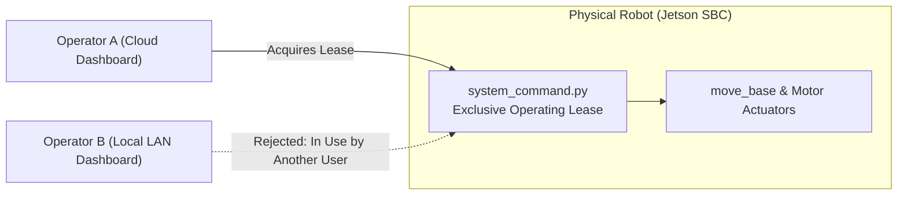

# Architecture

<RoleBadge role="developer" />

This document details the architectural design of the MSD700 autonomous robotics platform, explaining how the components interact, the data boundaries between them, and the engineering rationale behind every subsystem.

For repository locations, see [Repository Structure](/development/repository-structure). For exact data payloads, see [Message Contracts](/development/message-contracts). For finite state machines, see [State and Behavior](/development/state-and-behavior). For deployment topology, see [System Setup](/setup/system-setup).

## The Two-Machine Model

The central architectural decision of MSD700 is that **a Unit (the physical robot) runs a complete local server stack**, while the **MSD700 Server (the cloud)** runs the central management stack for the entire fleet. They are peers sharing identical data structures, connected via an encrypted MQTT transport.

| Dimension | MSD700 Unit (Robot) | MSD700 Server (Cloud) |
| --- | --- | --- |
| **Execution** | ROS 1 Noetic bringup, move_base, gmapping, sensor drivers, plus `backend_local`, `db_local`, `mosquitto_local`, and `frontend_local`. | Central `backend_node`, `db` (MySQL), `hivemq` (MQTT broker), `rosbridge`, `signalling_server`, `media-server`, and `frontend_prod`. |
| **Authority** | Owns the live physical robot, sensor readings, local operation lease, and raw map recordings. | Owns user accounts, authentication keyrings, rental profiles, robot enrolment registry, and fleet-wide synchronized maps/routes. |
| **Fault Tolerance** | Operates autonomously offline during complete loss of internet or Wi-Fi connectivity. | Survives robot shutdowns, network disconnects, and restarts without losing fleet metadata. |
| **Constraint** | Cannot assign its own global identity (requires initial cloud enrolment). | Cannot move a physical robot without an active robot connection. |

::: tip Core Design Principle: Local as Offline Cache
The unit's local stack is an **offline-first cache of the cloud, not an isolated silo**. An enrolled unit functions indefinitely without an active internet connection. When network connectivity is restored, recorded maps, executed routes, and configuration states automatically synchronize back to the cloud.
:::

## Component Overview

| Component | Technology | Responsibility | Host Location |
| --- | --- | --- | --- |
| **Frontend Dashboard** | Next.js, React, TypeScript | Single-page operator interface with map canvas, telemetry widgets, manual teleop, and navigation controls. | `ROS-dashboard-next-ts` (built as `frontend_prod`/`frontend_dev` on cloud and `frontend_local` on unit) |
| **backend_node** | Node.js, Express | Authentication middleware, CRUD for maps/routes/areas/playlists, robot command dispatch, and sync coordination. | Process inside the `nakayama_cloud` service (`ros-web-ui/source/dependencies/ROS-dashboard-backend`) |
| **multi_unit.py / cloud_multi.launch** | Python, ROS 1 Noetic | Multi-unit templated relay nodes serving all robots in a single unified ROS runtime via `/unit_<ULID>/...` namespaces. | Fleet relay container (`ros_web_ui_v2_unit_relays[_dev]`), deliberately separate from the backend so a code deploy is not a fleet-wide data-plane outage |
| **gen_bridge_params.py / nakayama_cloud_multi.launch** | Python, ROS 1 Noetic | Expands the MQTT bridge topic map over a roster of units so one `mqtt_client` nodelet and one TLS connection serve the whole fleet. | Fleet relay container (`ros_web_ui_v2_unit_relays[_dev]`) |
| **unit_manager.js (Legacy)** | Node.js (Docker API) | (Deprecated) Legacy dynamic container manager that instantiated 1 container per robot; replaced by the single ROS runtime multi-unit relays. | Embedded inside `backend_node` |
| **rosbridge** | `rosbridge_suite` (WebSocket) | Unified WebSocket bridge streaming live ROS topics for all units to browser canvases over port 9090 (9091 dev). | Inside the `nakayama_cloud` container and unit local stack |
| **HiveMQ (MQTT)** | HiveMQ CE (Java) | Encrypted, high-throughput message broker connecting robots to the server over port 8883 (TLS). | Server container (`hivemq` / `hivemq_dev`) |
| **MySQL Database** | MySQL 8.0 | Stores user accounts, rental profiles, enrolled unit records, route geometry, custom area boundaries, and sync journals. | Server (`db` / `db_dev`) and unit (`db_local`) |
| **media-server** | Node.js, Express | Manages map asset uploads, thumbnail generation, and serves static `.pgm` and `.yaml` map files. | Server container and unit container (`media_local`) |
| **signalling_server** | Node.js (WebSocket) | WebRTC peer negotiation server facilitating direct video streaming between robot cameras and operator browsers. | Server container (`signalling`) and unit container (`signalling_local`) |
| **coturn** | Coturn (C) | RFC 5766 TURN / STUN relay server providing media fallback when NAT traversal prevents direct peer-to-peer WebRTC video. | Containerized `coturn` service (`ros_web_ui_v2_coturn`, `network_mode: host`, prod-only profiles): a systemd service used to do this job before the container cutover |
| **Apache2** | Apache HTTP Server | Handles TLS termination, security headers, and routes all public traffic via `/services/...` paths. | Server host (native service) |
| **ROS Robot Packages** | C++, Python, ROS 1 Noetic | `msd700_robot` (navigation, SLAM, boustrophedon coverage, EKF, sensor drivers) and `ros-web-ui` bridge packages (`topic2string`, `system_command`, `operation_supervisor`). | Jetson SBC (`msd700` container) |

## System Topology and Data Flow

### Architectural Key Rules:
1. **Apache as the Single Public Ingress**: All HTTP and WebSocket requests enter through Apache port 443. Backend services bind to internal ports or loopback addresses. The only external port directly reached by robots is HiveMQ on port 8883 (TLS).
2. **Commands Flow over MQTT, Not ROS**: Commands dispatched by `backend_node` ride the `/unit_<ULID>/system_command` MQTT topic and are acknowledged over `/unit_<ULID>/system_feedback`. ROS topics in the cloud exist exclusively to feed the browser map canvas and telemetry displays.
3. **Per-Unit Containers as Deserializers**: The container `rosweb_unit_<u>_<unit>_nakayama` (legacy per-unit path; the fleet default `ros_web_ui_v2_unit_relays` serves all units instead) runs on demand to convert JSON/string payloads from MQTT back into native ROS messages (`nav_msgs/OccupancyGrid`, `geometry_msgs/PoseStamped`, `sensor_msgs/LaserScan`), allowing `rosbridge` to stream them to the dashboard.

## Two Diagnostic Channels

The platform uses two separate communication channels that fail independently:

| Channel | Transport | Data Carried | Failure Symptom |
| --- | --- | --- | --- |
| **MQTT** | TCP / TLS (8883) | Commands, acknowledgements, pose strings, status pings. | Robot appears **Offline** in the console. Commands fail immediately with HTTP 504. |
| **rosbridge** | WebSocket (WSS) | Typed ROS messages (`/map`, `/robot_pose`, `/scan`, `/global_plan`). | Robot appears **Online** and accepts commands, but the map canvas remains blank. |
| **Unit Relay Container** | Docker on Server | Translates MQTT strings to typed ROS topics for rosbridge. | Robot is online and rosbridge is connected, but the canvas remains blank because the fleet relay is down: or, on the legacy per-unit path, because `rosweb_unit_<u>_<unit>_nakayama` is stopped or reaped due to inactivity. |

## End-to-End Command Execution Flow

When an operator commands the robot (for example, clicking a waypoint on the map):

### Critical Implementation Details:
- **HTTP Response Reflects Robot State**: `backend_node` holds the HTTP connection open until `system_feedback` with the matching `request_id` arrives from the robot. A status 504 Gateway Timeout signifies that the robot never processed the command.
- **Selective Command Retry**: Mutating commands (navigation goals, mode switches, E-Stop) are retried every 1500 ms until acknowledged. Heartbeat pings are **never retried**: dropping a ping is the exact signal the safety watchdog uses to initiate zero-twist emergency stops.

## Per-Unit Container Lifecycle

::: info The fleet relay is the default
Multi-unit telemetry is processed by a single **fleet relay** container serving the whole fleet through namespaced topics (`/unit_<ULID>/...`) and templated relays (`multi_unit.py` / `cloud_multi.launch`, plus `nakayama_cloud_multi.launch` for the MQTT half). Its roster comes from the `units` table, so enrolling a robot is all it takes to make it reachable. The per-unit path below still ships and is one environment variable away, but the two must never run for the same unit. See [Unit Container Lifecycle](/development/unit-container-lifecycle#fleet-relay-one-container-for-every-unit).
:::

In the per-unit path, `unit_manager.js` inside `backend_node` dynamically manages one container per active unit over `/var/run/docker.sock`:

| Configuration Variable | Default Value | Description |
| --- | --- | --- |
| `UNIT_MANAGER_ENABLED` | `true` (server), `false` (unit) | Controls whether dynamic container management is active. |
| `UNIT_IMAGE` | `ros-noetic-webui-app-v2:latest` (`:dev` in dev) | Docker image instantiated for the unit relay. |
| `UNIT_IDLE_TIMEOUT_MS` | `1800000` (30 minutes) | Duration of operator inactivity before container is reaped. |
| `UNIT_REAP_INTERVAL_MS` | `60000` (1 minute) | Frequency of the background reaper sweep. |
| `UNIT_REMOVE_ON_REAP` | `false` | When true, deletes the container; when false, keeps it stopped. |
| `UNIT_MODE` | `prod` (or `dev`) | Selects port offsets (cloud ROS masters 11311/11312, rosbridge 9090/9091). The unit's own roscore is 11321/11322: not these. |

::: warning Autopilot Retention Guard
When a robot executes an autonomous mission in **Autopilot Mode**, its relay container enters the **Retained** state. Retained containers are exempt from idle timeouts and are not terminated when an operator logs out or closes their browser, ensuring continuous mission monitoring.
:::

## Clock Domain Boundary and Time Synchronization

The robot onboard computer and the cloud server run separate ROS master instances with independent system clocks. To prevent timestamp divergence, all geometric messages crossing MQTT are restamped to local ROS time on ingress via `BoundaryPublisher`.

::: danger Why Clock Restamping Is Mandatory
Omitting time restamping results in immediate `TF_OLD_DATA` warnings in RViz and web renderers. Furthermore, if `/use_sim_time` is enabled on one master without an active `/clock` generator, TF tree evaluation freezes completely.
:::

## Multi-Tier Trust Domains and Security

The MSD700 architecture enforces three distinct security trust domains. Credentials issued within one domain are strictly rejected by the others.

1. **Operator Tokens**: Standard HS256 JWTs (`typ=access`) verified against the keyring at `/run/secrets/jwt_keyring` inside the container (mounted from `${SECRETS_DIR:-/srv/msd/secrets}/jwt_keyring.dev.json` on dev services; production falls back to `JWT_SECRET_KEY`/`JWT_SECRET`). Tokens include user IDs and account scope. Admin tokens (`typ=admin`) are rejected by standard robot operation routes.
2. **Robot Cloud Tokens**: Minted by `/enroll/token` using the device secret generated during physical robot registration. Valid for 12 hours (`ACCESS_TOKEN_TTL`), refreshed on every system boot. The refresher and the boot-time identity resolver target the **same** backend (`ENROLL_BASE_URL` in `run_msd.sh`); a `401 reenroll` during a background refresh is logged and never touches `device.json`.
3. **Unit Local Tokens**: Issued locally by `backend_local` on the Jetson computer. Cloud-signed tokens are intentionally rejected by local endpoints to ensure complete local autonomy during network partitions.

## Operating Lease: Preventing Multi-Operator Conflicts

Because a robot can be accessed from both the cloud web interface and the onboard local network dashboard, the physical robot enforces a single **Operating Lease**.

- The lease is held on the **robot** (inside `system_command.py`), not on the server backend.
- When an operator opens a robot dashboard, the client acquires a 15-second lease renewed continuously by heartbeat pings.
- If a second operator attempts to send commands, the robot returns an `In Use` status. Takeover requires explicit confirmation from the original operator or lease expiration.

## State Ownership and Persistence Matrix

The core architectural principle of MSD700: **the physical robot is the ultimate source of truth**. Toggles, leases, and operational progress reside on the robot computer (`system_command.py` and `operation_supervisor.py`), surviving browser tab closures, server reboots, and network disconnects.

| State Domain | Primary Owner | Persistence Scope | Reader Consumer |
| --- | --- | --- | --- |
| **Robot Activity** | `system_command.py` (`RobotStateTracker`) | Persists through browser closures and backend restarts. | Telemetry ping response |
| **Operating Lease** | `system_command.py` | Persists through server restarts; expires in 15 seconds if unrefreshed. | Ping feedback (`in_use`, `origin_conflict`) |
| **Autopilot / Manual Mode** | `system_command.py` | Persists across browser tab closures. | Telemetry ping response |
| **Active Mission Batch** | `operation_supervisor.py` | Persists across browser closures; stored in RAM. | Latched `/string/operation_snapshot` |
| **Container Lifecycle** | `unit_manager.js` (Server RAM) | Server runtime only; reconstructed by `adoptExisting()` on boot. | Admin web console and reaper |
| **UI Drafts & Selections** | Browser `sessionStorage` | Session lifetime; cleared on tab close. | Dashboard React components |
| **Fleet Records & Maps** | Central MySQL (`db`) | Permanent storage. | Backend REST API |

::: warning Browser Storage Limitation
Closing a browser tab clears `sessionStorage`. To ensure seamless mission resumption, active waypoints and coverage boundaries are latched on `/string/operation_snapshot`. When an operator re-opens the dashboard in a new tab, the UI subscribes to this latched topic and fully reconstructs the active run. See [Navigation: Manual Override & Autopilot](/development/webui/navigation/manual-and-autopilot) for the full session-recovery mechanics, and [Safety Watchdog](/development/ros/safety-watchdog) for the robot-side timing tiers this table's "Operating Lease" and "Autopilot" rows depend on.
:::

## Related Documentation

- [Message Contracts](/development/message-contracts): Full specification of MQTT, ROS, and WebSocket payloads.
- [State and Behavior](/development/state-and-behavior): Detailed state machines for navigation, boustrophedon sweep, and E-Stop.
- [API Reference](/development/api-reference): REST API endpoints and authentication contracts.
- [Database Schema](/development/database-schema): MySQL schema, tables, foreign keys, and migration scripts.
- [Camera Streaming](/development/webui/camera/overview): WebRTC video pipeline and ICE candidate negotiation.
- [Data Sync](/development/data-sync): Synchronization mechanics between unit cache and central server.
