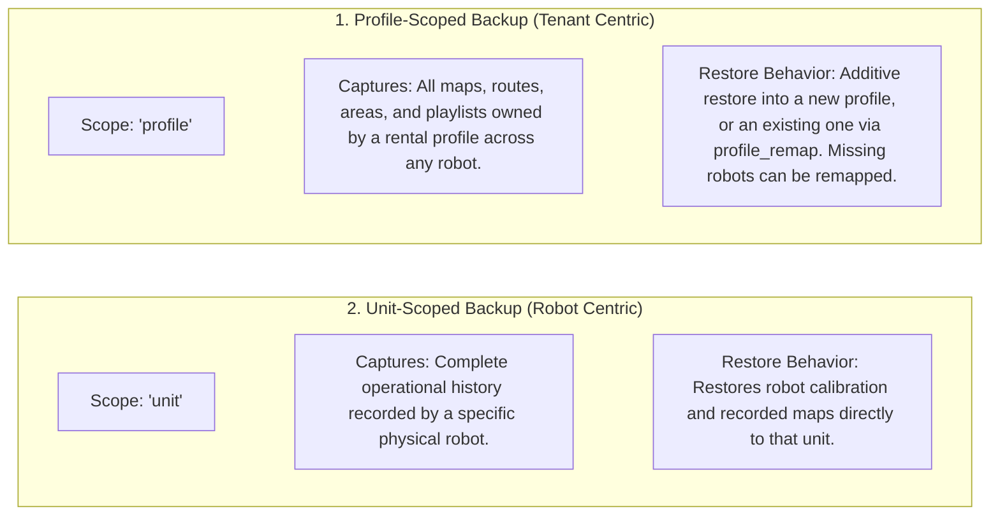

# Backup, Restore, and Data Migration

<RoleBadge role="developer" />

This document details the database backup architecture, export/import archive structures, rental profile transfer mechanics, and migration scripts in MSD700.

## Dual-Scope Backup Architecture

The platform supports two independent backup scopes:



| Dimension | Profile-Scoped Backup | Unit-Scoped Backup |
| --- | --- | --- |
| **Primary Scope Key** | `profile_id` (Rental Profile) | `unit_id` (Physical Robot ULID) |
| **Typical Use Case** | Migrating a customer's maps and routes to a replacement robot. | Archiving a robot before factory hardware servicing or refurbishment. |
| **Data Included** | Maps, waypoints, playlists, and user metadata for that profile. | All maps and sensor records originating from that specific hardware unit. |
| **Restore Strategy** | Additive (upsert without overwriting unrelated tenant data). | Direct restoration to the hardware unit. |

## Archive Structure (`.tar.gz`)

Backups are exported as compressed `.tar.gz` archives containing structured metadata and binary map files:

```
msd700_backup_01JZ8QK2H.tar.gz
├── manifest.json            # Version 2 archive manifest and metadata
├── database_dump.sql        # Scoped SQL insert statements
└── maps/                    # Binary map images (.pgm, .yaml, .png)
    ├── 01JZ8QK2H0001.pgm
    ├── 01JZ8QK2H0001.yaml
    └── 01JZ8QK2H0001_thumb.png
```

### Manifest Format (`manifest.json`)

```json
{
  "manifest_version": "2.0",
  "scope": "profile",
  "profile_id": "01JZ7YV5CQPROF00000000000",
  "tenant_name": "Acme Logistics",
  "created_at": "2026-08-15T14:30:00Z",
  "created_by": "01JZ7YV5CQUSER00000000000",
  "counts": {
    "maps": 4,
    "routes": 12,
    "areas": 6,
    "playlists": 2
  }
}
```

## REST API Backup Operations

All backup routes live under `/admin/api` (admin token required). There are no `/api/backup/export` or `/api/backup/import` endpoints.

### 1. Create Backup
`POST /admin/api/profiles/:id/backups` (profile scope) or `POST /admin/api/units/:id/backups` (unit scope)

Creates a backup record for the profile or unit.

### 2. Download Archive
`GET /admin/api/backups/:id/download`

Downloads the `.tar.gz` archive.

### 3. Upload Archive
`POST /admin/api/backups/upload`

Uploads an archive (raw body). Preview the plan first with `POST /admin/api/backups/:id/plan`.

### 4. Restore Archive
`POST /admin/api/backups/:id/restore`

Applies the uploaded archive additively.

### 5. List Backups
`GET /admin/api/backups`

## Archive machinery

Two scripts do the packing, so backups never shell out to `tar` on untrusted uploads:

- `profile_archive.js` packs/unpacks one DB slice + map files into a `.tar.gz` (`manifest.json` + `files/<mapId>.pgm|yaml|png`) for profile scope (one tenant) or unit scope (one robot, optionally cross-rental). It never ships `users` (re-links membership/authorship to existing accounts only), reuses free ULIDs, remaps taken ones, never overwrites. Key functions: `buildArchive`, `readArchive`, `buildRestorePlan`, `restoreArchive`.
- `tar_archive.js` is the minimal in-memory ustar reader/writer underneath it: `packTar`/`unpackTar` with an allow-list (`^files/<ULID>.(pgm|yaml|png)$`), checksum/truncation checks, non-regular files skipped: no staging dir, no CLI extraction.

## Schema Migration Scripts

Database schema evolutions are managed by automated scripts in `ros-web-ui/source/dependencies/ROS-dashboard-backend/scripts/`:

| Script Name | Purpose | Execution Command |
| --- | --- | --- |
| `migrate_unit_id_refactor.js` | Migrates legacy username/unitname paths to ULID addressing. | `node migrate_unit_id_refactor.js --profile server_dev --apply` |
| `migrate_enrolment.js` | Creates `pending_units` and `unit_devices` tables for nonce auth. | `node migrate_enrolment.js --profile server_dev --apply` |
| `migrate_sync.js` | Installs `sync_state` and `sync_tombstones` tables for offline data sync. | `node migrate_sync.js --profile server_dev --apply` |
| `migrate_backup_scope.js` | Upgrades `profile_backups` table with `scope` column. | `node migrate_backup_scope.js --profile server_dev --apply` |

::: danger Migration Testing Rule
Always test migration scripts against the development database on **port 3308** before applying them to production on port 3307. Migration scripts require an explicit `--profile` argument to prevent accidental target mismatch.
:::

## Related Documentation

- [Database Schema](/development/database-schema): Full MySQL table definitions and foreign keys.
- [Data Sync](/development/data-sync): Offline data replication and conflict resolution.
- [API Reference](/development/api-reference): REST API endpoints for fleet management.
