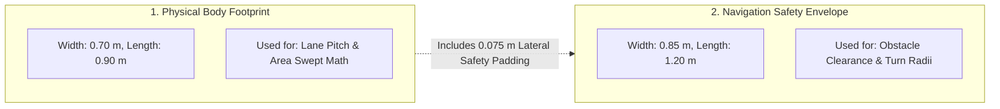
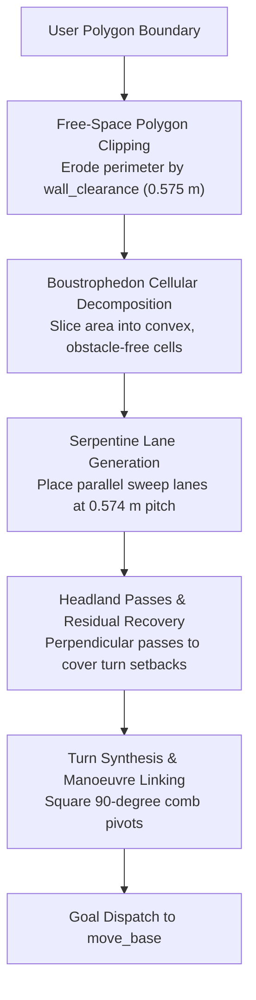
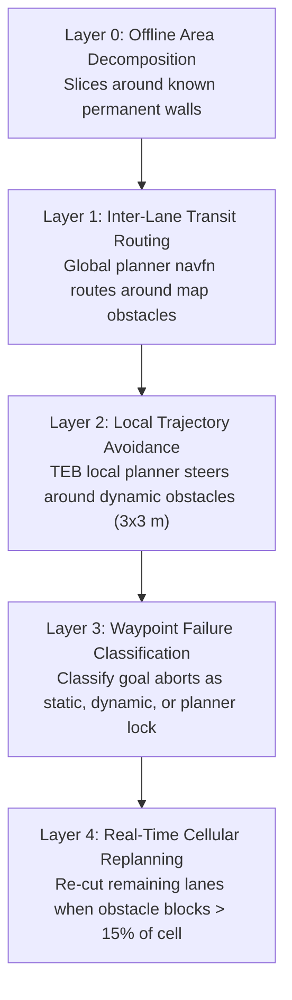
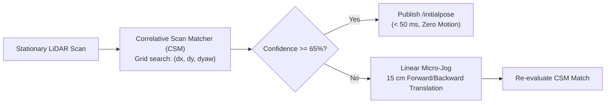

# Boustrophedon Coverage & Zero-Spin Alignment Architecture

<RoleBadge role="developer" />

This document details how the MSD700 robot plans area coverage sweeps, determines attainable coverage margins, handles static and dynamic obstacles, and executes zero-spin initial orientation alignment.

## 1. Dual Robot Geometries

A foundational design principle in MSD700 coverage planning is that **the robot has two distinct geometric dimensions used for different calculations**:

| Geometric Definition | Size Dimensions | Algorithmic Usage |
| --- | --- | --- |
| **Physical Body** (`~body_footprint`) | 0.90 m length x 0.70 m width | Determines lane pitch and swept-area attainment calculations. |
| **Costmap Safety Envelope** | 1.20 m length x 0.85 m width | Enforces TEB local planner clearances and turning feasibility. |

The costmap envelope in `costmap_common_params.yaml` includes intentional safety padding (0.075 m lateral and 0.150 m longitudinal per side). `path_coverage_node` reads the envelope directly from `/move_base/global_costmap/footprint` to maintain synchronization with navigation planners.

### Derived Clearance Constants (`libs/coverage_geometry.py`)

| Clearance Constant | Value | Formula Description |
| --- | --- | --- |
| `wall_clearance` | **0.575 m** | `inscribed_radius (0.425 m) + min_obstacle_dist (0.150 m)` |
| `turn_clearance` | **0.885 m** | `circumscribed_radius (0.735 m) + min_obstacle_dist (0.150 m)` |
| `pitch` | **0.574 m** | `body_width (0.70 m) x (1 - coverage_overlap (0.18))` |

### Physical Geometric Limits:
- **Narrowest corridor robot can enter**: **1.15 m** (`2 x wall_clearance`).
- **Narrowest corridor robot can pivot 180 degrees**: **1.77 m** (`2 x turn_clearance`).
- **Narrowest corridor worth 2-lane sweeping**: **1.72 m**.
- **Unreachable boundary strip along walls**: **0.225 m** (`wall_clearance - half_body_width`).

::: info Attainment vs Raw Coverage
Because the 0.225 m perimeter strip cannot be traversed without collision, a rectangular room (e.g. 3 x 6 m) reaches a theoretical maximum coverage of **78.6%**. System performance is measured by **Attainment Ratio** (fraction of reachable floor actually swept), rather than unadjusted raw area percentage.
:::

## 2. Coverage Planning Pipeline

1. **Free-Space Clipping**: `extract_free_space_regions` erodes the raw user polygon by `wall_clearance` against the static occupancy grid, isolating reachable floor space.
2. **Cellular Decomposition**: Vertical sweep lines decompose non-convex or obstructed areas into obstacle-free convex trapezoids.
3. **Serpentine Sweep Lanes**: Parallel lanes run along the cell long axis at `pitch` (0.574 m) spacing.
4. **Square 90-Degree Turns**: Pivot 90 degrees at lane ends, traverse sideways, and pivot 90 degrees into the return lane. If turning clearance is constrained, the planner automatically falls back to point turns or omega maneuvers.
5. **Headland Passes**: Lanes terminate `turn_clearance` short of walls to prevent collisions during rotation; perpendicular headland passes sweep the remaining strips.
6. **Residual Gap Sweeps**: Leftover pockets are identified via difference masks and swept in up to three residual passes.

## 3. Five-Layer Obstacle Management

| Layer | Operating Horizon | Strategy & Reaction |
| --- | --- | --- |
| **Layer 0 (L0)** | Entire Mission | Decomposes polygon around static map features. |
| **Layer 1 (L1)** | Stroke Transits | Navfn computes collision-free transits between disconnected cells. |
| **Layer 2 (L2)** | 3 x 3 m Window | TEB local planner steers around transient obstacles (people, boxes). |
| **Layer 3 (L3)** | Individual Goal | Evaluates goal failure: retries dynamic blocks later, nudges planner aborts sideways. |
| **Layer 4 (L4)** | Active Cell | Re-slices remaining lanes in real time when persistent obstacles block over 15% of a lane. |

## 4. Zero-Spin Orientation Alignment

To localize without disruptive 360-degree rotation in tight aisles:

1. **Stationary Scan Matcher**: Correlative Scan Matching compares a single stationary 2D LiDAR scan against the static map. When confidence exceeds 65%, the corrected pose publishes to `/initialpose` instantly without moving the robot.
2. **Linear Micro-Jog Fallback**: If symmetry or sparse features reduce match confidence, the robot performs a gentle 15 cm forward/backward jog to establish heading without spinning.

## Related Documentation

- [Simulation](/development/simulation): Warehouse testing environment and scale models.
- [Message Contracts](/development/message-contracts): Coverage command envelopes and ACK protocols.
- [State and Behavior](/development/state-and-behavior): Navigation and coverage finite state machines.
