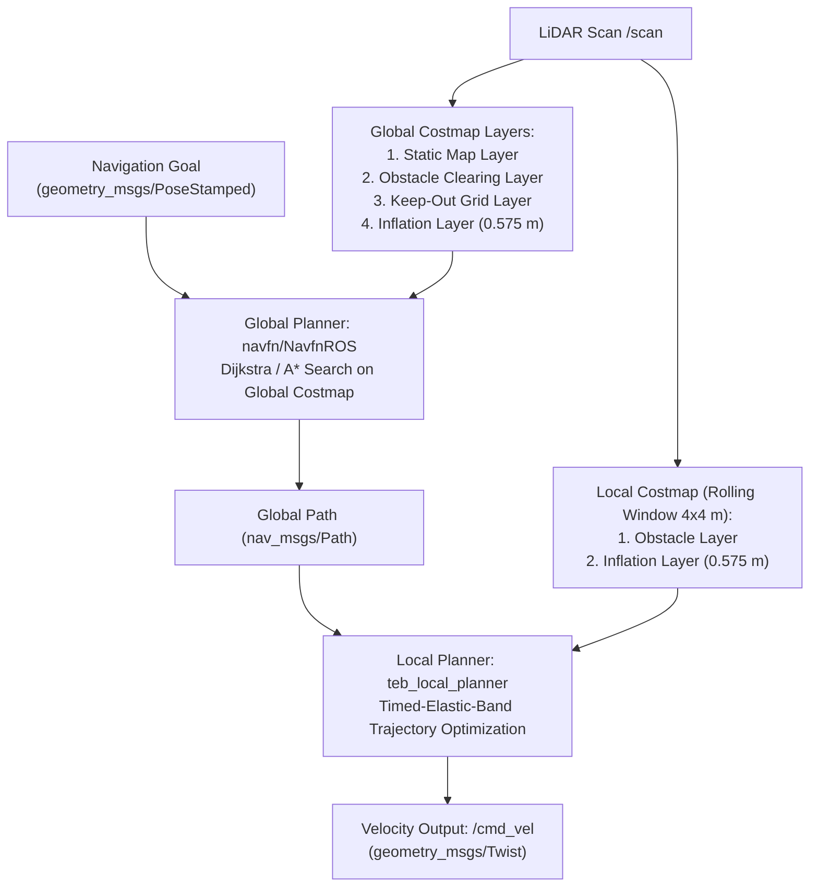
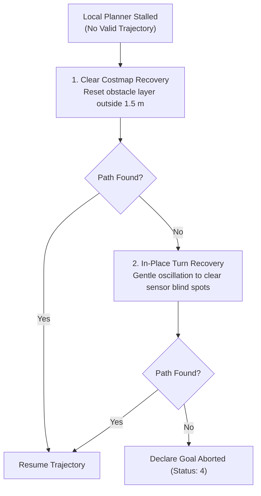

# Costmaps and Motion Planners

<RoleBadge role="developer" />

This document details the configuration and architecture of the navigation planning stack in MSD700, including costmap layered grids, global path planning (`navfn`), local trajectory optimization (`teb_local_planner`), and recovery behaviors.

## Navigation Planner Stack Overview

MSD700 relies on the standard ROS `move_base` action server pipeline, heavily tuned for a large-footprint (0.9 x 0.7 m physical, 1.20 x 0.85 m envelope) differential/skid-steer mobile robot.



## Layered Costmap Architecture

The costmap architecture uses `costmap_2d` layered plugins to maintain environmental representations:

```yaml
# config/costmap/costmap_common_params.yaml
footprint: [[-0.60, -0.425], [-0.60, 0.425], [0.60, 0.425], [0.60, -0.425]]
footprint_padding: 0.01

obstacle_layer:
  enabled: true
  max_obstacle_height: 2.0
  min_obstacle_height: 0.0
  obstacle_range: 5.5
  raytrace_range: 6.0
  observation_sources: laser_scan_sensor
  laser_scan_sensor:
    sensor_frame: base_scan
    data_type: LaserScan
    topic: /scan
    marking: true
    clearing: true

inflation_layer:
  enabled: true
  inflation_radius: 0.575
  cost_scaling_factor: 5.0
```

### Costmap Layers Explained:
1. **Static Layer**: Loads the pre-recorded occupancy grid from `/map` (`map_server`).
2. **Obstacle Layer**: Dynamically adds (marking) and removes (raytracing/clearing) transient obstacles detected by the 360-degree LiDAR.
3. **Keep-Out Layer (`keepout_layer`)**: Subscribes to `/msd700/keepout_grid` to inject virtual forbidden boundaries and restricted zones defined by operators in the dashboard.
4. **Inflation Layer**: Propagates lethal costs outward using an exponential decay curve.

::: tip Crucial Inflation Parameter Rule
`inflation_radius` is explicitly configured to **0.575 m**, which equals the inscribed radius of the robot safety envelope (`0.425 m`) plus the minimum safety margin (`0.150 m`). Setting inflation below the inscribed radius causes planners to calculate paths through lethal obstacle bands.
:::

## Global Path Planning: `navfn`

`navfn/NavfnROS` calculates the global route from current robot pose to the goal coordinates.

- **Algorithm**: Dijkstra / A* potential field search.
- **Planner Frequency**: 2.0 Hz.
- **Tolerance**: `default_tolerance: 0.5 m`.
- **Geodesic Path**: Guarantees finding the shortest path across open static cells while respecting inflation buffers.

## Local Trajectory Optimization: `teb_local_planner`

The Timed-Elastic-Band (TEB) local planner computes kinematically feasible velocity commands (`/cmd_vel`) in real time, steering around moving obstacles.

```yaml
# config/planner/teb_local_planner_params.yaml
TebLocalPlannerROS:
  odom_topic: /odometry/filtered
  map_frame: /map

  # Robot Kinematics
  max_vel_x: 0.40
  max_vel_x_backwards: 0.20
  max_vel_theta: 1.00
  acc_lim_x: 0.50
  acc_lim_theta: 1.00

  # Footprint Model
  footprint_model:
    type: "polygon"
    vertices: [[-0.60, -0.425], [-0.60, 0.425], [0.60, 0.425], [0.60, -0.425]]

  # Goal Tolerances
  xy_goal_tolerance: 0.15
  yaw_goal_tolerance: 0.10
  free_goal_vel: false

  # Obstacle Parameters
  min_obstacle_dist: 0.15
  include_costmap_obstacles: true
  costmap_obstacles_behind_robot_dist: 1.5
  obstacle_poses_affected: 30

  # Optimization Weights
  weight_kinematics_forward_drive: 1000.0
  weight_kinematics_turning_radius: 1.0
  weight_optimaltime: 1.0
  weight_obstacle: 50.0
```

### Dynamic Parameter Switching in Coverage Mode
In standard point-to-point navigation, `weight_kinematics_forward_drive` is set to `1000.0` to discourage backward driving. However, during boustrophedon area coverage sweeps, this causes the planner to stall when turning in narrow rows. `path_coverage_node` uses `dynamic_reconfigure` to temporarily lower forward bias to `5.0`, allowing smooth bidirectional turns during coverage missions.

## Recovery Behaviors

When the robot encounters tight pinches or moving blockades, `move_base` triggers sequential recovery behaviors:



## Related Documentation

- [Boustrophedon Coverage](/development/boustrophedon-and-alignment): Coverage planning algorithms.
- [Sensor Fusion and Control](/development/sensor-fusion-and-control): Odometry and LiDAR pipelines.
- [Simulation](/development/simulation): True-scale warehouse validation environment.
