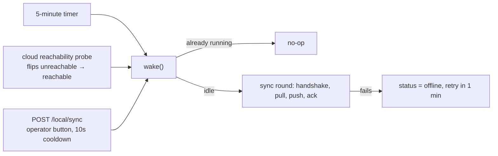

# Data Sync

<RoleBadge role="developer" />

How a Unit's local `ROS_DB` and the cloud's stay consistent while the two are connected only
intermittently. This page is about the **recurring reconciliation loop**: `sync_agent.js`,
`sync_engine.js`, `sync_tables.js`. For the HTTP contract it drives
(`/sync/handshake`, `/sync/pull`, `/sync/push`, ...), see
[API Reference § Sync](/development/api-reference#sync-sync). For what happens to a map at the
moment it is saved, which is a related but separate write path, see
[State and Behavior § Map storage](/development/state-and-behavior#map-storage).

::: info Local is a cache of the cloud, not a silo
A Unit works offline indefinitely once enrolled, but its accounts and its identity come from the
cloud, and its maps sync back to the cloud when the link returns. See
[Architecture § The two-machine model](/development/architecture#the-two-machine-model) for the
reasoning behind that split.
:::

## What has to agree, and which way

Not every table syncs the same direction. `sync_tables.js` puts each one in exactly one of two
regimes:

| Direction | Tables | Why |
| --- | --- | --- |
| **Down only** (cloud → Unit, never written back) | `units`, `rental_profiles`, `users` (including the password hash, so login still works offline), `profile_members`, `profile_units` | Identity is cloud state. A stolen or cloned Unit must not be able to mint its own accounts or rentals by writing to these tables locally. |
| **Both ways**, last-write-wins per row | `maps_data`, `routes_data`, `areas_data`, `playlists_data` | Operational data genuinely gets created on either side: a map recorded on the robot, a route drawn by an operator on either dashboard. |

Map, route and playlist **files** (`.pgm`, `.yaml`, thumbnail images) sync separately, over
`GET`/`PUT /sync/file/:mapId/:kind` and `/sync/route-file/:routeId/:kind`, and are compared by
**file size**, not checksum, a deliberate cost/precision tradeoff since a mismatched size already
proves a difference and a full hash of every map image on every round would be the more expensive
check for a property that rarely needs it.

## Three files, three jobs

| File | Runs on | Responsibility |
| --- | --- | --- |
| `sync_agent.js` | the Unit | Owns the polling loop, the manual and reachability-triggered wake-ups, and calls the cloud's `/sync/*` endpoints |
| `sync_engine.js` | both sides | The mechanics shared by both directions: collecting changed rows, applying them, resolving conflicts, writing and reading tombstones |
| `sync_tables.js` | both sides | The table registry above: direction, key columns, and the name-collision rule per table |

The cloud does not run its own polling loop; it only answers what `sync_agent` asks for. Every sync
round is Unit-initiated, because the Unit is the one behind NAT: the cloud has no way to dial in.

## When a round actually happens

::: warning Saving a row does not sync it immediately
There is no call from a route/area/playlist/map CRUD handler into `wake()`. A save on one side
becomes visible on the other only at the next scheduled round, the next reachability transition, or
the next manual `POST /local/sync`, never as a direct side effect of the save itself. Two operators
working on the same map from opposite sides of a flaky link will not see each other's changes as
quickly as the UI's optimistic update might suggest.
:::

`{full: true}` on the manual endpoint resets the stored watermark and forces a full re-pull, useful
for recovering a Unit whose database was restored from an old backup or otherwise fell out of step
with its own watermark.

## Resolving conflicts

Conflict resolution is **last-write-wins per row**, not per column: one side's entire row wins, the
other side's edit to the same row is discarded even if it touched a different field.

- **A delete counts as a write.** Deleting a row writes a tombstone (`sync_tombstones`, keyed by
  `table_name` + `row_id`) stamped with its own `deleted_at`, so an edit on one side racing a delete
  on the other resolves by the same timestamp comparison as two competing edits would.
- **Timestamps are compared in the cloud's clock frame.** Every peer measures a `clock_offset_ms`
  against the cloud at each handshake and corrects its own timestamps by it before comparing. This is
  load-bearing for a Jetson with no RTC, which can boot with a clock that is wrong by months.
- **Exact ties break deterministically:** a delete beats an edit, and the cloud's version beats the
  Unit's.
- **A name collision is not treated as a conflict.** If two operators working offline on opposite
  sides both create a map (or route, area, playlist) with the same name, the later-arriving one is
  auto-suffixed (`(1)`, `(2)`, ...) rather than rejected or silently overwritten.

::: info What this does not do
There is no per-column merge. A row that changed in two different fields on two different sides in
the same window still loses one side's change entirely, whichever row is "older" by the rule above.
This is a known limitation rather than an oversight, and it matters more once sync rounds are
frequent: see [What is not built yet](#what-is-not-built-yet).
:::

## Watermarks are scoped to a rental profile, not just a clock

`sync_state` holds one row per peer: `last_pull_watermark`, `last_push_watermark`, and, easy to miss,
`last_pull_profile_id`. A watermark by itself only means "nothing changed before this instant **that
I was allowed to see**." If the profile bound to a Unit changes (most notably when a Unit is
re-rented to a different tenant), an old watermark under the previous profile does not mean "nothing
new to pull" under the new one. `sync_agent` detects the mismatch at handshake and treats it as a
first sync rather than an incremental one, re-pulling everything the Unit is now permitted to see.

## Handling being offline

Losing the link mid-round is the expected case, not an error path. Recognised network-failure
patterns (`ENOTFOUND`, `ECONNREFUSED`, `ETIMEDOUT`, and similar) are logged at info level, `sync_state.status`
is set to `offline`, and the next attempt is scheduled a minute out rather than treated as a fault to
surface. Progress within a round is intentionally not persisted anywhere but `sync_state` itself. If
the process restarts mid-round, the next round simply starts from the last confirmed watermark.

## What is not built yet

The design (`docs/rancangan-penyimpanan-hybrid.md` in `ros-web-ui`) describes five stages; as of this
writing:

| Stage | Status |
| --- | --- |
| Retrying a stalled media upload, homebase data riding along with the map row | Landed |
| A map upload targeting both media servers in one request (see [State and Behavior § Map storage](/development/state-and-behavior#map-storage)) | Landed |
| An MQTT nudge so a change on one side reaches the other in seconds rather than at the next poll | Not built: no CRUD handler calls `wake()`, and there is no MQTT handler for a sync-specific message on either side |
| Cleaning up staged files after a completed transfer | Not built |

The two MQTT bridges a real-time nudge would ride on (one to the Unit's own Mosquitto, one to the
cloud's HiveMQ, both already running unconditionally on every Unit) are not part of what's missing;
they are existing infrastructure the rest of the system already depends on.

## Related

- [API Reference § Sync](/development/api-reference#sync-sync): the HTTP contract
- [State and Behavior § Map storage](/development/state-and-behavior#map-storage): what happens at
  the moment a map is saved, as opposed to the periodic reconciliation this page covers
- [Architecture § Trust domains](/development/architecture#trust-domains): the credential
  `sync_agent` authenticates with
- [Database Schema](/development/database-schema): `sync_tombstones` and `sync_state` in full
