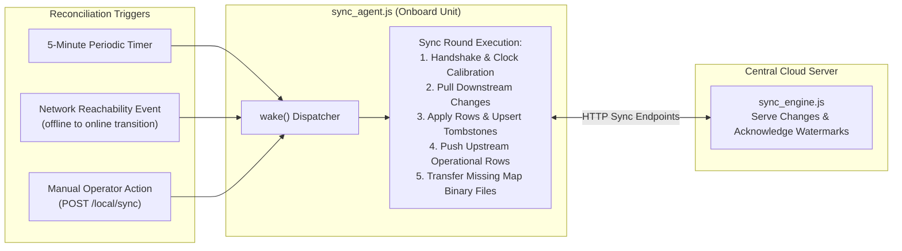
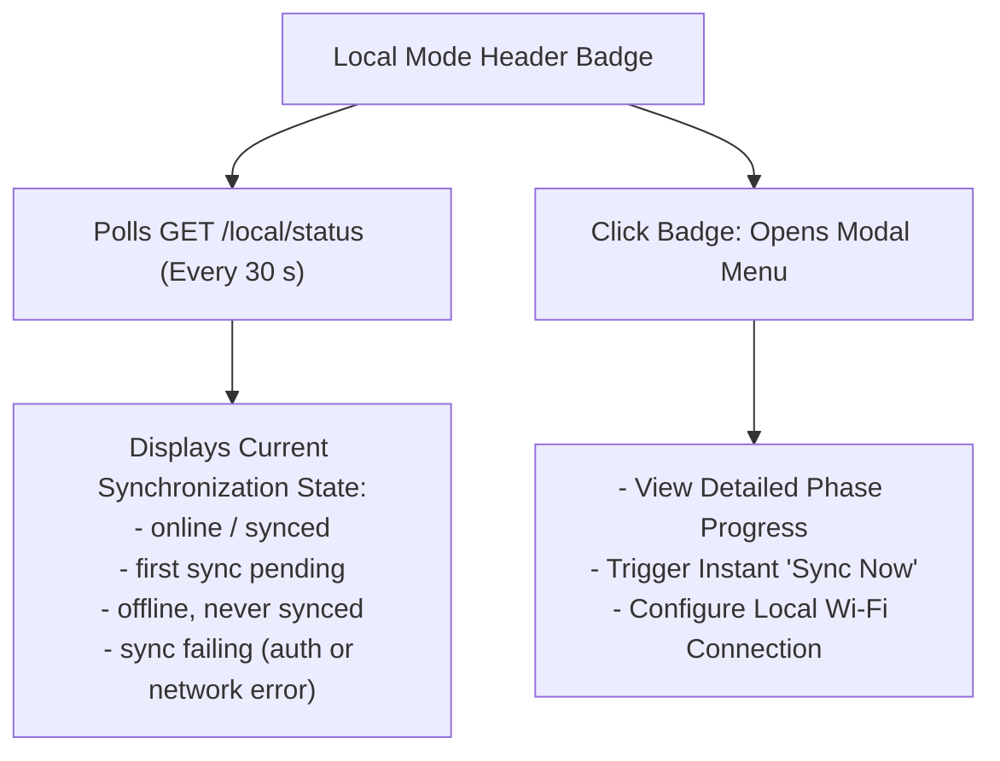

# Data Sync

<RoleBadge role="developer" />

This document details how a Unit's local MySQL database (`ROS_DB`) and the central cloud database maintain bidirectional consistency across intermittent wireless connectivity.

It covers the recurring reconciliation loop (`sync_agent.js`, `sync_engine.js`, `sync_tables.js`), conflict resolution algorithms, watermark tracking, and the Local Mode operator status badge.

For the HTTP sync contract, see [API Reference](/development/api-reference). For real-time map save uploads, see [State and Behavior](/development/state-and-behavior).

::: info Core Principle: Local as Cache
A Unit functions offline indefinitely once enrolled. User accounts, permissions, and rental profiles originate from the cloud, while maps, routes, and playlists recorded on the robot synchronize back to the cloud when network links are established.
:::

## Table Synchronization Regimes

Not all database tables synchronize in the same direction:

| Synchronization Direction | Tables Affected | Architectural Rationale |
| --- | --- | --- |
| **Downstream Only** (Cloud to Unit) | `units`, `rental_profiles`, `users` (including bcrypt password hashes for offline login), `profile_members`, `profile_units`. | Security boundary: identity and rental tenancy originate strictly on the cloud server. A local unit cannot mint new global accounts or reassign its own fleet tenancy. |
| **Bidirectional** (Last-Write-Wins per row) | `maps_data`, `routes_data`, `areas_data`, `playlists_data`. | Operational data is authored on both sides: SLAM maps recorded on the robot, and waypoint routes or playlists created in web dashboards. |

Binary assets (such as `.pgm` occupancy grids, `.yaml` metadata, and map thumbnails) synchronize via dedicated endpoints (`/sync/file/:mapId/:kind`) and are verified by exact file size.

## Synchronization Mechanics

### Key Components:
- **`sync_agent.js`**: Runs exclusively on the Unit, managing polling timers, reachability probes, and outbound HTTP calls to cloud endpoints. (The cloud does not dial into robots behind NAT).
- **`sync_engine.js`**: Shared library on both sides that queries changed rows based on watermarks, executes upserts, and manages delete tombstones.
- **`sync_tables.js`**: Defines synchronization directions, primary keys, and conflict resolution rules for each table.

## Conflict Resolution Rules

Conflict resolution follows a deterministic **Last-Write-Wins per row** strategy:

1. **Row-Level Granularity**: The newer row replaces the older record entirely.
2. **Delete Tombstones**: Deleting a record generates an entry in `sync_tombstones` with a `deleted_at` timestamp. A recent delete supersedes an older edit.
3. **Clock Skew Compensation**: During initial handshake, the unit calculates `clock_offset_ms` against cloud server time. All local timestamps are normalized to the cloud time reference frame before comparison.
4. **Deterministic Tie-Breaking**: If timestamps match exactly, deletes take precedence over edits, and the cloud version takes precedence over the unit version.
5. **Name Collision Handling**: If two operators create different routes or maps with the same name while offline, the later sync automatically appends an incremental suffix (e.g. `(1)`, `(2)`) rather than overwriting existing data.

## The Local Mode Status Badge

In local dashboard builds (`NEXT_PUBLIC_DEPLOYMENT_MODE=local`), the top-right header displays the Local Mode badge:

### Detailed Sync Phases:
1. `token`: Authenticating with cloud server using robot credentials.
2. `handshake`: Exchanging watermarks and calibrating clock offsets.
3. `pull`: Downloading downstream account and profile updates.
4. `apply`: Committing pulled records to local MySQL.
5. `push`: Uploading locally recorded maps and routes to cloud.
6. `files`: Transferring binary `.pgm` and `.yaml` map images.
7. `finish`: Acknowledging committed watermarks.

## Related Documentation

- [API Reference](/development/api-reference): REST sync endpoints and payloads.
- [State and Behavior](/development/state-and-behavior): Map saving and storage replication flows.
- [Architecture](/development/architecture): Hardware and cloud trust domain models.
- [Database Schema](/development/database-schema): Schema definitions for `sync_state` and `sync_tombstones`.
