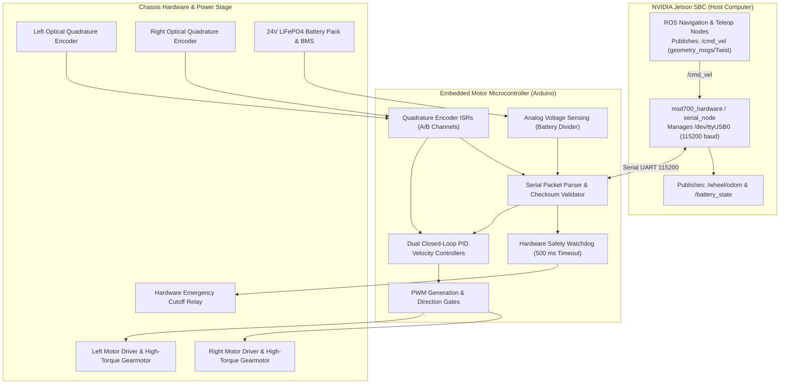

# Firmware and Hardware Architecture

<RoleBadge role="developer" />

This document details the low-level embedded hardware architecture, microcontroller firmware, motor driver interfaces, serial communication protocols, and battery telemetry monitoring for the MSD700 robot.

## Hardware Control Topology

The MSD700 chassis is controlled by an onboard embedded microcontroller (Arduino/Teensy) communicating with the main NVIDIA Jetson single-board computer over a high-speed isolated serial link.



## Serial Protocol Specification

Communication between the Jetson host and the microcontroller runs over USB UART (`/dev/ttyUSB0` or `/dev/ttyACM0`) at **115200 baud, 8N1**.

### 1. Velocity Command Packet (Host to Microcontroller)
Sent at 20 to 50 Hz whenever the robot moves:

```text
[START_BYTE] [CMD_TYPE] [LINEAR_VEL_MSB] [LINEAR_VEL_LSB] [ANGULAR_VEL_MSB] [ANGULAR_VEL_LSB] [CHECKSUM] [END_BYTE]
```

- `START_BYTE`: `0xAA`
- `CMD_TYPE`: `0x01` (Velocity Drive)
- `LINEAR_VEL`: 16-bit signed integer (millimeters per second, $v_x$).
- `ANGULAR_VEL`: 16-bit signed integer (milliradians per second, $\omega_z$).
- `CHECKSUM`: Bitwise XOR of all payload bytes.
- `END_BYTE`: `0x55`

### 2. Telemetry and Encoder Feedback (Microcontroller to Host)
Streamed continuously at 50 Hz:

```text
[START_BYTE] [TYPE] [L_ENC_B3] [L_ENC_B2] [L_ENC_B1] [L_ENC_B0] [R_ENC_B3] [R_ENC_B2] [R_ENC_B1] [R_ENC_B0] [VOLTAGE_MV] [STATUS_FLAG] [CHECKSUM] [END_BYTE]
```

- `L_ENC / R_ENC`: 32-bit signed integer cumulative quadrature pulse counts.
- `VOLTAGE_MV`: 16-bit unsigned integer battery voltage in millivolts.
- `STATUS_FLAG`: Bitfield flags (Emergency E-Stop, Motor Driver Fault, Temperature Alert).

## Microcontroller Firmware Architecture

The Arduino firmware in `msd700_firmware` executes a deterministic real-time control loop:

### 1. Quadrature Encoder Pulse Capture
Interrupt Service Routines (ISRs) monitor both rising and falling edges of optical encoder channels A and B, calculating directional displacement with zero missed pulses.

$$\Delta d_{left} = \frac{2 \pi r_{wheel} \cdot \Delta \text{ticks}_{left}}{\text{TICKS\_PER\_REV}}$$

$$\Delta d_{right} = \frac{2 \pi r_{wheel} \cdot \Delta \text{ticks}_{right}}{\text{TICKS\_PER\_REV}}$$

### 2. Closed-Loop PID Velocity Control
The firmware computes differential wheel speed targets from received $v_x$ and $\omega_z$:

$$v_{left} = v_x - \frac{\omega_z \cdot L_{track}}{2}, \quad v_{right} = v_x + \frac{\omega_z \cdot L_{track}}{2}$$

A discrete PID algorithm runs at 100 Hz per wheel channel:

$$PWM(t) = K_p e(t) + K_i \int e(t) dt + K_d \frac{de(t)}{dt}$$

### 3. Hardware Safety Watchdog
If the microcontroller does not receive a valid velocity command packet for **500 ms**, the firmware automatically sets motor PWM outputs to zero and disengages the power drive stage. This ensures the robot comes to a dead stop if the Jetson computer crashes or the serial cable disconnects.

## Battery Voltage and Telemetry

The robot is powered by a 24V LiFePO4 battery pack monitored via a precision resistor divider connected to an analog ADC input on the microcontroller. The host driver translates voltage readings into a linear state-of-charge percentage published on `/battery_state`.

## Related Documentation

- [ROS Package Registry](/development/ros-packages): Package structures and launch configurations.
- [Sensor Fusion and Control](/development/sensor-fusion-and-control): EKF state estimation using wheel odometry.
- [State and Behavior](/development/state-and-behavior): Emergency stop and safety states.
