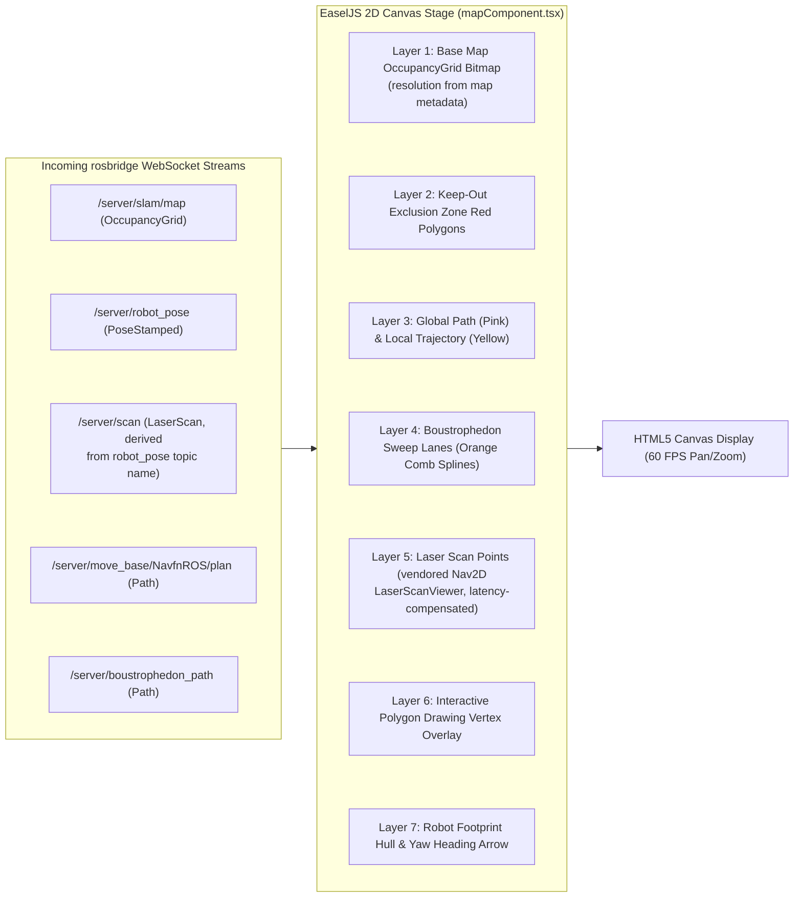

# Frontend Canvas & React Visualization Pipeline

<RoleBadge role="developer" />

This document details the 2D rendering pipeline, coordinate space conversions, layer stacking architecture, and React lifecycle integration implemented in `ROS-dashboard-next-ts` using HTML5 Canvas, EaselJS, and `ROS2D.js`.

## Canvas Rendering Pipeline Architecture

All topics are per-unit rooted: `` `${root}/server/…` `` with `root = /unit_<ULID>`. The bare `/server/…` names below are shorthand.



---

## Coordinate Transformations: Metric Space to Screen Pixels

The ROS coordinate frame is metric (meters, with $(0, 0)$ at map origin), while HTML5 Canvas uses top-left origin pixel coordinates $(p_x, p_y)$.

Given map resolution $r$ (meters per pixel), image height $H$ (pixels), and map origin $\mathbf{o} = [x_0, y_0]^T$:

### 1. Metric to Canvas Pixel Conversion:
$$p_x = \frac{x - x_0}{r}$$

$$p_y = H - \frac{y - y_0}{r}$$

*(The $y$-axis is inverted because ROS $Y$ increases upward while Canvas $Y$ increases downward).*

### 2. Canvas Pixel to Metric Conversion (For Goal Dispatching):
$$x = x_0 + (p_x \cdot r)$$

$$y = y_0 + ((H - p_y) \cdot r)$$

---

## The `createjs.Stage.prototype` Patch (`mapComponent.tsx`)

EaselJS re-evaluates `createjs.Stage` into a brand-new constructor whose prototype no longer has the `ROS2D` coordinate helpers. A viewer built afterwards then throws `stage.globalToRos is not a function`. The fix is `ensureStagePrototype()` in `mapComponent.tsx`, re-applied idempotently on the current prototype right before every viewer creation (the math mirrors `public/script/ros2d.js` exactly, so behaviour is unchanged on the happy path). Note `rosScriptLoader.ts` is only the sequential script loader: the patch does not live there:

```typescript
// src/components/navigationMap/mapComponent.tsx
const ensureStagePrototype = (): boolean => {
  if (typeof window === 'undefined') return false;
  const cjs = (window as any).createjs;
  const ROSLIB = (window as any).ROSLIB;
  const proto = cjs?.Stage?.prototype;
  if (!proto || !ROSLIB?.Vector3) return false;

  if (typeof proto.globalToRos !== 'function') {
    proto.globalToRos = function (this: any, x: number, y: number) {
      return new ROSLIB.Vector3({
        x: (x - this.x) / this.scaleX,
        y: (this.y - y) / this.scaleY,
      });
    };
  }
  if (typeof proto.rosToGlobal !== 'function') {
    proto.rosToGlobal = function (this: any, pos: any) {
      return {
        x: pos.x * this.scaleX + this.x,
        y: this.y - pos.y * this.scaleY,
      };
    };
  }
  if (typeof proto.rosQuaternionToGlobalTheta !== 'function') {
    proto.rosQuaternionToGlobalTheta = function (this: any, orientation: any) {
      // quaternion -> canvas heading degrees
    };
  }
  return typeof proto.globalToRos === 'function';
};
```

---

## Interactive Polygon Drawing Engine

When an operator defines area coverage sweep polygons or keep-out zones (`customAreaDraw.ts`):
1. **Vertex Placement**: Clicking the canvas records metric coordinates $(x_i, y_i)$.
2. **Dynamic Rubberbanding**: As the mouse moves, a dynamic temporary edge line renders to the cursor position.
3. **Closing Snapping**: If the click lands within `CLOSE_TOLERANCE_M` ($0.5\text{ m}$ by default, overridable via `NEXT_PUBLIC_CUSTOM_AREA_CLOSE_TOLERANCE`) of the first vertex (a metric distance, not pixels) the loop closes. Keep-out polygons render as overlay and are sent as `areas`/`exclusions` payloads; coverage polygons go to `/msd700/coverage_polygon`. (`/msd700/keepout_grid` itself is only an empty-grid initializer on the robot side.)

## Related Documentation

- [rosbridge Protocol](/development/rosbridge-protocol): WebSocket JSON operations and streaming topics.
- [Boustrophedon Coverage](/development/ros/boustrophedon-and-alignment): Dual-geometry sweep calculations.
- [API Reference](/development/api-reference): Map and route REST endpoints.
