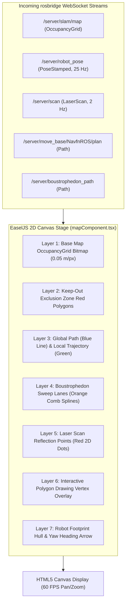

# Frontend Canvas & React Visualization Pipeline

<RoleBadge role="developer" />

This document details the 2D rendering pipeline, coordinate space conversions, layer stacking architecture, and React lifecycle integration implemented in `ROS-dashboard-next-ts` using HTML5 Canvas, EaselJS, and `ROS2D.js`.

## Canvas Rendering Pipeline Architecture



---

## Coordinate Transformations: Metric Space to Screen Pixels

The ROS coordinate frame is metric (meters, with $(0, 0)$ at map origin), while HTML5 Canvas uses top-left origin pixel coordinates $(p_x, p_y)$.

Given map resolution $r$ (meters per pixel), image height $H$ (pixels), and map origin $\mathbf{o} = [x_0, y_0]^T$:

### 1. Metric to Canvas Pixel Conversion:
$$p_x = \frac{x - x_0}{r}$$

$$p_y = H - \frac{y - y_0}{r}$$

*(The $y$-axis is inverted because ROS $Y$ increases upward while Canvas $Y$ increases downward).*

### 2. Canvas Pixel to Metric Conversion (For Goal Dispatching):
$$x = x_0 + (p_x \cdot r)$$

$$y = y_0 + ((H - p_y) \cdot r)$$

---

## The `createjs.Stage.prototype` Patch (`rosScriptLoader.ts`)

In modern React SPA frameworks (such as Next.js 14+), components mount and unmount rapidly during page transitions. Standard `ROS2D.js` binds coordinate conversion functions to stage instances on creation, which can be lost upon React DOM re-renders, causing fatal `TypeError: this.stage.globalToRos is not a function` errors.

To guarantee zero-crash visualization resilience, `rosScriptLoader.ts` dynamically patches `createjs.Stage.prototype` prior to canvas instantiation:

```typescript
// scripts/rosScriptLoader.ts
export function patchEaselJSStage(): void {
  if (typeof window === "undefined" || !(window as any).createjs) return;

  const StageProto = (window as any).createjs.Stage.prototype;

  if (!StageProto.globalToRos) {
    StageProto.globalToRos = function (x: number, y: number) {
      const rosX = (x - this.x) / (this.scaleX * this.ros2dViewer.scaleToDimensions);
      const rosY = -(y - this.y) / (this.scaleY * this.ros2dViewer.scaleToDimensions);
      return { x: rosX, y: rosY };
    };
  }

  if (!StageProto.rosToGlobal) {
    StageProto.rosToGlobal = function (rosX: number, rosY: number) {
      const x = rosX * this.scaleX * this.ros2dViewer.scaleToDimensions + this.x;
      const y = -rosY * this.scaleY * this.ros2dViewer.scaleToDimensions + this.y;
      return { x, y };
    };
  }
}
```

---

## Interactive Polygon Drawing Engine

When an operator defines area coverage sweep polygons or keep-out zones:
1. **Vertex Placement**: Clicking the canvas records metric coordinates $(x_i, y_i)$.
2. **Dynamic Rubberbanding**: As the mouse moves, a dynamic temporary edge line renders to the cursor position.
3. **Closing Snapping**: If the cursor enters within $15\text{ pixels}$ of the initial vertex, the polygon snaps closed and rasterizes into the `/msd700/keepout_grid` or coverage boundary.

## Related Documentation

- [rosbridge Protocol](/development/rosbridge-protocol): WebSocket JSON operations and streaming topics.
- [Boustrophedon Coverage](/development/boustrophedon-and-alignment): Dual-geometry sweep calculations.
- [API Reference](/development/api-reference): Map and route REST endpoints.
