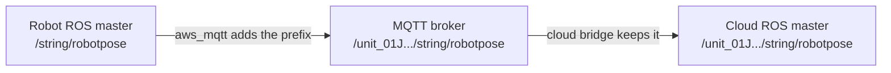
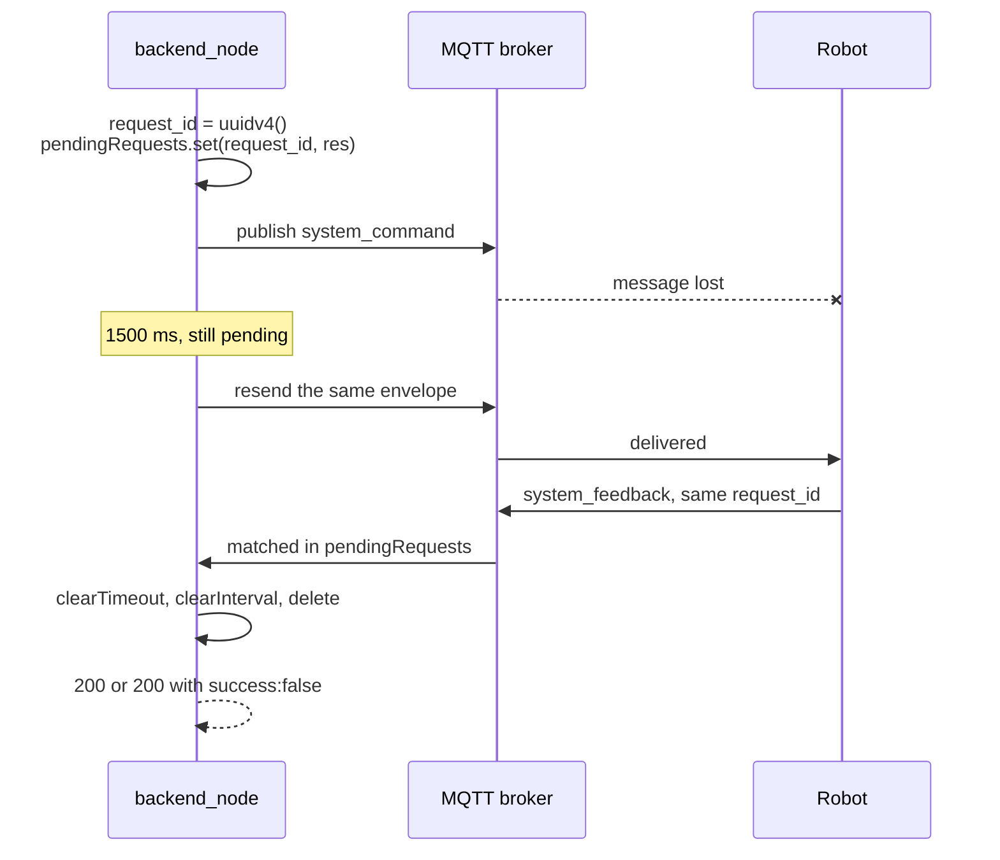
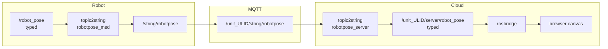
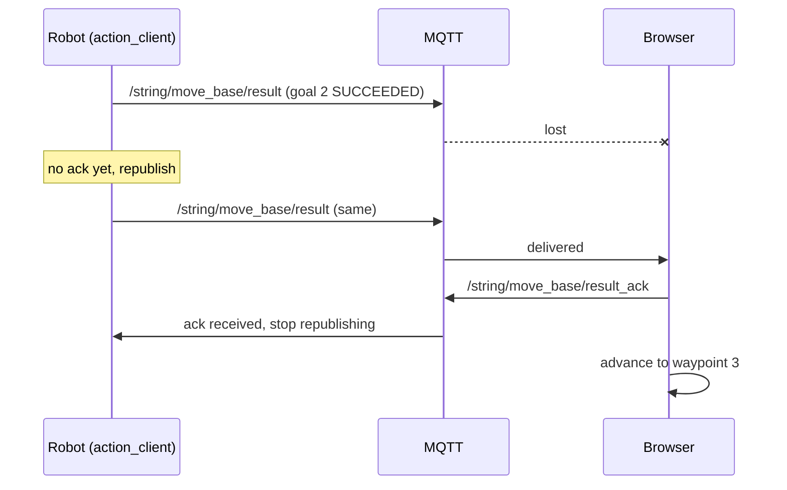
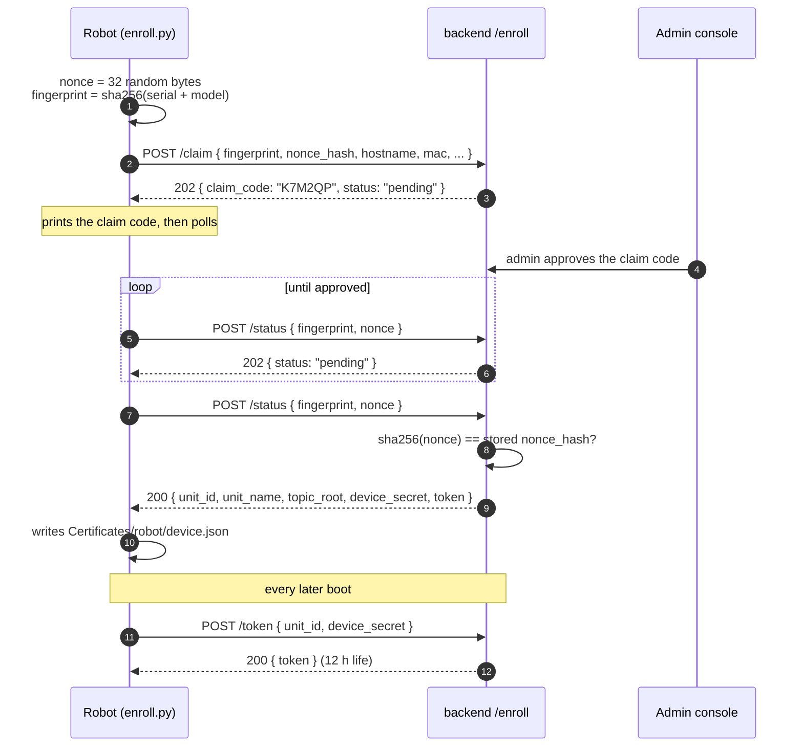

# Message Contracts

<RoleBadge role="developer" />

Every payload that crosses a machine boundary in MSD700, with its exact shape. This page covers the
MQTT command channel, the string-topic streaming bridge, the operation sync channel and the
enrolment exchange. For the HTTP surface in front of all of it, see
[API Reference](/development/api-reference). For the state machines that consume these messages, see
[State and Behavior](/development/state-and-behavior).

::: info These are contracts, not schemas
None of this is validated against a schema file. The shapes below are read out of the producing and
consuming code (`backend_node`, `system_command.py`, `operation_supervisor.py`, `topic2string`,
`enroll_api.js`). Treat a mismatch as a bug in whichever side changed last, and update this page in
the same commit.
:::

## Addressing

Every robot is addressed as `/unit_<ULID>/...`, where the ULID is the primary key of its row in the
`units` table, minted by the admin console at registration.



| Hop | Topic form | Why |
| --- | --- | --- |
| Robot ROS master | `/string/robotpose` | One master, one robot. Nothing to disambiguate. |
| MQTT broker | `/unit_<ULID>/string/robotpose` | One broker, the whole fleet. |
| Cloud ROS master | `/unit_<ULID>/string/robotpose` | One master, the whole fleet. |

::: warning The `unit_` prefix is required, not decorative
A ROS 1 graph resource name must begin with a letter, a tilde or a slash, and every ULID begins with
a digit. `/01JZ.../string/map` is rejected outright by rospy and by roslaunch's `ns=`. The same
prefixed string is reused on the MQTT side so the bridge configuration stays a one-to-one mapping.
:::

Before 2026-08-01 the address was `/<owner_username>/<unit_name>/...`. Both halves were display
names an admin could rename at any time, and renaming either one moved the robot to an address the
dashboard was not listening on. On screen that is indistinguishable from a robot that never booted.
A ULID cannot be renamed, so the failure mode is gone by construction.

## The command channel

Two MQTT topics carry every request/response interaction between the cloud and a robot:

| Topic | Direction | Producer | Consumer |
| --- | --- | --- | --- |
| `/unit_<ULID>/system_command` | cloud to robot | `backend_node` | `system_command.py` |
| `/unit_<ULID>/system_feedback` | robot to cloud | `system_command.py` | `backend_node` |

Neither has a row in the ROS bridge launch files. `backend_node` is an MQTT client in its own right
and publishes and subscribes to these directly on the broker.

### Command envelope

```json
{
  "header": "navigation",
  "command": "pointstamped",
  "config": {
    "resource": { "X": 3.1416, "Y": -1.2, "Z": 0.0 }
  },
  "metadata": {
    "timestamp": "2026-08-12T04:11:52.913Z",
    "request_id": "0b0d1f4e-6a2c-4c7e-9a51-1f1b6f7a2f10"
  }
}
```

| Field | Type | Required | Notes |
| --- | --- | --- | --- |
| `header` | string | yes | Selects the handler. One of `hardware`, `navigation`, `mapping`, `boustrophedon`, `manual`, `autopilot`, `emergency_stop`, `autoalign`. |
| `command` | string | yes | The action within that handler. An unknown value is logged and dropped, not answered. |
| `config` | object | per command | Command parameters. Most handlers read `config.resource`. |
| `data` | object | per command | Used instead of `config` by `hardware.ping`. |
| `metadata.request_id` | UUID v4 | yes | Correlation key. Generated per HTTP request by `backend_node`. |
| `metadata.timestamp` | ISO 8601 | yes | Set by the sender. Not used for ordering. |

### Feedback envelope

```json
{
  "header": "navigation",
  "command": "pointstamped",
  "data": {
    "status": true,
    "message": "Goal published to move_base"
  },
  "metadata": {
    "timestamp": 1786503112.913,
    "request_id": "0b0d1f4e-6a2c-4c7e-9a51-1f1b6f7a2f10"
  }
}
```

`metadata.timestamp` on the way back is `rospy.get_time()`, a float of seconds, not an ISO string.
`data.status` is the robot's own success flag and it drives the HTTP status code the browser sees.

### Correlation, retry and timeout



| Constant | Value | Where | Meaning |
| --- | --- | --- | --- |
| `DEFAULT_TIMEOUT` | `30000` ms | `backend_node` | How long an HTTP request waits for feedback before `504` |
| `COMMAND_RETRY_INTERVAL` | `1500` ms (env `COMMAND_RETRY_INTERVAL`) | `backend_node` | Resend period while a request is pending |

::: danger Pings are deliberately excluded from the retry loop
`header: "hardware", command: "ping"` is published exactly once. A dropped ping is the exact signal
the safety watchdog on the robot is built to observe. Retrying it would mask a real disconnection
and disable the automatic safety stop. This exclusion is load-bearing, not an optimisation.
:::

### How feedback becomes an HTTP response

| Robot says | HTTP status | Body |
| --- | --- | --- |
| `data.status: true` | `200` | `{ "success": true, "msg": data.message, "details": <full envelope> }` |
| `data.status: false` | `200` | `{ "success": false, ... }`. Deliberately not `400`: the request was well formed, the robot declined it. |
| nothing, for 30 s | `504` | `{ "success": false, "msg": "Request timed out..." }` |
| n/a, MQTT publish failed | `500` | `{ "success": false, ... }` |

## Command catalogue

Everything below is the `config` (or `data`) block of the envelope. `header`, `command`, and
`metadata` are omitted for brevity.

### `hardware`

| Command | Payload | Purpose |
| --- | --- | --- |
| `ping` | see [below](#the-ping-payload) | Liveness, lease, telemetry, watchdog heartbeat |
| `check` | none | Query hardware status |
| `init` | none | Bring drivers up |
| `stop` | none | Shut drivers down |
| `idle` | none | Tear the running mode down, stay powered |
| `battery_update` | `{ "config": { ... } }` | Push a battery reading |

### `navigation`

```json
// command: "init"
{
  "resource": {
    "map_name": "01JZ8QK2H0000000000000MAP",
    "default_save_path": "/home/ubuntu/ros_maps",
    "homebase_x": 1.25, "homebase_y": -0.5, "homebase_z": 0.0,
    "homebase_ox": 0.0, "homebase_oy": 0.0, "homebase_oz": 0.0, "homebase_ow": 1.0
  },
  "ensure_unpaused": true
}
```

```json
// command: "pointstamped"
{ "resource": { "X": 3.1416, "Y": -1.2, "Z": 0.0 } }
```

`map_name` is the map's **ULID**, which is also its filename on disk (`<ULID>.pgm`, `<ULID>.yaml`).
The human-readable name lives only in the database. The homebase block is omitted entirely when the
map has no homebase set. `ensure_unpaused: true` tells the robot to lower any standing
`/emergency_pause` lock before starting, so a mode init doubles as the release path for a
watchdog pause.

`command: "deactivate"` takes no payload.

### `mapping`

| Command | Payload |
| --- | --- |
| `start` | none |
| `pause` | none |
| `discard` | none |
| `stop` | the `resource` block below |

```json
// command: "stop"
{
  "resource": {
    "map_name": "01JZ8QK2H0000000000000MAP",
    "display_map_name": "Warehouse ground floor",
    "map_ulid": "01JZ8QK2H0000000000000MAP",
    "created_by": "01JZ7YV5CQUSER00000000000",
    "default_save_path": "/home/ubuntu/ros_maps",
    "unit_id": "01JZ8P9WZ0UNIT00000000000",
    "homebase_x": 1.2, "homebase_y": 0.5, "homebase_z": 0.0,
    "homebase_ox": 0.0, "homebase_oy": 0.0, "homebase_oz": 0.0, "homebase_ow": 1.0
  }
}
```

`map_name` is the on-disk filename, `display_map_name` is what the operator typed (or an
auto-generated `YYYY-MM-DD_HH-MM-SS` if they typed nothing). `created_by` is attribution, never
ownership: a map belongs to the unit it was recorded on. `homebase_*` (all optional) rides along so
it lands in the same row that gets created — there is no separate follow-up call any more; a browser
that PUT it afterwards, in cloud mode, was writing to a row the media server it uploaded to had not
created yet, and lost the pose to a silent `404`.

`default_save_path` is accepted for one more release as a fallback only. The robot's own
`MAPS_FOLDER` environment variable wins whenever it is set, because `default_save_path` names a
directory on whichever machine's `.env` the command happened to come from — not necessarily this
robot's own filesystem.

::: info `mapping stop` does not use the normal request/response pattern
Saving a map takes longer than the 30 s feedback timeout. The endpoint publishes the command and
returns `200` immediately with `{ request_id, map_ulid }`, and the dashboard opens an
`EventSource` on `GET /api/mapping/progress/:request_id` for the outcome (see below).
:::

#### The progress stream (`system_feedback`, `header: "mapping_progress"`)

Every stage of `stop` — saving the map files, uploading to each media server, switching back to
idle — publishes one of these on `/system_feedback`, which `backend_node` forwards verbatim over the
SSE stream above. Exactly one event per run carries `terminal: true`, and only that one carries
`outcome`:

```json
{
  "header": "mapping_progress",
  "command": "stop",
  "data": {
    "status": true,
    "progress": 100,
    "stage": "completed",
    "message": "Saved on the robot and the server.",
    "terminal": true,
    "outcome": "completed"
  },
  "metadata": { "timestamp": 1734000000.0, "request_id": "..." }
}
```

| `outcome` | When | Note |
| --- | --- | --- |
| `completed` | Stored on the Unit's media server **and** the cloud's | |
| `cloud_pending` | Stored on the Unit only | Not an error. `sync_agent` carries the rest on its next round. |
| `failed` | Not stored anywhere | The mapping session is left open; see [State and Behavior § Map storage](/development/state-and-behavior#map-storage) |

::: warning Read `outcome`, not the progress number
Before this contract existed, a failed save could emit **both** a `-1` (error) event and a later
`100` (`status: false`) event for the same run, and neither browser client read `status` — both
inferred success purely from `progress >= 100`. A client built against an older robot image that
still sends no `outcome` should fall back to `progress >= 100 && status !== false`, which is strictly
safer than the old `progress >= 100` alone.
:::

### `boustrophedon` (area coverage)

```json
// command: "init"
{
  "use_autocover": false,
  "polygon": [ { "x": 0.0, "y": 0.0 }, { "x": 4.0, "y": 0.0 }, { "x": 4.0, "y": 3.0 } ],
  "areas": [
    [ { "x": 0.0, "y": 0.0 }, { "x": 4.0, "y": 0.0 }, { "x": 4.0, "y": 3.0 } ],
    [ { "x": 6.0, "y": 0.0 }, { "x": 9.0, "y": 0.0 }, { "x": 9.0, "y": 3.0 } ]
  ],
  "exclusions": [
    [ { "x": 1.0, "y": 1.0 }, { "x": 2.0, "y": 1.0 }, { "x": 2.0, "y": 2.0 } ]
  ],
  "ensure_unpaused": true
}
```

| Field | Meaning |
| --- | --- |
| `use_autocover` | `true` lets the robot pick the area itself. Must match on `deactivate`, or the robot stops the wrong feature instance. |
| `polygon` | Legacy single custom area. Still accepted. |
| `areas` | Ordered list of cover polygons (an operation playlist). Swept in sequence. |
| `exclusions` | Keep-out polygons, subtracted from **every** cover area. |

`command: "pause"` takes `{ "pause": true }` or `{ "pause": false }`. `command: "deactivate"` takes
`{ "use_autocover": <same value as init> }`.

### `manual`, `autopilot`, `emergency_stop`

All three are pure toggles with no payload at all. Only `command` differs.

| Header | Commands |
| --- | --- |
| `manual` | `enable`, `disable` |
| `autopilot` | `enable`, `disable` |
| `emergency_stop` | `activate`, `deactivate` |

### `autoalign`

| Command | Payload | Feedback `data` |
| --- | --- | --- |
| `start` | none | `{ "status": bool, "message": str }` |
| `status` | none | `{ "status": bool, ... }` plus the aligner's own progress fields |
| `reset` | none | `{ "status": bool, "message": str }` |

## The ping payload

The ping is the busiest and most consequential message in the system. It carries the operating
lease, the watchdog heartbeat, and all robot telemetry, in both directions.

### Request (`data` block)

```json
{
  "session_id": "8b1c3f2a-...",
  "user_id": "01JZ7YV5CQUSER00000000000",
  "claim": true,
  "release": false,
  "page": "navigation",
  "origin": "cloud",
  "force_takeover": false
}
```

| Field | Set by | Meaning |
| --- | --- | --- |
| `session_id` | browser | Identifies this tab. An empty value means a client that predates the lease protocol, and the robot stays out of its way. |
| `user_id` | **backend, from the verified JWT** | Never taken from the body, so a client cannot claim a unit as someone else. It is the user ULID rather than the username, so an admin rename cannot lock an operator out of their own lease. |
| `claim` | browser | `true` only from pages that actually drive the robot. The unit list pings as a pure reader, so browsing the dashboard never marks units in use. |
| `release` | browser | Hand the lease back. |
| `page` | browser | Which dashboard page sent this. Drives the ping tiers, see below. |
| `origin` | **backend, from its own `DEPLOYMENT_MODE`** | `cloud` or `local`. Never from the body, for the same reason as `user_id`. |
| `force_takeover` | browser | `true` only when an operator clicks through an explicit takeover prompt. |

Recognised `page` values and what each one holds off:

| `page` | Presence tier (idle, shutdown) | Operation tier (motion pause) |
| --- | --- | --- |
| `dashboard`, `login` | no | no |
| `navigation` | yes | yes, while a navigation-side operation is running |
| `mapping` | yes | yes, while a mapping session is running |

### Response (`data` block)

```json
{
  "status": true,
  "robot_activity": "navigation_point_published",
  "active_page": "navigation",
  "battery": 87.5,
  "uptime": 42.3,
  "hw_status": "ready",
  "manual_override": false,
  "autopilot": false,
  "active_map_id": "01JZ8QK2H0000000000000MAP",
  "in_use": false,
  "in_use_by": null,
  "origin_conflict": false,
  "origin_conflict_side": null
}
```

| Field | Meaning |
| --- | --- |
| `robot_activity` | The robot's current activity, **after** the idle detector may have overridden it to `stuck`. See [the activity list](/development/state-and-behavior#robot-activity). |
| `active_page` | Derived from the **raw** activity, before that override, so a stuck robot still routes a returning operator back to Navigation instead of reading as idle. |
| `battery` | Percentage, float. |
| `uptime` | Minutes since the robot's software started, wall clock. |
| `hw_status` | Hardware monitor's summary. |
| `manual_override`, `autopilot` | The robot is the source of truth for both toggles. After a refresh or a new tab, the dashboard re-syncs to these rather than trusting its own storage. |
| `active_map_id` | Map ULID currently loaded for navigation, or `null`. |
| `in_use` | Account-level: another **account** holds the lease. Drives the grey "In Use" badge on the unit list. |
| `in_use_by` | The holder's user ULID. |
| `origin_conflict` | Session-level: your own account holds the lease from another session or the other surface. Drives the takeover prompt. |
| `origin_conflict_side` | `cloud` or `local`, whichever holds it. |

::: info Why `in_use` and `origin_conflict` are two different answers
`in_use` is what the unit **list** needs: your own account should never read as a stranger. `origin_conflict` is what the operating **page** needs: another session of yours is driving right now, so this one has no control until an explicit takeover. Conflating them either strands operators out of their own units or lets two tabs interleave commands to one robot.
:::

For a ping specifically, `backend_node` merges its own sync state into the response before
returning it, so the browser gets robot telemetry and cloud sync status in one round trip.

## Streaming topics

Live data does not use the command channel. `topic2string` serialises typed ROS messages into
strings on the robot, `aws_mqtt` bridges them, and a mirrored set of relays deserialises them on the
cloud so rosbridge has typed topics for the browser to subscribe to.



### Robot to Server

| Robot topic | Produced by | Rate | Payload |
| --- | --- | --- | --- |
| `/string/robotpose` | `robotpose_msd` | 25 Hz | JSON pose |
| `/string/map` | `map_compression_node` | on change | base64(zlib(JSON)) occupancy grid |
| `/string/laserscan` | `laserscan_to_string` | 2 Hz | compressed JSON scan |
| `/string/move_base/result` | `msd_action_client` | per goal | JSON result summary |
| `/string/move_base/status` | `msd_action_client` | continuous | JSON goal status array |
| `/string/move_base/NavfnROS/plan` | `navplan_msd` | per plan | JSON global plan |
| `/string/move_base/TebLocalPlannerROS/local_plan` | `localplan_msd` | continuous | JSON local plan |
| `/string/boustrophedon_path` | `boustrophedon_path_msd` | per plan | JSON coverage path |
| `/string/operation_progress` | `operation_supervisor` | on change | JSON progress |
| `/string/operation_snapshot` | `operation_supervisor`, **latched** | on change | JSON full-operation snapshot |
| `/system_feedback` | `system_command.py` | per command | JSON envelope, forwarded verbatim |
| `/msd/ping` | liveness relay | continuous | primitive |

::: info Why the laser scan is the slowest thing on the link
It is the heaviest payload by a wide margin and the dashboard only draws it as an overlay. Robot pose runs at 25 Hz because manual driving looks wrong below that. The bottleneck used to be a 2 Hz cap on the pose egress relay, which made remote driving feel broken while the link was perfectly healthy.
:::

### Server to Robot

| MQTT topic | Robot topic | Consumed by |
| --- | --- | --- |
| `/unit_<ULID>/string/move_base/goal` | `/string/move_base/goal` | `action_client.py` |
| `/unit_<ULID>/string/move_base/cancel` | `/string/move_base/cancel` | `action_client.py` |
| `/unit_<ULID>/string/move_base/result_ack` | `/string/move_base/result_ack` | `action_client.py` (ARQ) |
| `/unit_<ULID>/string/boustrophedon_path_ack` | `/string/boustrophedon_path_ack` | `path_coverage_node.py` (ARQ) |
| `/unit_<ULID>/string/initialpose` | `/string/initialpose` | `json_to_initialpose.py` |
| `/unit_<ULID>/string/key_vel` | `/string/key_vel` | `twist_from_string`, into `/mux/key_vel` |
| `/unit_<ULID>/string/operation_sync` | `/string/operation_sync` | `operation_supervisor` |
| `/unit_<ULID>/system_command` | `/system_command` | `system_command.py` |
| `/unit_<ULID>/msd/pong` | `/msd/pong` | liveness relay |

### Cloud-side typed topics (what the browser subscribes to)

| Cloud string topic | Cloud typed topic | Relay node |
| --- | --- | --- |
| `/unit_<ULID>/string/robotpose` | `/unit_<ULID>/server/robot_pose` | `robotpose_server` |
| `/unit_<ULID>/string/map` | `/unit_<ULID>/server/slam/map` | `map_decompression_node` |
| `/unit_<ULID>/string/laserscan` | `/unit_<ULID>/server/scan` | `laserscan_from_string` |
| `/unit_<ULID>/string/move_base/NavfnROS/plan` | `/unit_<ULID>/server/move_base/NavfnROS/plan` | `navplan_server` |
| `/unit_<ULID>/string/move_base/TebLocalPlannerROS/local_plan` | `/unit_<ULID>/server/move_base/TebLocalPlannerROS/local_plan` | `localplan_server` |
| `/unit_<ULID>/string/boustrophedon_path` | `/unit_<ULID>/server/boustrophedon_path` | `boustrophedon_path_server` |
| `/unit_<ULID>/string/move_base/{goal,cancel,result,status}` | `/unit_<ULID>/server/move_base/{...}` | `action_server` |

Two relays run the other way, serialising what the browser publishes on the cloud master:

| Cloud typed topic (from browser) | Cloud string topic | Node |
| --- | --- | --- |
| `/unit_<ULID>/initialpose` | `/unit_<ULID>/string/initialpose` | `initialpose_msd` |
| `/unit_<ULID>/server/key_vel` | `/unit_<ULID>/string/key_vel` | `twist_to_string` |

Note that `/unit_<ULID>/initialpose` is a **sibling** of the action server, not a child of it. That
is why `Nav2D.js` builds it by stripping `/server/move_base` off the `serverName` it was handed
rather than appending to it.

::: warning Every path published to the canvas must already be in the `map` frame
The web canvas ignores `frame_id` entirely. On a real unit the TEB local plan is published in
`odom`, so the yellow local-plan line lands in the wrong place. The simulator hides this because it
runs with `odometrySource=world`, which makes `odom` and `map` coincide.
:::

### The two ACK topics

MQTT drops messages, and a dropped one-shot message used to strand a multi-waypoint run: the robot
finished a goal, published its terminal `/result` exactly once, that message was lost, and the
browser waited forever for a waypoint that had already been reached.



The same pattern covers coverage path revisions on `/string/boustrophedon_path_ack`.

## Operation sync

`operation_supervisor` keeps a unit-side copy of every operation the dashboard runs, so a run
survives the browser being closed. All messages are `std_msgs/String` carrying JSON.

### Dashboard to robot: `/string/operation_sync`

```json
{
  "type": "batch",
  "operation": "multi_pinpoint",
  "route_mode": "round-trip",
  "waypoints": [
    { "position": { "x": 1.0, "y": 2.0, "z": 0.0 },
      "orientation": { "x": 0.0, "y": 0.0, "z": 0.0, "w": 1.0 } }
  ],
  "current_index": 0,
  "map_name": "01JZ8QK2H0000000000000MAP",
  "coverage": null,
  "timestamp": 1786503112.913
}
```

| `type` | Payload | Meaning |
| --- | --- | --- |
| `batch` | full description above | An operation started. Replaces any previous batch. |
| `progress` | `{ "current_index": n }` | The browser's own waypoint advancement, mirrored. |
| `takeover` | `{ "current_index": n }` | Autopilot switched on. |
| `release` | none | Autopilot switched off. |
| `pause` | none | Operator paused. Keep the batch, stand down. |
| `stop` | none | Operator stopped. Drop the batch. |
| `complete` | none | The browser-driven loop finished the route itself. |
| `resync` | none | Request a fresh snapshot. |

`operation` is one of `multi_pinpoint`, `single_pinpoint`, `coverage`, `custom_coverage`,
`playlist`, `automap`. `route_mode` is `basic`, `round-trip` or `loop`. Only `multi_pinpoint` and
`single_pinpoint` are **drivable** by the supervisor: coverage and automap already run autonomously
on the robot, so their batches are recorded for telemetry only.

### Robot to dashboard: `/string/operation_progress`

```json
{
  "type": "progress",
  "current_index": 3,
  "active": true,
  "operation": "multi_pinpoint",
  "direction": "backward",
  "timestamp": 1786503112.913
}
```

`direction` (`forward` or `backward`) has to travel back because the supervisor may have turned a
round trip around while it was driving. An index alone does not describe where such a run is going:
waypoint 2 of A-B-C-D is either "heading for C on the way out" or "on the way home", and the two
continue to opposite ends of the route.

### Robot to dashboard: `/string/operation_snapshot` (latched)

```json
{
  "type": "snapshot",
  "operation": "multi_pinpoint",
  "route_mode": "round-trip",
  "waypoints": [ /* same shape as batch */ ],
  "current_index": 3,
  "direction": "forward",
  "map_name": "01JZ8QK2H0000000000000MAP",
  "coverage": null,
  "active": true,
  "driving": true,
  "paused": false,
  "autopilot": true,
  "manual": false,
  "timestamp": 1786503112.913
}
```

Latched on purpose. A dashboard opened in a brand-new tab has an empty `sessionStorage`, which is
the browser's only copy of pins, mode and coverage state. Subscribing to a latched topic hands it
the entire run on connect, so the navigation view is rebuilt from the robot rather than from
anything the browser remembered.

| Field | Meaning |
| --- | --- |
| `active` | A run is in flight: either the supervisor is dispatching, or a batch is recorded and not paused or stopped. |
| `driving` | The supervisor itself is dispatching goals (autopilot takeover). |
| `paused` | Sticky pause flag. Set by a `pause` message, cleared by a resume. |
| `autopilot`, `manual` | Mirrors of the robot's own toggles. |

## Enrolment

Three endpoints, none authenticated in the usual sense, because a robot calling them has nothing to
authenticate with yet.



### `POST /enroll/claim`

```json
{
  "fingerprint": "3f5a...64 lowercase hex chars",
  "nonce_hash": "9c1e...64 lowercase hex chars",
  "hostname": "msd700-unit-03",
  "mac": ["dc:a6:32:11:22:33"],
  "agent_version": "1.4.0",
  "bootstrap_key": "optional, a trust marker only",
  "enrollment_code": "optional single-use voucher"
}
```

Responses: `202` with `{ claim_code, status }` when the row is pending, `200` with a full credential
when an `enrollment_code` voucher was redeemed, `409` when an approved row is presented a different
nonce (the row is reset to pending and an admin must approve again), `404` for an invalid voucher.

### `POST /enroll/status`

```json
{ "fingerprint": "3f5a...", "nonce": "the 32-byte value, never sent before", "agent_version": "1.4.0" }
```

`202` while pending, `403` if rejected or if the nonce does not match, `200` with the credential
once approved.

### `POST /enroll/token`

```json
{ "unit_id": "01JZ8P9WZ0UNIT00000000000", "device_secret": "...", "agent_version": "1.4.0", "reason": "boot" }
```

### The credential

```json
{
  "unit_id": "01JZ8P9WZ0UNIT00000000000",
  "unit_name": "Unit 03",
  "topic_root": "/unit_01JZ8P9WZ0UNIT00000000000",
  "device_secret": "...",
  "token": "eyJhbGciOiJIUzI1NiIs..."
}
```

::: danger Why the nonce exists
A fingerprint is not a secret. MAC addresses and hostnames are visible to anyone on the same LAN and are printed in the admin console. Without the nonce, approving a unit while its robot is switched off would leave a credential that anyone able to spoof a MAC could walk up and collect first. The robot mints the nonce itself, sends only its hash, and presents the nonce exactly once to collect the credential.

The bootstrap key does **not** guard these endpoints. It ships inside every robot image and will leak, so it is recorded as a trust marker (`pending_units.bootstrap_ok`) and never as a gate. A robot with an out-of-date image still has to be rescuable.

`device_secret` is minted at **handover**, never at approval. A database dump taken between an admin clicking Register and the robot next booting contains nothing usable, and only its bcrypt hash is ever stored.
:::

| Guard | Value |
| --- | --- |
| `ENROLL_RATE_MAX` | 30 requests per IP per minute |
| `ENROLL_PENDING_CAP` | 200 rows, then new fingerprints are refused |
| `ENROLL_PENDING_TTL_DAYS` | 30 days before a pending row is swept |
| `ROBOT_ACCESS_TTL` | `12h` |

## Where these are defined

| File | Role |
| --- | --- |
| `dependencies/aws_mqtt/launch/nakayama_msd.launch` | robot-side bridge, adds the `/unit_<ULID>` prefix |
| `dependencies/aws_mqtt/launch/nakayama_cloud.launch` | cloud-side bridge, keeps the prefix |
| `dependencies/aws_mqtt/launch/local_msd.launch` | robot-side bridge against the unit's own Mosquitto |
| `dependencies/topic2string/launch/msd.launch` | robot-side typed/string relays |
| `dependencies/topic2string/launch/cloud.launch` | cloud-side relays, one unit |
| `dependencies/topic2string/launch/cloud_multi.launch` | cloud-side relays, whole fleet in one node |
| `dependencies/topic2string/scripts/multi_unit.py` | expands `{unit_id}` templates over the roster |
| `msd700_webui_control/scripts/system_command.py` | every command handler and the feedback envelope |
| `msd700_webui_control/scripts/operation_supervisor.py` | operation sync, progress, snapshot |
| `ROS-dashboard-backend/scripts/enroll_api.js` | the enrolment exchange |

## Related

- [State and Behavior](/development/state-and-behavior)
- [API Reference](/development/api-reference)
- [Architecture](/development/architecture)
