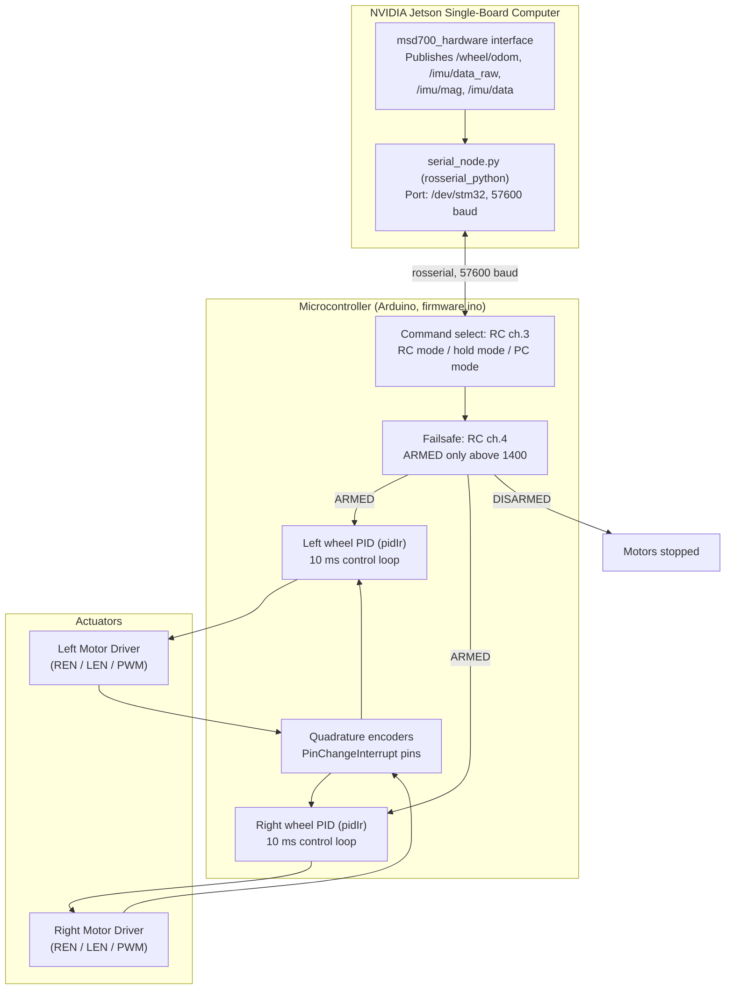

# Firmware, Microcontroller, and Hardware Bus

<RoleBadge role="developer" />

The embedded microcontroller firmware (`msd700_firmware/firmware/firmware.ino`, Arduino) and how the Jetson talks to it. The firmware takes commands from **two** sources — an RC receiver (Taranis X7) or the PC over ROS — and drives both wheel motors through per-wheel PID loops.

## Embedded Control Topology

There is no `/battery_state` topic anywhere in the stack, and no ADC battery divider in this firmware. Wheel geometry constants in the firmware (`WHEEL_RADIUS 2.75 cm`, `WHEEL_DISTANCE 23.0 cm`) match the host-side odometry config (`odometry_config.yaml`: radius `2.7 cm`, distance `23 cm`, `encoder_ppr 2400`).

---

## Hardware Pinout (`firmware.ino`)

| Signal Function | Microcontroller Pin |
| --- | --- |
| **Right Motor REN / LEN / PWM** | Pins 4 / 5 / 9 |
| **Left Motor REN / LEN / PWM** | Pins 6 / 7 / 8 |
| **Right Encoder A / B** | Pins 52 / 12 |
| **Left Encoder A / B** | Pins 11 / 10 |
| **Status LEDs (red / blue)** | Pins 30 / 31 |
| **Camera servo** | Pin 3 (range 125–175, step 10) |
| **Ultrasonic (UART2 RX / TX)** | Pins 17 / 16 |

The Jetson link is `Serial.begin(57600)`.

---

## Closed-Loop PID Velocity Control

Each wheel runs a discrete PID loop (`pidIr`) on a 10 ms control period (`LOOP_TIME 10`):

$$\text{PWM}_k = K_p \cdot e_k + K_i \sum e_j \cdot \Delta t + K_d \cdot \frac{e_k - e_{k-1}}{\Delta t}$$

The output is saturated (`constrain`) at `MAX_PWM 250`, not the full 8-bit 255. Speed caps are `MAX_RPM_MOVE 180` (longitudinal) and `MAX_RPM_TURN 70` (rotation). RC receiver channels pass through a 0.25 Hz low-pass filter; encoder signals through a 3 Hz low-pass filter.

---

## RC Failsafe (Arming)

The prototype only accepts motion commands while **ARMED**: RC channel 4 must read above 1400 (`update_failsafe()`). Below that the state is DISARMED and the motors stop, regardless of what RC or PC commands arrive. Command source follows RC channel 3: RC mode, hold mode, or PC (ROS) mode.

## Related Documentation

- [Sensor Fusion and Control](/development/ros/sensor-fusion-and-control): Odometry integration and EKF.
- [Costmaps and Planners](/development/ros/costmaps-and-planners): Velocity limit parameters.
- [State and Behavior](/development/state-and-behavior): Emergency stop state machines.
