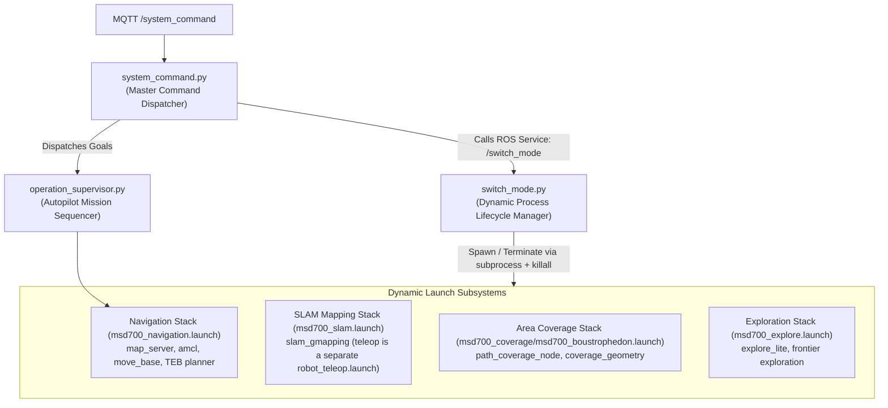
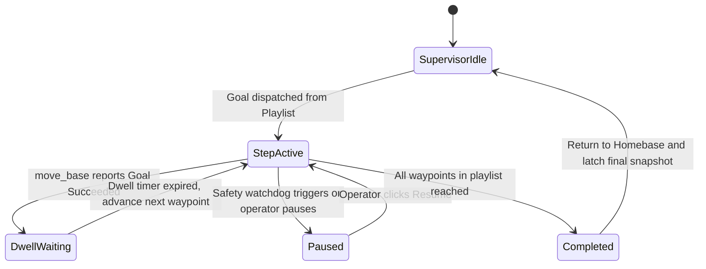

# Dynamic Node and Mode Switching Architecture

<RoleBadge role="developer" />

This document details how the MSD700 robot dynamically switches between operational modes (`navigation`, `slam`, `explore`, `boustrophedon` — idle is simply "no launch stack") at runtime using `switch_mode.py`, `system_command.py`, and `operation_supervisor.py` without restarting the primary ROS core. Mode names come from `switch_mode.yaml` and must match the strings sent over the `/switch_mode` service.

## Mode Orchestration Topology



---

## Operating Modes and Active Node Stacks

| Mode (`switch_mode.yaml`) | Launch file | Notes |
| --- | --- | --- |
| (idle — no stack) | — | Base nodes keep running (`serial_node`, `imu_filter`, `robot_state_publisher`, `aws_mqtt`, `camera_client`). |
| **`navigation`** | `msd700_navigation.launch` | `map_server`, `amcl`, `move_base`, costmaps. |
| **`slam`** | `msd700_slam.launch` | Live mapping; teleop is a separate launch, not part of the stack. |
| **`explore`** | `msd700_explore.launch` | `explore_lite` frontier search. |
| **`boustrophedon`** | `msd700_coverage/msd700_boustrophedon.launch` | `path_coverage_node`; `use_autocover` off by default. |

---

## Dynamic Process Lifecycle via `subprocess`

`switch_mode.py` spawns each stack with `subprocess.Popen(cmd_list, ...)` and tears it down with the timeouts from `switch_mode.yaml`:

```yaml
timeouts:
  graceful_shutdown: 3   # seconds before escalation
  force_kill: 1          # seconds before SIGKILL
```

### Graceful Teardown and Zombie Prevention:
1. **Terminate**: the active stack's process group is asked to shut down gracefully.
2. **3-Second Grace Window**: nodes get up to 3 seconds to flush state (e.g. `map_saver` writing `.pgm`/`.yaml`).
3. **Escalation**: past the grace window the switcher escalates to force-kill (`1 s`), and simulator leftovers are reaped with `killall`, ensuring zero zombie nodes remain on the ROS master graph.

---

## Autopilot Mission Sequencing (`operation_supervisor.py`)

`operation_supervisor.py` manages autonomous execution of multi-step waypoint routes and area coverage playlists:



### Key Supervisor Capabilities:
- **Latched Operation Snapshot**: Publishes `/string/operation_snapshot` with latched QoS. When any operator opens a browser tab, the full state of the active mission (active waypoint index, remaining route pins, dwell timer) is recovered in milliseconds.
- **Autopilot Safety Exemption**: When Autopilot is toggled ON, the supervisor suppresses the 10-second operator disconnect pause, allowing long-running sweeping missions to proceed unattended.

## Related Documentation

- [ROS Package Registry](/development/ros/ros-packages): Package structures and launch file definitions.
- [State and Behavior](/development/state-and-behavior): Detailed finite state machines and watchdog tiers.
- [Message Contracts](/development/message-contracts): MQTT and operation sync message payloads.
