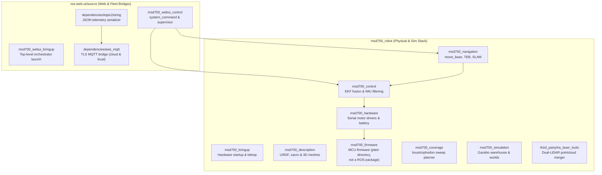

# ROS Package Registry

<RoleBadge role="developer" />

This document provides a comprehensive registry of all ROS 1 Noetic packages within the MSD700 workspace across `msd700_robot` and `ros-web-ui/source`, detailing package roles, key launch files, active nodes, published/subscribed topics, and parameters.

## Workspace Package Layout

## Package Directory: `msd700_robot`

### 1. `msd700_navigation`
The core autonomous movement, SLAM mapping, and area coverage package.

- **Primary Nodes**:
  - `move_base`: Standard ROS navigation action server utilizing `navfn/NavfnROS` for global path planning and `teb_local_planner/TebLocalPlannerROS` for trajectory optimization.
  - `slam_gmapping`: 2D laser-based SLAM mapping node generating occupancy grids.
  - `amcl`: Adaptive Monte Carlo Localization particle filter for static map localization.
- **Key Launch Files**:
  - `msd700_navigation.launch`: Full navigation bringup with map server, AMCL, and move_base.
  - `msd700_slam.launch`: Gmapping SLAM launch (teleop is the separate `robot_teleop.launch`).
  - `msd700_explore.launch`: Autonomous SLAM frontier exploration (`explore_lite`).
- **Coverage lives next door**: `msd700_coverage/launch/msd700_boustrophedon.launch` runs `path_coverage_node.py`, which plans serpentine paths and replans around obstacles using `src/msd700_coverage/coverage_geometry.py`.

### 2. `msd700_control`
Manages state estimation, coordinate transform hierarchies, and sensor fusion.

- **Primary Nodes**:
  - `ekf_localization_node` (`robot_localization`): Extended Kalman Filter fusing wheel encoder odometry (`/wheel/odom`) and filtered IMU data (`/imu/from_filter`) into a stable `/odometry/filtered` topic at 30 Hz.
  - `imu_filter_node` (`imu_filter_madgwick`, launched by `imu_filter.launch` with `gain 0.01`, magnetometer on, fixed frame `odom`): Madgwick AHRS filter converting raw angular rate and acceleration into orientation quaternions. Its output topic is `/imu/from_filter` (remapped from `/imu/data`), which is what the EKF actually consumes; `/imu/data` itself is published by `hardware_state.py`.
- **Key Launch Files**:
  - `robot_localization.launch`: Configures and launches EKF fusion with parameter loading from `ekf_localization_config.yaml`.
  - `imu_filter.launch`: Launches Madgwick orientation estimation.

### 3. `msd700_description`
Defines physical kinematic structures, collision geometries, and sensor placements using URDF and Xacro.

- **Primary URDF Models**:
  - `urdf/msd700_field.urdf.xacro`: True-scale production robot model (0.90 x 0.70 m body, 4 drive wheels at x = ±0.30 m / y = ±0.30 m, Velodyne mast at 0.50 m above footprint). No casters, no `camera_link`.
  - `urdf/velodyne/VLP_16.urdf.xacro`: High-fidelity 16-channel 3D LiDAR model and Gazebo sensor plugins.
  - `urdf/turtlebot3_waffle.urdf.xacro`: Legacy small-scale prototype model.

### 4. `msd700_hardware` & `msd700_firmware`
Handles low-level hardware interfaces, motor actuation, encoder pulse counting, and battery status.

- **Hardware Architecture**:
  - `serial_launch.launch` (`msd700_bringup`): Connects the host to the low-level microcontroller over `/dev/stm32` at 57600 baud (via `rosserial_python` `serial_node.py`).
  - The firmware speaks the rosserial protocol to the `msd700_hardware` interface, which publishes `/wheel/odom` and the raw IMU topics. There is no `/battery_state` topic anywhere in the stack. See [Firmware and Hardware](/development/ros/firmware-and-hardware) for what the firmware actually implements.

### 5. `msd700_simulation`
Gazebo simulation environment for testing navigation algorithms in software.

- **Key Environments**:
  - `msd700_warehouse_nav.launch`: Launches the 13.98 x 20.91 m AWS RoboMaker Small Warehouse with true-scale `msd700_field` robot model.
  - `scripts/fetch_sim_worlds.sh`: On-demand downloader for 3D simulation meshes (12 MB) from GitHub `ros1` branch.

### 6. `third_party/ira_laser_tools`
Available for merging multiple 2D LiDAR scanners, but the default stack does not use the dual merger: `pointcloud_to_laserscan` converts the Velodyne cloud into `/scan`, with the hazard pipeline adding `/scan_hazard`.

## Package Directory: `ros-web-ui/source`

### 1. `msd700_webui_control`
Bridges web commands and dashboard telemetry to physical robot hardware.

- **Key Nodes**:
  - `system_command.py`: Subscribes to MQTT `/system_command`, manages the exclusive operating lease, dispatches actions, and publishes `/system_feedback`.
  - `operation_supervisor.py`: Autonomous mission sequencer managing Autopilot waypoint advancement and latching `/string/operation_snapshot`.
  - `switch_mode.py`: ROS service orchestrator dynamically switching between `navigation`, `slam`, `explore`, and `boustrophedon` mode launch stacks (idle = no stack).
  - `hardware_monitor.py`: Background watchdog verifying that critical sensor processes and USB devices remain healthy.

### 2. `dependencies/topic2string`
High-performance serialization layer converting heavy ROS message types to JSON strings.

- **Key Nodes**:
  - `robotpose_to_string.py`: pose telemetry serializer, 2 Hz by default (raised to 25 Hz by `topic2string/launch/msd.launch` so the dashboard marker stays smooth during manual drive).
  - `laserscan_to_string.py`: event-driven compressed laser scan serializer (no fixed rate).
  - `map_compression_pipeline.py` (node name `map_compression_node`): Base64 zlib compression for live SLAM occupancy grids.

### 3. `dependencies/aws_mqtt`
Encrypted transport bridge linking local ROS topics to the central HiveMQ broker.

- **Launch Files**:
  - `nakayama_msd.launch`: Robot-side bridge connecting onboard ROS topics to cloud HiveMQ on port 8883 (TLS).
  - `nakayama_cloud.launch`: Server-side bridge translating MQTT topics into per-unit cloud ROS topics.
  - `local_msd.launch`: Unit-side bridge connecting to local Mosquitto broker (`127.0.0.1:1883`).

## Related Documentation

- [Architecture](/development/architecture): High-level system structure and seams.
- [Sensor Fusion and Control](/development/ros/sensor-fusion-and-control): Detailed EKF and sensor pipeline setup.
- [State and Behavior](/development/state-and-behavior): Detailed state machines for all control nodes.
