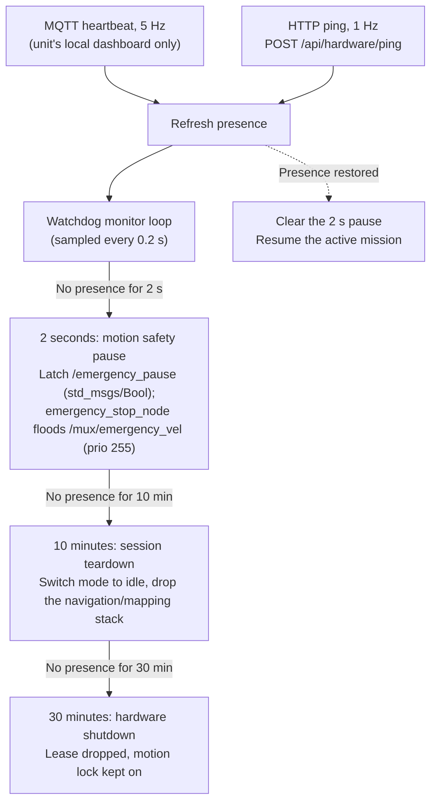

# Safety Watchdog and Heartbeat Supervision

<RoleBadge role="developer" />

The onboard software monitors operator presence with a watchdog, running inside `system_command.py`. This is a robot-internal safety mechanism with no dashboard UI of its own; for how the operator sees its effects (the `in_use`/lease fields, activity states it can force), see [Architecture § State Ownership and Persistence Matrix](/development/architecture#state-ownership-and-persistence-matrix) and [Navigation: Manual Override & Autopilot](/development/webui/navigation/manual-and-autopilot).

## Two presence signals

The watchdog accepts either of two signals as proof that an operator page is watching:

| Signal | Path | Rate | What it carries |
| --- | --- | --- | --- |
| `ping` | Browser → `POST /api/hardware/ping` → backend → MQTT → `/system_command` | 1 Hz, request timeout 1.5 s | Presence **and** authority: operating lease, claim/release/takeover, `origin` stamped by the backend, status feedback |
| `heartbeat` | Browser → MQTT over WebSocket straight to the unit's Mosquitto (`NEXT_PUBLIC_MQTT_WS_URL`, port `9001`) → `/system_command` | 5 Hz, QoS 0, no retain | Presence only (`data.page`). Grants nothing: no claim, no release, no origin, no feedback |

The heartbeat exists because the HTTP ping is a round trip through the cloud: on a lossy link two lost pings in a row already trip the 2 s tier. The heartbeat needs ten consecutive losses. It only runs where the dashboard was built with `NEXT_PUBLIC_MQTT_WS_URL`, which the unit's local dashboard is (`ws://<LOCAL_IP>:9001`); the cloud dashboard does not set it, so cloud sessions are supervised by the HTTP ping alone. `heartbeatService.ts` sends it; `_operator_heartbeat` in `system_command.py` receives it.

## Heartbeat Watchdog Timing Tiers

Values come from `msd700_webui_control/config/system_command.yaml`.

1. **2 seconds (motion pause)**: With no presence for 2 s (`ping_pause_timeout: 2.0`, sampled every `ping_monitor_interval: 0.2`), `system_command.py` latches `/emergency_pause` (`std_msgs/Bool`) and `emergency_stop_node` floods zero-twist on `/mux/emergency_vel` at priority 255. The active `move_base` goal is not cancelled. The next accepted ping or heartbeat lifts the pause and motion resumes.
2. **10 minutes (session teardown)**: With no presence for 10 minutes (`ping_timeout: 600.0`), the active navigation or mapping session is unloaded and the robot goes idle.
3. **30 minutes (hardware shutdown)**: After 30 minutes (`ping_shutdown_timeout: 1800.0`) the operating lease is dropped, the operation supervisor and manual override state are cleared, and all hardware is shut down with the motion lock held on. This tier does **not** recover on reconnect: the hardware must be re-initialised explicitly.

Only the page that owns the running operation holds these tiers off. The unit list and login page are read-only and never count as supervising.

::: warning Autopilot Mode Exemption
While Autopilot is active, **all three** tiers are suspended: the 2 s pause, the 10-minute idle switch and the 30-minute shutdown. The robot finishes its autonomous route even if the operator closes their laptop or drives through Wi-Fi dead zones. See [Navigation: Manual Override & Autopilot](/development/webui/navigation/manual-and-autopilot) and [Mapping: Manual Override & Autonomous Exploration](/development/webui/mapping/manual-and-autonomous) for what triggers this exemption from each page.
:::

## Related

- [Architecture § State Ownership and Persistence Matrix](/development/architecture#state-ownership-and-persistence-matrix)
- [Navigation: Manual Override & Autopilot](/development/webui/navigation/manual-and-autopilot)
- [Mapping: Manual Override & Autonomous Exploration](/development/webui/mapping/manual-and-autonomous)
- [ROS Package Registry](/development/ros/ros-packages)
