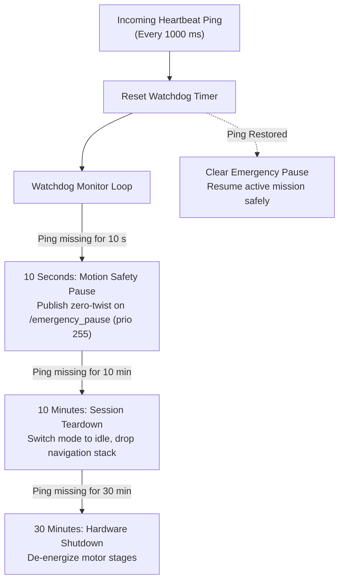

# Safety Watchdog and Heartbeat Supervision

<RoleBadge role="developer" />

The onboard software monitors communication health via a continuous sliding window watchdog, running inside `system_command.py`. This is a robot-internal safety mechanism with no dashboard UI of its own; for how the operator sees its effects (the `in_use`/lease fields, activity states it can force), see [Architecture § State Ownership and Persistence Matrix](/development/architecture#state-ownership-and-persistence-matrix) and [Navigation: Manual Override & Autopilot](/development/webui/navigation/manual-and-autopilot).

## Heartbeat Watchdog Timing Tiers

1. **10 Seconds (Motion Pause)**: If no valid heartbeat arrives for 10 seconds, `system_command.py` asserts a latched `/emergency_pause` twist command at priority 255. The robot decelerates to a complete stop without canceling the active `move_base` goal. When communication returns, the pause is lifted and motion resumes automatically.
2. **10 Minutes (Session Teardown)**: If the operator remains disconnected for 10 minutes, the active navigation or mapping session is gracefully unloaded to prevent motor overheating.
3. **30 Minutes (Hardware Shutdown)**: After 30 minutes of continuous absence, hardware drivers power down into a low-power standby mode.

::: warning Autopilot Mode Exemption
When Autopilot Mode is active, the 10-second communication pause is suspended. The robot continues its autonomous route even if the operator closes their laptop or drives through Wi-Fi dead zones. See [Navigation: Manual Override & Autopilot](/development/webui/navigation/manual-and-autopilot) and [Mapping: Manual Override & Autonomous Exploration](/development/webui/mapping/manual-and-autonomous) for what triggers this exemption from each screen.
:::

## Related

- [Architecture § State Ownership and Persistence Matrix](/development/architecture#state-ownership-and-persistence-matrix)
- [Navigation: Manual Override & Autopilot](/development/webui/navigation/manual-and-autopilot)
- [Mapping: Manual Override & Autonomous Exploration](/development/webui/mapping/manual-and-autonomous)
- [ROS Package Registry](/development/ros/ros-packages)
