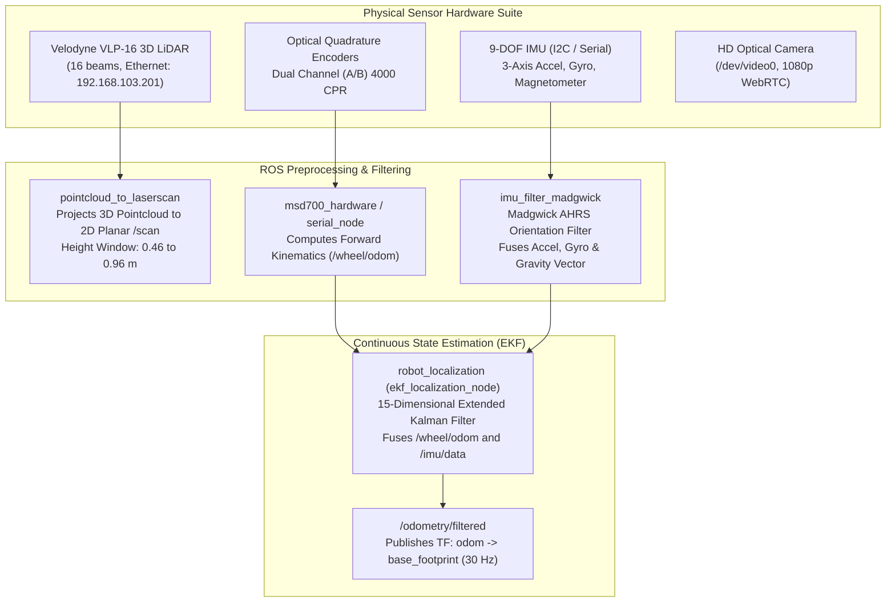
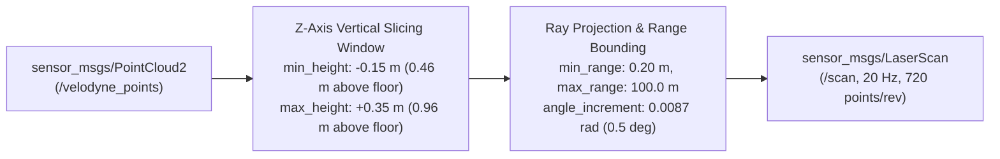

# Sensor Fusion, Kinematics, and State Estimation

<RoleBadge role="developer" />

This document provides an exhaustive mathematical and architectural specification of the state estimation pipeline, Extended Kalman Filter (EKF) configuration, IMU orientation filtering, and differential drive kinematics implemented on the MSD700 robot.

## Perception and Fusion Architecture

---

## Differential Drive Forward Kinematics

The physical robot operates as a two-wheel differential drive platform supported by four passive caster wheels.

### Kinematic Parameters:
- Wheel Radius: $r = 0.075\text{ m}$ (Wheel Diameter: $0.150\text{ m}$).
- Track Gauge (Distance between drive wheel centerlines): $L = 0.580\text{ m}$.
- Encoder Resolution: $CPR = 4000\text{ counts/revolution}$ (after $4\times$ quadrature decoding).
- Gearbox Reduction Ratio: $N = 30:1$.

### Displacement Calculations per Control Period $\Delta t$:
Given left encoder delta $\Delta \text{ticks}_L$ and right encoder delta $\Delta \text{ticks}_R$:

$$\Delta s_L = \frac{2 \pi r \cdot \Delta \text{ticks}_L}{CPR \cdot N}, \quad \Delta s_R = \frac{2 \pi r \cdot \Delta \text{ticks}_R}{CPR \cdot N}$$

Linear displacement $\Delta s$ and heading change $\Delta \theta$:

$$\Delta s = \frac{\Delta s_R + \Delta s_L}{2}, \quad \Delta \theta = \frac{\Delta s_R - \Delta s_L}{L}$$

### Discrete Odometry Integration:
In the robot local frame with Runge-Kutta 2nd-order (midpoint) integration:

$$x_{k+1} = x_k + \Delta s \cdot \cos\left(\theta_k + \frac{\Delta \theta}{2}\right)$$

$$y_{k+1} = y_k + \Delta s \cdot \sin\left(\theta_k + \frac{\Delta \theta}{2}\right)$$

$$\theta_{k+1} = \theta_k + \Delta \theta$$

---

## Madgwick AHRS IMU Orientation Filter

Raw IMU data on `/imu/data_raw` ($50\text{ Hz}$) is processed by `imu_filter_madgwick` to derive drift-free quaternion orientation $\mathbf{q} = [q_w, q_x, q_y, q_z]^T$:

### Gradient Descent Optimization:
$$\mathbf{q}_{k+1} = \mathbf{q}_k + \left( \frac{1}{2} \mathbf{q}_k \otimes \mathbf{\omega}_{gyro} - \beta \frac{\nabla \mathbf{f}}{\|\nabla \mathbf{f}\|} \right) \Delta t$$

- $\mathbf{\omega}_{gyro} = [0, \omega_x, \omega_y, \omega_z]^T$: Angular rate vector from gyroscope.
- $\nabla \mathbf{f}$: Objective function gradient aligning measured accelerometer gravity vector with reference earth-frame gravity $[0, 0, 1]^T$.
- $\beta = 0.05$: Filter divergence rate parameter balancing gyroscope responsiveness against accelerometer vibration noise.

---

## 15-Dimensional Extended Kalman Filter (EKF)

The state estimation node (`ekf_localization_node` from `robot_localization`) maintains a 15-state Gaussian random variable vector:

$$\mathbf{x} = \begin{bmatrix} x & y & z & \phi & \theta & \psi & \dot{x} & \dot{y} & \dot{z} & \dot{\phi} & \dot{\theta} & \dot{\psi} & \ddot{x} & \ddot{y} & \ddot{z} \end{bmatrix}^T$$

Where:
- $x, y, z$: 3D position in odometry frame ($z$ clamped to $0$ in 2D mode).
- $\phi, \theta, \psi$: Roll, pitch, and yaw (Euler angles).
- $\dot{x}, \dot{y}, \dot{z}$: Body-frame linear velocities.
- $\dot{\phi}, \dot{\theta}, \dot{\psi}$: Angular velocities.
- $\ddot{x}, \ddot{y}, \ddot{z}$: Linear accelerations.

### Process Update (Prediction Step):
$$\hat{\mathbf{x}}_{k|k-1} = \mathbf{f}(\hat{\mathbf{x}}_{k-1|k-1}, \mathbf{u}_k)$$

$$\mathbf{P}_{k|k-1} = \mathbf{F}_k \mathbf{P}_{k-1|k-1} \mathbf{F}_k^T + \mathbf{Q}$$

- $\mathbf{F}_k = \left. \frac{\partial \mathbf{f}}{\partial \mathbf{x}} \right|_{\hat{\mathbf{x}}_{k-1|k-1}}$: State transition Jacobian matrix.
- $\mathbf{Q}$: Diagonal Process Noise Covariance Matrix (reflecting unmodeled dynamics and wheel slip).

### Measurement Update (Correction Step):
$$\mathbf{K}_k = \mathbf{P}_{k|k-1} \mathbf{H}_k^T \left( \mathbf{H}_k \mathbf{P}_{k|k-1} \mathbf{H}_k^T + \mathbf{R}_k \right)^{-1}$$

$$\hat{\mathbf{x}}_{k|k} = \hat{\mathbf{x}}_{k|k-1} + \mathbf{K}_k \left( \mathbf{z}_k - \mathbf{h}(\hat{\mathbf{x}}_{k|k-1}) \right)$$

$$\mathbf{P}_{k|k} = (\mathbf{I} - \mathbf{K}_k \mathbf{H}_k) \mathbf{P}_{k|k-1}$$

- $\mathbf{z}_k$: Measurement vector fusing velocity $\dot{x}$ from wheel odometry, and absolute yaw $\psi$ and angular velocity $\dot{\psi}$ from IMU.
- $\mathbf{R}_k$: Measurement Noise Covariance Matrix tuned for sensor variance ($R_{\dot{x}, \text{wheel}} = 10^{-3}$, $R_{\psi, \text{imu}} = 10^{-4}$).

---

## LiDAR PointCloud Projection Pipeline

The Velodyne VLP-16 sensor produces 300,000 points/sec across 16 laser rings. To minimize CPU utilization while preserving spatial obstacle awareness, `pointcloud_to_laserscan` slices the 3D point cloud into a high-rate 2D planar scan:

This ensures that obstacles (such as table legs, low pallets, and standing personnel) within the $0.46\text{ m}$ to $0.96\text{ m}$ elevation zone are captured into the navigation costmaps without floor-reflection clutter.

## Related Documentation

- [Costmaps and Planners](/development/costmaps-and-planners): Navigation layers and obstacle inflation.
- [Firmware and Hardware](/development/firmware-and-hardware): Microcontroller pulse counting and PID loops.
- [Simulation](/development/simulation): True-scale Gazebo sensor verification.
