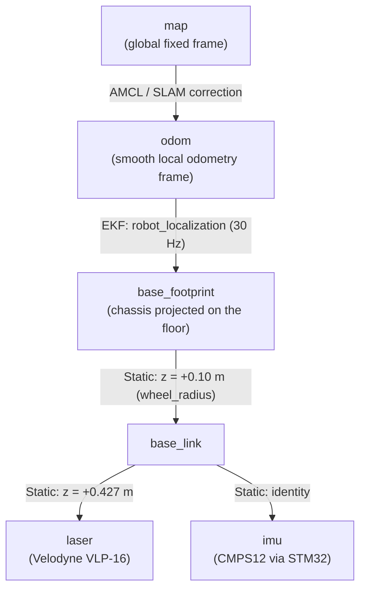
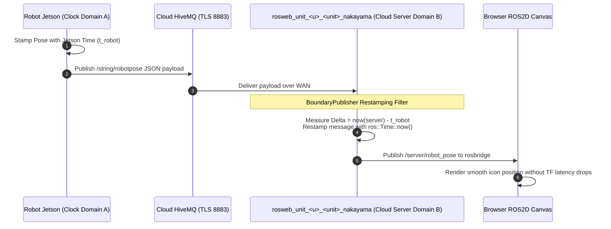

# Coordinate Frames, Transforms, and TF Architecture

<RoleBadge role="developer" />

This document provides a comprehensive specification of the coordinate transform tree (`tf` / `tf2`), spatial reference frames, dynamic transform broadcasters, sensor offsets, and cross-machine clock restamping implemented in the MSD700 robot system.

## Coordinate Frame Hierarchy (TF Tree)

The coordinate transform tree adheres to ROS REP-103 (Standard Units of Measure & Coordinate Conventions) and REP-105 (Coordinate Frames for Mobile Platforms):

The tree below is what the **real unit** publishes: `irbot.urdf.xacro` through `msd700_description/launch/robot_description.launch.xml`, started by `bringup_msd.launch` in every mode (idle included) so `/scan` and the EKF always have their static transforms. The lidar height comes from `config/msd700_xacro_irbot.yaml` (`offset_z_lidar: 0.427`, `wheel_radius: 0.10`) and is the datum `msd700_perception` measures every height from.



There is no `camera_link` on the robot: the camera is a separate USB/WebRTC device, not a URDF link.

In simulation the Gazebo model `msd700_field.urdf.xacro` is used instead: frames `base_scan` (0.40 m above `base_link`, 0.50 m above the footprint, with a `laser` alias for bag replay), `imu_link` (z ≈ 0.085 m) and four wheel links driven by `joint_state_publisher`.

---

## Transform Publishers and Update Rates

| Transform Edge | Broadcaster Node | Rate | Mathematical Source | Behavior During Outages |
| --- | --- | --- | --- | --- |
| `map -> odom` | `amcl` / `slam_gmapping` | 10 Hz | Corrects odometric drift against static laser occupancy grid. | Discrete jumps when localized; preserves last transform if laser scans drop. |
| `odom -> base_footprint` | `robot_localization` (`ekf_localization_node`) | 30 Hz | Continuous fusion of wheel odometry velocities and IMU attitude and angular rates. | Continuous, smooth, drift-free short-term trajectory. |
| `base_footprint -> base_link` | `robot_state_publisher` | Static | Fixed elevation offset ($z = 0.10\text{ m}$ = `wheel_radius`). | Fixed transform from URDF. |
| `base_link -> laser` | `robot_state_publisher` | Static | LiDAR mount ($x = 0$, $z = 0.427\text{ m}$ from `base_link`, `msd700_xacro_irbot.yaml`). | Fixed transform from URDF. |
| `base_link -> imu` | `robot_state_publisher` | Static | Identity; `/imu/data` is stamped in frame `imu`, so without this edge the EKF drops every IMU sample. | Fixed transform from URDF. |

---

## Spatial Coordinate Conventions (REP-103)

MSD700 strictly enforces right-handed Cartesian coordinate systems:

```
        +X (Forward / Roll Axis)
           ▲
           │
           │
           │
 ◄─────────┼─────────► +Y (Left / Pitch Axis)
           │
           ▼
        +Z (Upward / Yaw Axis)
```

- **$+X$**: Points directly forward along the robot's primary direction of travel.
- **$+Y$**: Points directly leftward across the robot's lateral width.
- **$+Z$**: Points vertically upward perpendicular to the floor plane.
- **Rotation Angles**: Follow right-hand rule (Counter-Clockwise rotation around $+Z$ corresponds to positive yaw rate $+\dot{\theta}$).

---

## Cross-Machine Clock Domain Restamping (`BoundaryPublisher`)

When telemetry (such as robot pose and laser scans) is bridged from the physical robot across the internet to the cloud server, **clock drift between physical machines creates `TF_OLD_DATA` extrapolation warnings** if timestamps are evaluated directly.



### Why Restamping Is Load-Bearing:
1. **Jetson RTC Limitations**: Physical SBCs in field environments without NTP access can boot with clocks skewed by seconds or months.
2. **Buffer Eviction**: If incoming pose messages carry timestamps in the past relative to the server's ROS master, `tf2_ros::Buffer` immediately discards them, preventing the web canvas from rendering robot movement.
3. **`BoundaryPublisher` Solution**: `BoundaryPublisher` (`topic2string/scripts/clock_boundary.py`, C++ twin `include/topic2string/clock_boundary.h`) wraps every bridge-ingress publisher and rewrites each absolute timestamp in the message to the local ROS clock, so a foreign robot or simulator stamp never reaches the server master's consumers.

## Related Documentation

- [Sensor Fusion and Control](/development/ros/sensor-fusion-and-control): Kinematic state estimation and EKF.
- [Costmaps and Planners](/development/ros/costmaps-and-planners): Navigation costmap coordinate frames.
- [rosbridge Protocol](/development/rosbridge-protocol): WebSocket topic serialization.
