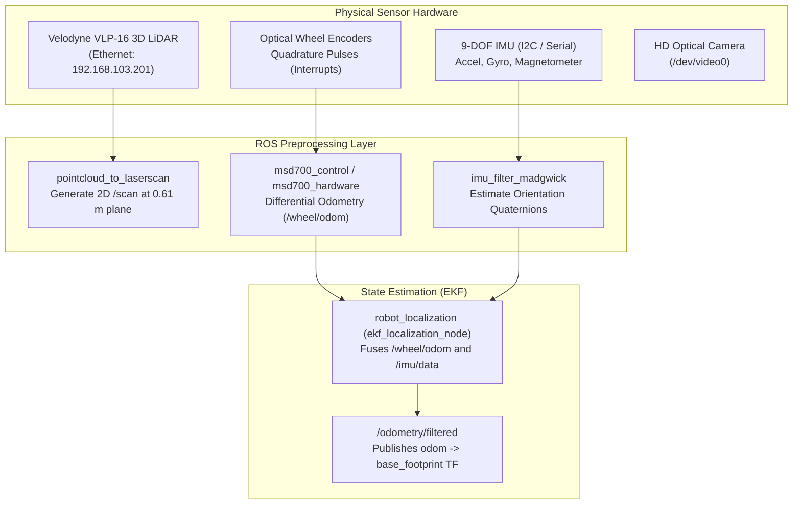
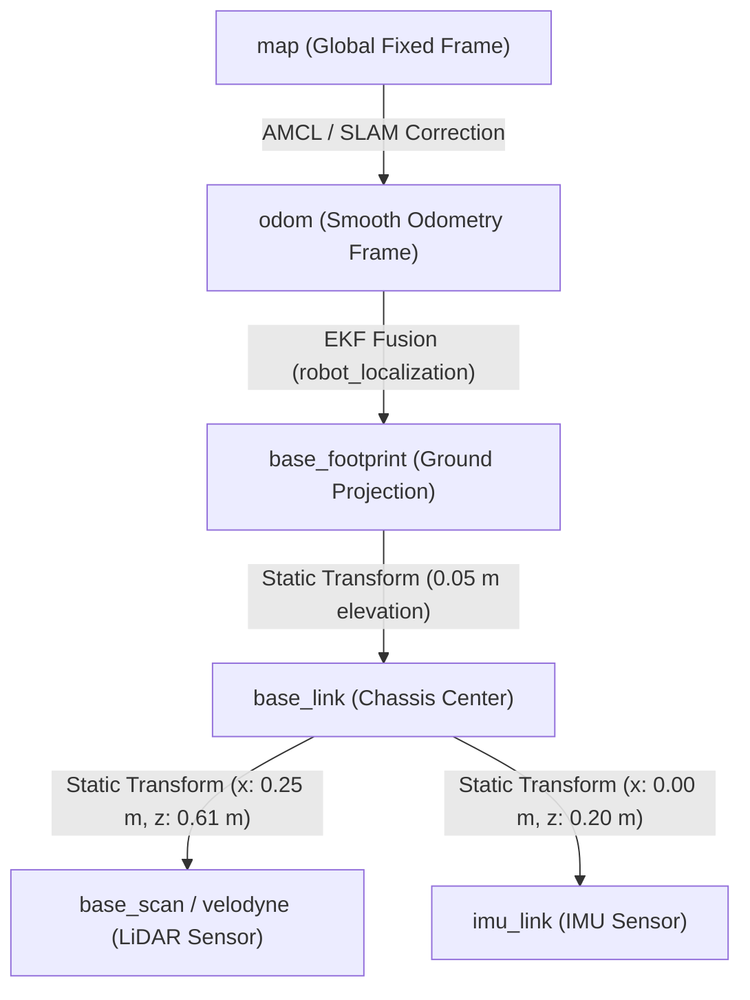

# Sensor Fusion and State Estimation

<RoleBadge role="developer" />

This document details the sensor hardware suite, network configuration, sensor preprocessing pipelines, and Extended Kalman Filter (EKF) state estimation architecture implemented on the MSD700 robot.

## Sensor Suite Overview

The MSD700 perception system combines multi-layer 3D LiDAR, 9-DOF Inertial Measurement Units (IMU), optical wheel encoders, and HD optical cameras.



## Hardware Sensors and Network Configuration

### 1. Velodyne VLP-16 3D LiDAR
The primary sensor for 360-degree obstacle detection and SLAM mapping.

- **Channels**: 16 laser channels firing at 10 to 20 Hz.
- **Range**: 100 meters measurement range with +/- 3 cm accuracy.
- **Field of View**: 360 degrees horizontal, 30 degrees vertical (+15 to -15 degrees).
- **Mounting**: Mounted on a rigid mast 0.61 m above ground to clear the chassis and avoid ground reflection artifacts.
- **Network Interface**:
  - Host Interface (`end0` on Jetson): `192.168.103.100`, subnet mask `255.255.255.0`.
  - Sensor IP: `192.168.103.201`, port `2368` (UDP data packets) and `8308` (telemetry).
  - ROS Driver: `velodyne_driver` and `velodyne_pointcloud` publish raw `sensor_msgs/PointCloud2` on `/velodyne_points`.

### 2. PointCloud-to-LaserScan Pipeline
To feed 2D costmaps and standard 2D SLAM (gmapping) without excessive CPU overhead, `pointcloud_to_laserscan` projects the 3D point cloud into a 2D planar laser scan:

- **Target Frame**: `base_scan`
- **Scan Height Window**: Filtered to points between `min_height: -0.15 m` and `max_height: 0.35 m` relative to sensor center (0.46 to 0.96 m above floor).
- **Angle Increment**: 0.0087 radians (approx. 0.5 degrees, 720 points per revolution).
- **Output Topic**: `/scan` (`sensor_msgs/LaserScan`).

### 3. Inertial Measurement Unit (IMU)
- **Sensor Specs**: 3-axis accelerometer, 3-axis gyroscope, and 3-axis digital magnetometer.
- **Update Rate**: 50 Hz on `/imu/data_raw`.
- **Madgwick Filter**: `imu_filter_madgwick` fuses angular velocity and linear acceleration with gravity vectors, eliminating gyro drift and publishing stabilized orientations on `/imu/data`.

## Extended Kalman Filter (EKF) State Estimation

State estimation is handled by `robot_localization/ekf_localization_node` in `msd700_control/launch/robot_localization.launch`.

### EKF Process and Measurement Model

The 15-dimensional EKF state vector estimates:
$$\mathbf{x} = [x, y, z, \text{roll}, \text{pitch}, \text{yaw}, \dot{x}, \dot{y}, \dot{z}, \dot{\text{roll}}, \dot{\text{pitch}}, \dot{\text{yaw}}, \ddot{x}, \ddot{y}, \ddot{z}]^T$$

```yaml
# config/ekf_localization_config.yaml
frequency: 30
two_d_mode: true
publish_tf: true
odom_frame: odom
base_link_frame: base_footprint
world_frame: odom

# Wheel Odometry Measurement Vector: [x, y, z, roll, pitch, yaw, vx, vy, vz, vroll, vpitch, vyaw, ax, ay, az]
odom0: /wheel/odom
odom0_config: [false, false, false,
               false, false, false,
               true,  false, false,
               false, false, true,
               false, false, false]
odom0_differential: false

# IMU Measurement Vector
imu0: /imu/data
imu0_config: [false, false, false,
              false, false, true,
              false, false, false,
              false, false, true,
              false, false, false]
imu0_differential: false
imu0_relative: false
```

### Fusion Rules:
1. **2D Mode Enabled (`two_d_mode: true`)**: Clamps $z$, $\text{roll}$, $\text{pitch}$, $\dot{z}$, $\dot{\text{roll}}$, and $\dot{\text{pitch}}$ to zero, eliminating vertical drift on flat indoor floors.
2. **Velocity from Wheel Encoders**: Reads linear forward velocity $\dot{x}$ and yaw rate $\dot{\text{yaw}}$ from wheel odometry.
3. **Orientation from IMU**: Reads absolute yaw orientation and high-frequency rotational acceleration from the IMU, eliminating wheel slip error during aggressive skid turns.

## Coordinate Frame Transform Hierarchy (TF Tree)



## Related Documentation

- [ROS Package Registry](/development/ros-packages): Package directories and node files.
- [Boustrophedon Coverage](/development/boustrophedon-and-alignment): Dual-geometry clearance calculations.
- [Simulation](/development/simulation): True-scale field model sensor emulation.
