# State and Behavior

<RoleBadge role="developer" />

MSD700 has more state machines than it looks like it has, and most support bugs are one of them
disagreeing with another. This page documents each one: where it lives, what moves it, what it
guarantees, and what it deliberately refuses to do.

The organising principle throughout: **the robot is the source of truth.** Toggles, leases and the
running operation all live on the robot, not in the browser and not in the backend, because the
robot is the only party that survives a backend restart, a closed tab, a reconnect and a network
outage.

## Where each piece of state lives

| State | Owner | Survives | Read by |
| --- | --- | --- | --- |
| Robot activity | `system_command.py` (`RobotStateTracker`) | browser close, backend restart | ping feedback |
| Operating lease | `system_command.py` | browser close, backend restart | ping feedback |
| Autopilot, manual override | `system_command.py` | browser close, backend restart | ping feedback |
| Current operation (waypoints, index) | `operation_supervisor.py` | browser close, backend restart | latched snapshot topic |
| Per-unit container liveness | `unit_manager.js` (backend memory) | nothing; rebuilt by `adoptExisting()` on boot | admin console, logout |
| Pins, draft areas, UI mode | browser `sessionStorage` | page refresh only | the dashboard itself |
| Accounts, maps, routes | MySQL | everything | everyone |

::: warning `sessionStorage` is the one piece that does not survive
Closing a tab wipes the browser's only copy of pins, mode and coverage draft. That is precisely why
`/string/operation_snapshot` is latched: a brand-new tab subscribes and gets the whole run back from
the robot. If you find yourself adding state to the browser that an operator would expect to survive
a tab close, it belongs on the robot instead.
:::

## Robot activity

One string, tracked by `RobotStateTracker`, reported in every ping. It is both the robot's status
and the routing key that sends a returning operator back to the right dashboard tab.

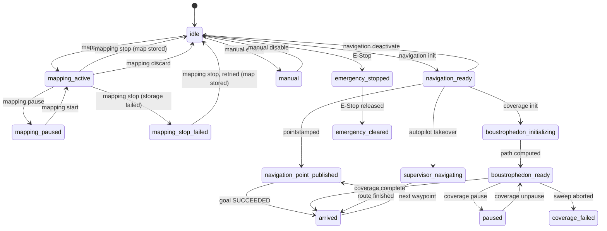

### The full activity vocabulary

Anything ending in `_failed` is a terminal error state that the operator has to clear; the robot
stays where it is.

| Activity | Tab | Meaning |
| --- | --- | --- |
| `idle` | idle | Nothing running. Drivers may still be up. |
| `manual` | idle | Operator is driving with W-A-S-D. |
| `mapping_active` | mapping | SLAM plus `explore_lite` running. |
| `mapping_paused` | mapping | Operator paused the mapping run. |
| `mapping_stop_failed` | mapping | `stop` was requested but the map is not safely stored yet. SLAM is deliberately **not** torn down; see [Map storage](#map-storage). |
| `navigation_ready` | navigation | Map loaded, `move_base` up, no goal. |
| `navigation_point_published` | navigation | A goal is in flight. |
| `boustrophedon_initializing` | navigation | Coverage path being computed. **Not** idle and **not** stuck. |
| `boustrophedon_ready` | navigation | Coverage sweeping. |
| `supervisor_navigating` | navigation | `operation_supervisor` is dispatching waypoints (autopilot takeover). |
| `arrived` | navigation | Goal or coverage run finished successfully. |
| `coverage_failed` | navigation | Coverage aborted before sweeping its area. |
| `auto_aligning` | navigation | Auto Align running. |
| `paused` | navigation | **Operator** paused a coverage run. |
| `paused_due_to_ping_loss` | (memo) | The **watchdog** paused motion. Not an operation of its own. |
| `emergency_stopped`, `emergency_cleared` | idle | E-Stop state. |
| `hardware_ready`, `hardware_checked`, `hardware_stopped` | idle | Hardware lifecycle. |
| `stuck` | (masked) | Not a real activity. See [idle and stuck](#idle-and-stuck-arbitration). |

Two derived answers come out of this single string:

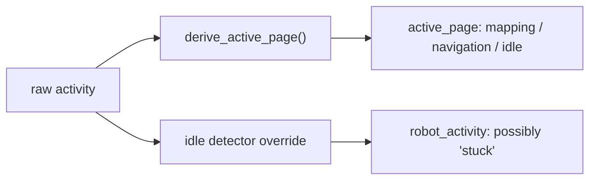

`active_page` is computed from the **raw** activity, before the stuck override. This ordering is
deliberate: a robot that got stuck mid-navigation must still route a returning operator to the
Navigation tab, and reporting `stuck` first would route them to `idle` and lose the running session.

## Velocity arbitration

Nothing on the robot writes to `/cmd_vel` directly. Everything goes through `twist_mux`, and the
priorities are what make E-Stop and manual override safe by construction rather than by convention.

| Source | Topic | Priority | Timeout | Who publishes |
| --- | --- | --- | --- | --- |
| Auto Align | `mux/allign` | 5 | 3.0 s | `align_checker` |
| Navigation | `mux/nav_vel` | 10 | 0.5 s | `move_base` |
| Keyboard / manual | `mux/key_vel` | 90 | 0.5 s | dashboard W-A-S-D |
| Emergency | `mux/emergency_vel` | 255 | 0.5 s | `emergency_stop_node` |

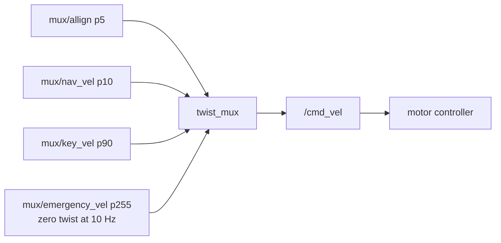

A pause is not a command to stop. It is `emergency_stop_node` flooding a zero twist at priority 255,
at 10 Hz, for as long as `/emergency_pause` is `true`. Because it outranks everything, it wins
without cancelling anybody's goal: the navigation stack keeps planning underneath and resumes the
instant the lock drops.

::: info Why every timeout is 0.5 s
`mux/key_vel`'s 0.5 s is what guarantees a manual stop when the operator's input stream dies, which
is why the watchdog is allowed to skip pausing during manual driving. The emergency topic's timeout
used to be 5.0 s, which kept the mux discarding every lower-priority twist for five seconds *after*
the pause was released. To an operator that reads as a robot stuck at the start of a run.
:::

## The disconnect watchdog (ping tiers)

Three independent tiers, all driven by the ping stream, all evaluated once per second by
`_monitor_ping_timeout`. They exist because a browser closing is not the same event as an operator
walking away, and neither is the same as a robot being abandoned for the night.

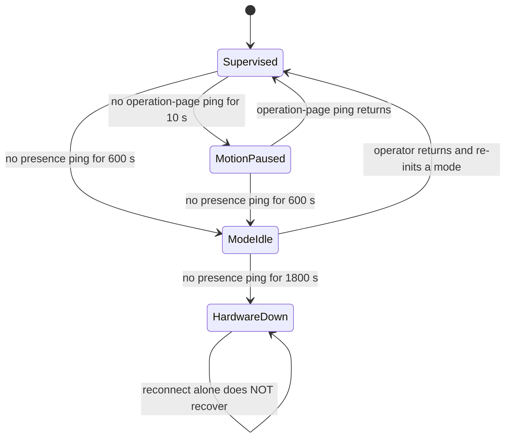

| Tier | Threshold | Fed by | Action | Auto-recovers |
| --- | --- | --- | --- | --- |
| Motion pause | `ping_pause_timeout` = **10 s** | pings whose `page` matches the running operation | Raise `/emergency_pause`. The mode keeps running underneath. | Yes, on the next matching ping |
| Idle | `ping_timeout` = **600 s** (10 min) | any operating-page ping (presence) | Drop the lease, raise the pause, `switch_mode` to `idle` | No, the operator re-inits a mode |
| Shutdown | `ping_shutdown_timeout` = **1800 s** (30 min) | presence | Drop the lease, keep the pause, shut **all** hardware down | No, hardware must be re-initialised explicitly |

Monitor period: `ping_monitor_interval` = 1.0 s. All four values live in
`msd700_webui_control/config/system_command.yaml`.

### Which pings feed which tier

This is the part that is easy to get wrong. A ping carries a `page`, and the page decides what that
ping is allowed to keep alive.

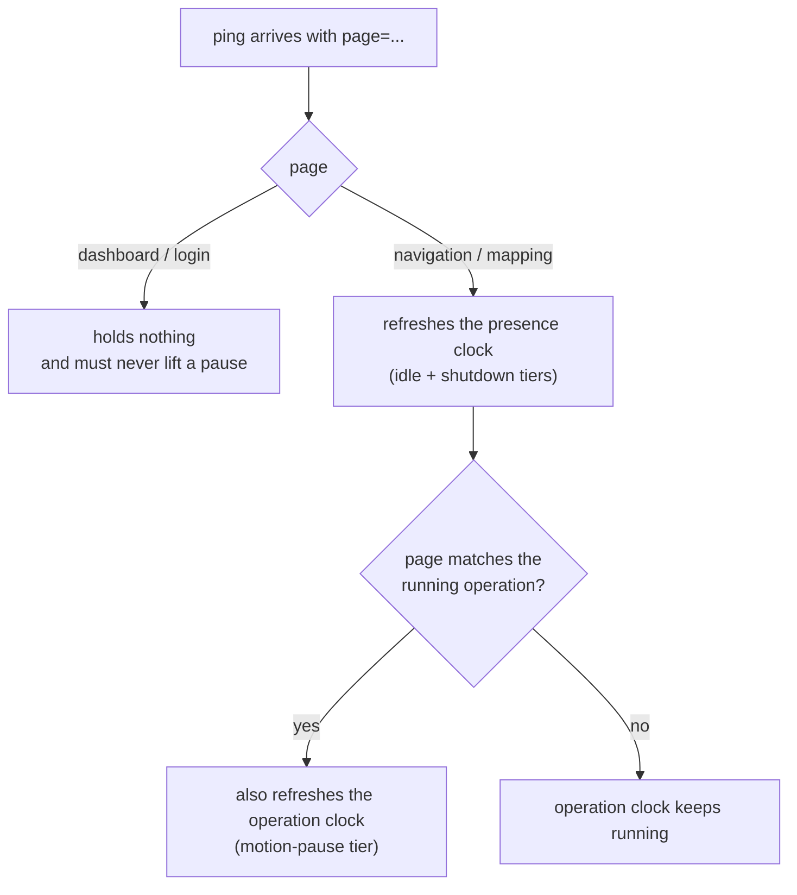

::: danger A unit-list poll must never resume a robot
The unit list pings every unit it can see, just to draw status badges. If those pings lifted a
motion pause, merely leaving the dashboard open on the list page would un-pause a robot nobody is
watching. That is the exact hole the tiering closes: only a ping from the page that owns the running
operation clears the pause.
:::

### Cases the watchdog deliberately declines

| Situation | Watchdog behavior | Why |
| --- | --- | --- |
| Autopilot is on | All tiers suspended, pending flags cleared | The whole point of autopilot is to keep running with no UI attached |
| Autopilot just went off | Tiers re-armed with a **fresh** window | Their clocks kept running while suspended; firing immediately on disengage would pause a healthy run |
| Manual override is on | Motion-pause tier suppressed, long tiers stay active | A priority-255 zero-twist flood would freeze W-A-S-D input; `mux/key_vel`'s own 0.5 s timeout already guarantees a stop |
| Operator paused (`paused`, `mapping_paused`) | Tier disarmed but the lock is left up | The lock is the operator's now, and their own resume path lowers it |
| No operation running | Pause cleared, tier idle | Nothing is moving, so there is nothing to pause |
| Nobody has ever opened this unit | Long tiers stay disarmed | There is nothing to have abandoned |

::: warning Clearing the flag and releasing the lock are one operation
`_clear_ping_pause` publishes `False` to `/emergency_pause` on its way out. An earlier version
cleared only the internal flag, which stranded the lock: `emergency_stop_node` kept flooding its
zero twist while nothing on the robot believed a pause was in effect, so no tier could ever lower it
again. Point navigation has no Play/Pause path that publishes to this topic, and session recovery
skips re-initialising a run that is already going, so the robot ended up pinned at zero with no
button in the UI able to free it.
:::

### Arming the operation clock

The short tier arms on the **idle to operation** edge only. Transitions *within* a run
(`navigation_ready` to `navigation_point_published`, `boustrophedon_initializing` to
`boustrophedon_ready`) must never re-arm it, or an operation that churns its own state would hold
the watchdog off forever without a single ping arriving.

Equally, the clock must be **refreshed** at that edge, not merely enabled. It stops advancing
whenever the robot is idle, paused or manual, so an operation starting after a long quiet period
would otherwise arm the tier holding a timestamp several minutes stale, and fire within one monitor
tick of the operator pressing Play.

## The operating lease

Which session is driving. Held on the robot, expiring, refreshed by the operating page's ping.

| Property | Value |
| --- | --- |
| Timeout | `~session_lease_timeout` = **15 s** since the last claiming ping |
| Refreshed by | Any ping with `claim: true` from the holding session |
| Released by | An explicit `release: true`, expiry, or the idle and shutdown tiers |
| Scope of a release | Same session, **or** the same account from any session |

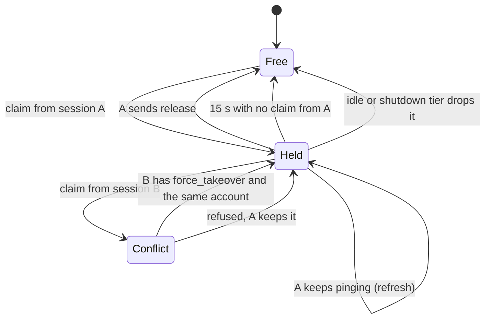

The rules, in the order they are applied:

1. **No `session_id`** means a client that predates the lease protocol. The robot returns success
   and claims nothing, rather than stranding the unit for 15 s after every ping.
2. **Re-entry by the same session always succeeds.** A refresh or a re-opened tab that kept its
   session id resumes control instead of locking itself out.
3. **Every other session is refused** unless `force_takeover` is set. This includes another session
   of the same account, and includes one on the same surface.
4. **A forced takeover across accounts is refused outright**, even with `force_takeover`. The unit
   list already refuses to enter a unit another account holds, so a hand-crafted request must not do
   what the UI will not offer.

::: info Why a second tab of your own account is refused
Two tabs of one account could otherwise drive the same robot simultaneously, each refreshing the
lease every second, each shown as being in control, and neither ever told about the other. Commands
from both interleave on one machine. A lease that any second session can take silently is not a
lease. Refusing here is also what makes a takeover visible on the **losing** side: its own next claim
fails, and `lease_status` starts reporting the conflict that the frontend acts on.
:::

The forced-logout case (an idle timeout or an expired token leaves a lease with nobody left to
release it) is covered without a silent steal: the lease expires 15 s after its last ping, so a
returning operator normally finds the unit free, and when they do not, one click takes it back.

## Autopilot

Autopilot is not a driving mode. It is a declaration that the operator is **allowed to leave**.

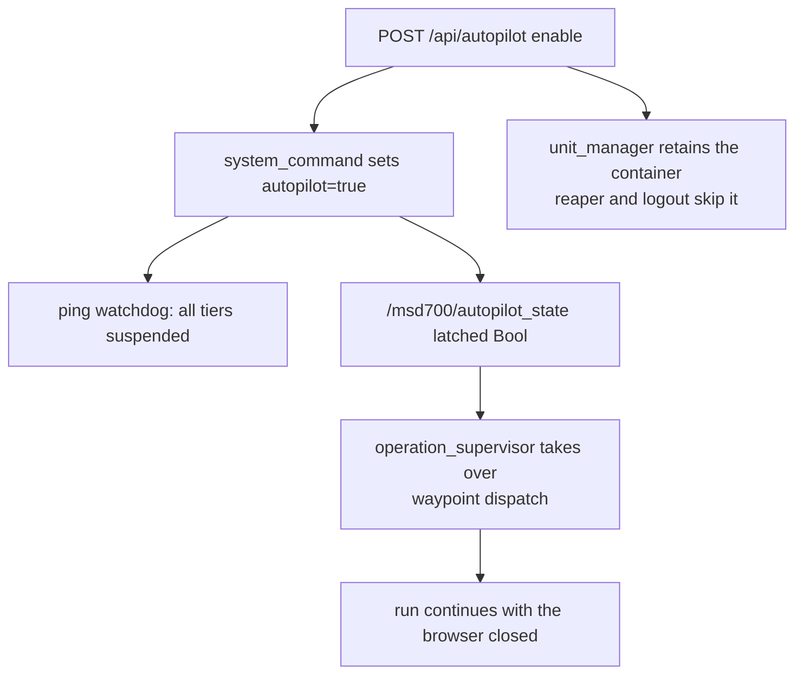

Three separate subsystems react to one toggle:

| Subsystem | Reaction |
| --- | --- |
| Ping watchdog | Suspends pause, idle and shutdown tiers |
| `operation_supervisor` | Takes over `move_base` goal dispatch for waypoint operations |
| `unit_manager` | Retains the per-unit container: the reaper skips it and a logout does not stop it |

Takeover engages when **autopilot is on** and **a waypoint batch is active** and **manual override
is off**. The latched `/msd700/autopilot_state` Bool is the authoritative trigger rather than the
explicit `takeover` message, so takeover still engages if that message is lost or the UI is already
gone.

Coverage and automap batches are recorded but never driven by the supervisor: they already run
autonomously on the robot (`path_coverage_node`, `explore_lite`).

::: warning Autopilot keeps the robot running; it never keeps a session
Suspending the watchdog does **not** refresh the lease. An absent operator still loses the unit to
the next taker after 15 s. This is intentional: the run continues, the seat does not stay reserved.
:::

### The stale-report race

A ping already in flight when an autopilot command is issued can be answered by the robot with the
flag's **old** value and arrive after the backend's own write, silently undoing it. The backend
therefore *pins* its view for a short window (`AUTOPILOT_PIN_MS`) in both directions. Pinning the
enable direction matters as much as disable: a stale contradicting report right after an enable would
stop the retention pass from ever seeing the unit as autonomous.

### When the handover is not acknowledged

Engaging autopilot mid-run is an explicit transfer of ownership. The browser sends the batch and a
`takeover`, waits up to 2.5 s for a snapshot that reflects it, and retries three times. Only once
that snapshot arrives does it suspend its own dispatch loop.

If it never arrives the browser **keeps driving** and says so in a banner. That is the safer
default: standing down for a driver that may not have picked up leaves the robot parked mid-route.

But a missing ACK is a statement about what the tab heard, not about the robot, and the two disagree
whenever the return leg alone is lost. So the tab keeps listening. `operation_progress` is published
only while the supervisor is dispatching, which makes an `active` progress message better proof of
ownership than the ACK it was waiting for. On receiving one, the browser stands its loop down and
clears the banner. Without that step both the tab and the supervisor dispatch onto the same
`move_base`, and the robot obeys whichever wrote last.

### Waypoint advancement

The browser's multi-pin loop advances **only on `SUCCEEDED` (status 3)**. Advancing on every
terminal status made the browser race the supervisor and skip waypoints the robot never reached.

## Manual override

| Aspect | Behavior |
| --- | --- |
| On enable | Cancels any running autonomous goal, releases the emergency-pause lock, activity becomes `manual` |
| On disable | Robot is zeroed |
| Velocity path | Dashboard publishes to `mux/key_vel` over rosbridge, priority 90 |
| Watchdog | Motion-pause tier suppressed while manual is on |
| Source of truth | The robot. The dashboard re-syncs its toggle from ping feedback after any refresh |

Because the toggle is synced **from** the robot, the UI must not assume its own click took effect.
The ordering rule is that the request carries a `reportRequestedAt` stamp, and a later robot report
that contradicts it wins with a visible notice, rather than the UI silently showing a state the robot
is not in.

## Idle and stuck arbitration

`idle_detector` answers one question over a service: is the robot physically moving? Combining that
with the tracked activity is how the "Robot Stuck" banner is produced, and getting it wrong in either
direction is very visible to operators.

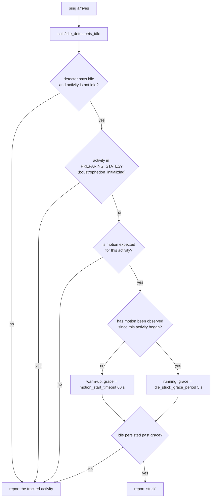

| Knob | Default | Meaning |
| --- | --- | --- |
| `idle_stuck_grace_period` | 5.0 s | How long idle must persist before declaring stuck, once the robot has moved at all |
| `motion_start_timeout` | 60.0 s | Warm-up allowance before the **first** motion of an activity |
| `idle_stuck_log_cooldown` | 15.0 s | Rate limit on the repeated-mismatch warning |

Two design points worth keeping:

- **`boustrophedon_initializing` is its own state.** Computing a coverage path can take a long time
  while the robot is legitimately stationary. Without a dedicated preparing state, every coverage
  run started with a false "stuck" banner.
- **Motion is tracked per activity, not globally.** A new activity resets `motion_observed`, so the
  60 s warm-up applies again. This is what tells "still warming up, never moved" apart from "was
  moving, now genuinely stalled".

::: info When the banner is wrong, the bug is in `idle_detector`
A "Robot Stuck" banner while the robot is visibly driving has always turned out to be the detector's
own logic (a sticky anchor point, or a displacement threshold too large for slow motion), not the
frontend. Fix it there rather than adding a filter in the UI.
:::

## Coverage lifecycle

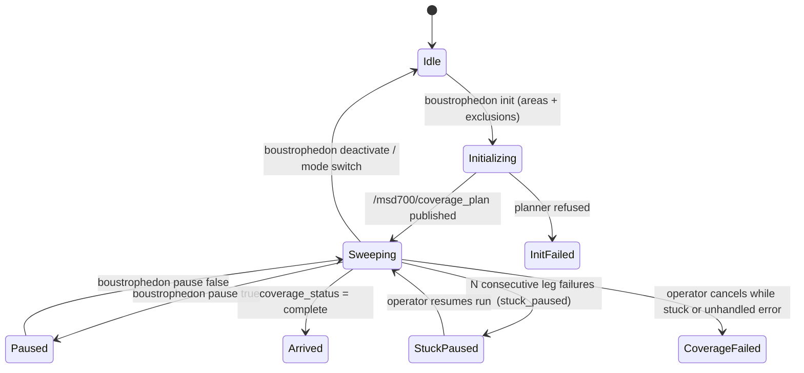

| Signal | Topic | Consumer |
| --- | --- | --- |
| Planned path | `/msd700/coverage_plan` | dashboard overlay (orange boustrophedon lines) |
| Keep-out grid | `/msd700/keepout_grid` | `keepout_layer` in the costmap |
| Run status | `/msd700/coverage_status` (`running`, `complete`, `aborted`, `stuck_paused`) | backend, flips activity to `arrived`, `coverage_failed`, or `stuck` |
| Swept path | `/msd700/boustrophedon_path`, **latched** | dashboard overlay, ACKed per revision |

### The sweep overlay is cleared at both ends of a run

`publish_coverage_status` wipes `/msd700/boustrophedon_path` when a run starts **and** when it
reaches a terminal status, and `boustrophedon deactivate` wipes it too, because that path stops
`path_coverage_node` before it can clear up after itself. Every entry point emits exactly one
`running`/terminal pair around a whole run, a playlist included, so a wipe can never erase earlier
areas mid-sequence.

::: warning Hiding an overlay in the browser does not end it
The topic is latched, and `navplan_to_string` rebroadcasts the last path it saw at 2 Hz for as long
as it lives. Until 2026-08-15 the only thing that ended a sweep overlay was a `sessionStorage` flag
in the dashboard, which logout wipes, so the next login resubscribed and the robot handed the old
sweep straight back. Anything that must survive a new browser session has to be cleared at the
source.
:::

::: tip Stuck and obstacle fallback in coverage
When consecutive waypoints fail due to an obstacle, `path_coverage_node` enters `stuck_paused` and
notifies the system rather than hard-aborting the whole run. The operator sees the Robot Stuck
warning, can remove the obstruction, and press Resume to continue the sweep.
:::

::: danger Coverage failure modes that look like success
**Keep-out deadlock.** `keepout_layer` waits for `/msd700/keepout_grid`. If it is never published,
the costmap never becomes "current", the planner stops, and goals are accepted while the robot does
not move at all.

**ABORTED reported as complete.** `complete` used to be published on every exit (including degenerate
outlines or missing free space), so an area the robot gave up on was filed as swept. Early exits now
explicitly mark `_sweep_aborted = True` so an unswept area is never falsely marked `complete`.
:::

::: warning Cancel leaves residue on a latched topic
The area list is published on a latched topic. Cancelling a run does not clear it, so the next
coverage node to start picks the old areas back up and the robot "continues an operation that was
cancelled". Clearing the latch is part of cancelling, not part of starting.
:::

## Map storage

A finished map is written to **two** media servers — the Unit's own, and the cloud's — in the same
`mapping stop` request, using the credential each one actually trusts (see
[Architecture § Trust domains](/development/architecture#trust-domains)). The two targets do not
carry equal weight:

| Target | Required? | A failure means |
| --- | --- | --- |
| The Unit's own media server | Yes | The robot cannot navigate this map at all. Treated as the save failing. |
| The cloud's media server | No | Not yet on the cloud. `sync_agent` carries the row and the files up on its next round; no separate retry queue exists. |

Both uploads carry the **same map ULID**, minted once by `backend_node` before the command is sent.
That is what makes retrying, or writing to both targets, safe rather than risky: `sync_engine`'s
`applyRow` is an upsert keyed by `id`, so two independent writes for the same ULID converge on one
row instead of racing into a duplicate.

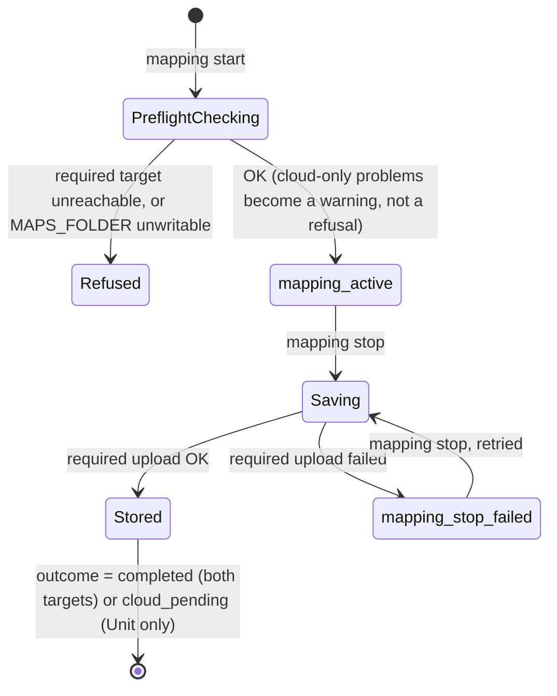

::: info Preflight moves the failure earlier, it does not remove it
`check_map_storage_ready()` runs on `mapping start`: it probes `MAPS_FOLDER` is writable, that a
credential can be minted for each target, and each target's `/health`. A problem with the **required**
target refuses the start outright — mapping is 20–30 minutes of unrecoverable work if it fails at
the end, since SLAM keeps no history to resume from. A problem with the **optional** cloud target
does not block anything; it is echoed back in the `start` response message so the operator knows the
map will land on the robot only, ahead of time rather than as a surprise at the end.
:::

::: warning A failed save does not tear the session down
Earlier behaviour called `switch_mode('idle')` and reset the map regardless of whether storage
succeeded, which discarded the whole run over a problem as mundane as an expired token or a
restarted container. Now a failure on the **required** target leaves `mapping_active`'s SLAM state
alone and reports `mapping_stop_failed`: the operator fixes the cause and presses Save again on the
same run. Only a **stored** map (`completed` or `cloud_pending`) tears down mapping mode.
:::

The terminal event on `/system_feedback` (`header: "mapping_progress"`) carries an `outcome` field
that names the result instead of leaving the dashboard to infer it from the progress number — see
[Message Contracts § mapping](/development/message-contracts#mapping) for the exact payload. Exactly
one terminal event is sent per run; `terminal: true` marks it.

| `outcome` | Meaning | Should the operator worry? |
| --- | --- | --- |
| `completed` | Stored on the Unit and the cloud | No |
| `cloud_pending` | Stored on the Unit; the cloud copy will follow via sync | No — this is normal for a robot working offline |
| `failed` | Not stored anywhere | Yes |

## Session recovery

What happens when an operator comes back.

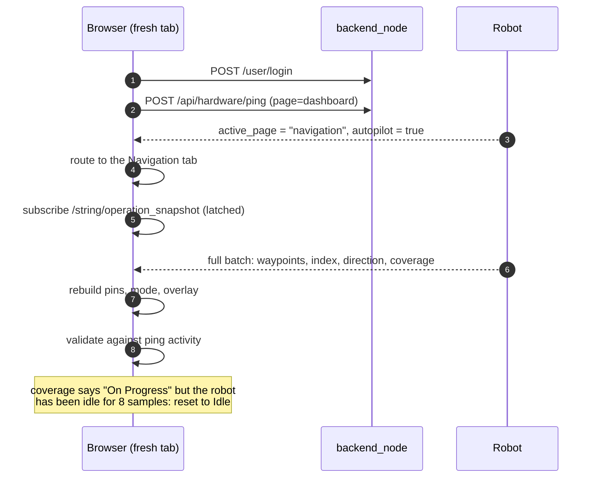

Four rules that make this reliable:

1. **Routing comes from `active_page`**, which is derived from the raw activity, so a stuck or
   paused robot still lands the operator on the right tab.
2. **The run is rebuilt from the latched snapshot**, not from browser storage, which a new tab does
   not have.
3. **Client-driven advancement must be restarted.** A refresh mid-run kills the browser loop that
   dispatches the next waypoint, so recovery calls `startNav(resumeIndex)`. Without it the robot
   finishes its current goal and stalls forever. Coverage and explicitly paused runs are excluded.
4. **Recovered state is validated against the robot.** If the snapshot claims a coverage run is in
   progress but the robot reports idle across several samples, the UI resets to Idle rather than
   showing a phantom operation.
5. **Ending an operation is an explicit message.** The supervisor drops a batch only on `stop` or
   `complete`, so every way a run can end has to send one: a coverage run that finished on the robot
   with no deactivate call, a `boustrophedon deactivate`, a point-nav route that ended `Failed`, and
   a recovery that gives up on a run it cannot rebuild. Miss any of them and the snapshot keeps
   advertising a finished operation, which is exactly what rule 2 will faithfully restore.

::: warning Opening a map from the Database page is a full state flush
Entering a map from Database wipes the session state completely, then re-validates on re-entry.
This is deliberate: carrying `selectedMapId` across a logout was what made auto-resume bail and left
the canvas blank until a manual reload. Logout now clears the browser session explicitly and emits a
`ros-session-cleared` event rather than relying on a document reload that never happened.
:::

## Restart and shutdown verification

| Action | What is verified | Escalation |
| --- | --- | --- |
| Logout | The unit's rosbridge container is actually gone | Force-kill if the graceful stop does not take |
| Emergency shutdown | E-Stop first, then the full container set | Force-kill, then re-check |
| Reinit banner | Only shown on a **real** reboot (uptime reset), not a connection blip | Threshold 30 s, auto-hidden once healthy |

The session is cleared only when the verification succeeds. A shutdown that reports success while a
container is still running is worse than one that reports failure, because the next operator
inherits a robot the system believes is off.

## Related

- [Message Contracts](/development/message-contracts): the payloads these machines exchange
- [Architecture](/development/architecture): where each machine runs
- [API Reference](/development/api-reference): the HTTP surface that drives them
- [Troubleshooting](/setup/troubleshooting)
