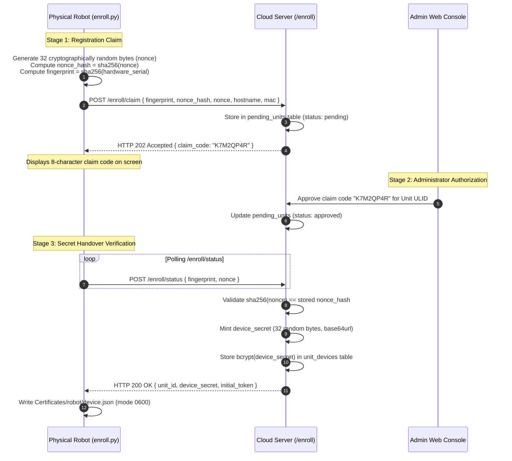

# Accounts & Access: Hardware Enrolment

<RoleBadge role="developer" />

The full cryptographic protocol a physical robot uses to register itself with the cloud server and
receive its own device credentials, with no human at the robot doing anything beyond reading a
claim code off a screen. This protocol produces the Robot Cloud Domain credentials described in
[Security & Tokens](/development/webui/accounts/security-and-tokens); for where the resulting
`device.json` and token cache live on the robot host, see
[ROS Integration](/development/webui/accounts/ros-integration).

## Cryptographic hardware enrolment (the nonce protocol)

Unenrolled robots register themselves with the cloud server through a three-stage cryptographic
handshake.

### Why the 32-byte nonce protocol is critical

- **MAC / Fingerprint Spoofing Protection**: Hardware MAC addresses and serial numbers are
  broadcast on local networks and visible in the admin console. Without the secret nonce, an
  attacker spoofing a MAC address could claim credentials while the physical robot is powered off.
- **Single-Use Verification**: The plaintext nonce is transmitted over TLS in a POST body (never a
  query string, so it stays out of reverse-proxy access logs) during credential handover, and again
  on a self-heal recovery (below). The server always verifies `sha256(nonce)` against the stored
  hash before it mints anything.
- **Zero Raw Secret Storage**: The cloud database stores only the `bcrypt` hash of `device_secret`.
  Even a complete database leak does not compromise active robot device secrets.

### Self-heal recovery: a lost `device.json` without a new approval

A robot that loses its local `device.json` (disk wipe, a container bind-mount creating an empty
directory, an earlier bug) normally reappears in the **pending** pool and an administrator has to
adopt it back onto its unit, every time. When nothing about the binding actually changed, that is
pure latency and a queue operators learn to rubber-stamp.

`POST /enroll/claim` now short-circuits that when **all three** hold:

1. The `pending_units` row is already `claimed` (this hardware completed enrolment before).
2. The request carries the **raw nonce**, and `sha256(nonce)` matches the row's stored
   `nonce_hash`. This is the same bar `/enroll/status` clears before a handover; a spoofed
   fingerprint never had the nonce.
3. A live `unit_devices` row still binds this exact `fingerprint` to the unit the row was approved
   onto (`revoked_at IS NULL`).

The server then re-mints the `device_secret` in place and returns it in the claim response, exactly
like the enrolment-voucher path, with no administrator step. The `unit_connection_log` entry is
tagged `recovery`.

Anything that fails those checks still falls through to the pending pool for a human: a changed
nonce (a genuine re-image, or an impostor), or no live binding (the hardware was adopted onto a
different unit, or an admin unbound it on purpose).

### `secret_prev_hash`: one generation of grace

`issueCredential` keeps the outgoing `secret_hash` as `secret_prev_hash` **only when the same
`fingerprint` is re-collecting**. A robot that writes the new `device.json` and then, on a retry or
a racing second call, presents the copy it held a moment earlier is not locked out for it.
`/enroll/token` clears `secret_prev_hash` the instant the robot proves it holds the current secret,
so the window is exactly "until first successful use". A takeover (the `fingerprint` changed) still
cuts over immediately, with no grace for the box being replaced.

## Related

- [Overview](/development/webui/accounts/overview): the four Accounts & Access screens and how
  they relate.
- [Security & Tokens](/development/webui/accounts/security-and-tokens): JWT keyring, trust domains,
  and TLS termination.
- [ROS Integration](/development/webui/accounts/ros-integration): how tokens and the operating
  lease reach the robot.
- [Architecture](/development/architecture): full platform topology and trust domains.
- [State & Behavior](/development/state-and-behavior): the robot-side state machine, including
  lease enforcement.
