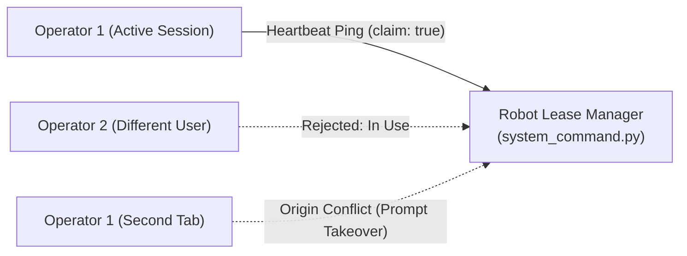

# Accounts & Access: ROS Integration

<RoleBadge role="developer" />

The boundary between the Accounts & Access pages and the physical robot: how the enrolment
protocol's tokens actually reach the robot host, and how the robot itself protects against two
operators trying to drive it at once. For the pages that start this chain, see
[Overview](/development/webui/accounts/overview); for the full nonce handshake, see
[Hardware Enrolment](/development/webui/accounts/enrolment); for the token and trust domain
mechanics, see [Security & Tokens](/development/webui/accounts/security-and-tokens).

## From enrolment to the robot host

The robot side of the nonce protocol is implemented by `enroll.py`, running on the robot's Jetson
SBC: it generates the nonce, performs the `POST /enroll/claim` and `POST /enroll/status` calls
described in [Hardware Enrolment](/development/webui/accounts/enrolment), and on success writes the
result to disk on the robot host:

- `Certificates/robot/device.json` (mode `0600`): the device secret issued by the cloud enrolment
  service.
- `Certificates/robot/token.cred`: the onboard token cache, a 12-hour TTL token minted from that
  device secret, used to authenticate to HiveMQ and the cloud media server.

These credentials belong to the **Robot Cloud Domain** described in
[Security & Tokens](/development/webui/accounts/security-and-tokens): scoped strictly to this
robot's assigned unit ULID, and never valid on the operator-facing `/api/*` routes. A robot on its
own local network additionally holds a separate **Unit Local Domain** keyring, isolated from these
cloud secrets, so local LAN operation keeps working even when the robot cannot reach the cloud at
all.

## Operating lease security: preventing multi-operator takeover

To prevent conflicting commands from simultaneous users or browser tabs, access to motor actuation
is governed by an **exclusive operating lease** held in memory on the physical robot.

- **Heartbeat Expiry**: The lease is valid for 15 seconds and must be renewed by periodic pings.
- **Account vs Session Separation**:
  - `in_use`: If another user account holds the lease, command execution is blocked.
  - `origin_conflict`: If the same user account opens a second tab or switches from cloud to local
    network, the UI prompts for explicit takeover rather than silently interrupting the active tab.

The lease itself is enforced entirely on the robot: `system_command.py` holds it in memory and is
the only thing that decides whether a command executes. The dashboard's role is limited to driving
this through session and ping UX, sending the heartbeat and surfacing the takeover prompt; it does
not hold or arbitrate the lease itself. For the full state machine the robot runs around this
lease, see [State & Behavior](/development/state-and-behavior).

## Related

- [Overview](/development/webui/accounts/overview): the four Accounts & Access pages and how
  they relate.
- [Security & Tokens](/development/webui/accounts/security-and-tokens): JWT keyring, trust domains,
  and TLS termination.
- [Hardware Enrolment](/development/webui/accounts/enrolment): the nonce protocol a robot uses to
  register itself.
- [Architecture](/development/architecture): full platform topology and trust domains.
- [State & Behavior](/development/state-and-behavior): the robot-side state machine, including
  lease enforcement.
