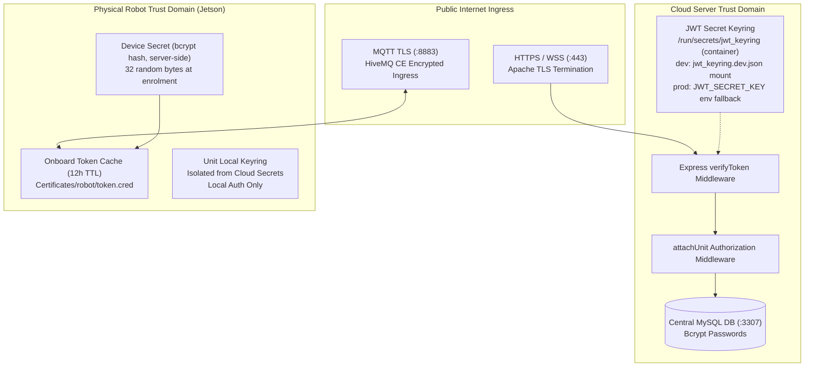

# Accounts & Access: Security & Tokens

<RoleBadge role="developer" />

The backend mechanics behind the [Accounts & Access pages](/development/webui/accounts/overview):
the JWT keyring that signs and verifies tokens, the three independent trust domains those tokens
live in, and the TLS termination that protects them in transit. For how a robot first acquires its
own credentials, see [Hardware Enrolment](/development/webui/accounts/enrolment); for how those
credentials reach the robot host, see [ROS Integration](/development/webui/accounts/ros-integration).

## Trust domain architecture

MSD700 enforces defense-in-depth across the web frontend, cloud backend, message broker, and
physical Jetson single-board computers (SBCs).



## Three independent trust domains

Security boundaries are separated into three non-interchangeable trust domains:

| Trust Domain | Issuer Authority | Token Purpose | Validation Endpoint | Isolation Rule |
| --- | --- | --- | --- | --- |
| **Operator Domain** | Cloud Server Backend (`backend_node`) | Authenticates human operators accessing the web dashboard. | `verifyToken` on all `/api/*` routes | Operator tokens are for `/api/*`; the `/local/*` routes carry no token check at all (several are loopback-restricted instead). |
| **Robot Cloud Domain** | Cloud Enrolment Service (`/enroll/token`) | Authenticates physical robots connecting to HiveMQ and cloud media servers. | HiveMQ TLS + cloud `media-server` | Scoped strictly to the robot's assigned ULID; valid for 12 hours. |
| **Unit Local Domain** | Onboard Local Backend (`backend_local`) | Serves local LAN operators and onboard video streaming clients. | `/local/*` endpoints (no auth middleware) | Local endpoints are reachable without any token by design for offline use; isolation comes from the LAN boundary, not token rejection. |

What the table establishes is that the robot itself never accepts a browser-issued token of any
kind, only credentials minted through the enrolment flow covered in
[Hardware Enrolment](/development/webui/accounts/enrolment).

## JWT keyring and zero-downtime secret rotation

Authentication tokens are verified against a **JWT Keyring** rather than a single static
environment variable. Inside the container the file is `/run/secrets/jwt_keyring`; the parser
rejects anything that is not a `msd-jwt-keyring` document, and the process exits instead of
running on a stale secret.

```json
{
  "format": "msd-jwt-keyring",
  "keys": [
    { "kid": "key_2026_08_a", "secret": "9a8b7c6d5e4f3a2b1c0d...", "status": "active" },
    { "kid": "key_2026_07_b", "secret": "1f2e3d4c5b6a7f8e9d0c...", "status": "accepted" }
  ]
}
```

### Keyring resolution order

`shared/jwt_keyring.js` resolves in order: (1) file `JWT_KEYRING_FILE` (default `/run/secrets/jwt_keyring`); (2) env `JWT_SECRET` then `JWT_SECRET_KEY` (so unmigrated prod keeps running on env while dev uses the file); (3) neither → `process.exit(1)`. File errors are fatal with no env fallthrough: unreadable, invalid JSON, wrong `format`, zero usable keys, or no `status: 'active'` key. There is deliberately no default secret (the old `'roswebui'` fallback was removed).

### Keyring rotation rules

1. **Active Signing Key**: All newly minted access and refresh tokens are signed with the key
   whose `status` is `active`.
2. **Grace Window Verification**: When an incoming token arrives, `verifyToken` checks its
   signature against the active key first, then against `accepted` keys still inside their grace
   window, before rejecting with HTTP 401.
3. **Zero Session Disruption**: Rotating secrets in production does not force all active operators
   to re-login simultaneously.

## Network security and TLS termination

1. **Apache Reverse Proxy**: All external HTTP, SSE, and WebSocket traffic terminates TLS at Apache
   port 443 using certificates from Let's Encrypt (`/etc/letsencrypt/live/`).
2. **HiveMQ Mutual Transport Security**: Robots connect to HiveMQ on port 8883 over TLS. Keystore
   PKCS#12 certificates reside in `/srv/msd/secrets/hivemq/keystore.p12`.
3. **Container Isolation**: Backend containers communicate across internal Docker bridge networks
   (`ros_webui_prod_net` / `ros_webui_dev_net`), exposing no internal database or rosbridge ports directly to the public
   internet.

## Related

- [Overview](/development/webui/accounts/overview): the four Accounts & Access pages and how
  they relate.
- [Hardware Enrolment](/development/webui/accounts/enrolment): the nonce protocol a robot uses to
  register itself.
- [ROS Integration](/development/webui/accounts/ros-integration): how tokens and the operating
  lease reach the robot.
- [Architecture](/development/architecture): full platform topology and trust domains.
- [State & Behavior](/development/state-and-behavior): the robot-side state machine, including
  lease enforcement.
