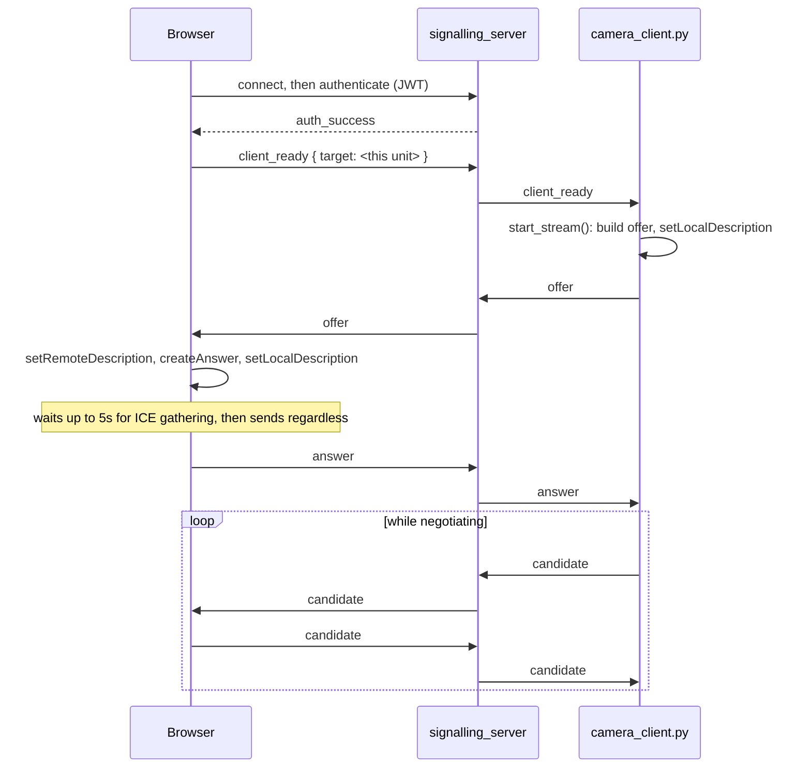

# Camera & Live View

<RoleBadge role="developer" />

The live video widget shown in the dashboard sidebar (`src/components/sidebar/sidebar.tsx`) on the
Mapping and Navigation screens: how `VideoStreamComponent` gets a WebRTC connection to the robot's
camera, and how the browser notices when that connection has silently died. The Database page's
sidebar shows a static map-preview thumbnail in the same slot instead of live video. For the
robot-hosted half of this same handshake, `camera_client.py`'s ICE configuration, and the reconnect
logic, see [ROS Integration](/development/webui/camera/ros-integration).

::: info Video is peer to peer; only negotiation crosses the server
`signalling_server` exchanges SDP offers, answers and ICE candidates between `camera_client.py` and
the browser. Once a connection is established, video frames never touch it: they flow directly
between robot and browser, or through `coturn` when no direct path exists.
:::

## The handshake

`VideoStreamComponent` creates the browser's `RTCPeerConnection` only once an `offer` arrives from
its end of this exchange, not eagerly on page load. `signalling_server` itself is a stateless relay
keyed by `target`: it never inspects SDP content, only routes messages between the two peers named
in them. Authentication only requires a valid, keyring-verified token carrying `userId` or
`username`; a robot token missing `userId` is rejected here outright, which is why both the cloud and
unit-local token issuers put it in explicitly (see
[Architecture § Trust domains](/development/architecture#multi-tier-trust-domains-and-security)).

## Browser-side stall detection

Beyond the native `oniceconnectionstatechange` (which triggers the browser's own `restartIce()` on
`failed`), a separate watchdog polls `getStats()` every 2 seconds and checks whether `framesDecoded`
on the inbound video track is still advancing. If it has not moved in 6 seconds despite the
transport reporting `connected`, the stream is marked `stalled`. This is the one failure mode ICE's
own state machine cannot see: the robot process died, or the network went silently dark, while the
peer connection itself never noticed anything wrong.

## Build-time signalling URL

Which signalling backend a given dashboard build talks to is decided at **build time**, not runtime:
`NEXT_PUBLIC_SIGNALLING_URL` is baked into `frontend_prod` / `frontend_dev` / `frontend_local`
separately (see
[Repository Structure § ROS-dashboard-next-ts](/development/repository-structure)). The unit-local
build goes one step further and swaps the *host* portion of every `NEXT_PUBLIC_*` service URL,
including this one, for `window.location.hostname` at runtime, keeping only the build-time port. The
same `frontend_local` image then survives a DHCP lease change or an operator reaching the unit by a
different hostname, which a purely build-time URL cannot.

## Related

- [ROS Integration](/development/webui/camera/ros-integration): `camera_client.py`, ICE/STUN/TURN
  configuration, the mDNS candidate bug, and reconnect logic
- [Architecture](/development/architecture): where `signalling_server` and `coturn` sit in the wider
  system, and how trust domains apply to the tokens used here
