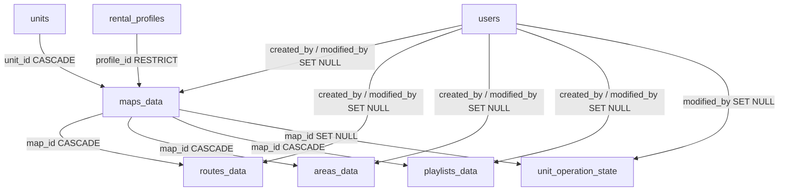

# ROS Integration

<RoleBadge role="developer" />

Despite the name, kept for consistency with the other ROS Web UI feature groups, the Database
feature has no ROS-side component of its own: a robot produces a map through the Mapping feature,
but browsing, renaming, and deleting recorded maps is a MySQL-and-REST-only concern. This page
covers the schema and wire contract behind the Database page. For the page's own behavior,
see [Overview](/development/webui/database/overview) and
[Rename and Delete](/development/webui/database/rename-and-delete).

## Tables

The full schema lives in [Database Schema](/development/database-schema); this is the subset that
is a map, or something attached to one.

| Table | Purpose | Key columns |
| --- | --- | --- |
| `maps_data` | A recorded map | `unit_id` → `units` (`ON DELETE CASCADE`, which robot recorded it), `profile_id` → `rental_profiles` (`ON DELETE RESTRICT`, which rental owns it), `UNIQUE(map_name, unit_id, profile_id)` |
| `routes_data` | A saved multi-pinpoint route | `map_id` → `maps_data` (`ON DELETE CASCADE`), `route_points` (JSON), `UNIQUE(route_name, map_id)` |
| `areas_data` | A saved coverage area | `map_id` → `maps_data` (`ON DELETE CASCADE`), `area_type` (`cover`/`no_cover`), `polygon_points` (JSON), `UNIQUE(area_name, map_id)` |
| `playlists_data` | An ordered list of areas to sweep in sequence | `map_id` → `maps_data` (`ON DELETE CASCADE`), `items` (JSON, a snapshot of each area's geometry rather than a reference), `UNIQUE(playlist_name, map_id)` |

`unit_operation_state` also carries a `map_id` foreign key, `ON DELETE SET NULL` rather than
`CASCADE`: deleting a map the unit currently has loaded clears that pointer instead of being
blocked. See
[Database Schema § Operational data (per map)](/development/database-schema#operational-data-per-map)
for the row this comes from.

`users`, `units`, and `rental_profiles` are not repeated here since they are identity/access
tables covered on their own page: see
[Database Schema § Identity and access](/development/database-schema#identity-and-access).

`maps_data.unique_map_unit (map_name, unit_id, profile_id)` is why two robots on one rental can
each hold a map with the same name without collision, and why the Database page must scope by
`unit_id` and deduplicate by `id` rather than by name (see
[Overview § Map list](/development/webui/database/overview#map-list)).

All four tables above follow the shared `created_at` / `modified_at` convention, and their
`created_by` / `modified_by` columns record a user ULID for attribution only, never for access
control; access to a map runs entirely through the owning rental profile. See
[Database Schema § created_at / modified_at](/development/database-schema#created-at-modified-at)
for the convention and [Database Schema](/development/database-schema) for the attribution note.

## Foreign keys

The subset of [Database Schema § Foreign keys, in full](/development/database-schema#foreign-keys-in-full)
relevant to this feature:

This is what backs [Rename and Delete § Cascade delete](/development/webui/database/rename-and-delete#cascade-delete):
deleting a `maps_data` row cascades to its routes, areas, and playlists, and clears rather than
blocks any operation state pointing at it.

## REST endpoints

From [API Reference § Map and Route Data Management](/development/api-reference#map-and-route-data-management):

### List Maps

`GET /api/maps_data?unit_id=<unit ULID>`

`unit_id` is optional on the wire but mandatory in practice for the Database page: without it
the response is every map in the caller's rental scope (what archive and admin views want), with
it the list narrows to the maps that one robot recorded (what this page needs, since a rental
can hold several robots and a sibling robot's map cannot be navigated on this one). Passing a unit
the caller has no active rental on is a `403`, not an empty list.

`GET /api/maps/:mapId` takes the same `unit_id` parameter and applies the same scope.

::: warning Map names are only unique per (unit, rental)
Do not deduplicate the response by `map_name`. Two robots on one rental may each hold a map called
the same thing with different `id` values; dropping the "duplicate" drops a real map. Deduplicate
by `id`, and always scope by `unit_id`.
:::

### Rename and delete: not yet documented here

The API Reference's Map and Route Data Management section does not currently document a rename or
delete endpoint for `maps_data`. The Database page's rename and delete behavior (described in
[Rename and Delete](/development/webui/database/rename-and-delete)) is confirmed against the
frontend (`updateMapName` in `services.ts`, and a `ConfirmDelete`-gated delete call), but the
exact HTTP method and path are not covered by the current source material and are not guessed at
here.

### Out of scope: Save Custom Waypoint Route

The same API Reference section also documents `POST /api/routes` for saving a waypoint route.
That endpoint belongs to the Navigation feature, not Database: routes are not listed or managed
from this page (see [Overview § Scope](/development/webui/database/overview#scope)), so it is
not repeated here.

## Related

- [Overview](/development/webui/database/overview): the map list, search/sort/pagination, and states built on this data
- [Rename and Delete](/development/webui/database/rename-and-delete): the mutating actions built on this schema and API surface
- [Architecture](/development/architecture)
- [Database Schema](/development/database-schema): the full schema reference for `ROS_DB`
