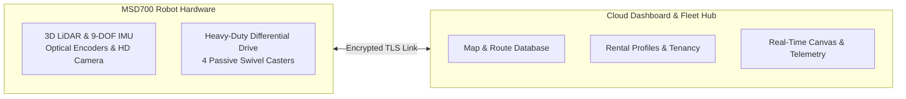

# Introduction to MSD700

<RoleBadge role="user" />

## What is MSD700?

The **MSD700** is an industrial-grade autonomous mobile robot developed by **ITB de Labo Research Lab**. It is specifically engineered to perform autonomous environmental mapping, point-to-point navigation, and systematic area coverage in complex indoor environments such as warehouses, office corridors, tunnels, and open industrial floors.

Equipped with 360-degree 3D LiDAR sensors, inertial measurement units (IMUs), and high-resolution optical cameras, the robot builds centimeter-accurate occupancy grid maps in real time using Simultaneous Localization and Mapping (SLAM).

## Key Operator Capabilities

1. **Simultaneous Localization and Mapping (SLAM)**: Drive the robot through a new environment to create a 2D floorplan.
2. **Point-to-Point Navigation**: Click anywhere on the map to dispatch the robot to that location with autonomous obstacle avoidance.
3. **Boustrophedon Area Sweeps**: Draw polygons around rooms or corridors and command the robot to sweep the entire floor area systematically in parallel lanes.
4. **Automated Mission Playlists**: Chain multiple waypoint routes and cleaning areas into unattended sequence playlists.
5. **Zero-Spin Heading Alignment (Auto-Align)**: Place the robot in a mapped room and align its position instantly without disruptive 360-degree rotations.
6. **Live HD Video Streaming**: Monitor the robot's point-of-view in real time through ultra-low latency WebRTC streaming.
7. **Offline Standalone Operation**: When working in remote facilities without internet access, connect directly to the robot's local Wi-Fi to use the full dashboard offline.

## System Architecture for Users

The system is composed of two primary layers:

| Layer | Component | User Interaction |
| --- | --- | --- |
| **Cloud Dashboard** | Central Server (`https://msd.nglobal.jp`) | The central web application where you log in, manage maps, assign routes, and monitor fleet status across all rented robots. |
| **Physical Robot (Unit)** | Onboard Jetson Computer | The physical machine executing your navigation goals. Each unit has a unique identifier (ULID) and connects securely to the cloud. |

## User Roles and Access

Access to robots is governed by **Rental Profiles**:

- **Fleet Operators**: Standard user accounts assigned to one or more rental profiles. You can drive assigned robots, record maps, create routes, and monitor telemetry.
- **Lab Administrators**: Manage tenant rental profiles, provision operator accounts, and approve new hardware robot registrations.

## Next Steps

- Proceed to the [Quick Start Guide](/getting-started/quick-start) to log in and control your first robot.
- Read [System Features](/getting-started/features) for a full breakdown of mapping and navigation capabilities.
- Review [How the Robot Behaves](/getting-started/behavior) to understand safety watchdogs and Autopilot persistence.
