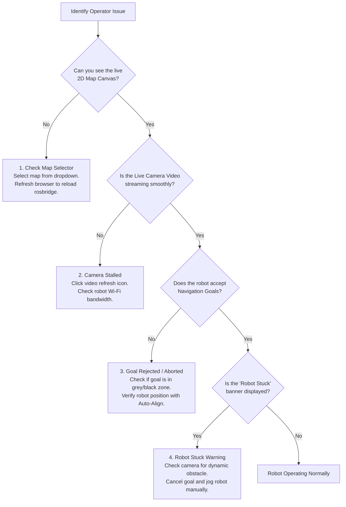

# Operator Troubleshooting Guide

<RoleBadge role="user" />

This guide provides quick solutions for common operational symptoms encountered while controlling the MSD700 robot from the web dashboard.

::: tip Technical or Hardware Diagnostics
For low-level server errors, Docker container logs, or ROS driver diagnostics, see the [Technician Troubleshooting Guide](/setup/troubleshooting) or [Developer Diagnostics](/development/troubleshooting-guide).
:::

## Operator Diagnostic Flowchart

---

## Common Issues and Solutions

### 1. Map Canvas is Blank or Infinite Loading Spinner
- **Symptom**: The navigation page opens, but the center area remains a dark grey screen with a spinning loader.
- **Probable Causes**:
  - No active map has been selected for this unit.
  - The browser WebSocket connection to `rosbridge` was temporarily interrupted.
- **Operator Actions**:
  1. Look at the top-left **Select Map** dropdown. If it displays "No Map Loaded", click it and choose your facility map.
  2. If a map is selected but still blank, refresh your browser tab (`Ctrl + F5` or `Cmd + Shift + R`).
  3. Verify that the unit status badge in the header displays **Online** (green).

---

### 2. Live Camera Video Feed Frozen or Black
- **Symptom**: The camera window shows a frozen frame, spinning wheel, or black rectangle.
- **Probable Causes**:
  - Temporary packet loss on the Wi-Fi link between robot and server.
  - Browser blocked WebRTC ICE negotiation.
- **Operator Actions**:
  1. Click the small **Refresh Stream** icon in the camera header.
  2. If using Chrome, ensure hardware acceleration is enabled in browser settings.
  3. If operating on a local facility network without internet, ensure you are connected to the robot's local Wi-Fi and accessing `http://<unit-ip>:3000`.

---

### 3. Navigation Goal Aborted / Robot Refuses to Move
- **Symptom**: You set a 2D Nav Goal or start a route, but the robot beeps and the status immediately flips from `On Progress` back to `Idle` or `Goal Aborted`.
- **Probable Causes**:
  - The destination point is placed inside a black wall, inside an obstacle, or within the lethal inflation buffer (within 0.575 m of a wall).
  - The robot has lost its localization coordinates relative to the map.
- **Operator Actions**:
  1. Click a goal in wide, open free space (light grey area) well clear of walls and pillars.
  2. Click the **Auto Align** button on the toolbar to re-synchronize the robot's LiDAR scan with the static map.
  3. If Auto-Align fails, drive the robot forward 0.5 meters manually and re-trigger Auto-Align.

---

### 4. "Robot Stuck" Banner Won't Clear
- **Symptom**: An amber banner at the top of the canvas reads "Robot Stuck: Recovery in Progress".
- **Probable Causes**:
  - A person, forklift, or newly placed box is blocking the planned trajectory path.
  - The robot is attempting an area coverage sweep in a tight corridor narrower than 1.15 meters.
- **Operator Actions**:
  1. Check the live camera feed and red LiDAR dots on the canvas for nearby physical obstructions.
  2. If the path is blocked by transient objects, wait 10 seconds; the local planner automatically steers around obstacles once clearance opens.
  3. If the robot cannot resolve the pinch, click **Pause / Cancel Goal**, switch to **Manual Drive**, and jog the robot into open floor space before resuming.

---

### 5. Control Locked: "In Use by Another Operator"
- **Symptom**: You open a robot and all drive buttons are disabled with an "In Use" banner.
- **Probable Causes**:
  - Another operator account in your organization is currently driving this unit.
  - You left another tab or laptop open logged into the same robot.
- **Operator Actions**:
  1. If the banner shows a different colleague's name, coordinate with them before requesting control.
  2. If the banner shows your own account (e.g. from an old tab), click the **Take Over Control** button. The previous session is gracefully detached and control transfers to your active window.

---

### 6. Emergency Stop Engaged
- **Symptom**: The header flashes red with "Emergency Stop Engaged" and all movement is locked.
- **Probable Causes**:
  - An operator pressed the `Escape` key or clicked the on-screen E-Stop button.
  - A technician triggered the physical hardware E-Stop bumper on the robot.
- **Operator Actions**:
  1. Verify that the physical robot environment is completely safe.
  2. If physical hardware E-Stop was pressed, twist and release the hardware button on the robot chassis.
  3. In the web dashboard, click **Release Emergency Stop** to re-engage motor controllers.

---

## Escalation Path

If the steps above do not resolve the issue:
1. Contact your on-site **Field Technician** to inspect physical hardware power and sensors.
2. Provide the technician with the robot's ULID (displayed in the dashboard header, e.g. `01JZ8P9WZ...`).
3. Refer the technician to the [Technician Troubleshooting Guide](/setup/troubleshooting).
