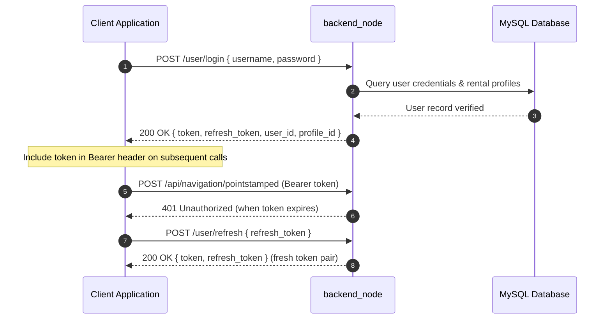
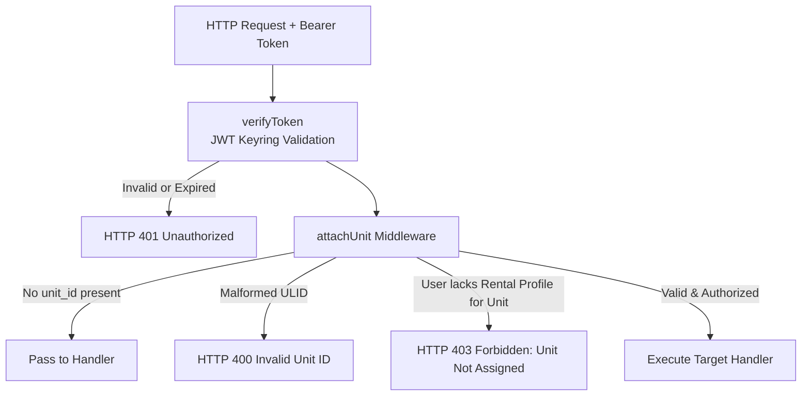

# Referensi API

<RoleBadge role="developer" />

Dokumen ini adalah referensi REST API lengkap untuk `backend_node` (server API Ekspres), yang merinci semua titik akhir, mekanisme autentikasi, parameter permintaan, struktur respons, dan kode status HTTP.

Untuk payload MQTT yang dibungkus oleh titik akhir ini, lihat [Kontrak Pesan](/id/development/message-contracts). Untuk mesin negara terbatas, lihat [Status dan Perilaku](/id/development/state-and-behavior). Untuk arsitektur sistem, lihat [Arsitektur](/id/development/architecture).

## Konvensi API

### URL dasar

| Lingkungan | URL Dasar | Deskripsi Perutean |
| --- | --- | --- |
| **Server Produksi** | `https://msd.nglobal.jp/services/rosbackend` | Proksi terbalik melalui Apache2 ke `localhost:5000` |
| **Server Pengembangan** | `http://<server-ip>:5001` | Akses HTTP langsung ke wadah backend pengembangan |
| **Unit Server Lokal** | `http://<unit-ip>:5002` | Akses HTTP langsung ke Jetson SBC di pesawat `backend_local` |

### Otentikasi dan Otorisasi

Semua rute yang dilindungi memerlukan header HTTP `Authorization` yang membawa JSON Web Token (JWT):

```http
Authorization: Bearer <access_token>
Content-Type: application/json
```

Token ditandatangani secara kriptografis menggunakan HS256 dan divalidasi dengan keyring bersama (`/srv/msd/secrets/jwt_keyring`). Kunci rahasia yang aktif menandatangani token baru, sementara kunci yang baru saja dirotasi tetap valid selama masa tenggang transisi.



| Klaim Token `typ` | Ruang Lingkup & Penerimaan | Aturan Penolakan |
| --- | --- | --- |
| **Operator Standar** (tidak ada atau `operator`) | Akses penuh ke operasi dan peta armada robot yang ditugaskan. | Ditolak jika sudah habis masa berlakunya atau ditandatangani dengan rahasia yang tidak valid. |
| `refresh` | Diterima secara eksklusif di `/user/refresh`. | Ditolak oleh middleware API standar dengan HTTP 401. |
| `admin` | Diterima pada rute administratif (`/admin/api/*`). | Ditolak oleh rute operator robot standar karena tidak memiliki konteks pengguna. |

### Middleware Otorisasi Unit (`attachUnit`)

Setiap kali permintaan ditujukan ke robot tertentu, bidang `unit_id` di isi permintaan (atau parameter kueri) diproses melalui middleware `attachUnit`:



## Amplop Respon Standar

### Respon Sukses
```json
{
  "success": true,
  "msg": "Command executed successfully.",
  "details": {
    "status": true,
    "message": "Goal published to move_base"
  }
}
```

### Respon Kesalahan
```json
{
  "success": false,
  "msg": "Robot rejected command: emergency stop active."
}
```

### Respon Array/Daftar
```json
{
  "success": true,
  "data": [
    {
      "id": 1,
      "ulid": "01JZ8QK2H0000000000000MAP",
      "display_name": "Main Warehouse Floor",
      "created_at": "2026-08-15T10:30:00Z"
    }
  ]
}
```

## Titik Akhir Otentikasi

### 1. Login Pengguna
`POST /user/login`

Mengautentikasi akun operator dan mengeluarkan token akses/penyegaran.

- **Badan Permintaan**:
```json
{
  "username": "operator1",
  "password": "SecurePassword123"
}
```
- **Respon (200 Oke)**:
```json
{
  "success": true,
  "token": "eyJhbGciOiJIUzI1NiIs...",
  "refresh_token": "eyJhbGciOiJIUzI1NiIs...",
  "user_id": "01JZ7YV5CQUSER00000000000",
  "role": "operator",
  "profile_id": 4
}
```

### 2. Penyegaran Token
`POST /user/refresh`

Menukarkan token penyegaran yang valid dengan pasangan token baru.

- **Badan Permintaan**:
```json
{
  "refresh_token": "eyJhbGciOiJIUzI1NiIs..."
}
```
- **Respon (200 Oke)**:
```json
{
  "success": true,
  "token": "eyJhbGciOiJIUzI1NiIs...",
  "refresh_token": "eyJhbGciOiJIUzI1NiIs..."
}
```

## Manajemen Unit dan Operasi Armada

### 1. Daftar Unit yang Dapat Diakses
`GET /api/units`

Mengembalikan semua robot terdaftar yang ditugaskan ke profil persewaan aktif pengguna yang diautentikasi.

- **Header**: `Authorization: Bearer <token>`
- **Respon (200 Oke)**:
```json
{
  "success": true,
  "data": [
    {
      "unit_id": "01JZ8P9WZ0UNIT00000000000",
      "unit_name": "Unit 01",
      "model": "MSD700",
      "status": "online",
      "is_in_use": false,
      "active_page": "navigation",
      "battery": 94.2
    }
  ]
}
```

### 2. Ping Detak Jantung Robot
`POST /api/units/ping`

Mengirimkan detak jantung yang hidup, memperbarui sewa operasi, dan mengembalikan telemetri saat ini.

- **Header**: `Authorization: Bearer <token>`
- **Badan Permintaan**:
```json
{
  "unit_id": "01JZ8P9WZ0UNIT00000000000",
  "session_id": "8b1c3f2a-605d-4871-bc01-e28a9b3d1f04",
  "claim": true,
  "release": false,
  "page": "navigation",
  "force_takeover": false
}
```
- **Respon (200 Oke)**:
```json
{
  "success": true,
  "data": {
    "status": true,
    "robot_activity": "navigation_point_published",
    "battery": 91.0,
    "uptime": 128.5,
    "hw_status": "ready",
    "manual_override": false,
    "autopilot": false,
    "in_use": false,
    "origin_conflict": false
  }
}
```

### 3. Berhenti/Jeda Darurat
`POST /api/hardware/emergency`

Mengalihkan penghentian darurat perangkat keras atau jeda gerakan.

- **Header**: `Authorization: Bearer <token>`
- **Badan Permintaan**:
```json
{
  "unit_id": "01JZ8P9WZ0UNIT00000000000",
  "action": "activate"
}
```
- **Respon (200 Oke)**:
```json
{
  "success": true,
  "msg": "Emergency stop state updated."
}
```

## Navigasi dan Pengiriman Misi

### 1. Inisialisasi Mode Navigasi
`POST /api/navigation/init`

Meluncurkan tumpukan navigasi pada robot dengan peta tertentu.

- **Header**: `Authorization: Bearer <token>`
- **Badan Permintaan**:
```json
{
  "unit_id": "01JZ8P9WZ0UNIT00000000000",
  "map_name": "01JZ8QK2H0000000000000MAP"
}
```

### 2. Tujuan Titik Arah Pengiriman
`POST /api/navigation/pointstamped`

Mengirimkan satu koordinat tujuan target ke tumpukan navigasi robot.

- **Header**: `Authorization: Bearer <token>`
- **Badan Permintaan**:
```json
{
  "unit_id": "01JZ8P9WZ0UNIT00000000000",
  "X": 5.25,
  "Y": -3.10,
  "Z": 0.0
}
```

### 3. Mulai Cakupan Area Boustrophedon
`POST /api/boustrophedon/init`

Meluncurkan cakupan sapuan boustrophedon otonom pada batas poligon yang ditentukan.

- **Header**: `Authorization: Bearer <token>`
- **Badan Permintaan**:
```json
{
  "unit_id": "01JZ8P9WZ0UNIT00000000000",
  "areas": [
    [
      { "x": 0.0, "y": 0.0 },
      { "x": 12.0, "y": 0.0 },
      { "x": 12.0, "y": 6.0 },
      { "x": 0.0, "y": 6.0 }
    ]
  ],
  "exclusions": [
    [
      { "x": 4.0, "y": 2.0 },
      { "x": 6.0, "y": 2.0 },
      { "x": 6.0, "y": 4.0 },
      { "x": 4.0, "y": 4.0 }
    ]
  ]
}
```

## Operasi Pemetaan (SLAM).

### 1. Mulai Sesi Pemetaan
`POST /api/mapping/start`

Memulai mode SLAM (gmapping) pada unit target.

- **Badan Permintaan**: `{ "unit_id": "01JZ8P9WZ0UNIT00000000000" }`

### 2. Hentikan Pemetaan dan Simpan Peta
`POST /api/mapping/stop`

Menyimpan grid hunian aktif, menghasilkan metadata thumbnail, dan mengunggah aset.

- **Badan Permintaan**:
```json
{
  "unit_id": "01JZ8P9WZ0UNIT00000000000",
  "display_map_name": "Warehouse Sector 4",
  "homebase_x": 0.0,
  "homebase_y": 0.0
}
```
- **Respon (200 Oke)**:
```json
{
  "success": true,
  "request_id": "9b1deb4d-3b7d-4bad-9bdd-2b0d7b3dcb6d",
  "map_ulid": "01JZ8QK2H0000000000000MAP"
}
```

## Manajemen Data Peta dan Rute

### 1. Daftar Peta
`GET /api/maps?profile_id=4`

- **Respon (200 Oke)**:
```json
{
  "success": true,
  "data": [
    {
      "id": 12,
      "ulid": "01JZ8QK2H0000000000000MAP",
      "display_name": "Warehouse Ground Floor",
      "thumbnail_url": "/services/media/thumbnails/01JZ8QK2H0000000000000MAP.png",
      "created_at": "2026-08-10T14:20:00Z",
      "modified_at": "2026-08-10T14:20:00Z"
    }
  ]
}
```

### 2. Simpan Rute Waypoint Kustom
`POST /api/routes`

- **Badan Permintaan**:
```json
{
  "profile_id": 4,
  "map_id": "01JZ8QK2H0000000000000MAP",
  "route_name": "Inspection Loop Alpha",
  "route_type": "round-trip",
  "waypoints": [
    { "x": 1.0, "y": 2.0, "yaw": 0.0 },
    { "x": 5.0, "y": 2.0, "yaw": 1.57 }
  ]
}
```

## Sistem Penyelarasan Otomatis

`POST /api/autoalign/start`

Memulai validasi konvergensi filter partikel dan penyelarasan orientasi otomatis terhadap geometri referensi.

- **Badan Permintaan**: `{ "unit_id": "01JZ8P9WZ0UNIT00000000000" }`
- **Respon (200 Oke)**:
```json
{
  "success": true,
  "msg": "Auto align algorithm initiated."
}
```

## Dokumentasi Terkait

- [Kontrak Pesan](/id/development/message-contracts): Format serialisasi topik MQTT dan ROS.
- [Status dan Perilaku](/id/development/state-and-behavior): Mesin status terperinci dan transisi kegagalan.
- [Skema Basis Data](/id/development/database-schema): Tabel MySQL dan model hubungan entitas.