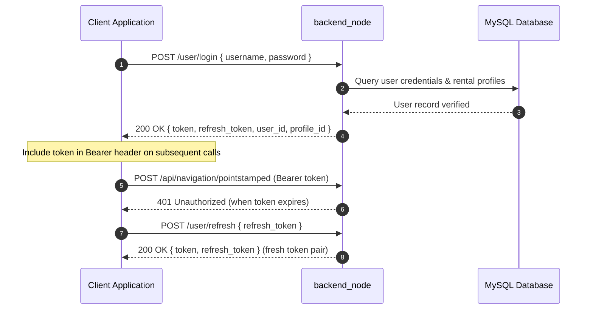
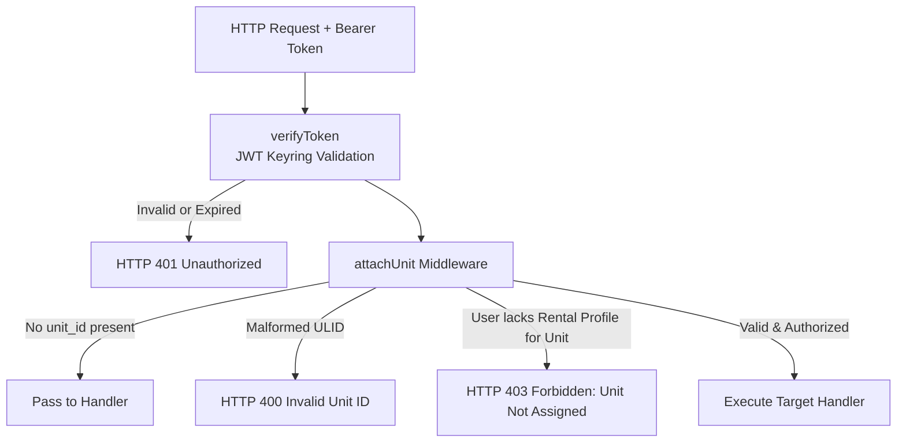

# Referensi API

<RoleBadge role="developer" />

Dokumen ini adalah referensi REST API lengkap untuk `backend_node` (server API Express), merinci semua endpoint, mekanisme autentikasi, parameter permintaan, struktur respons, dan kode status HTTP.

Untuk payload MQTT yang dibungkus endpoint ini, lihat [Kontrak Pesan](/id/development/message-contracts). Untuk finite state machine, lihat [State and Behavior](/id/development/state-and-behavior). Untuk arsitektur sistem, lihat [Arsitektur](/id/development/architecture).

## Konvensi API

### Base URL

| Lingkungan | Base URL | Deskripsi Routing |
| --- | --- | --- |
| **Server Produksi** | `https://msd.nglobal.jp/services/rosbackend` | Di-reverse-proxy lewat Apache2 ke `localhost:5000` |
| **Server Pengembangan** | `http://<server-ip>:5001` | Akses HTTP langsung ke kontainer backend pengembangan |
| **Server Lokal Unit** | `http://<unit-ip>:5002` | Akses HTTP langsung ke `backend_local` onboard Jetson SBC |

### Autentikasi dan Otorisasi

Semua rute terproteksi membutuhkan header HTTP `Authorization` yang membawa sebuah JSON Web Token (JWT):

```http
Authorization: Bearer <access_token>
Content-Type: application/json
```

Token ditandatangani secara kriptografis menggunakan HS256 dan divalidasi terhadap sebuah keyring bersama (`/srv/msd/secrets/jwt_keyring`). Secret key aktif menandatangani token baru, sementara key yang baru saja dirotasi tetap valid selama periode grace transisi.



| Klaim Token `typ` | Lingkup & Penerimaan | Aturan Penolakan |
| --- | --- | --- |
| **Operator Standar** (tidak ada atau `operator`) | Akses penuh ke operasi dan peta fleet robot yang ditugaskan. | Ditolak jika kedaluwarsa atau ditandatangani dengan secret tidak valid. |
| `refresh` | Hanya diterima secara eksklusif pada `/user/refresh`. | Ditolak oleh middleware API standar dengan HTTP 401. |
| `admin` | Diterima pada rute administratif (`/admin/api/*`). | Ditolak oleh rute operator robot standar karena kekurangan konteks pengguna. |

### Middleware Otorisasi Unit (`attachUnit`)

Setiap kali sebuah permintaan menuju robot spesifik, field `unit_id` di body permintaan (atau parameter query) diproses lewat middleware `attachUnit`:



## Amplop Respons Standar

### Respons Sukses
```json
{
  "success": true,
  "msg": "Command executed successfully.",
  "details": {
    "status": true,
    "message": "Goal published to move_base"
  }
}
```

### Respons Error
```json
{
  "success": false,
  "msg": "Robot rejected command: emergency stop active."
}
```

### Respons Array / List
```json
{
  "success": true,
  "data": [
    {
      "id": 1,
      "ulid": "01JZ8QK2H0000000000000MAP",
      "display_name": "Main Warehouse Floor",
      "created_at": "2026-08-15T10:30:00Z"
    }
  ]
}
```

## Endpoint Autentikasi

### 1. Login Pengguna
`POST /user/login`

Mengautentikasi akun operator dan menerbitkan token akses/refresh.

- **Request Body**:
```json
{
  "username": "operator1",
  "password": "SecurePassword123"
}
```
- **Response (200 OK)**:
```json
{
  "success": true,
  "token": "eyJhbGciOiJIUzI1NiIs...",
  "refresh_token": "eyJhbGciOiJIUzI1NiIs...",
  "user_id": "01JZ7YV5CQUSER00000000000",
  "role": "operator",
  "profile_id": 4
}
```

### 2. Refresh Token
`POST /user/refresh`

Menukar refresh token yang valid dengan pasangan token baru.

- **Request Body**:
```json
{
  "refresh_token": "eyJhbGciOiJIUzI1NiIs..."
}
```
- **Response (200 OK)**:
```json
{
  "success": true,
  "token": "eyJhbGciOiJIUzI1NiIs...",
  "refresh_token": "eyJhbGciOiJIUzI1NiIs..."
}
```

## Manajemen Unit dan Operasi Fleet

### 1. Daftar Unit yang Dapat Diakses
`GET /api/units`

Mengembalikan semua robot terdaftar yang ditugaskan ke rental profile aktif pengguna terautentikasi.

- **Headers**: `Authorization: Bearer <token>`
- **Response (200 OK)**:
```json
{
  "success": true,
  "data": [
    {
      "unit_id": "01JZ8P9WZ0UNIT00000000000",
      "unit_name": "Unit 01",
      "model": "MSD700",
      "status": "online",
      "is_in_use": false,
      "active_page": "navigation",
      "battery": 94.2
    }
  ]
}
```

### 2. Ping Heartbeat Robot
`POST /api/units/ping`

Mengirim heartbeat liveness, memperbarui operating lease, dan mengembalikan telemetri saat ini.

- **Headers**: `Authorization: Bearer <token>`
- **Request Body**:
```json
{
  "unit_id": "01JZ8P9WZ0UNIT00000000000",
  "session_id": "8b1c3f2a-605d-4871-bc01-e28a9b3d1f04",
  "claim": true,
  "release": false,
  "page": "navigation",
  "force_takeover": false
}
```
- **Response (200 OK)**:
```json
{
  "success": true,
  "data": {
    "status": true,
    "robot_activity": "navigation_point_published",
    "battery": 91.0,
    "uptime": 128.5,
    "hw_status": "ready",
    "manual_override": false,
    "autopilot": false,
    "in_use": false,
    "origin_conflict": false
  }
}
```

### 3. Emergency Stop / Pause
`POST /api/hardware/emergency`

Mengalihkan emergency stop hardware atau pause pergerakan.

- **Headers**: `Authorization: Bearer <token>`
- **Request Body**:
```json
{
  "unit_id": "01JZ8P9WZ0UNIT00000000000",
  "action": "activate"
}
```
- **Response (200 OK)**:
```json
{
  "success": true,
  "msg": "Emergency stop state updated."
}
```

## Navigasi dan Dispatch Misi

### 1. Inisialisasi Mode Navigasi
`POST /api/navigation/init`

Meluncurkan stack navigasi pada robot dengan sebuah peta yang ditentukan.

- **Headers**: `Authorization: Bearer <token>`
- **Request Body**:
```json
{
  "unit_id": "01JZ8P9WZ0UNIT00000000000",
  "map_id": "01JZ8QK2H0000000000000MAP"
}
```

Peta tersebut harus salah satu yang direkam oleh unit ini, di dalam sebuah rental yang diikuti oleh pemanggil. Sebuah peta yang terlihat oleh pemanggil tetapi milik robot yang **berbeda** ditolak di sini dengan `404` dan
`"That map does not belong to this unit"`. Sebelum 2026-09-10 ini diteruskan begitu saja: robot kemudian mencoba mengambil file peta yang tidak pernah diunggahnya, navigasi tidak pernah menyala, dan kegagalannya hanya muncul di log unit sementara dashboard sudah menampilkan permulaan yang berhasil.

### 2. Kirim Goal Waypoint
`POST /api/navigation/pointstamped`

Mengirim satu koordinat tujuan target ke stack navigasi robot.

- **Headers**: `Authorization: Bearer <token>`
- **Request Body**:
```json
{
  "unit_id": "01JZ8P9WZ0UNIT00000000000",
  "X": 5.25,
  "Y": -3.10,
  "Z": 0.0
}
```

### 3. Mulai Coverage Area Boustrophedon
`POST /api/boustrophedon/init`

Meluncurkan coverage sweep boustrophedon otonom di atas batas poligon yang ditentukan.

- **Headers**: `Authorization: Bearer <token>`
- **Request Body**:
```json
{
  "unit_id": "01JZ8P9WZ0UNIT00000000000",
  "areas": [
    [
      { "x": 0.0, "y": 0.0 },
      { "x": 12.0, "y": 0.0 },
      { "x": 12.0, "y": 6.0 },
      { "x": 0.0, "y": 6.0 }
    ]
  ],
  "exclusions": [
    [
      { "x": 4.0, "y": 2.0 },
      { "x": 6.0, "y": 2.0 },
      { "x": 6.0, "y": 4.0 },
      { "x": 4.0, "y": 4.0 }
    ]
  ]
}
```

## Operasi Mapping (SLAM)

### 1. Mulai Sesi Mapping
`POST /api/mapping/start`

Memulai mode SLAM (gmapping) pada unit target.

- **Request Body**: `{ "unit_id": "01JZ8P9WZ0UNIT00000000000" }`

### 2. Hentikan Mapping dan Simpan Peta
`POST /api/mapping/stop`

Menyimpan occupancy grid aktif, menghasilkan metadata thumbnail, dan mengunggah aset.

- **Request Body**:
```json
{
  "unit_id": "01JZ8P9WZ0UNIT00000000000",
  "display_map_name": "Warehouse Sector 4",
  "homebase_x": 0.0,
  "homebase_y": 0.0
}
```
- **Response (200 OK)**:
```json
{
  "success": true,
  "request_id": "9b1deb4d-3b7d-4bad-9bdd-2b0d7b3dcb6d",
  "map_ulid": "01JZ8QK2H0000000000000MAP"
}
```

## Manajemen Data Peta dan Rute

### 1. Daftar Peta
`GET /api/maps_data?unit_id=<unit ULID>`

`unit_id` opsional di wire dan wajib secara praktis untuk apa pun yang dilihat seorang operator. Tanpa itu, respons berisi setiap peta dalam lingkup rental pemanggil, yang merupakan apa yang diinginkan tampilan arsip dan admin. Dengan itu, daftarnya dipersempit menjadi peta yang direkam robot tersebut, yang merupakan apa yang dibutuhkan halaman Database: sebuah rental bisa memegang beberapa robot, dan peta yang direkam oleh sibling tidak bisa dinavigasi pada robot ini. Meneruskan sebuah unit yang tidak dimiliki pemanggil lewat rental aktif adalah sebuah `403`, bukan daftar kosong. `GET /api/maps/:mapId` menerima parameter yang sama dan menerapkan lingkup yang sama.

- **Response (200 OK)**:
```json
{
  "success": true,
  "data": [
    {
      "id": "01JZ8QK2H0000000000000MAP",
      "map_name": "Warehouse Ground Floor",
      "unit_id": "01JZ7K3M9QA0B1C2D3E4F5G6H7",
      "unit_name": "unit1",
      "created_by_username": "operator1",
      "modified_by_username": "operator1",
      "created_at": "2026-08-10T14:20:00Z",
      "modified_at": "2026-08-10T14:20:00Z",
      "homebase_x": 0.0,
      "homebase_y": 0.0
    }
  ]
}
```

::: warning Nama peta hanya unik per (unit, rental)
Dua robot pada satu rental masing-masing bisa memiliki peta bernama `hazard test`, dan keduanya adalah peta berbeda dengan ULID berbeda. Jangan mendeduplikasi sebuah daftar peta berdasarkan nama: membuang entri kedua membuang sebuah peta nyata dan menyimpan milik robot tetangga, dan membuka nama tersebut kemudian me-resolve ke sebuah ULID yang tidak bisa dimuat robot itu. Deduplikasi berdasarkan `id`, dan batasi lingkup berdasarkan `unit_id`.
:::

### 2. Simpan Rute Waypoint Kustom
`POST /api/routes`

- **Request Body**:
```json
{
  "profile_id": 4,
  "map_id": "01JZ8QK2H0000000000000MAP",
  "route_name": "Inspection Loop Alpha",
  "route_type": "round-trip",
  "waypoints": [
    { "x": 1.0, "y": 2.0, "yaw": 0.0 },
    { "x": 5.0, "y": 2.0, "yaw": 1.57 }
  ]
}
```

## Sistem Auto Align

`POST /api/autoalign/start`

Memulai validasi konvergensi particle filter dan penyelarasan orientasi otomatis terhadap geometri referensi.

- **Request Body**: `{ "unit_id": "01JZ8P9WZ0UNIT00000000000" }`
- **Response (200 OK)**:
```json
{
  "success": true,
  "msg": "Auto align algorithm initiated."
}
```

## Dokumentasi Terkait

- [Kontrak Pesan](/id/development/message-contracts): Format serialisasi topik MQTT dan ROS.
- [State and Behavior](/id/development/state-and-behavior): State machine terperinci dan transisi kegagalan.
- [Skema Database](/id/development/database-schema): Tabel MySQL dan model relasi entitas.
