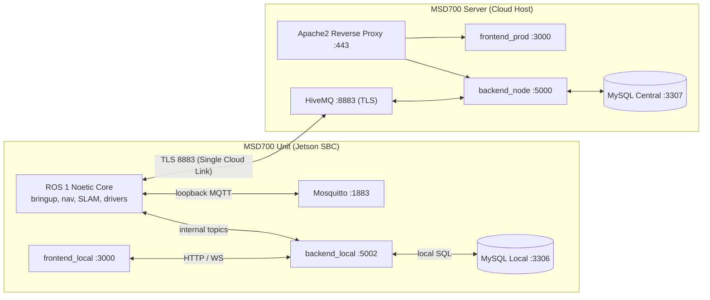
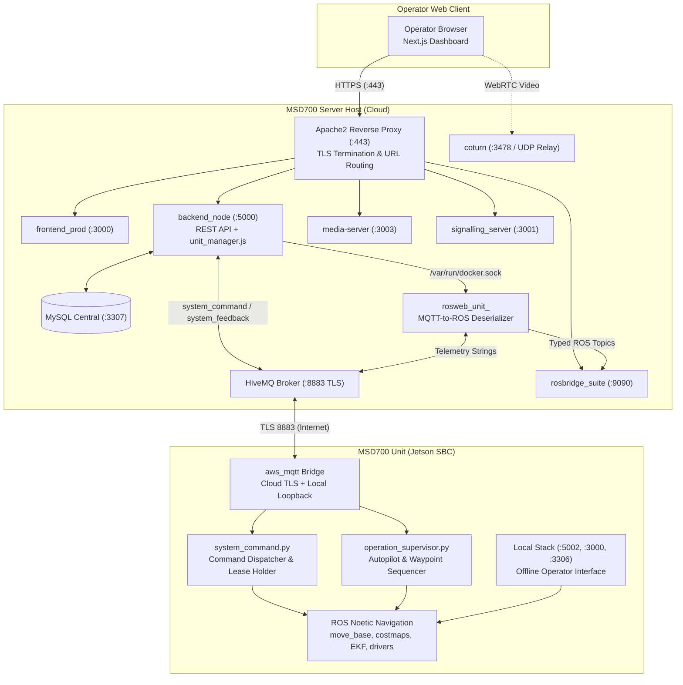
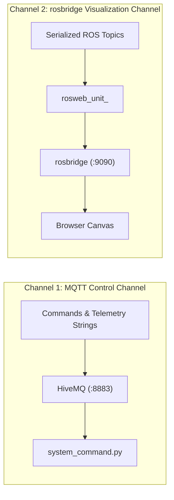
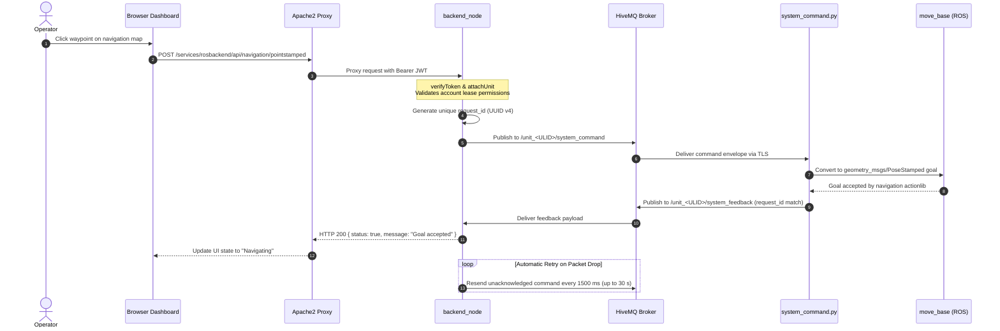
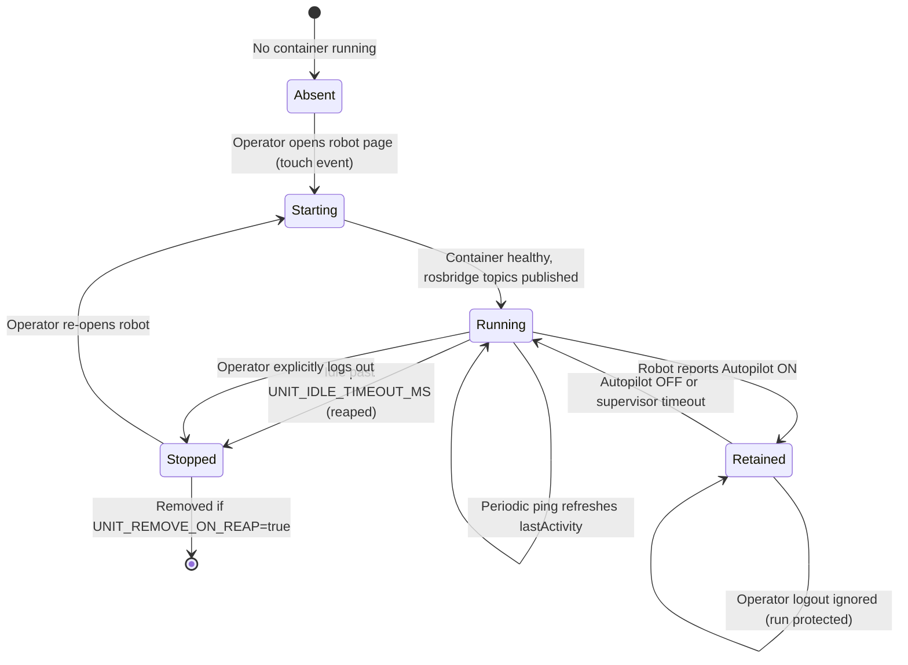
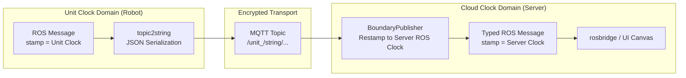
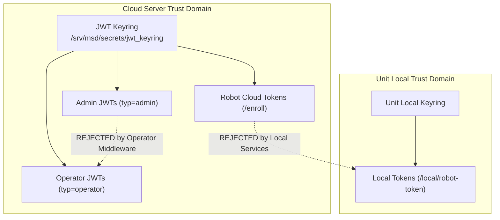
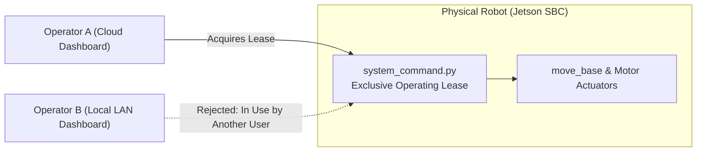

#Arsitektur

<RoleBadge role="developer" />

Dokumen ini merinci desain arsitektur platform robotika otonom MSD700, menjelaskan bagaimana komponen berinteraksi, batasan data di antara komponen tersebut, dan alasan teknis di balik setiap subsistem.

Untuk lokasi repositori, lihat [Struktur Repositori](/id/development/repository-structure). Untuk payload data pastinya, lihat [Kontrak Pesan](/id/development/message-contracts). Untuk mesin negara terbatas, lihat [Status dan Perilaku](/id/development/state-and-behavior). Untuk topologi penerapan, lihat [Pengaturan Sistem](/id/setup/system-setup).

## Model Dua Mesin

Keputusan arsitektur utama MSD700 adalah **Unit (robot fisik) menjalankan tumpukan server lokal lengkap**, sedangkan **Server MSD700 (cloud)** menjalankan tumpukan manajemen pusat untuk seluruh armada. Mereka adalah rekan-rekan yang berbagi struktur data yang identik, terhubung melalui transportasi MQTT terenkripsi.

| Dimensi | Unit MSD700 (Robot) | Server MSD700 (Awan) |
| --- | --- | --- |
| **Eksekusi** | ROS 1 Pembawaan Noetic, move_base, gmapping, driver sensor, plus `backend_local`, `db_local`, `mosquitto_local`, dan `frontend_local`. | Pusat `backend_node`, `db` (MySQL), `hivemq` (broker MQTT), `rosbridge`, `signalling_server`, `media-server`, dan `frontend_prod`. |
| **Otoritas** | Memiliki robot fisik langsung, pembacaan sensor, sewa operasi lokal, dan rekaman peta mentah. | Memiliki akun pengguna, gantungan kunci autentikasi, profil persewaan, registri pendaftaran robot, dan peta/rute yang disinkronkan di seluruh armada. |
| **Toleransi Kesalahan** | Beroperasi secara offline secara mandiri selama hilangnya konektivitas internet atau Wi-Fi. | Bertahan dari penghentian robot, pemutusan jaringan, dan memulai ulang tanpa kehilangan metadata armada. |
| **Kendala** | Tidak dapat menetapkan identitas globalnya sendiri (memerlukan pendaftaran cloud awal). | Tidak dapat menggerakkan robot fisik tanpa koneksi robot yang aktif. |

::: tip Core Design Principle: Local as Offline Cache
Tumpukan lokal unit adalah **cache cloud yang mengutamakan offline, bukan silo terisolasi**. Unit terdaftar berfungsi tanpa batas waktu tanpa koneksi internet aktif. Ketika konektivitas jaringan dipulihkan, peta yang direkam, rute yang dijalankan, dan status konfigurasi secara otomatis disinkronkan kembali ke cloud.
:::

## Ikhtisar Komponen

| Komponen | Teknologi | Tanggung jawab | Lokasi Tuan Rumah |
| --- | --- | --- | --- |
| **Dasbor Bagian Depan** | Berikutnya.js, Bereaksi, TypeScript | Antarmuka operator satu halaman dengan kanvas peta, widget telemetri, teleop manual, dan kontrol navigasi. | `ROS-dashboard-next-ts` (dibuat sebagai `frontend_prod` di cloud dan `frontend_local` di unit) |
| **simpul_belakang** | Node.js, Ekspres | Middleware autentikasi, CRUD untuk peta/rute/area/daftar putar, pengiriman perintah robot, koordinasi sinkronisasi, dan manajer siklus hidup kontainer (`unit_manager.js`). | `ros-web-ui/source/dependencies/ROS-dashboard-backend` |
| **unit_manager.js** | Node.js (API Docker) | Berputar secara dinamis dan menuai kontainer relai per unit (`rosweb_unit_<ULID>`) di server melalui `/var/run/docker.sock`. | Tertanam di dalam `backend_node` |
| **jembatan ros** | `rosbridge_suite` (WebSocket) | Menjembatani topik ROS langsung (pose robot, pemindaian laser, peta biaya, rencana global) ke kanvas browser melalui WebSockets. | Kontainer cloud (`nakayama_cloud`) dan tumpukan lokal unit |
| **HiveMQ (MQTT)** | HiveMQ CE (Jawa) | Broker pesan terenkripsi dengan throughput tinggi yang menghubungkan robot ke server melalui port 8883 (TLS). | Wadah server (`hivemq` / `hivemq_dev`) |
| **Basis Data MySQL** | MySql 8.0 | Menyimpan akun pengguna, profil persewaan, catatan unit terdaftar, geometri rute, batas area khusus, dan jurnal sinkronisasi. | Server (`db` / `db_dev`) dan unit (`db_local`) |
| **server media** | Node.js, Ekspres | Mengelola unggahan aset peta, pembuatan thumbnail, dan menyajikan file peta statis `.pgm` dan `.yaml`. | Wadah server dan wadah unit (`media_local`) |
| **server_sinyal** | Node.js (WebSocket) | Server negosiasi rekan WebRTC memfasilitasi streaming video langsung antara kamera robot dan browser operator. | Kontainer server (`signalling`) dan kontainer unit (`signalling_local`) |
| **kembali pulang** | Coturn (C) | Server relai RFC 5766 TURN / STUN menyediakan penggantian media saat traversal NAT mencegah video WebRTC peer-to-peer langsung. | Server host (`coturn` layanan, jaringan host) |
| **Apache2** | Server HTTP Apache | Menangani penghentian TLS, header keamanan, dan merutekan semua lalu lintas publik melalui jalur `/services/...`. | Host server (layanan asli) |
| **Paket Robot ROS** | C++, Python, ROS 1 Noetik | `msd700_robot` (navigasi, SLAM, cakupan boustrophedon, EKF, driver sensor) dan paket jembatan `ros-web-ui` (`topic2string`, `system_command`, `operation_supervisor`). | Jetson SBC (`msd700` wadah) |

## Topologi Sistem dan Aliran Data

### Aturan Utama Arsitektur:
1. **Apache sebagai Single Public Ingress**: Semua permintaan HTTP dan WebSocket masuk melalui port Apache 443. Layanan backend terikat ke port internal atau alamat loopback. Satu-satunya port eksternal yang langsung dijangkau oleh robot adalah HiveMQ pada port 8883 (TLS).
2. **Aliran Perintah melalui MQTT, Bukan ROS**: Perintah yang dikirim oleh `backend_node` menggunakan topik `/unit_<ULID>/system_command` MQTT dan diakui melalui `/unit_<ULID>/system_feedback`. Topik ROS di cloud ada secara eksklusif untuk memberi makan kanvas peta browser dan tampilan telemetri.
3. **Kontainer Per-Unit sebagai Deserializer**: Kontainer `rosweb_unit_<ULID>` berjalan sesuai permintaan untuk mengonversi muatan JSON/string dari MQTT kembali menjadi pesan ROS asli (`nav_msgs/OccupancyGrid`, `geometry_msgs/PoseStamped`, `sensor_msgs/LaserScan`), memungkinkan `rosbridge` mengalirkannya ke dasbor.

## Dua Saluran Diagnostik

Platform ini menggunakan dua saluran komunikasi terpisah yang gagal secara independen:

| Saluran | Transportasi | Data yang Dibawa | Gejala Kegagalan |
| --- | --- | --- | --- |
| **MQTT** | TCP / TLS (8883) | Perintah, ucapan terima kasih, string pose, ping status. | Robot muncul **Offline** di konsol. Perintah langsung gagal dengan HTTP 504. |
| **jembatan ros** | WebSocket (WSS) | Pesan ROS yang diketik (`/map`, `/robot_pose`, `/scan`, `/global_plan`). | Robot muncul **Online** dan menerima perintah, namun kanvas peta tetap kosong. |
| **Kontainer Relai Unit** | buruh pelabuhan di Server | Menerjemahkan string MQTT ke topik ROS yang diketik untuk rosbridge. | Robot sedang online dan rosbridge terhubung, tetapi kanvas tetap kosong karena `rosweb_unit_<ULID>` dihentikan atau dituai karena tidak aktif. |

## Alur Eksekusi Perintah Ujung-ke-Ujung

Saat operator memerintahkan robot (misalnya, mengklik titik jalan di peta):

### Detail Penerapan Penting:
- **Respon HTTP Mencerminkan Status Robot**: `backend_node` menahan koneksi HTTP tetap terbuka hingga `system_feedback` dengan `request_id` yang cocok tiba dari robot. Status 504 Gateway Timeout menandakan bahwa robot tidak pernah memproses perintah.
- **Coba Ulang Perintah Selektif**: Perintah yang bermutasi (sasaran navigasi, peralihan mode, E-Stop) dicoba ulang setiap 1500 mdtk hingga diakui. Ping detak jantung **tidak pernah diulang**: menjatuhkan ping adalah sinyal tepat yang digunakan pengawas keselamatan untuk memulai penghentian darurat zero-twist.

## Siklus Hidup Kontainer Per Unit

Untuk menghemat memori server dan CPU, server tidak menjalankan node master ROS persisten untuk robot yang tidak aktif. Sebaliknya, `unit_manager.js` di dalam `backend_node` secara dinamis mengelola satu kontainer per unit aktif.

| Variabel Konfigurasi | Nilai Bawaan | Deskripsi |
| --- | --- | --- |
| `UNIT_MANAGER_ENABLED` | `true` (server), `false` (satuan) | Mengontrol apakah pengelolaan kontainer dinamis aktif. |
| `UNIT_IMAGE` | `ros-noetic-webui-app-v2:latest` (`:dev` dalam pengembangan) | Gambar Docker dipakai untuk relai unit. |
| `UNIT_IDLE_TIMEOUT_MS` | `1800000` (30 menit) | Durasi ketidakaktifan operator sebelum kontainer dituai. |
| `UNIT_REAP_INTERVAL_MS` | `60000` (1 menit) | Frekuensi sapuan penuai latar belakang. |
| `UNIT_REMOVE_ON_REAP` | `false` | Jika benar, hapus wadahnya; jika salah, tetap hentikan. |
| `UNIT_MODE` | `prod` (atau `dev`) | Memilih offset port (ROS master 11311/11312, rosbridge 9090/9091). |

::: warning Autopilot Retention Guard
Saat robot menjalankan misi otonom dalam **Mode Autopilot**, kontainer relainya memasuki status **Ditahan**. Kontainer yang disimpan dikecualikan dari waktu tunggu menganggur dan tidak dihentikan ketika operator logout atau menutup browser mereka, sehingga memastikan pemantauan misi berkelanjutan.
:::

## Batas Domain Jam dan Sinkronisasi Waktu

Komputer terpasang robot dan server cloud menjalankan instans master ROS terpisah dengan jam sistem independen. Untuk mencegah perbedaan stempel waktu, semua pesan geometris yang melintasi MQTT diberi stempel ulang ke waktu ROS lokal saat masuk melalui `BoundaryPublisher`.

::: danger Why Clock Restamping Is Mandatory
Menghilangkan waktu restamping akan menghasilkan peringatan `TF_OLD_DATA` langsung di RViz dan penyaji web. Selanjutnya, jika `/use_sim_time` diaktifkan pada satu master tanpa generator `/clock` yang aktif, evaluasi pohon TF terhenti sepenuhnya.
:::

## Domain dan Keamanan Kepercayaan Multi-Tingkat

Arsitektur MSD700 menerapkan tiga domain kepercayaan keamanan yang berbeda. Kredensial yang diterbitkan dalam satu domain ditolak keras oleh domain lain.

1. **Token Operator**: JWT HS256 standar yang diverifikasi dengan gantungan kunci `/srv/msd/secrets/`. Token mencakup ID pengguna dan cakupan akun. Token admin (`typ=admin`) ditolak oleh rute operasi robot standar.
2. **Robot Cloud Token**: Dicetak oleh `/enroll/token` menggunakan rahasia perangkat yang dihasilkan selama pendaftaran robot fisik. Berlaku selama 12 jam dan disegarkan pada setiap boot sistem.
3. **Unit Token Lokal**: Diterbitkan secara lokal oleh `backend_local` di komputer Jetson. Token yang ditandatangani di cloud sengaja ditolak oleh titik akhir lokal untuk memastikan otonomi lokal penuh selama partisi jaringan.

## Sewa Operasi: Mencegah Konflik Multi-Operator

Karena robot dapat diakses dari antarmuka web cloud dan dasbor jaringan lokal onboard, robot fisik menerapkan **Sewa Operasi** tunggal.

- Sewa diadakan di **robot** (di dalam `system_command.py`), bukan di backend server.
- Saat operator membuka dasbor robot, klien memperoleh waktu sewa 15 detik yang diperbarui terus menerus dengan ping detak jantung.
- Jika operator kedua mencoba mengirimkan perintah, robot mengembalikan status `In Use`. Pengambilalihan memerlukan konfirmasi eksplisit dari operator asli atau berakhirnya sewa.

## Dokumentasi Terkait

- [Kontrak Pesan](/id/development/message-contracts): Spesifikasi lengkap payload MQTT, ROS, dan WebSocket.
- [Status dan Perilaku](/id/development/state-and-behavior): Mesin status terperinci untuk navigasi, sapuan boustrophedon, dan E-Stop.
- [Referensi API](/id/development/api-reference): Titik akhir REST API dan kontrak autentikasi.
- [Skema Basis Data](/id/development/database-schema): Skema MySQL, tabel, kunci asing, dan skrip migrasi.
- [Streaming Kamera](/id/development/camera-streaming): Saluran video WebRTC dan negosiasi kandidat ICE.
- [Sinkronisasi Data](/id/development/data-sync): Mekanisme sinkronisasi antara cache unit dan server pusat.