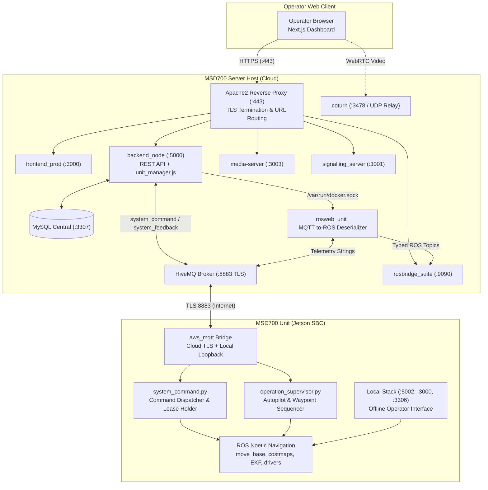
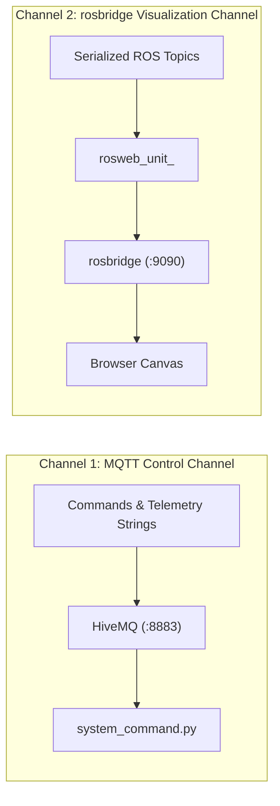
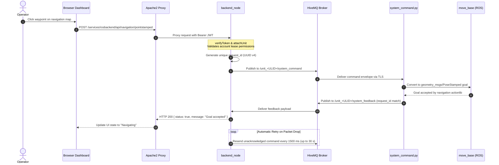
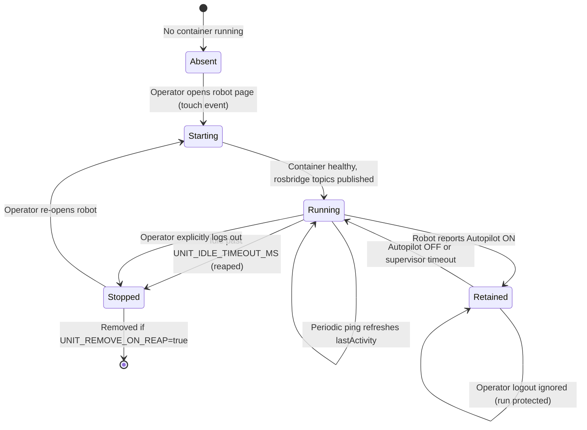
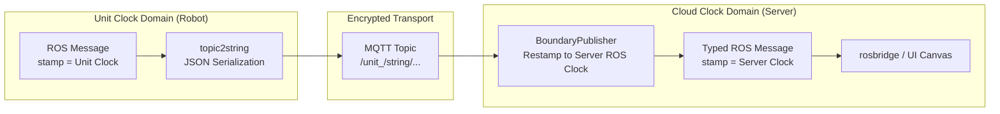
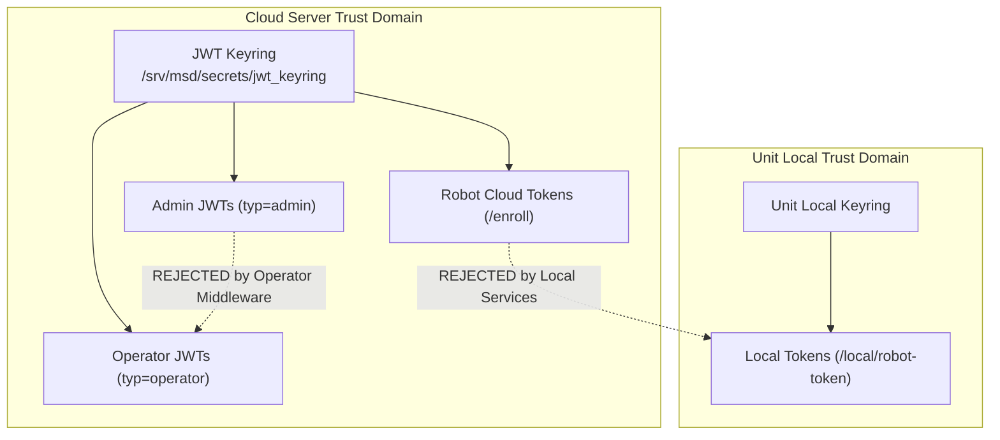
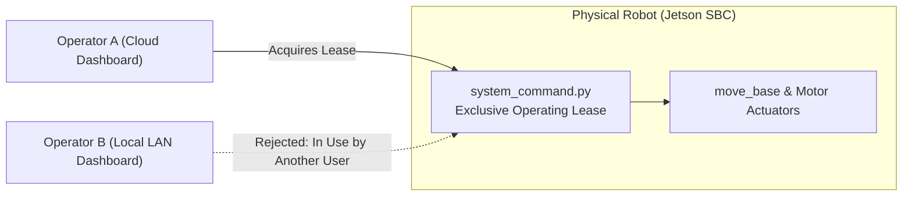

# Arsitektur

<RoleBadge role="developer" />

Dokumen ini merinci desain arsitektur platform robotika otonom MSD700, menjelaskan bagaimana komponen-komponennya berinteraksi, batas data di antara mereka, dan rasional engineering di balik setiap subsistem.

Untuk lokasi repositori, lihat [Struktur Repositori](/id/development/repository-structure). Untuk payload data yang tepat, lihat [Kontrak Pesan](/id/development/message-contracts). Untuk finite state machine, lihat [State and Behavior](/id/development/state-and-behavior). Untuk topologi deployment, lihat [System Setup](/id/setup/system-setup).

## Model Dua Mesin

Keputusan arsitektur sentral MSD700 adalah bahwa **sebuah Unit (robot fisik) menjalankan stack server lokal yang lengkap**, sementara **MSD700 Server (cloud)** menjalankan stack manajemen pusat untuk seluruh fleet. Keduanya adalah peer yang berbagi struktur data identik, terhubung lewat transport MQTT terenkripsi.

| Dimensi | MSD700 Unit (Robot) | MSD700 Server (Cloud) |
| --- | --- | --- |
| **Eksekusi** | ROS 1 Noetic bringup, move_base, gmapping, driver sensor, ditambah `backend_local`, `db_local`, `mosquitto_local`, dan `frontend_local`. | `backend_node` pusat, `db` (MySQL), `hivemq` (broker MQTT), `rosbridge`, `signalling_server`, `media-server`, dan `frontend_prod`. |
| **Otoritas** | Memiliki robot fisik yang live, pembacaan sensor, lease operasi lokal, dan rekaman peta mentah. | Memiliki akun pengguna, keyring autentikasi, rental profile, registri pendaftaran robot, dan peta/rute tersinkronisasi fleet-wide. |
| **Ketahanan Kegagalan** | Beroperasi secara otonom offline selama kehilangan total konektivitas internet atau Wi-Fi. | Bertahan dari shutdown robot, pemutusan jaringan, dan restart tanpa kehilangan metadata fleet. |
| **Batasan** | Tidak bisa menetapkan identitas global miliknya sendiri (membutuhkan pendaftaran cloud awal). | Tidak bisa menggerakkan robot fisik tanpa koneksi robot yang aktif. |

::: tip Prinsip Desain Inti: Lokal sebagai Cache Offline
Stack lokal unit adalah **cache offline-first dari cloud, bukan silo terisolasi**. Sebuah unit yang terdaftar berfungsi tanpa batas waktu tanpa koneksi internet aktif. Ketika konektivitas jaringan dipulihkan, peta yang direkam, rute yang dieksekusi, dan state konfigurasi secara otomatis tersinkronisasi kembali ke cloud.
:::

## Ikhtisar Komponen

| Komponen | Teknologi | Tanggung Jawab | Lokasi Host |
| --- | --- | --- | --- |
| **Frontend Dashboard** | Next.js, React, TypeScript | Antarmuka operator single-page dengan map canvas, widget telemetri, teleop manual, dan kontrol navigasi. | `ROS-dashboard-next-ts` (dibangun sebagai `frontend_prod` di cloud dan `frontend_local` di unit) |
| **backend_node** | Node.js, Express | Middleware autentikasi, CRUD untuk peta/rute/area/playlist, dispatch perintah robot, dan koordinasi sinkronisasi. | `ros-web-ui/source/dependencies/ROS-dashboard-backend` |
| **multi_unit.py / cloud_multi.launch** | Python, ROS 1 Noetic | Node relay bertemplate multi-unit yang melayani semua robot dalam satu ROS runtime terpadu lewat namespace `/unit_<ULID>/...`. | Kontainer fleet relay (`rosweb_unit_relays`), sengaja dipisahkan dari backend sehingga sebuah code deploy bukan sebuah outage data-plane fleet-wide |
| **gen_bridge_params.py / nakayama_cloud_multi.launch** | Python, ROS 1 Noetic | Memperluas peta topik bridge MQTT di atas sebuah roster unit sehingga satu nodelet `mqtt_client` dan satu koneksi TLS melayani seluruh fleet. | Kontainer fleet relay (`rosweb_unit_relays`) |
| **unit_manager.js (Legacy)** | Node.js (Docker API) | (Deprecated) Manager kontainer dinamis legacy yang menginstansiasi 1 kontainer per robot; digantikan oleh fleet relay ROS runtime tunggal. | Ter-embed di dalam `backend_node` |
| **rosbridge** | `rosbridge_suite` (WebSocket) | Bridge WebSocket terpadu yang men-streaming topik ROS live untuk semua unit ke canvas browser lewat port 9090. | Kontainer cloud (`nakayama_cloud`) dan stack lokal unit |
| **HiveMQ (MQTT)** | HiveMQ CE (Java) | Broker pesan terenkripsi berthroughput tinggi yang menghubungkan robot ke server lewat port 8883 (TLS). | Kontainer server (`hivemq` / `hivemq_dev`) |
| **Database MySQL** | MySQL 8.0 | Menyimpan akun pengguna, rental profile, record unit terdaftar, geometri rute, batas area kustom, dan journal sinkronisasi. | Server (`db` / `db_dev`) dan unit (`db_local`) |
| **media-server** | Node.js, Express | Mengelola upload aset peta, generasi thumbnail, dan menyajikan file peta `.pgm` dan `.yaml` statis. | Kontainer server dan kontainer unit (`media_local`) |
| **signalling_server** | Node.js (WebSocket) | Server negosiasi peer WebRTC yang memfasilitasi streaming video langsung antara kamera robot dan browser operator. | Kontainer server (`signalling`) dan kontainer unit (`signalling_local`) |
| **coturn** | Coturn (C) | Server relay TURN / STUN RFC 5766 yang menyediakan fallback media ketika NAT traversal mencegah WebRTC video peer-to-peer langsung. | Host server (layanan `coturn`, host networking) |
| **Apache2** | Apache HTTP Server | Menangani terminasi TLS, header keamanan, dan merutekan semua traffic publik lewat path `/services/...`. | Host server (layanan native) |
| **Paket Robot ROS** | C++, Python, ROS 1 Noetic | `msd700_robot` (navigasi, SLAM, coverage boustrophedon, EKF, driver sensor) dan paket bridge `ros-web-ui` (`topic2string`, `system_command`, `operation_supervisor`). | Jetson SBC (kontainer `msd700`) |

## Topologi Sistem dan Alur Data

### Aturan Kunci Arsitektur:
1. **Apache sebagai Satu-Satunya Ingress Publik**: Semua permintaan HTTP dan WebSocket masuk lewat Apache port 443. Layanan backend binding ke port internal atau alamat loopback. Satu-satunya port eksternal yang dijangkau langsung oleh robot adalah HiveMQ pada port 8883 (TLS).
2. **Perintah Mengalir lewat MQTT, Bukan ROS**: Perintah yang dikirim oleh `backend_node` menumpang topik MQTT `/unit_<ULID>/system_command` dan diakui lewat `/unit_<ULID>/system_feedback`. Topik ROS di cloud eksis semata-mata untuk memberi makan map canvas dan tampilan telemetri browser.
3. **Kontainer Per-Unit sebagai Deserializer**: Kontainer `rosweb_unit_<ULID>` berjalan on-demand untuk mengonversi payload JSON/string dari MQTT kembali menjadi pesan ROS native (`nav_msgs/OccupancyGrid`, `geometry_msgs/PoseStamped`, `sensor_msgs/LaserScan`), memungkinkan `rosbridge` men-streaming-nya ke dashboard.

## Dua Kanal Diagnostik

Platform ini menggunakan dua kanal komunikasi terpisah yang gagal secara independen:

| Kanal | Transport | Data yang Dibawa | Gejala Kegagalan |
| --- | --- | --- | --- |
| **MQTT** | TCP / TLS (8883) | Perintah, acknowledgement, string pose, ping status. | Robot tampak **Offline** di konsol. Perintah gagal seketika dengan HTTP 504. |
| **rosbridge** | WebSocket (WSS) | Pesan ROS bertipe (`/map`, `/robot_pose`, `/scan`, `/global_plan`). | Robot tampak **Online** dan menerima perintah, tetapi map canvas tetap kosong. |
| **Kontainer Relay Unit** | Docker di Server | Menerjemahkan string MQTT ke topik ROS bertipe untuk rosbridge. | Robot online dan rosbridge terhubung, tetapi canvas tetap kosong karena `rosweb_unit_<ULID>` dihentikan atau di-reap karena inaktivitas. |

## Alur Eksekusi Perintah End-to-End

Ketika seorang operator memerintahkan robot (misalnya, mengklik sebuah waypoint pada peta):

### Detail Implementasi Kritis:
- **Response HTTP Mencerminkan State Robot**: `backend_node` menahan koneksi HTTP terbuka hingga `system_feedback` dengan `request_id` yang cocok tiba dari robot. Status 504 Gateway Timeout menandakan robot tidak pernah memproses perintah tersebut.
- **Retry Perintah Selektif**: Perintah yang mengubah state (goal navigasi, mode switch, E-Stop) di-retry setiap 1500 ms hingga diakui. Ping heartbeat **tidak pernah di-retry**: hilangnya sebuah ping adalah sinyal persis yang digunakan safety watchdog untuk memulai zero-twist emergency stop.

## Siklus Hidup Kontainer Per-Unit

::: info Fleet relay adalah default
Telemetri multi-unit diproses oleh satu kontainer **fleet relay** yang melayani seluruh fleet lewat topik bernamespace (`/unit_<ULID>/...`) dan relay bertemplate (`multi_unit.py` / `cloud_multi.launch`, ditambah `nakayama_cloud_multi.launch` untuk paruh MQTT-nya). Roster-nya berasal dari tabel `units`, sehingga mendaftarkan sebuah robot adalah satu-satunya hal yang diperlukan agar bisa dijangkau. Jalur per-unit di bawah ini masih tersedia dan hanya berjarak satu environment variable, tetapi keduanya tidak boleh pernah berjalan untuk unit yang sama. Lihat [Siklus Hidup Kontainer Unit](/id/development/unit-container-lifecycle#fleet-relay-satu-kontainer-untuk-setiap-unit).
:::

Pada jalur per-unit, `unit_manager.js` di dalam `backend_node` secara dinamis mengelola satu kontainer per unit aktif lewat `/var/run/docker.sock`:

| Variabel Konfigurasi | Nilai Default | Deskripsi |
| --- | --- | --- |
| `UNIT_MANAGER_ENABLED` | `true` (server), `false` (unit) | Mengontrol apakah manajemen kontainer dinamis aktif. |
| `UNIT_IMAGE` | `ros-noetic-webui-app-v2:latest` (`:dev` di dev) | Image Docker yang diinstansiasi untuk relay unit. |
| `UNIT_IDLE_TIMEOUT_MS` | `1800000` (30 menit) | Durasi inaktivitas operator sebelum kontainer di-reap. |
| `UNIT_REAP_INTERVAL_MS` | `60000` (1 menit) | Frekuensi sapuan reaper latar belakang. |
| `UNIT_REMOVE_ON_REAP` | `false` | Bila true, menghapus kontainer; bila false, mempertahankannya dalam keadaan stopped. |
| `UNIT_MODE` | `prod` (atau `dev`) | Memilih offset port (ROS master 11311/11312, rosbridge 9090/9091). |

::: warning Guard Retensi Autopilot
Ketika sebuah robot menjalankan misi otonom dalam **Mode Autopilot**, kontainer relay-nya memasuki state **Retained**. Kontainer Retained dikecualikan dari idle timeout dan tidak dihentikan ketika seorang operator logout atau menutup browser-nya, memastikan pemantauan misi berlanjut secara kontinu.
:::

## Batas Domain Jam dan Sinkronisasi Waktu

Komputer onboard robot dan server cloud menjalankan instance ROS master terpisah dengan jam sistem independen. Untuk mencegah divergensi timestamp, semua pesan geometrik yang melintasi MQTT di-restamp ke waktu ROS lokal saat ingress lewat `BoundaryPublisher`.

::: danger Mengapa Restamping Jam Wajib
Melewatkan restamping waktu menghasilkan peringatan `TF_OLD_DATA` seketika di RViz dan renderer web. Lebih jauh lagi, jika `/use_sim_time` diaktifkan pada satu master tanpa generator `/clock` yang aktif, evaluasi pohon TF membeku sepenuhnya.
:::

## Trust Domain dan Keamanan Multi-Tingkat

Arsitektur MSD700 menegakkan tiga trust domain keamanan yang berbeda. Kredensial yang diterbitkan dalam satu domain ditolak dengan tegas oleh yang lain.

1. **Token Operator**: JWT HS256 standar yang diverifikasi terhadap keyring `/srv/msd/secrets/`. Token menyertakan ID pengguna dan lingkup akun. Token admin (`typ=admin`) ditolak oleh rute operasi robot standar.
2. **Token Cloud Robot**: Dicetak oleh `/enroll/token` menggunakan device secret yang dihasilkan selama pendaftaran robot fisik. Valid selama 12 jam, disegarkan pada setiap boot sistem dan lagi setiap 6 jam selama robot menyala. Refresher dan resolver identitas saat boot menargetkan backend yang **sama** (`ENROLL_BASE_URL` di `run_msd.sh`); sebuah `401 reenroll` selama refresh latar belakang dicatat dan tidak pernah menyentuh `device.json`.
3. **Token Lokal Unit**: Diterbitkan secara lokal oleh `backend_local` pada komputer Jetson. Token yang ditandatangani cloud sengaja ditolak oleh endpoint lokal untuk memastikan otonomi lokal yang lengkap selama partisi jaringan.

## Operating Lease: Mencegah Konflik Multi-Operator

Karena sebuah robot dapat diakses baik dari antarmuka web cloud maupun dashboard jaringan lokal onboard, robot fisik menegakkan satu **Operating Lease** eksklusif.

- Lease dipegang pada **robot** (di dalam `system_command.py`), bukan pada backend server.
- Ketika seorang operator membuka dashboard robot, klien memperoleh lease 15 detik yang diperbarui terus-menerus lewat ping heartbeat.
- Jika operator kedua mencoba mengirim perintah, robot mengembalikan status `In Use`. Takeover membutuhkan konfirmasi eksplisit dari operator asli atau berakhirnya masa lease.

## Matriks Kepemilikan dan Persistensi State

Prinsip arsitektur inti MSD700: **robot fisik adalah sumber kebenaran tertinggi**. Toggle, lease, dan progres operasional berada pada komputer robot (`system_command.py` dan `operation_supervisor.py`), bertahan dari penutupan tab browser, restart server, dan pemutusan jaringan.

| Domain State | Pemilik Utama | Lingkup Persistensi | Konsumen Pembaca |
| --- | --- | --- | --- |
| **Aktivitas Robot** | `system_command.py` (`RobotStateTracker`) | Bertahan lewat penutupan browser dan restart backend. | Response ping telemetri |
| **Operating Lease** | `system_command.py` | Bertahan lewat restart server; kedaluwarsa dalam 15 detik jika tidak disegarkan. | Feedback ping (`in_use`, `origin_conflict`) |
| **Mode Autopilot / Manual** | `system_command.py` | Bertahan lewat penutupan tab browser. | Response ping telemetri |
| **Batch Misi Aktif** | `operation_supervisor.py` | Bertahan lewat penutupan browser; disimpan di RAM. | `/string/operation_snapshot` yang di-latch |
| **Siklus Hidup Kontainer** | `unit_manager.js` (RAM Server) | Hanya runtime server; direkonstruksi oleh `adoptExisting()` saat boot. | Konsol web admin dan reaper |
| **Draft & Pilihan UI** | `sessionStorage` Browser | Umur sesi; dihapus saat tab ditutup. | Komponen React dashboard |
| **Record Fleet & Peta** | MySQL Pusat (`db`) | Penyimpanan permanen. | REST API backend |

::: warning Keterbatasan Penyimpanan Browser
Menutup tab browser menghapus `sessionStorage`. Untuk memastikan pemulihan misi yang mulus, waypoint aktif dan batas coverage di-latch pada `/string/operation_snapshot`. Ketika seorang operator membuka kembali dashboard di tab baru, UI subscribe ke topik yang di-latch ini dan sepenuhnya merekonstruksi run yang aktif. Lihat [Navigasi: Manual Override & Autopilot](/id/development/webui/navigation/manual-and-autopilot) untuk mekanika pemulihan sesi secara lengkap, dan [Safety Watchdog](/id/development/ros/safety-watchdog) untuk tingkatan timing sisi robot yang menjadi dasar baris "Operating Lease" dan "Autopilot" pada tabel ini.
:::

## Dokumentasi Terkait

- [Kontrak Pesan](/id/development/message-contracts): Spesifikasi lengkap payload MQTT, ROS, dan WebSocket.
- [State and Behavior](/id/development/state-and-behavior): State machine terperinci untuk navigasi, sweep boustrophedon, dan E-Stop.
- [Referensi API](/id/development/api-reference): Endpoint REST API dan kontrak autentikasi.
- [Skema Database](/id/development/database-schema): Skema MySQL, tabel, foreign key, dan script migrasi.
- [Streaming Kamera](/id/development/webui/camera/overview): Pipeline video WebRTC dan negosiasi ICE candidate.
- [Sinkronisasi Data](/id/development/data-sync): Mekanika sinkronisasi antara cache unit dan server pusat.
