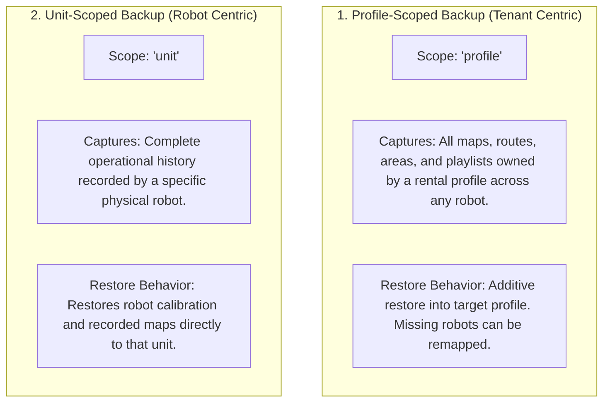

# Pencadangan, Pemulihan, dan Migrasi Data

<RoleBadge role="developer" />

Dokumen ini merinci arsitektur cadangan database, struktur arsip ekspor/impor, mekanisme transfer profil sewa, dan skrip migrasi di MSD700.

## Arsitektur Cadangan Cakupan Ganda

Platform ini mendukung dua cakupan pencadangan independen:



| Dimensi | Cadangan Cakupan Profil | Cadangan Cakupan Unit |
| --- | --- | --- |
| **Kunci Lingkup Utama** | `profile_id` (Profil Sewa) | `unit_id` (ULID Robot Fisik) |
| **Kasus Penggunaan Khas** | Memigrasikan peta dan rute pelanggan ke robot pengganti. | Mengarsipkan robot sebelum servis atau perbaikan perangkat keras pabrik. |
| **Termasuk Data** | Peta, titik jalan, daftar putar, dan metadata pengguna untuk profil tersebut. | Semua peta dan catatan sensor berasal dari unit perangkat keras tertentu. |
| **Strategi Pemulihan** | Aditif (dimasukkan tanpa menimpa data penyewa yang tidak terkait). | Pemulihan langsung ke unit perangkat keras. |

## Struktur Arsip (`.tar.gz`)

Cadangan diekspor sebagai arsip `.tar.gz` terkompresi yang berisi metadata terstruktur dan file peta biner:

```
msd700_backup_01JZ8QK2H.tar.gz
├── manifest.json            # Version 2 archive manifest and metadata
├── database_dump.sql        # Scoped SQL insert statements
└── maps/                    # Binary map images (.pgm, .yaml, .png)
    ├── 01JZ8QK2H0001.pgm
    ├── 01JZ8QK2H0001.yaml
    └── 01JZ8QK2H0001_thumb.png
```

### Format Manifes (`manifest.json`)

```json
{
  "manifest_version": "2.0",
  "scope": "profile",
  "profile_id": "01JZ7YV5CQPROF00000000000",
  "tenant_name": "Acme Logistics",
  "created_at": "2026-08-15T14:30:00Z",
  "created_by": "01JZ7YV5CQUSER00000000000",
  "counts": {
    "maps": 4,
    "routes": 12,
    "areas": 6,
    "playlists": 2
  }
}
```

## Operasi Pencadangan REST API

### 1. Ekspor Arsip
`POST /api/backup/export`

Menghasilkan dan mengunduh arsip `.tar.gz`.

- **Badan Permintaan**:
```json
{
  "scope": "profile",
  "profile_id": "01JZ7YV5CQPROF00000000000"
}
```

### 2. Impor dan Pulihkan Arsip
`POST /api/backup/import`

Mengunggah arsip dan menerapkannya secara tambahan.

- **Request Payload**: Data formulir multi-bagian dengan `file: <archive.tar.gz>` dan target `profile_id`.

## Skrip Migrasi Skema

Evolusi skema basis data dikelola oleh skrip otomatis di `ros-web-ui/source/dependencies/ROS-dashboard-backend/scripts/`:

| Nama Skrip | Tujuan | Perintah Eksekusi |
| --- | --- | --- |
| `migrate_unit_id_refactor.js` | Memigrasikan jalur nama pengguna/nama unit lama ke pengalamatan ULID. | `node migrate_unit_id_refactor.js --apply` |
| `migrate_enrolment.js` | Membuat tabel `pending_units` dan `unit_devices` untuk autentikasi nonce 32 byte. | `node migrate_enrolment.js --apply` |
| `migrate_sync.js` | Menginstal tabel `sync_state` dan `sync_tombstones` untuk sinkronisasi data offline. | `node migrate_sync.js --profile dev --apply` |
| `migrate_backup_scope.js` | Tingkatkan tabel `profile_backups` dengan kolom `scope`. | `node migrate_backup_scope.js --profile dev --apply` |

::: danger Migration Testing Rule
Selalu uji skrip migrasi terhadap database pengembangan pada **port 3308** sebelum menerapkannya ke produksi pada port 3307. Skrip migrasi memerlukan argumen `--profile` yang eksplisit untuk mencegah ketidakcocokan target yang tidak disengaja.
:::

## Dokumentasi Terkait

- [Skema Basis Data](/id/development/database-schema): Definisi tabel MySQL lengkap dan kunci asing.
- [Sinkronisasi Data](/id/development/data-sync): Replikasi data offline dan resolusi konflik.
- [Referensi API](/id/development/api-reference): Titik akhir REST API untuk manajemen armada.