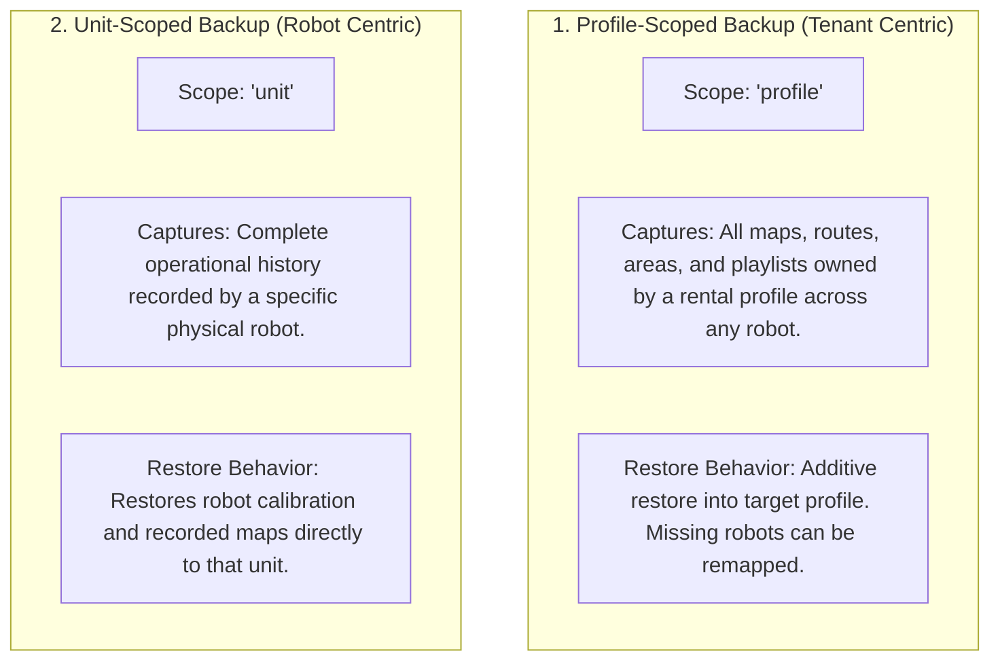

# Cadangan, Pemulihan, dan Migrasi Data

<RoleBadge role="developer" />

Dokumen ini merinci arsitektur backup database, struktur arsip export/import, mekanika transfer rental profile, dan script migrasi di MSD700.

## Arsitektur Backup Dua-Lingkup

Platform ini mendukung dua lingkup backup yang independen:



| Dimensi | Backup Berlingkup Profil | Backup Berlingkup Unit |
| --- | --- | --- |
| **Kunci Lingkup Utama** | `profile_id` (Rental Profile) | `unit_id` (ULID Robot Fisik) |
| **Kasus Penggunaan Tipikal** | Memigrasikan peta dan rute pelanggan ke robot pengganti. | Mengarsipkan sebuah robot sebelum servis hardware pabrik atau refurbishment. |
| **Data yang Disertakan** | Peta, waypoint, playlist, dan metadata pengguna untuk profil tersebut. | Semua peta dan record sensor yang berasal dari unit hardware spesifik itu. |
| **Strategi Restore** | Aditif (upsert tanpa menimpa data tenant yang tidak terkait). | Restorasi langsung ke unit hardware. |

## Struktur Arsip (`.tar.gz`)

Backup diekspor sebagai arsip `.tar.gz` terkompresi yang berisi metadata terstruktur dan file peta biner:

```
msd700_backup_01JZ8QK2H.tar.gz
├── manifest.json            # Version 2 archive manifest and metadata
├── database_dump.sql        # Scoped SQL insert statements
└── maps/                    # Binary map images (.pgm, .yaml, .png)
    ├── 01JZ8QK2H0001.pgm
    ├── 01JZ8QK2H0001.yaml
    └── 01JZ8QK2H0001_thumb.png
```

### Format Manifest (`manifest.json`)

```json
{
  "manifest_version": "2.0",
  "scope": "profile",
  "profile_id": "01JZ7YV5CQPROF00000000000",
  "tenant_name": "Acme Logistics",
  "created_at": "2026-08-15T14:30:00Z",
  "created_by": "01JZ7YV5CQUSER00000000000",
  "counts": {
    "maps": 4,
    "routes": 12,
    "areas": 6,
    "playlists": 2
  }
}
```

## Operasi Backup REST API

Semua rute backup berada di bawah `/admin/api` (membutuhkan token admin). Tidak ada endpoint `/api/backup/export` atau `/api/backup/import`.

### 1. Buat Backup
`POST /admin/api/profiles/:id/backups` (lingkup profil) atau `POST /admin/api/units/:id/backups` (lingkup unit)

Membuat record backup untuk profil atau unit.

### 2. Unduh Arsip
`GET /admin/api/backups/:id/download`

Mengunduh arsip `.tar.gz`.

### 3. Unggah Arsip
`POST /admin/api/backups/upload`

Mengunggah arsip (raw body). Pratinjau rencananya dulu dengan `POST /admin/api/backups/:id/plan`.

### 4. Restore Arsip
`POST /admin/api/backups/:id/restore`

Menerapkan arsip yang diunggah secara aditif.

### 5. Daftar Backup
`GET /admin/api/backups`

## Script Migrasi Skema

Evolusi skema database dikelola oleh script otomatis di `ros-web-ui/source/dependencies/ROS-dashboard-backend/scripts/`:

| Nama Script | Tujuan | Perintah Eksekusi |
| --- | --- | --- |
| `migrate_unit_id_refactor.js` | Memigrasikan path username/unitname lama ke pengalamatan ULID. | `node migrate_unit_id_refactor.js --profile server_dev --apply` |
| `migrate_enrolment.js` | Membuat tabel `pending_units` dan `unit_devices` untuk autentikasi nonce. | `node migrate_enrolment.js --profile server_dev --apply` |
| `migrate_sync.js` | Memasang tabel `sync_state` dan `sync_tombstones` untuk sinkronisasi data offline. | `node migrate_sync.js --profile server_dev --apply` |
| `migrate_backup_scope.js` | Meningkatkan tabel `profile_backups` dengan kolom `scope`. | `node migrate_backup_scope.js --profile server_dev --apply` |

::: danger Aturan Pengujian Migrasi
Selalu uji script migrasi terhadap database pengembangan pada **port 3308** sebelum menerapkannya ke produksi pada port 3307. Script migrasi membutuhkan argumen `--profile` eksplisit untuk mencegah ketidakcocokan target yang tidak disengaja.
:::

## Dokumentasi Terkait

- [Skema Database](/id/development/database-schema): Definisi tabel MySQL lengkap dan foreign key.
- [Sinkronisasi Data](/id/development/data-sync): Replikasi data offline dan resolusi konflik.
- [Referensi API](/id/development/api-reference): Endpoint REST API untuk manajemen fleet.
