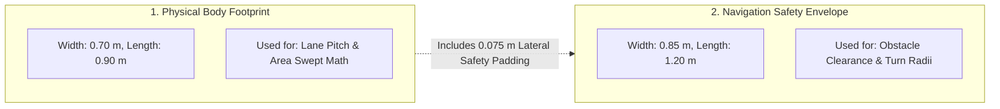
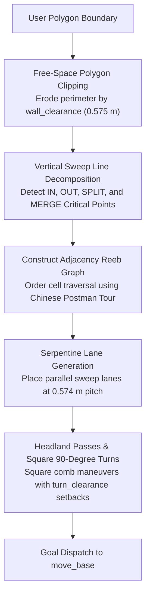
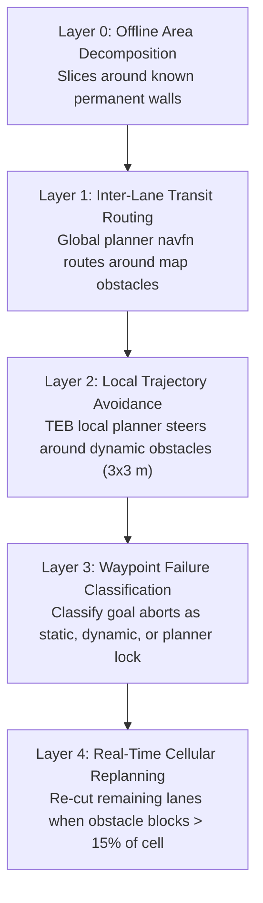
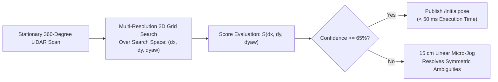

# Cakupan Boustrophedon & Arsitektur Penyelarasan Zero-Spin

<RoleBadge role="developer" />

Dokumen ini memberikan spesifikasi algoritmik komprehensif dari jalur perencanaan cakupan Dekomposisi Seluler Boustrophedon, penghitungan jarak bebas geometri ganda, pengelolaan rintangan lima lapis, dan penyelarasan putaran nol Korelatif Scan Matcher (CSM).

## Geometri Robot Ganda

Prinsip desain dasar dalam perencanaan cakupan MSD700 adalah **robot memiliki dua dimensi geometris berbeda yang digunakan untuk perhitungan berbeda**:

| Definisi Geometris | Dimensi Ukuran | Penggunaan Algoritma |
| --- | --- | --- |
| **Tubuh Fisik** (`~body_footprint`) | Panjang 0,90 m x lebar 0,70 m | Menentukan jarak jalur dan penghitungan pencapaian area sapuan. |
| **Amplop Keamanan Costmap** | Panjang 1,20 m x lebar 0,85 m | Menegakkan izin perencana lokal TEB dan kelayakan belokan. |

Amplop peta biaya di `costmap_common_params.yaml` mencakup bantalan pengaman yang disengaja (0,075 m lateral dan 0,150 m memanjang per sisi). `path_coverage_node` membaca amplop langsung dari `/move_base/global_costmap/footprint` untuk menjaga sinkronisasi dengan perencana navigasi.

### Konstanta Izin Turunan (`libs/coverage_geometry.py`)

| Izin Konstan | Nilai | Rumus Matematika |
| --- | --- | --- |
| `wall_clearance` | **0,575m** | $r_{\text{tertulis}} (0,425\text{ m}) + d_{\min} (0,150\text{ m})$ |
| `turn_clearance` | **0,885 m** | $r_{\text{dibatasi}} (0,735\text{ m}) + d_{\min} (0,150\text{ m})$ |
| `pitch` | **0,574 m** | $w_{\text{body}} (0,70\text{ m}) \kali (1 - \text{tumpang tindih} (0,18))$ |

### Batas Fisika Geometris:
- **Robot koridor tersempit yang bisa masuk**: **1,15 m** ($2 \times \text{wall\_clearance}$).
- **Robot koridor tersempit dapat berputar 180 derajat**: **1,77 m** ($2 \times \text{turn\_clearance}$).
- **Koridor tersempit senilai 2 jalur**: **1,72 m**.
- **Jalur batas yang tidak dapat dijangkau di sepanjang dinding**: **0,225 m** ($\text{wall\_clearance} - \frac{w_{\text{body}}}{2}$).

::: info Attainment vs Raw Coverage
Karena garis keliling 0,225 m tidak dapat dilalui tanpa tumbukan, sebuah ruangan berbentuk persegi panjang (misalnya 3 x 6 m) mencapai cakupan maksimum teoritis **78,6%**. Performa sistem diukur dengan **Rasio Pencapaian** (bagian dari luas lantai yang dapat dijangkau yang benar-benar tersapu), bukan persentase area mentah yang tidak disesuaikan.
:::

---

## Algoritma Dekomposisi Seluler Boustrophedon

Perencana cakupan menguraikan batas poligonal cekung sembarang dengan hambatan internal menjadi subsel cembung dan bebas hambatan:

### Klasifikasi Titik Kritis:
Selama perkembangan garis sapuan vertikal sepanjang sumbu $x$, simpul batas diklasifikasikan berdasarkan konektivitas lokal dari ruang bebas:
1. **DI Titik Kritis**: Sel baru terbuka seiring bertambahnya ruang kosong.
2. **KELUAR Titik Kritis**: Sel berakhir saat batas bertemu.
3. **Titik Kritis SPLIT**: Kendala internal membagi sel aktif menjadi dua subsel paralel yang berbeda.
4. **MERGE Critical Point**: Dua sub-sel paralel bergabung kembali melewati tepi belakang rintangan.

---

## Manajemen Kendala Lima Lapis

---

## Penyelarasan Orientasi Putaran Nol (Pencocokan Pemindaian Korelatif)

Ketika robot ditempatkan dalam pose yang tidak diketahui pada peta yang telah direkam sebelumnya, AMCL tradisional memerlukan rotasi 360 derajat di tempat untuk menghentikan penyebaran partikel.

MSD700 mengimplementasikan **Correlative Scan Matching (CSM)** untuk menghitung orientasi dan posisi secara instan tanpa gerakan:

### Rumusan Matematika:
Mengingat $N$ titik pemindaian laser $\mathbf{p}_i = [x_i, y_i]^T$ dan peta kisi hunian statis $M(x, y)$, pencocokan pemindaian menemukan transformasi kaku $(\Delta x, \Delta y, \Delta \theta)$ yang memaksimalkan skor korelasi:

$$S(\Delta x, \Delta y, \Delta \theta) = \sum_{i=1}^N M\left( \mathbf{R}(\Delta \theta) \mathbf{p}_i + \begin{bmatrix} \Delta x \\ \Delta y \end{bmatrix} \kanan)$$

Dimana $\mathbf{R}(\Delta \theta)$ adalah matriks rotasi 2D:
$$\mathbf{R}(\Delta \theta) = \begin{bmatrix} \cos(\Delta \theta) & -\sin(\Delta \theta) \\ \sin(\Delta \theta) & \cos(\Delta \theta) \end{bmatrix}$$

Ketika kepercayaan skor pertandingan melebihi $65\%$, perkiraan pose dipublikasikan ke `/initialpose`, melokalisasi robot dalam waktu kurang dari $50\text{ ms}$ dengan gerakan rotasi nol.

## Dokumentasi Terkait

- [Simulasi](/id/development/simulation): Lingkungan pengujian gudang dan model skala.
- [Kontrak Pesan](/id/development/message-contracts): Cakupan amplop perintah dan protokol ACK.
- [Status dan Perilaku](/id/development/state-and-behavior): Navigasi dan cakupan mesin negara terbatas.