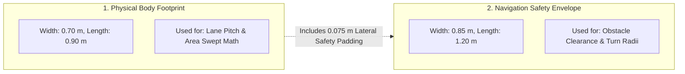
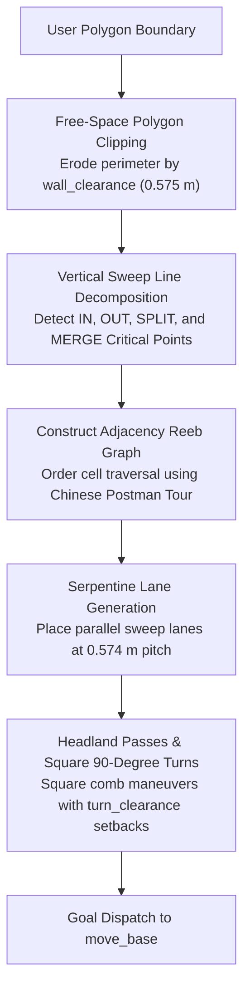
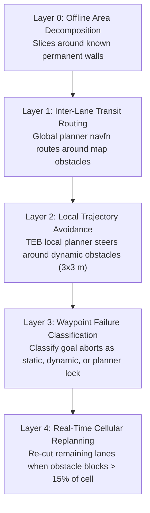
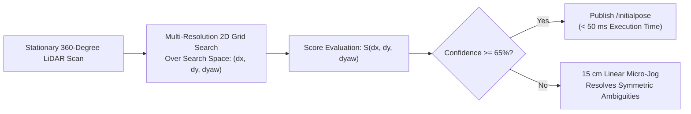
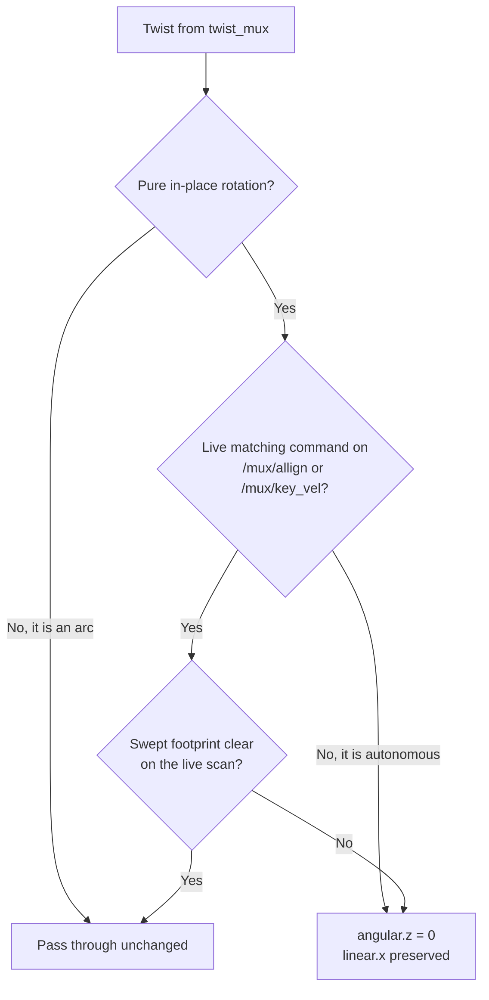

# Boustrophedon Coverage & Zero-Spin Alignment Architecture

<RoleBadge role="developer" />

This document provides a comprehensive algorithmic specification of the Boustrophedon Cellular Decomposition coverage planning pipeline, dual-geometry clearance calculations, five-layer obstacle management, and Correlative Scan Matcher (CSM) zero-spin alignment.

## Dual Robot Geometries

A foundational design principle in MSD700 coverage planning is that **the robot has two distinct geometric dimensions used for different calculations**:

| Geometric Definition | Size Dimensions | Algorithmic Usage |
| --- | --- | --- |
| **Physical Body** (`~body_footprint`) | 0.90 m length x 0.70 m width | Determines lane pitch and swept-area attainment calculations. |
| **Costmap Safety Envelope** | 1.20 m length x 0.85 m width | Enforces TEB local planner clearances and turning feasibility. |

The costmap envelope in `costmap_common_params.yaml` includes intentional safety padding (0.075 m lateral and 0.150 m longitudinal per side). `path_coverage_node` reads the envelope directly from `/move_base/global_costmap/footprint` to maintain synchronization with navigation planners.

### Derived Clearance Constants (`libs/coverage_geometry.py`)

| Clearance Constant | Value | Mathematical Formula |
| --- | --- | --- |
| `wall_clearance` | **0.575 m** | $r_{\text{inscribed}} (0.425\text{ m}) + d_{\min} (0.150\text{ m})$ |
| `turn_clearance` | **0.885 m** | $r_{\text{circumscribed}} (0.735\text{ m}) + d_{\min} (0.150\text{ m})$ |
| `pitch` | **0.574 m** | $w_{\text{body}} (0.70\text{ m}) \times (1 - \text{overlap} (0.18))$ |

### Physical Geometric Limits:
- **Narrowest corridor robot can enter**: **1.15 m** ($2 \times \text{wall\_clearance}$).
- **Narrowest corridor robot can pivot 180 degrees**: **1.77 m** ($2 \times \text{turn\_clearance}$).
- **Narrowest corridor worth 2-lane sweeping**: **1.72 m**.
- **Unreachable boundary strip along walls**: **0.225 m** ($\text{wall\_clearance} - \frac{w_{\text{body}}}{2}$).

::: info Attainment vs Raw Coverage
Because the 0.225 m perimeter strip cannot be traversed without collision, a rectangular room (e.g. 3 x 6 m) reaches a theoretical maximum coverage of **78.6%**. System performance is measured by **Attainment Ratio** (fraction of reachable floor actually swept), rather than unadjusted raw area percentage.
:::

---

## Boustrophedon Cellular Decomposition Algorithm

The coverage planner decomposes arbitrary concave polygonal boundaries with internal obstacles into convex, obstacle-free sub-cells:

### Critical Point Classification:
During vertical sweep line progression along the $x$-axis, boundary vertices are classified based on the local connectivity of the free space:
1. **IN Critical Point**: A new cell opens as free space expands.
2. **OUT Critical Point**: A cell terminates as boundaries converge.
3. **SPLIT Critical Point**: An internal obstacle divides an active cell into two distinct parallel sub-cells.
4. **MERGE Critical Point**: Two parallel sub-cells rejoin past the trailing edge of an obstacle.

---

## Five-Layer Obstacle Management

---

## Zero-Spin Orientation Alignment (Correlative Scan Matching)

When the robot is placed in an unknown pose on a pre-recorded map, traditional AMCL requires a 360-degree in-place rotation to collapse particle dispersion.

MSD700 implements **Correlative Scan Matching (CSM)** to calculate orientation and position instantly without motion:

### Mathematical Formulation:
Given $N$ laser scan points $\mathbf{p}_i = [x_i, y_i]^T$ and a static occupancy grid map $M(x, y)$, the scan matcher finds the rigid transform $(\Delta x, \Delta y, \Delta \theta)$ that maximizes the correlation score:

$$S(\Delta x, \Delta y, \Delta \theta) = \sum_{i=1}^N M\left( \mathbf{R}(\Delta \theta) \mathbf{p}_i + \begin{bmatrix} \Delta x \\ \Delta y \end{bmatrix} \right)$$

Where $\mathbf{R}(\Delta \theta)$ is the 2D rotation matrix:
$$\mathbf{R}(\Delta \theta) = \begin{bmatrix} \cos(\Delta \theta) & -\sin(\Delta \theta) \\ \sin(\Delta \theta) & \cos(\Delta \theta) \end{bmatrix}$$

When the match score confidence exceeds $65\%$, the estimated pose is published to `/initialpose`, localizing the robot in less than $50\text{ ms}$ with zero rotational motion.

---

## In-Place Rotation Is Denied By Default

Zero-spin alignment removed the *reason* to rotate. The rotation guard removes the *ability*, because several parts of the stack still reached for a spin on their own.

`rotation_guard` (`msd700_control`) sits between `twist_mux` and the base, on the shared `cmd_vel` path, so it covers every rotation source at once rather than one plugin at a time. A command counts as in-place rotation when `|angular.z| > 0.05` and `|linear.x| <= 0.05`; arcs and straight-line motion pass through untouched, because they translate the footprint as well as turning it and the local planner already owns that case.

An in-place rotation reaches the wheels only if **both** gates agree:

**Gate 1, consent.** The only rotations honoured are the ones a person asked for: Map Sync's **Auto Align** (`/mux/allign`, published by `align_checker` after the operator presses the button) and **manual WASD** (`/mux/key_vel`, typed locally or relayed from the dashboard). The outgoing twist must turn the same way and no faster than what that source asked for, within a 5% tolerance, and the consent expires 1 second after the source stops publishing. `/mux/nav_vel` is deliberately absent: everything autonomous arrives there.

**Gate 2, geometry.** The swept footprint is tested against the live scan rather than the costmap. This gate is documented in full in `rotation_guard.py`; the short version is that the costmap is the wrong oracle for rotation, because the swept band sits inside the LiDAR's minimum range and the obstacle layer raytraces the mark away as the robot closes on it.

### What this turned off

| Source | Was | Now |
| --- | --- | --- |
| `rotate_recovery` | Last rung of move_base's recovery ladder | Not loaded. `recovery_behaviors` lists only the two costmap resets, neither of which commands motion |
| TEB terminal pivot | Turned to face the goal heading at every waypoint | Gone. `yaw_goal_tolerance: 3.15` accepts any final heading |
| TEB initial pivot | Turned on the spot when the path led off behind the robot | Reverses instead. `allow_init_with_backwards_motion: true` |
| `SYNC` command (`nav_controller`) | 10 s of open-loop `0.5 rad/s`, no obstacle check | No-op. Use Auto Align, which scan-matches first |

::: warning Waypoint headings
`yaw_goal_tolerance: 3.15` is correct only because no waypoint in this system carries a heading anyone chose. The dashboard builds every pin from a map click and fills the quaternion with the identity, so a tight tolerance was buying a pivot at every pin to satisfy an unset struct field. If waypoints ever gain a real heading, this has to be reconsidered, and a pivot at each one comes back with it.
:::

### Escape hatches

- `rotation_guard/allow_in_place: true` reverts to the geometry gate alone, so any source may spin as long as the sweep is clear.
- `twist_mux.launch guard_rotation:=false` removes the node entirely and restores the pre-guard wiring, with no checks of any kind.

Neither is appropriate for the field robot. A local planner that decides it must pivot before it can proceed will now sit still and eventually abort its goal, and that trade is deliberate: an aborted goal is visible and recoverable, a blind spin into a shelf is neither.

## Related Documentation

- [Simulation](/id/development/simulation): Warehouse testing environment and scale models.
- [Message Contracts](/id/development/message-contracts): Coverage command envelopes and ACK protocols.
- [State and Behavior](/id/development/state-and-behavior): Navigation and coverage finite state machines.
