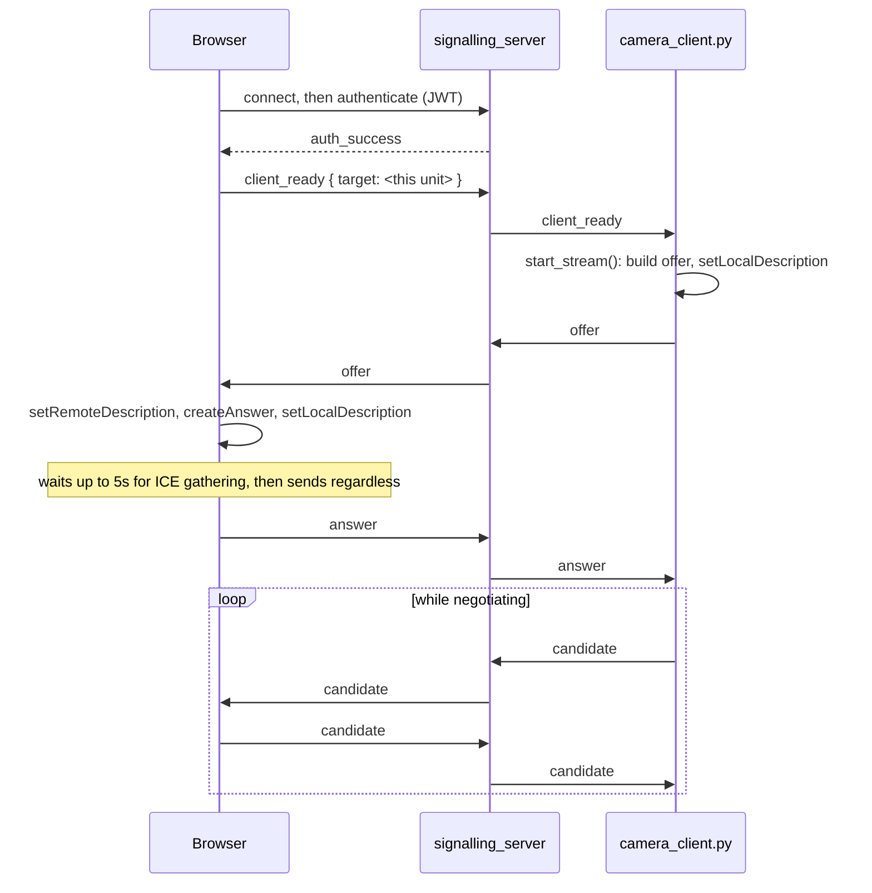
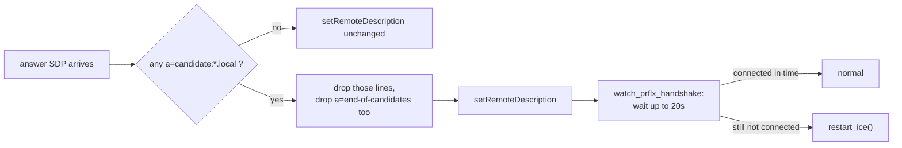

# Camera Streaming

<RoleBadge role="developer" />

How the live camera feed gets from the robot to an operator's browser: WebRTC signalling, ICE
negotiation, and the one Chrome behaviour that broke it on a unit with no internet. For where
`signalling_server` and `coturn` sit in the wider system, see
[Architecture](/id/development/architecture#components). For the production TURN relay's own
configuration, see [Server Setup § The TURN relay](/id/setup/server-setup#_6-the-turn-relay-production-only). This page
covers what neither of those does: the handshake itself, and why the unit-local path needs
different handling than the cloud path.

::: info Video is peer to peer; only negotiation crosses the server
`signalling_server` exchanges SDP offers, answers and ICE candidates between `camera_client.py` and
the browser. Once a connection is established, video frames never touch it: they flow directly
between robot and browser, or through `coturn` when no direct path exists.
:::

## One camera, two peer connections

`camera_client.py` is not a container of its own. It runs inside the robot container, in the
`camera_client` tmux window started by `run_msd.sh` (see
[Docker Reference § Unit: run_msd.sh](/id/setup/docker-reference#unit-run-msd-sh)). A single physical
camera is shared by **two** independent `CameraClient` objects in that one process (one peered
with the cloud, one peered with whatever dashboard is open on the unit's own LAN), each with its own
WebSocket connection and its own `RTCPeerConnection`.

| Target | Signalling WebSocket | Media / backend | STUN/TURN |
| --- | --- | --- | --- |
| Cloud production | `wss://msd.nglobal.jp/services/signalling` (Apache proxies to `:3001`) | media `:3003`, backend `:5000` | Google STUN + the production `coturn` relay |
| Cloud dev | `ws://<server-ip>:4001` | media `:4003`, backend `:5001` | same as production (one relay, shared) |
| Unit-local | `ws://<unit-ip>:3001` | media `:3003`, backend `:5002` | **none by default** |

## Why the unit-local path has no STUN/TURN by default

A unit with no internet route fails `getaddrinfo` resolving `stun.l.google.com`, and `aiortc` raises
that failure straight out of `setLocalDescription`: not a degraded connection, a dead
`start_stream()` and no video at all, even though the camera, the signalling server and the
dashboard are all healthy. Since the operator's browser and the robot share the same LAN in this
case, a host candidate is already reachable; there is nothing for a relay to solve.

`camera_client.py` and the dashboard's `VideoStreamComponent` both read the same convention for their
ICE server list: unset falls back to the cloud defaults (Google STUN plus the production TURN
credentials), and the literal string `none` clears the list entirely rather than leaving it unset.
`LOCAL_STUN_URLS` / `LOCAL_TURN_URL` / `LOCAL_TURN_USERNAME` / `LOCAL_TURN_CREDENTIAL` in
`msd700_noetic/docker/.env` default to `none` for exactly this reason, and are only worth setting on
a unit whose LAN genuinely needs a relay (a segmented network, a captive Wi-Fi bridge between robot
and operator).

## The handshake



`signalling_server` is a stateless relay keyed by `target`: it never inspects SDP content, only
routes messages between the two peers named in them. Authentication only requires a valid,
keyring-verified token carrying `userId` or `username`. That claim is load-bearing for a robot
token specifically, though, since it is what the operator-token and robot-token paths have in common. A
robot token missing `userId` is rejected here outright, which is why both the cloud and unit-local
token issuers put it in explicitly (see [Architecture § Trust domains](/id/development/architecture#trust-domains)).

## The mDNS candidate bug (2026-08-14)

Modern Chrome does not put a host's real LAN address in an ICE candidate. It mints a random
`<uuid>.local` name instead and relies on multicast DNS to resolve it, a privacy feature that
assumes the receiving side can join mDNS. On a unit with no default route, it cannot:

```
OSError: [Errno 19] No such device
  at aioice/mdns.py, joining 224.0.0.251 with INADDR_ANY
  raised out of add_remote_candidate()
```

The critical detail is where this is raised: not per-candidate, but out of `add_remote_candidate`
itself, which aborts the entire `setRemoteDescription` call. One unresolvable candidate in the
answer was enough to fail the whole negotiation, even though the browser's answer also carried a
usable public IP: a symptom that reads exactly like a DNS problem, which is what made it easy to
conflate with the unrelated STUN-resolution failure described above.

### The fix

`_strip_mdns_candidates()` removes any `a=candidate:` line whose address ends in `.local` from the
answer before handing it to `aiortc`, and does the same for trickled candidates in
`handle_ice_candidate`. The candidate most likely to matter for connectivity is gone either way, so
this only works because of what happens next:

- **`a=end-of-candidates` is stripped too, whenever anything else was.** Leaving it in place would
  tell `aioice` "no more candidates are coming," and an agent with zero remote candidates and nothing
  left to wait for declares the connection failed before the browser's own connectivity check has a
  chance to arrive.
- **The recovery mechanism is peer-reflexive discovery (RFC 8445 §7.2.1.3), not name resolution.**
  The robot still advertises its own host candidates. Once the browser's STUN connectivity check
  reaches one of them, `aioice` learns the browser's real address from the source of that packet.
  No `.local` name ever needs resolving. This is why stripping the candidate is *removing dead
  weight*, not removing the only path to connectivity.
- **A bounded wait replaces `aioice`'s own (non-existent) timeout.** With no remote candidates and no
  end-of-candidates marker, `aioice` will wait indefinitely: correct behaviour if peer-reflexive
  discovery is still coming, wrong behaviour if the browser tab closed mid-handshake.
  `_watch_prflx_handshake()` sleeps `MDNS_PRFLX_WAIT_S` (default 20s, generous for a LAN where the
  real connectivity check typically lands in under a second) and calls `restart_ice()` if the
  connection still is not `connected`/`completed` by then.



::: warning Stripping applies to both targets, not just unit-local
An mDNS candidate is equally useless to the cloud target: it names an address unreachable across
the internet regardless of DNS. The fix is unconditional rather than gated on which `CameraClient`
instance is handling the answer.
:::

## Reconnect and retry

`camera_client.py`'s connection loop never gives up permanently. An earlier version stopped after a
fixed attempt budget and left the camera dead until someone manually restarted `run_msd.sh`. Retry
delay is exponential backoff with jitter: a 2-second base, doubled per failed attempt, capped at 60
seconds, and randomised so that a fleet of units sharing one cloud signalling server does not retry
in lockstep after a shared outage.

A transport-level ICE failure (`iceConnectionState` reaching `failed`) triggers `restart_ice()`
directly: the old peer connection is torn down, a new one built with the same ICE configuration, the
track and data channel re-attached, and a fresh offer sent with an `isRestart` flag. This is separate
from restarting the physical camera, which is rate-limited to once per 15 seconds and mutually
exclusive with an in-progress reboot, since both power-cycle the same `/dev/videoN` shared by both
`CameraClient` instances.

## Browser-side stall detection

The dashboard's `RTCPeerConnection` is created only once an `offer` arrives, not eagerly on page
load. Beyond the native `oniceconnectionstatechange` (which triggers the browser's own
`restartIce()` on `failed`), a separate watchdog polls `getStats()` every 2 seconds and checks
whether `framesDecoded` on the inbound video track is still advancing. If it has not moved in 6
seconds despite the transport reporting `connected`, the stream is marked `stalled`. This is the one
failure mode ICE's own state machine cannot see: the robot process died, or the network went
silently dark, while the peer connection itself never noticed anything wrong.

Which of the two builds a given dashboard talks to is decided at **build time**, not runtime:
`NEXT_PUBLIC_SIGNALLING_URL` is baked into `frontend_prod` / `frontend_dev` / `frontend_local`
separately (see [Repository Structure § ROS-dashboard-next-ts](/id/development/repository-structure)).
The unit-local build goes one step further and swaps the *host* portion of every `NEXT_PUBLIC_*`
service URL, including this one, for `window.location.hostname` at runtime, keeping only the
build-time port. The same `frontend_local` image then survives a DHCP lease change or an operator
reaching the unit by a different hostname, which a purely build-time URL cannot.

## Deploying a change here

`camera_client.py` is always bind-mounted, on both the cloud-only path and the `local_dev` path. An
edit on the host takes effect the next time `run_msd.sh` (re)starts the tmux window, no image build
involved. `signalling_server`, by contrast, is one of the services `Dockerfile.webui-local`
**`COPY`s** into the unit's own local-stack image; a change there needs the same rebuild
`docker-manager.sh` already checks for staleness on the dashboard and backend images (see
[Docker Reference § What `up` does, in order](/id/setup/docker-reference#what-up-does-in-order)).
Forgetting this looks exactly like the staleness failure documented there: the stack comes up
cleanly and serves signalling logic from before the edit.

## Related

- [Architecture § Components](/id/development/architecture#components) and
  [§ Trust domains](/id/development/architecture#trust-domains)
- [Server Setup § The TURN relay](/id/setup/server-setup#_6-the-turn-relay-production-only)
- [Docker Reference § Unit: run_msd.sh](/id/setup/docker-reference#unit-run-msd-sh)
- [Message Contracts](/id/development/message-contracts)
