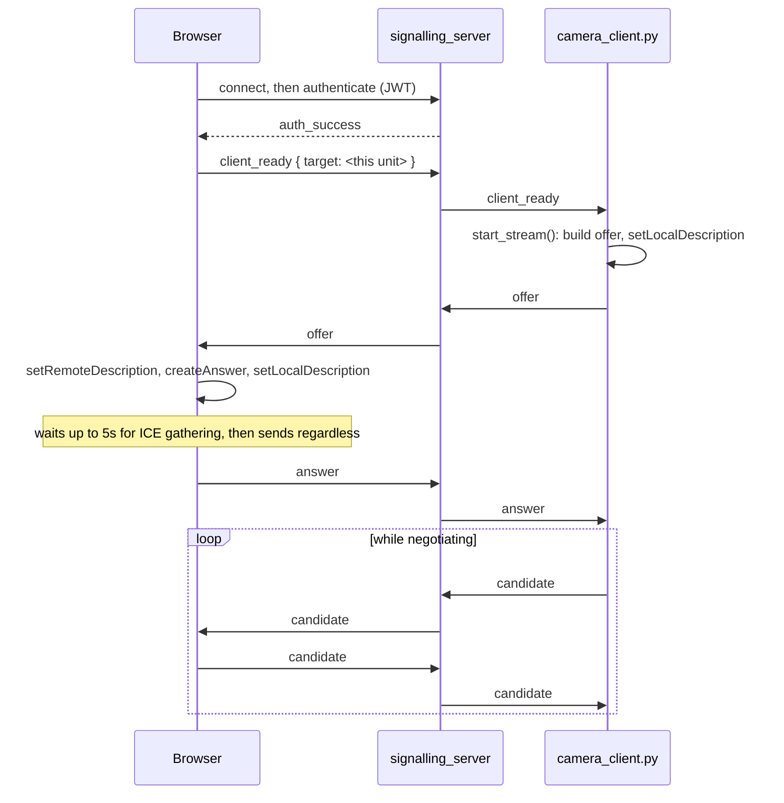
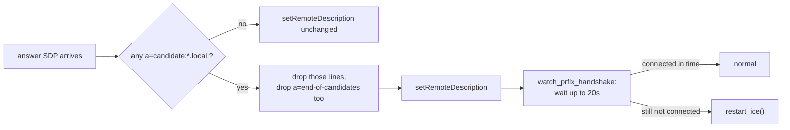

# Streaming Kamera

<RoleBadge role="developer" />

Bagaimana umpan kamera langsung didapat dari robot ke browser operator: pensinyalan WebRTC, ICE
negosiasi, dan satu perilaku Chrome yang merusaknya pada unit tanpa internet. Untuk dimana
`signalling_server` dan `coturn` berada dalam sistem yang lebih luas, lihat
[Arsitektur](/id/development/architecture#components). Untuk produksi relay TURN milik sendiri
konfigurasi, lihat [Pengaturan Server § Relai TURN](/id/setup/server-setup#_6-the-turn-relay-production-only). Halaman ini
mencakup apa yang tidak dilakukan keduanya: jabat tangan itu sendiri, dan mengapa jalur unit-lokal diperlukan
penanganan yang berbeda dari jalur cloud.

::: info Video is peer to peer; only negotiation crosses the server
`signalling_server` bertukar tawaran SDP, jawaban dan kandidat ICE antara `camera_client.py` dan
peramban. Setelah koneksi dibuat, frame video tidak pernah menyentuhnya: mereka mengalir secara langsung
antara robot dan browser, atau melalui `coturn` ketika tidak ada jalur langsung.
:::

## Satu kamera, dua koneksi rekan

`camera_client.py` bukan wadah tersendiri. Ini berjalan di dalam wadah robot, di
`camera_client` jendela tmux dimulai oleh `run_msd.sh` (lihat
[Referensi Docker § Unit: run_msd.sh](/id/setup/docker-reference#unit-run-msd-sh)). Satu fisik
kamera dibagikan oleh **dua** objek `CameraClient` independen dalam satu proses tersebut (satu di-peering
dengan cloud, seseorang mengintip dengan dasbor apa pun yang terbuka di LAN milik unit), masing-masing dengan miliknya sendiri
Koneksi WebSocket dan `RTCPeerConnection` miliknya sendiri.

| Sasaran | Memberi Sinyal WebSocket | Media/bagian belakang | STUN/PUTAR |
| --- | --- | --- | --- |
| Produksi awan | `wss://msd.nglobal.jp/services/signalling` (proxy Apache ke `:3001`) | media `:3003`, ujung belakang `:5000` | Google STUN + relai produksi `coturn` |
| Pengembang awan | `ws://<server-ip>:4001` | media `:4003`, ujung belakang `:5001` | sama seperti produksi (satu relay, shared) |
| Unit-lokal | `ws://<unit-ip>:3001` | media `:3003`, ujung belakang `:5002` | **tidak ada secara default** |

## Mengapa jalur unit-lokal tidak memiliki STUN/TURN secara default

Unit tanpa rute internet gagal `getaddrinfo` menyelesaikan `stun.l.google.com`, dan `aiortc` menaikkan
kegagalan itu langsung dari `setLocalDescription`: bukan koneksi yang rusak, koneksi mati
`start_stream()` dan tidak ada video sama sekali, meskipun kamera, server sinyal dan
dashboard semuanya sehat. Karena browser operator dan robot berbagi LAN yang sama dalam hal ini
dalam hal ini calon tuan rumah sudah dapat dijangkau; tidak ada yang perlu diselesaikan oleh relay.

`camera_client.py` dan dashboard `VideoStreamComponent` keduanya membaca konvensi yang sama untuk mereka
Daftar server ICE: tidak disetel akan kembali ke default cloud (Google STUN ditambah produksi TURN
kredensial), dan string literal `none` menghapus seluruh daftar daripada membiarkannya tidak disetel.
`LOCAL_STUN_URLS` / `LOCAL_TURN_URL` / `LOCAL_TURN_USERNAME` / `LOCAL_TURN_CREDENTIAL` di
`msd700_noetic/docker/.env` default ke `none` justru karena alasan ini, dan hanya layak untuk disetel
unit yang LAN-nya benar-benar membutuhkan relai (jaringan tersegmentasi, jembatan Wi-Fi yang terikat antar robot
dan operator).

## Jabat tangan



`signalling_server` adalah relay stateless yang dikunci oleh `target`: ia tidak pernah memeriksa konten SDP, hanya saja
merutekan pesan antara dua rekan yang disebutkan di dalamnya. Otentikasi hanya memerlukan valid,
token terverifikasi gantungan kunci yang membawa `userId` atau `username`. Klaim tersebut merupakan beban bagi robot
token secara khusus, karena itulah kesamaan yang dimiliki oleh jalur operator-token dan robot-token. SEBUAH
token robot yang hilang `userId` langsung ditolak di sini, itulah sebabnya cloud dan unit-lokal
penerbit token memasukkannya secara eksplisit (lihat [Arsitektur § Domain kepercayaan](/id/development/architecture#trust-domains)).

## Bug kandidat mDNS (14-08-2026)

Chrome modern tidak memasukkan alamat LAN asli host ke dalam kandidat ICE. Itu dicetak secara acak
`<uuid>.local` sebagai gantinya dan mengandalkan DNS multicast untuk mengatasinya, fitur privasi itu
mengasumsikan pihak penerima dapat bergabung dengan mDNS. Pada unit yang tidak memiliki rute default, unit tidak dapat:

```
OSError: [Errno 19] No such device
  at aioice/mdns.py, joining 224.0.0.251 with INADDR_ANY
  raised out of add_remote_candidate()
```

Detail kritisnya adalah ketika hal ini diangkat: bukan per kandidat, tapi dari `add_remote_candidate`
itu sendiri, yang membatalkan seluruh panggilan `setRemoteDescription`. Salah satu kandidat yang tidak dapat terselesaikan di
jawaban sudah cukup untuk menggagalkan seluruh negosiasi, meskipun jawaban browser juga membawa a
IP publik yang dapat digunakan: gejala yang terbaca persis seperti masalah DNS, yang membuatnya mudah
sama dengan kegagalan resolusi STUN yang dijelaskan di atas.

### Perbaikannya

`_strip_mdns_candidates()` menghapus baris `a=candidate:` yang alamatnya berakhiran `.local` dari
jawab sebelum menyerahkannya ke `aiortc`, dan lakukan hal yang sama untuk kandidat yang masuk
`handle_ice_candidate`. Kandidat yang paling penting dalam hal konektivitas sudah tidak ada lagi
ini hanya berfungsi karena apa yang terjadi selanjutnya:

- **`a=end-of-candidates` juga akan terkelupas, jika ada hal lain yang terkelupas.** Membiarkannya di tempatnya juga akan terkelupas
  beri tahu `aioice` "tidak ada lagi kandidat yang datang," dan agen yang tidak memiliki kandidat jarak jauh dan tidak ada apa pun
  dibiarkan menunggu menyatakan koneksi gagal sebelum pemeriksaan konektivitas browser sendiri a
  kesempatan untuk tiba.
- **Mekanisme pemulihan adalah penemuan refleksif rekan (RFC 8445 §7.2.1.3), bukan resolusi nama.**
  Robot tersebut masih mengiklankan calon tuan rumahnya sendiri. Setelah memeriksa konektivitas STUN browser
  mencapai salah satunya, `aioice` mempelajari alamat sebenarnya browser dari sumber paket itu.
  Tidak ada nama `.local` yang perlu diselesaikan. Inilah sebabnya mengapa pengupasan kandidat adalah *penghapusan yang mati
  berat*, tidak menghilangkan satu-satunya jalur menuju konektivitas.
- **Penantian terbatas menggantikan batas waktu `aioice` (yang tidak ada) milik `aioice`.** Tanpa kandidat jarak jauh dan tanpa kandidat jarak jauh
  penanda akhir kandidat, `aioice` akan menunggu tanpa batas waktu: perilaku yang benar jika refleksif rekan
  penemuan masih datang, perilaku salah jika tab browser ditutup saat jabat tangan.
  `_watch_prflx_handshake()` tidur `MDNS_PRFLX_WAIT_S` (default 20s, murah hati untuk LAN di mana
  pemeriksaan konektivitas nyata biasanya dilakukan dalam waktu kurang dari satu detik) dan memanggil `restart_ice()` jika
  koneksi masih belum `connected`/`completed` saat itu.



::: warning Stripping applies to both targets, not just unit-local
Kandidat mDNS juga tidak berguna bagi target cloud: ia menyebutkan alamat yang tidak dapat dijangkau
internet terlepas dari DNS. Perbaikan ini tidak bersyarat dan tidak terbatas pada `CameraClient`
contohnya adalah menangani jawabannya.
:::

## Hubungkan kembali dan coba lagi

Lingkaran koneksi `camera_client.py` tidak pernah berhenti secara permanen. Versi sebelumnya berhenti setelah a
anggaran upaya tetap dan membiarkan kamera mati sampai seseorang memulai ulang secara manual `run_msd.sh`. Coba lagi
penundaan adalah kemunduran eksponensial dengan jitter: basis 2 detik, dua kali lipat per upaya yang gagal, dibatasi pada 60
detik, dan diacak sehingga armada unit yang berbagi satu server sinyal cloud tidak mencoba lagi
sejalan setelah pemadaman bersama.

Kegagalan ICE tingkat transportasi (`iceConnectionState` mencapai `failed`) memicu `restart_ice()`
secara langsung: koneksi peer lama dirobohkan, koneksi baru dibangun dengan konfigurasi ICE yang sama, yaitu
trek dan saluran data dipasang kembali, dan tawaran baru dikirim dengan bendera `isRestart`. Ini terpisah
dari memulai ulang kamera fisik, yang kecepatannya dibatasi satu kali per 15 detik dan bergantian
eksklusif dengan reboot yang sedang berlangsung, karena kedua siklus daya sama `/dev/videoN` dibagikan oleh keduanya
`CameraClient` contoh.

## Deteksi terhenti di sisi browser

`RTCPeerConnection` dasbor dibuat hanya setelah `offer` tiba, tidak bersemangat di halaman
memuat. Di luar `oniceconnectionstatechange` asli (yang memicu milik browser itu sendiri
`restartIce()` di `failed`), pengawas terpisah melakukan jajak pendapat `getStats()` setiap 2 detik dan memeriksa
apakah `framesDecoded` di track video inbound masih maju. Jika belum pindah dalam 6
detik meskipun ada laporan transportasi `connected`, alirannya ditandai `stalled`. Ini dia
mode kegagalan Mesin negara ICE sendiri tidak dapat melihat: proses robot mati, atau jaringan mati
diam-diam gelap, sementara koneksi rekan itu sendiri tidak pernah menyadari ada yang salah.

Yang mana dari dua build yang menjadi tujuan pembicaraan dasbor ditentukan pada **waktu build**, bukan waktu proses:
`NEXT_PUBLIC_SIGNALLING_URL` dimasukkan ke dalam `frontend_prod` / `frontend_dev` / `frontend_local`
secara terpisah (lihat [Struktur Repositori § ROS-dashboard-next-ts](/id/development/repository-structure)).
Pembangunan unit-lokal melangkah lebih jauh dan menukar bagian *host* dari setiap `NEXT_PUBLIC_*`
URL layanan, termasuk yang ini, untuk `window.location.hostname` saat runtime, hanya menyimpan
pelabuhan waktu pembangunan. Gambar `frontend_local` yang sama kemudian bertahan dari perubahan sewa DHCP atau operator
menjangkau unit dengan nama host yang berbeda, yang tidak dapat dilakukan oleh URL waktu pembuatan murni.

## Menerapkan perubahan di sini

`camera_client.py` selalu terikat, baik pada jalur khusus cloud maupun jalur `local_dev`. Sebuah
edit pada host berlaku saat berikutnya `run_msd.sh` (ulang) memulai jendela tmux, tidak ada pembuatan gambar
terlibat. `signalling_server`, sebaliknya, adalah salah satu layanan `Dockerfile.webui-local`
**`COPY`s** ke dalam gambar tumpukan lokal milik unit; perubahan di sana memerlukan pembangunan kembali yang sama
`docker-manager.sh` sudah memeriksa kebasian pada dashboard dan gambar backend (lihat
[Referensi Docker § Apa yang `up` lakukan, secara berurutan](/id/setup/docker-reference#what-up-does-in-order)).
Melupakan ini tampak persis seperti kegagalan staleness yang didokumentasikan di sana: tumpukan muncul
dengan bersih dan menyajikan logika sinyal dari sebelum pengeditan.

## Terkait

- [Arsitektur § Komponen](/id/development/architecture#components) dan
  [§ Percayai domain](/id/development/architecture#trust-domains)
- [Pengaturan Server § Relai TURN](/id/setup/server-setup#_6-the-turn-relay-production-only)
- [Referensi Docker § Unit: run_msd.sh](/id/setup/docker-reference#unit-run-msd-sh)
- [Kontrak Pesan](/id/development/message-contracts)