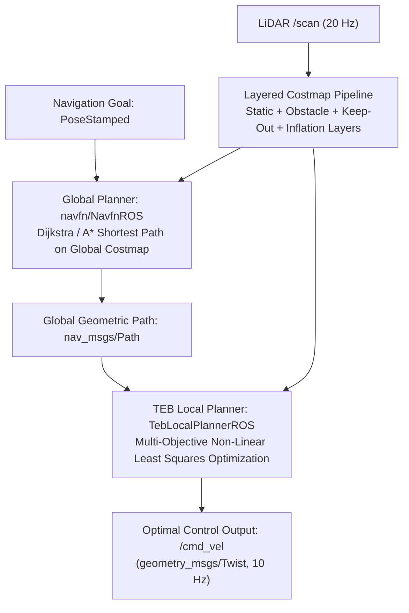

# Peta Biaya dan Perencana Gerak

<RoleBadge role="developer" />

Dokumen ini merinci arsitektur peta biaya berlapis, algoritma perencanaan jalur global (`navfn`), dan mekanisme optimasi lintasan lokal (`teb_local_planner`) yang diimplementasikan dalam tumpukan navigasi MSD700.

## Saluran Perencanaan Gerak



---

## Arsitektur Costmap Berlapis

Lingkungan direpresentasikan sebagai grid hunian 2D di mana setiap sel memiliki nilai biaya antara $0$ (ruang kosong) dan $254$ (rintangan mematikan).

### Perhitungan Biaya dan Penurunan Inflasi Eksponensial

Ketika sel hambatan diidentifikasi pada posisi $\mathbf{p}_{obs}$, biaya sel tetangga pada jarak $d = \|\mathbf{p} - \mathbf{p}_{obs}\|$ dihitung dengan lapisan inflasi:

$$\text{Biaya}(d) = \mulai{kasus}
254 & \text{if } d \le r_{\text{tertulis}} \quad (\text{Penyangga Hambatan Mematikan}) \\
\text{round}\left( 253 \cdot \exp\left(-\alpha \cdot (d - r_{\text{tertulis}})\right) \kanan) & \text{if } r_{\text{tertulis}} < d \le r_{\text{inflasi}} \\
0 & \text{if } d > r_{\text{inflasi}} \quad (\text{Ruang Kosong})
\end{kasus}$$

### Parameter Inflasi yang Dikonfigurasi:
- **Inscribed Radius ($r_{\text{inscribed}}$)**: $0,425\text{ m}$ (setengah lebar amplop pengaman).
- **Radius Inflasi ($r_{\text{inflasi}}$)**: $0,575\text{ m}$ ($r_{\text{tertulis}} + 0,150\text{ m}$margin keamanan).
- **Faktor Penskalaan Biaya ($\alpha$)**: $5,0$.

```yaml
# config/costmap/costmap_common_params.yaml
footprint: [[-0.60, -0.425], [-0.60, 0.425], [0.60, 0.425], [0.60, -0.425]]
footprint_padding: 0.01

obstacle_layer:
  enabled: true
  max_obstacle_height: 2.0
  min_obstacle_height: 0.0
  obstacle_range: 5.5
  raytrace_range: 6.0
  observation_sources: laser_scan_sensor
  laser_scan_sensor:
    sensor_frame: base_scan
    data_type: LaserScan
    topic: /scan
    marking: true
    clearing: true

inflation_layer:
  enabled: true
  inflation_radius: 0.575
  cost_scaling_factor: 5.0
```

---

## Optimasi Lintasan Pita Elastis Berwaktu (TEB).

`teb_local_planner` merumuskan pembuatan lintasan sebagai masalah pengoptimalan multi-tujuan non-linier pada serangkaian status robot $\mathbf{s}_k = [x_k, y_k, \theta_k]^T$ dan perbedaan waktu $\Delta T_k$:

$$\mathcal{B} = \kiri\{ \mathbf{s}_0, \Delta T_0, \mathbf{s}_1, \Delta T_1, \titik, \mathbf{s}_N \kanan\}$$

### Fungsi Tujuan:
Perencana meminimalkan jumlah tertimbang dari fungsi penalti objektif:

$$V(\mathcal{B}) = \sum_k \left( \gamma_{\text{time}} \cdot \Delta T_k^2 + \gamma_{\text{path}} \cdot \|\mathbf{s}_{k+1} - \mathbf{s}_k\|^2 + \gamma_{\text{obs}} \cdot f_{\text{obs}}(\mathbf{s}_k) + \gamma_{\text{kin}} \cdot f_{\text{kin}}(\mathbf{s}_k, \mathbf{s}_{k+1}) \kanan)$$

### Fungsi Penalti Utama:
1. **Penalti Optimalitas Waktu**:
   $$f_{\text{waktu}}(\Delta T_k) = \Delta T_k^2$$
   Mendorong robot untuk mencapai tujuan dalam waktu minimal dalam batas kecepatan ($v_{\max} = 0.40\text{ m/s}$, $\omega_{\max} = 1.0\text{ rad/s}$).

2. **Penalti Pembebasan Rintangan**:
   $$f_{\text{obs}}(\mathbf{s}_k) = \begin{kasus}
   \kiri( d_{\min} - \text{dist}(\mathbf{s}_k, \mathcal{O}) \kanan)^2 & \text{if } \text{dist}(\mathbf{s}_k, \mathcal{O}) < d_{\min} \\
   0 & \teks{sebaliknya}
   \end{kasus}$$
   Dimana $d_{\min} = 0.150\text{ m}$ adalah jarak bebas rintangan minimum.

3. **Kendala Non-Holonomik Kinematik**:
   Menghukum kecepatan geser lateral untuk menerapkan kinematika penggerak diferensial:
   $$\dot{y}_k \cdot \cos(\theta_k) - \dot{x}_k \cdot \sin(\theta_k) = 0$$

---

## Zona Larangan dan Konfigurasi Ulang Dinamis

1. **Keep-Out Grid Layer (`keepout_layer`)**: Berlangganan ke `/msd700/keepout_grid` di mana poligon operator khusus diraster menjadi sel berbiaya $254$, sehingga mencegah perencana global dan lokal menghasilkan lintasan di zona yang dikecualikan.
2. **Adaptasi Mode Cakupan**: Selama sapuan boustrophedon, `path_coverage_node` menurunkan bobot penggerak ke depan (`weight_kinematics_forward_drive`) dari `1000.0` ke `5.0` melalui `dynamic_reconfigure`, memungkinkan putaran pivot sisir 90 derajat yang mulus tanpa terhenti.

## Dokumentasi Terkait

- [Cakupan Boustrophedon](/id/development/boustrophedon-and-alignment): Geometri cakupan dan dekomposisi sel.
- [Penggabungan dan Kontrol Sensor](/id/development/sensor-fusion-and-control): Estimasi keadaan kinematik dan EKF.
- [Simulasi](/id/development/simulation): Lingkungan pengujian gudang.