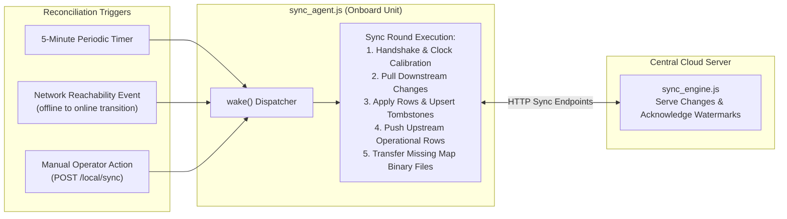
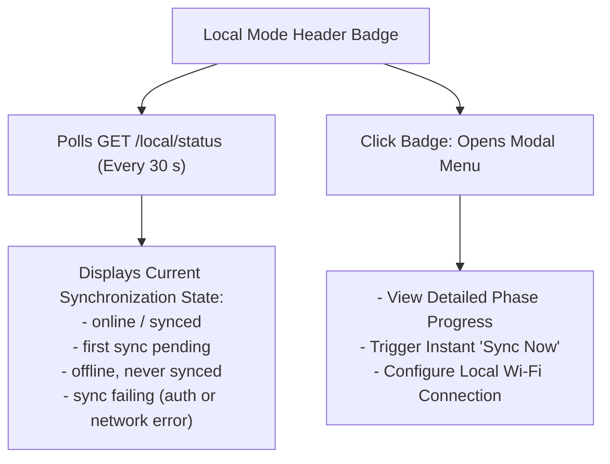

# Sinkronisasi Data

<RoleBadge role="developer" />

Dokumen ini merinci bagaimana database MySQL lokal Unit (`ROS_DB`) dan database cloud pusat menjaga konsistensi dua arah di seluruh konektivitas nirkabel intermiten.

Ini mencakup loop rekonsiliasi berulang (`sync_agent.js`, `sync_engine.js`, `sync_tables.js`), algoritme resolusi konflik, pelacakan tanda air, dan lencana status operator Mode Lokal.

Untuk kontrak sinkronisasi HTTP, lihat [Referensi API](/id/development/api-reference). Untuk unggahan penyimpanan peta secara real-time, lihat [Keadaan dan Perilaku](/id/development/state-and-behavior).

::: info Core Principle: Local as Cache
Unit berfungsi offline tanpa batas waktu setelah terdaftar. Akun pengguna, izin, dan profil persewaan berasal dari cloud, sementara peta, rute, dan daftar putar yang direkam di robot disinkronkan kembali ke cloud ketika tautan jaringan dibuat.
:::

## Rezim Sinkronisasi Tabel

Tidak semua tabel database disinkronkan ke arah yang sama:

| Arah Sinkronisasi | Tabel Terkena | Dasar Pemikiran Arsitektur |
| --- | --- | --- |
| **Hanya Hilir** (Cloud ke Unit) | `units`, `rental_profiles`, `users` (termasuk hash kata sandi bcrypt untuk login offline), `profile_members`, `profile_units`. | Batasan keamanan: identitas dan penyewaan sewa sepenuhnya berasal dari server cloud. Unit lokal tidak dapat membuat akun global baru atau menetapkan ulang penyewaan armadanya sendiri. |
| **Dua arah** (Penulisan-Terakhir-Menang per baris) | `maps_data`, `routes_data`, `areas_data`, `playlists_data`. | Data operasional ditulis di kedua sisi: peta SLAM direkam pada robot, dan rute titik jalan atau daftar putar dibuat di dasbor web. |

Aset biner (seperti jaringan hunian `.pgm`, metadata `.yaml`, dan thumbnail peta) disinkronkan melalui titik akhir khusus (`/sync/file/:mapId/:kind`) dan diverifikasi berdasarkan ukuran file yang tepat.

## Mekanisme Sinkronisasi

### Komponen Utama:
- **`sync_agent.js`**: Berjalan secara eksklusif di Unit, mengelola pengatur waktu polling, pemeriksaan keterjangkauan, dan panggilan HTTP keluar ke titik akhir cloud. (Cloud tidak menghubungi robot di belakang NAT).
- **`sync_engine.js`**: Pustaka bersama di kedua sisi yang menanyakan perubahan baris berdasarkan tanda air, mengeksekusi upsert, dan mengelola penghapusan batu nisan.
- **`sync_tables.js`**: Menentukan arah sinkronisasi, kunci utama, dan aturan resolusi konflik untuk setiap tabel.

## Aturan Penyelesaian Konflik

Penyelesaian konflik mengikuti strategi deterministik **Kemenangan Penulisan Terakhir per baris**:

1. **Perincian Tingkat Baris**: Baris yang lebih baru menggantikan seluruh data lama.
2. **Hapus Batu Nisan**: Menghapus rekaman akan menghasilkan entri di `sync_tombstones` dengan stempel waktu `deleted_at`. Penghapusan baru-baru ini menggantikan pengeditan lama.
3. **Kompensasi Kemiringan Jam**: Selama jabat tangan awal, unit menghitung `clock_offset_ms` terhadap waktu server cloud. Semua stempel waktu lokal dinormalisasi ke kerangka referensi waktu cloud sebelum dibandingkan.
4. **Pemutus Ikatan Deterministik**: Jika stempel waktu sama persis, penghapusan akan diprioritaskan dibandingkan pengeditan, dan versi cloud akan diprioritaskan dibandingkan versi unit.
5. **Penanganan Tabrakan Nama**: Jika dua operator membuat rute atau peta berbeda dengan nama yang sama saat offline, sinkronisasi selanjutnya secara otomatis menambahkan akhiran tambahan (misalnya `(1)`, `(2)`) daripada menimpa data yang sudah ada.

## Lencana Status Mode Lokal

Di dasbor lokal yang dibuat (`NEXT_PUBLIC_DEPLOYMENT_MODE=local`), header kanan atas menampilkan lencana Mode Lokal:

### Fase Sinkronisasi Terperinci:
1. `token`: Mengautentikasi dengan server cloud menggunakan kredensial robot.
2. `handshake`: Pertukaran tanda air dan kalibrasi offset jam.
3. `pull`: Mengunduh pembaruan akun dan profil hilir.
4. `apply`: Melakukan penarikan catatan ke MySQL lokal.
5. `push`: Mengunggah peta dan rute yang direkam secara lokal ke cloud.
6. `files`: Mentransfer gambar peta biner `.pgm` dan `.yaml`.
7. `finish`: Mengakui tanda air yang berkomitmen.

## Dokumentasi Terkait

- [Referensi API](/id/development/api-reference): REST menyinkronkan endpoint dan payload.
- [Status dan Perilaku](/id/development/state-and-behavior): Aliran replikasi penyimpanan dan penyimpanan peta.
- [Arsitektur](/id/development/architecture): Model perangkat keras dan domain kepercayaan cloud.
- [Skema Basis Data](/id/development/database-schema): Definisi skema untuk `sync_state` dan `sync_tombstones`.