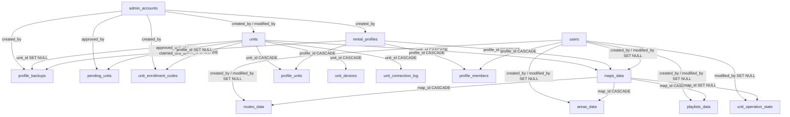

# Skema Basis Data

<RoleBadge role="developer" />

18 tabel di `ROS_DB`, dikelompokkan berdasarkan kegunaannya, dengan kunci asing di antaranya. Itu
sumber kanonik adalah `ROS-dashboard-backend/sql/init.sql`, yang hanya berjalan pada MySQL yang kosong
direktori data. Penerapan yang ada mengambil perubahan skema melalui skrip migrasi di
`ROS-dashboard-backend/scripts/` sebagai gantinya (`migrate_unit_id_refactor.js`, `migrate_enrolment.js`,
`migrate_sync.js`, `migrate_backup_scope.js`). Untuk bentuk baris yang sebenarnya dikembalikan oleh API,
lihat [Referensi API](/id/development/api-reference); halaman ini mencakup kolom dan hubungan,
bukan respons JSON.

## Identitas dan akses

| Tabel | Tujuan | Kolom kunci |
| --- | --- | --- |
| `users` | Akun operator | `id` (ULID, PK), `username`, `email`, `password` (bcrypt), `status` (`active`/`suspended`) |
| `admin_accounts` | Akun back-office, sengaja dipisahkan dari `users` | `id` (ULID, PK), `role` (`superadmin`/`admin`), `must_change_password` |
| `rental_profiles` | Satu baris per sewa. Menangguhkannya akan menyembunyikan unit dan datanya dari anggota, tanpa menyentuh | `id` (ULID, PK), `profile_name` (unik), `tenant_name`, `status` |
| `units` | Satu baris per robot fisik, di seluruh armada. `unit_name` adalah label tampilan yang dapat diganti namanya, bukan identitas | `id` (ULID, PK): ini alamat robotnya, `/unit_<id>/...` |
| `profile_members` | Akun mana yang termasuk dalam profil mana | `UNIQUE(profile_id, user_id)`, keduanya `ON DELETE CASCADE` |
| `profile_units` | Unit mana yang dapat diakses oleh profil | `UNIQUE(unit_id)`, **tidak** `(profile_id, unit_id)`, jadi sebuah unit tidak akan pernah bisa ditugaskan ganda |

::: info `users.status` is written, not yet enforced
`PATCH /admin/api/users/:id/status` menulis kolom ini, tetapi `/user/login` tidak membacanya: a
sesi operator yang ditangguhkan tetap berfungsi dan mereka masih dapat masuk kembali. Keduanya
sengaja dipisahkan sehingga konsol admin tidak akan pernah bisa mengunci penerapan langsung
robotnya sendiri; menerapkannya di batas login adalah pekerjaan yang berbeda. Ini adalah sebuah
mekanismenya berbeda dengan *profil rental yang ditangguhkan*, yang langsung menghapus unit dan unitnya
data dari pandangan setiap anggota (lihat [Referensi API § Profil rental](/id/development/api-reference#rental-profiles)).
:::

## Data operasional (per peta)

| Tabel | Tujuan | Kolom kunci |
| --- | --- | --- |
| `maps_data` | Peta yang direkam | `unit_id` → `units` (`ON DELETE CASCADE`, robot mana yang merekamnya), `profile_id` → `rental_profiles` (`ON DELETE RESTRICT`, pemilik rental mana), `UNIQUE(map_name, unit_id, profile_id)` |
| `routes_data` | Rute multi-titik yang disimpan | `map_id` → `maps_data` (`ON DELETE CASCADE`), `route_points` (JSON), `UNIQUE(route_name, map_id)` |
| `areas_data` | Area cakupan yang disimpan | `map_id` → `maps_data` (`ON DELETE CASCADE`), `area_type` (`cover`/`no_cover`), `polygon_points` (JSON), `UNIQUE(area_name, map_id)` |
| `playlists_data` | Daftar area yang diurutkan untuk disapu secara berurutan | `map_id` → `maps_data` (`ON DELETE CASCADE`), `items` (JSON, **snapshot** geometri setiap area dan bukan referensi), `UNIQUE(playlist_name, map_id)` |
| `unit_operation_state` | Mode unit saat ini, untuk pemulihan setelah restart backend | PK **adalah** `unit_id` itu sendiri, karena satu robot hanya dapat melakukan satu hal |

`maps_data` sengaja dikunci pada rental yang mencatatnya, bukan pada unitnya: satu unit
disewakan kembali kepada penyewa lain tidak menyerahkan peta milik penyewa sebelumnya, dan penyewa yang memilikinya
pihak persewaan menyimpan peta mereka meskipun mereka tidak dapat lagi mengemudikan unit yang mencatatnya. Lihat
[Referensi API § Profil rental](/id/development/api-reference#rental-profiles) untuk mengetahui cara kerjanya
pada lapisan akses.

## Pendaftaran

| Tabel | Tujuan | Kolom kunci |
| --- | --- | --- |
| `unit_devices` | Kredensial satu perangkat yang terikat pada unit | `UNIQUE(unit_id)`, `secret_hash` + `secret_prev_hash` (generasi sebelumnya tetap valid hingga pertukaran token berikutnya berhasil, jadi memutar rahasia tidak dapat membuat robot di tengah rotasi) |
| `pending_units` | Robot yang sudah menyapa tapi belum diklaim | `fingerprint` (unik), `claim_code`, `nonce_hash`, `status` (`pending`/`approved`/`claimed`/`rejected`), `contact_count` (penghitung, bukan log per kontak, karena titik akhir ini tidak diautentikasi berdasarkan desain) |
| `unit_enrollment_codes` | Voucher sekali pakai untuk mengklaim unit tertentu sebelum robotnya ada | `unit_id`, `code_hash`, `expires_at`, `used_at` |
| `unit_connection_log` | Riwayat koneksi hanya tambahkan | Satu-satunya tabel dengan `AUTO_INCREMENT` PK biasa dan bukan ULID; dibersihkan selama 180 hari terakhir |

Lihat [Kontrak Pesan § Pendaftaran](/id/development/message-contracts#enrolment) untuk pertukaran selengkapnya
tabel ini mendukung.

## Cadangkan dan sinkronkan

| Tabel | Tujuan | Kolom kunci |
| --- | --- | --- |
| `profile_backups` | Arsip manifes | `scope` (`profile` atau `unit`: arsip dengan cakupan profil mencakup satu penyewa di setiap robot yang digunakan, arsip dengan cakupan unit mencakup satu robot di setiap penyewa yang telah menggunakannya), `profile_id`/`unit_id` keduanya `ON DELETE SET NULL` (arsip harus berumur lebih lama dari yang diarsipkan) |
| `sync_tombstones` | Hapus catatan untuk sinkronisasi lintas perangkat | `UNIQUE(table_name, row_id)`, tidak ada kunci asing sama sekali, karena batu nisan harus hidup lebih lama dari barisnya, dan mungkin unitnya, ini mengacu pada |
| `sync_state` | Satu baris per rekan sinkronisasi | PK `peer` (`'cloud'` pada unit; ULID unit, di cloud), `last_pull_watermark`, `last_push_watermark`, `last_pull_profile_id`, `clock_offset_ms` |

Lihat [Sinkronisasi Data](/id/development/data-sync) untuk mengetahui bagaimana sebenarnya kedua tabel ini digunakan.

## Kunci asing, selengkapnya

::: info Attribution is never authorization
`created_by` / `modified_by` di `maps_data`, `routes_data`, `areas_data` dan `playlists_data` menyimpan
**ULID pengguna**, tidak pernah menyebutkan nama, dan hanya digunakan untuk menyebutkan siapa yang menyentuh suatu baris, tidak pernah untuk memutuskan siapa yang menyentuhnya
diizinkan untuk melihat atau mengubahnya. Keduanya aman untuk menjadi `NULL`, dan pencipta yang akunnya sudah tidak ada lagi
dirender sebagai *tidak diketahui* daripada memutus baris. Aksesnya sendiri seluruhnya melalui persewaan
profil (lihat [Referensi API § Profil rental](/id/development/api-reference#rental-profiles)).
:::

## `created_at` / `modified_at`

Konvensi stempel waktu disatukan di seluruh skema pada 01-08-2026
(`created_at TIMESTAMP NOT NULL DEFAULT CURRENT_TIMESTAMP`,
`modified_at TIMESTAMP NOT NULL DEFAULT CURRENT_TIMESTAMP ON UPDATE CURRENT_TIMESTAMP`) berlaku untuk 15
dari 18 tabel. Tiga orang menyimpang darinya dengan sengaja, bukan karena kelalaian:

| Tabel | Apa yang dimilikinya | Mengapa |
| --- | --- | --- |
| `pending_units` | `first_seen_at` / `last_seen_at` | Tabel ini melacak *kontak*, bukan catatan dengan riwayat edit |
| `unit_enrollment_codes` | `created_at` saja | Voucher tidak dapat diubah; siklus hidupnya adalah `used_at`, bukan stempel waktu pembaruan |
| `unit_connection_log` | `connected_at` saja | Log hanya tambahan, tidak pernah diperbarui setelah baris ditulis |

## Basis data per profil penerapan

Nama database selalu `ROS_DB`; yang membedakan adalah host dan port.

| Profil | Tuan rumah:pelabuhan |
| --- | --- |
| Satuan (`local_dev`) | `127.0.0.1:3306` (`network_mode: host`) |
| Awan `server_prod` | port kontainer `3306`, dipublikasikan di host sebagai `3307` |
| Awan `server_dev` | port kontainer `3306`, dipublikasikan di host sebagai `3308` |

`migrate_backup_scope.js` melakukan hardcode pada pasangan ini dan **menolak untuk dijalankan tanpa eksplisit
`--profile`** flag, khususnya agar default fallback tidak pernah dapat mengarahkan skrip pemeliharaan ke
basis data yang salah. Lihat [Referensi Docker § Layanan dan peta port](/id/setup/docker-reference#service-and-port-map)
untuk mengetahui bagaimana port ini cocok dengan profil penulisan lainnya.

## Indeks perlu diketahui alasannya

| Indeks | Alasan |
| --- | --- |
| `maps_data.unique_map_unit (map_name, unit_id, profile_id)` | Dua penyewa berbeda diperbolehkan memberi nama peta dengan hal yang sama pada robot yang sama tanpa melihat |
| `profile_units.unique_rented_unit (unit_id)` | Penugasan ganda gagal dengan keras alih-alih menimpa tugas yang sudah ada secara diam-diam |
| `unit_devices.unique_device_unit (unit_id)` | Dua robot tidak akan pernah bisa menulis akar topik yang sama |
| `unit_connection_log.idx_conn_unit_time (unit_id, connected_at)` | Mendukung kueri riwayat per unit dan pekerjaan pembersihan 180 hari dalam satu indeks |

## Terkait

- [Referensi API](/id/development/api-reference): permukaan HTTP yang dibangun berdasarkan skema ini
- [Sinkronisasi Data](/id/development/data-sync): bagaimana `sync_tombstones` dan `sync_state` terbiasa
- [Kontrak Pesan § Pendaftaran](/id/development/message-contracts#enrolment)
- [Arsitektur](/id/development/architecture)