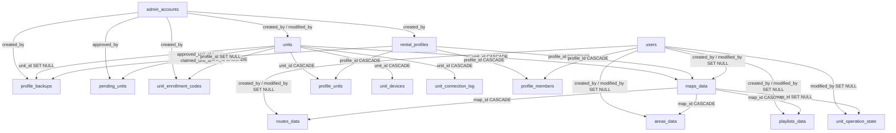

# Database Schema

<RoleBadge role="developer" />

The 18 tables in `ROS_DB`, grouped by what they're for, with the foreign keys between them. The
canonical source is `ROS-dashboard-backend/sql/init.sql`, which only runs against an empty MySQL
data directory. An existing deployment picks up schema changes through the migration scripts in
`ROS-dashboard-backend/scripts/` instead (`migrate_unit_id_refactor.js`, `migrate_enrolment.js`,
`migrate_sync.js`, `migrate_backup_scope.js`). For the shape of a row as the API actually returns it,
see [API Reference](/id/development/api-reference); this page covers columns and relationships,
not response JSON.

## Identity and access

| Table | Purpose | Key columns |
| --- | --- | --- |
| `users` | Operator accounts | `id` (ULID, PK), `username`, `email`, `password` (bcrypt), `status` (`active`/`suspended`) |
| `admin_accounts` | Back-office accounts, deliberately separate from `users` | `id` (ULID, PK), `role` (`superadmin`/`admin`), `must_change_password` |
| `rental_profiles` | One row per rental. Suspending it hides both the unit and its data from members, without touching either | `id` (ULID, PK), `profile_name` (unique), `tenant_name`, `status` |
| `units` | One row per physical robot, fleet-wide. `unit_name` is a renameable display label, not an identity | `id` (ULID, PK): this is the robot's address, `/unit_<id>/...` |
| `profile_members` | Which accounts belong to which profile | `UNIQUE(profile_id, user_id)`, both `ON DELETE CASCADE` |
| `profile_units` | Which units a profile can access | `UNIQUE(unit_id)`, **not** `(profile_id, unit_id)`, so a unit can never be double-assigned |

::: info `users.status` is written, not yet enforced
`PATCH /admin/api/users/:id/status` writes this column, but `/user/login` does not read it: a
suspended operator's existing session keeps working and they can still log back in. The two were
deliberately kept separate so standing up the admin console could never lock a live deployment out
of its own robots; enforcing it at the login boundary is a distinct piece of work. This is a
different mechanism from a *suspended rental profile*, which does immediately remove a unit and its
data from every member's view (see [API Reference § Rental profiles](/id/development/api-reference#rental-profiles)).
:::

## Operational data (per map)

| Table | Purpose | Key columns |
| --- | --- | --- |
| `maps_data` | A recorded map | `unit_id` → `units` (`ON DELETE CASCADE`, which robot recorded it), `profile_id` → `rental_profiles` (`ON DELETE RESTRICT`, which rental owns it), `UNIQUE(map_name, unit_id, profile_id)` |
| `routes_data` | A saved multi-pinpoint route | `map_id` → `maps_data` (`ON DELETE CASCADE`), `route_points` (JSON), `UNIQUE(route_name, map_id)` |
| `areas_data` | A saved coverage area | `map_id` → `maps_data` (`ON DELETE CASCADE`), `area_type` (`cover`/`no_cover`), `polygon_points` (JSON), `UNIQUE(area_name, map_id)` |
| `playlists_data` | An ordered list of areas to sweep in sequence | `map_id` → `maps_data` (`ON DELETE CASCADE`), `items` (JSON, a **snapshot** of each area's geometry rather than a reference), `UNIQUE(playlist_name, map_id)` |
| `unit_operation_state` | The unit's own current mode, for recovery after a backend restart | PK **is** `unit_id` itself, since one robot can only be doing one thing |

`maps_data` is deliberately locked to the rental that recorded it rather than to the unit: a unit
re-rented to a different tenant does not hand over any previous tenant's maps, and a tenant whose
rental ends keeps their maps even though they can no longer drive the unit that recorded them. See
[API Reference § Rental profiles](/id/development/api-reference#rental-profiles) for how that plays out
at the access layer.

## Enrolment

| Table | Purpose | Key columns |
| --- | --- | --- |
| `unit_devices` | The one device credential bound to a unit | `UNIQUE(unit_id)`, `secret_hash` + `secret_prev_hash` (the previous generation stays valid until the next successful token exchange, so rotating the secret can't brick a robot mid-rotation) |
| `pending_units` | Robots that have said hello but are not yet claimed | `fingerprint` (unique), `claim_code`, `nonce_hash`, `status` (`pending`/`approved`/`claimed`/`rejected`), `contact_count` (a counter rather than a per-contact log, since this endpoint is unauthenticated by design) |
| `unit_enrollment_codes` | Single-use vouchers to claim a specific unit before its robot exists | `unit_id`, `code_hash`, `expires_at`, `used_at` |
| `unit_connection_log` | Append-only connection history | The only table with a plain `AUTO_INCREMENT` PK rather than a ULID; purged past 180 days |

See [Message Contracts § Enrolment](/id/development/message-contracts#enrolment) for the full exchange
these tables support.

## Backup and sync

| Table | Purpose | Key columns |
| --- | --- | --- |
| `profile_backups` | Archive manifests | `scope` (`profile` or `unit`: a profile-scoped archive covers one tenant across every robot it has used, a unit-scoped archive covers one robot across every tenant that has used it), `profile_id`/`unit_id` both `ON DELETE SET NULL` (an archive must outlive what it archived) |
| `sync_tombstones` | Delete records for cross-device sync | `UNIQUE(table_name, row_id)`, no foreign keys at all, since a tombstone has to outlive the row, and possibly the unit, it refers to |
| `sync_state` | One row per sync peer | PK `peer` (`'cloud'` on a unit; the unit's ULID, on the cloud), `last_pull_watermark`, `last_push_watermark`, `last_pull_profile_id`, `clock_offset_ms` |

See [Data Sync](/id/development/data-sync) for how these two tables are actually used.

## Foreign keys, in full

::: info Attribution is never authorization
`created_by` / `modified_by` on `maps_data`, `routes_data`, `areas_data` and `playlists_data` store a
**user ULID**, never a name, and are used only to say who touched a row, never to decide who is
allowed to see or change it. Both are safe to be `NULL`, and a creator whose account no longer exists
renders as *unknown* rather than breaking the row. Access itself runs entirely through rental
profiles (see [API Reference § Rental profiles](/id/development/api-reference#rental-profiles)).
:::

## `created_at` / `modified_at`

The timestamp convention unified across the schema on 2026-08-01
(`created_at TIMESTAMP NOT NULL DEFAULT CURRENT_TIMESTAMP`,
`modified_at TIMESTAMP NOT NULL DEFAULT CURRENT_TIMESTAMP ON UPDATE CURRENT_TIMESTAMP`) applies to 15
of the 18 tables. Three depart from it on purpose, not by omission:

| Table | What it has instead | Why |
| --- | --- | --- |
| `pending_units` | `first_seen_at` / `last_seen_at` | This table tracks *contact*, not a record with an edit history |
| `unit_enrollment_codes` | `created_at` only | A voucher is immutable; its lifecycle is `used_at`, not an update timestamp |
| `unit_connection_log` | `connected_at` only | Append-only log, never updated after the row is written |

## Database per deployment profile

The database name is always `ROS_DB`; what differs is host and port.

| Profile | Host:port |
| --- | --- |
| Unit (`local_dev`) | `127.0.0.1:3306` (`network_mode: host`) |
| Cloud `server_prod` | container port `3306`, published on the host as `3307` |
| Cloud `server_dev` | container port `3306`, published on the host as `3308` |

`migrate_backup_scope.js` hardcodes this pairing and **refuses to run without an explicit
`--profile`** flag, specifically so a fallback default can never point a maintenance script at the
wrong database. See [Docker Reference § Service and port map](/id/setup/docker-reference#service-and-port-map)
for how these ports fit into the rest of the compose profile.

## Indexes worth knowing the reason for

| Index | Reason |
| --- | --- |
| `maps_data.unique_map_unit (map_name, unit_id, profile_id)` | Two different tenants are allowed to name a map the same thing on the same robot without either seeing the other's |
| `profile_units.unique_rented_unit (unit_id)` | A double-assignment fails loudly instead of silently overwriting the existing one |
| `unit_devices.unique_device_unit (unit_id)` | Two robots can never end up writing to the same topic root |
| `unit_connection_log.idx_conn_unit_time (unit_id, connected_at)` | Supports both a per-unit history query and the 180-day purge job in one index |

## Related

- [API Reference](/id/development/api-reference): the HTTP surface built on this schema
- [Data Sync](/id/development/data-sync): how `sync_tombstones` and `sync_state` get used
- [Message Contracts § Enrolment](/id/development/message-contracts#enrolment)
- [Architecture](/id/development/architecture)
