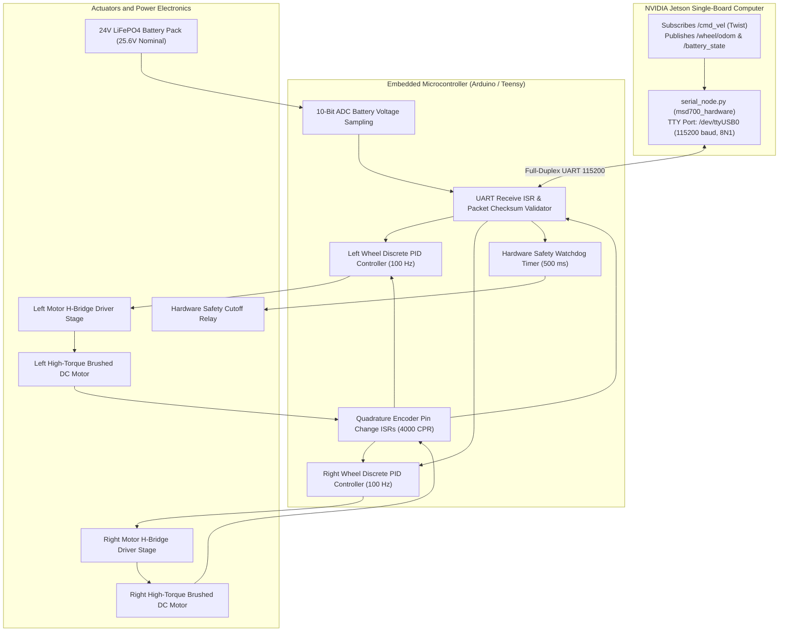

# Firmware, Mikrokontroler, dan Bus Perangkat Keras

<RoleBadge role="developer" />

Dokumen ini memberikan spesifikasi teknis mendalam tentang firmware mikrokontroler tertanam, antarmuka driver motor, decoding encoder optik, algoritma kontrol kecepatan PID diskrit, dan sirkuit telemetri analog yang diterapkan pada robot MSD700.

## Topologi Kontrol Tertanam

---

## Pinout dan Pengkabelan Listrik Perangkat Keras

Komunikasi antara NVIDIA Jetson dan mikrokontroler berjalan melalui USB UART berkecepatan tinggi dengan isolasi optik:

| Fungsi Sinyal | Pin Mikrokontroler | Koneksi Driver / Periferal | Karakteristik Listrik |
| --- | --- | --- | --- |
| **PWM Motor Kiri** | Pin 5 (Pengatur Waktu 3) | Gerbang Kecepatan H-Bridge Kiri | Logika 0 hingga 5V, PWM 20 kHz (Drive Tak Terdengar Senyap) |
| **DIR Motor Kiri** | Sematkan 4 | Masukan Arah H-Jembatan Kiri | Logika Tinggi : Maju, Logika Rendah : Mundur |
| **PWM Motor Kanan** | Pin 6 (Pengatur Waktu 4) | Gerbang Kecepatan H-Bridge Kanan | Logika 0 hingga 5V, PWM 20 kHz |
| **DIR Motor Kanan** | Sematkan 7 | Input Arah H-Jembatan Kanan | Logika Tinggi : Maju, Logika Rendah : Mundur |
| **Encoder Kiri A** | Pin 2 (INT0) | Saluran Encoder Optik Kiri A | Interupsi TTL 5V (Tepi Naik/Turun) |
| **Encoder Kiri B** | Pin 3 (INT1) | Saluran Encoder Optik Kiri B | Interupsi TTL 5V |
| **Encoder Kanan A** | Pin 18 (INT5) | Saluran Encoder Optik Kanan A | Interupsi TTL 5V |
| **Encoder Kanan B** | Pin 19 (INT4) | Saluran Encoder Optik Kanan B | Interupsi TTL 5V |
| **ADC Tegangan Baterai**| Pin A0 (ADC0) | Output Pembagi Resistor Presisi | Tegangan Analog 0 hingga 5.0V |
| **Jalur Keamanan E-Stop** | Sematkan 12 | Driver Gerbang Relai Perangkat Keras | Logika Tinggi: Motor Diaktifkan, Rendah: Cutoff |

---

## Kontrol Kecepatan PID Diskrit Loop Tertutup

Firmware menjalankan loop kontrol PID diskrit ganda pada $100\text{ Hz}$ ($\Delta t = 0.01\text{ s}$) dengan penjepitan anti-windup untuk mengontrol kecepatan roda:

### Formulasi Kesalahan Diskrit:
$$e_k = v_{\text{target}} - v_{\text{diukur}}$$

### Output Kontrol PID dengan Penjepit:
$$\text{PWM}_k = K_p \cdot e_k + K_i \sum_{j=0}^k e_j \cdot \Delta t + K_d \cdot \frac{e_k - e_{k-1}}{\Delta t}$$

### Perlindungan Integrator Anti-Windup:
Untuk mencegah kerusakan integrator ketika motor dibebani sementara atau terhenti pada bidang miring:

$$\jumlah e_j \cdot \Delta t = \text{clamp}\left( \sum e_j \cdot \Delta t, -I_{\max}, I_{\max} \kanan)$$

$$\text{PWM}_k = \text{penjepit}(\text{PWM}_k, -\text{PWM}_{\max}, \text{PWM}_{\max})$$

Dimana $\text{PWM}_{\max} = 255$ ($8$-bit resolusi timer).

---

## Sirkuit Penginderaan Tegangan Baterai

Robot ini ditenagai oleh baterai LiFePO4 24V (pengisian penuh: $29,2\text{ V}$, nominal: $25,6\text{ V}$, batas: $21,0\text{ V}$).

Pembagi tegangan terpasang menurunkan tegangan baterai ke kisaran $0\text{ hingga }5\text{ V}$ dari mikrokontroler ADC:

$$V_{adc} = V_{kelelawar} \cdot \frac{R_2}{R_1 + R_2}$$

Dimana $R_1 = 30\text{ k}\Omega$ dan $R_2 = 5,1\text{ k}\Omega$ (Rasio Pembagi $K_{div} = 0,1453$).

### Rekonstruksi Tegangan di Firmware:
$$V_{bat} = \frac{\text{ADC\_RAW}}{1024} \cdot V_{ref} \cdot \kiri( \frac{R_1 + R_2}{R_2} \kanan)$$

Dimana $V_{ref} = 5,00\teks{ V}$.

---

## Pengawas Keamanan Perangkat Keras

Untuk mencegah kondisi robot yang kabur karena OS host terkunci atau kabel serial putus, mikrokontroler menjalankan pengawas perangkat keras otonom:

1. **Timer Expiry**: Register timer pengawas direset ke $500\text{ ms}$ pada setiap paket kecepatan valid yang diverifikasi checksum.
2. **Safety Cutoff**: Jika tidak ada paket yang tiba sebesar $500\text{ ms}$, mikrokontroler segera menjepit output PWM motor ke nol dan memutus jalur gerbang `ESTOP_RELAY`.

## Dokumentasi Terkait

- [Penggabungan dan Kontrol Sensor](/id/development/sensor-fusion-and-control): Integrasi odometri dan EKF.
- [Peta Biaya dan Perencana](/id/development/costmaps-and-planners): Parameter batas kecepatan.
- [Status dan Perilaku](/id/development/state-and-behavior): Mesin status berhenti darurat.