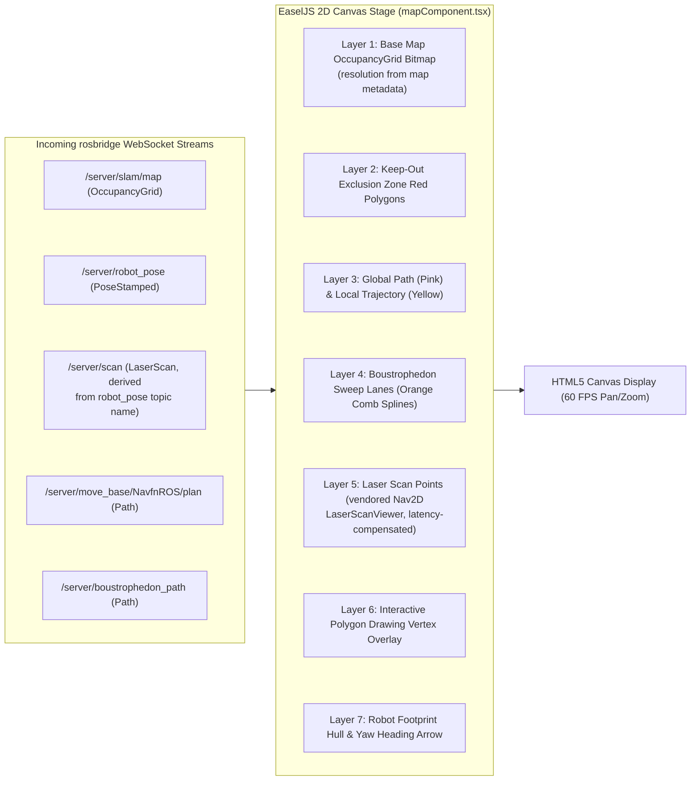

# Frontend Canvas & Pipeline Visualisasi React

<RoleBadge role="developer" />

Dokumen ini merinci pipeline rendering 2D, konversi ruang koordinat, arsitektur penumpukan layer, dan integrasi lifecycle React yang diimplementasikan di `ROS-dashboard-next-ts` menggunakan HTML5 Canvas, EaselJS, dan `ROS2D.js`.

## Arsitektur Pipeline Rendering Canvas

Semua topic berakar per-unit: `` `${root}/server/…` `` dengan `root = /unit_<ULID>`. Nama `/server/…` polos di bawah adalah singkatan.



---

## Transformasi Koordinat: Ruang Metrik ke Piksel Layar

Frame koordinat ROS bersifat metrik (meter, dengan $(0, 0)$ pada origin peta), sedangkan HTML5 Canvas menggunakan koordinat piksel dengan origin di kiri atas $(p_x, p_y)$.

Diberikan resolusi peta $r$ (meter per piksel), tinggi gambar $H$ (piksel), dan origin peta $\mathbf{o} = [x_0, y_0]^T$:

### 1. Konversi Metrik ke Piksel Canvas:
$$p_x = \frac{x - x_0}{r}$$

$$p_y = H - \frac{y - y_0}{r}$$

*(Sumbu $y$ dibalik karena ROS $Y$ bertambah ke atas sedangkan Canvas $Y$ bertambah ke bawah).*

### 2. Konversi Piksel Canvas ke Metrik (Untuk Pengiriman Goal):
$$x = x_0 + (p_x \cdot r)$$

$$y = y_0 + ((H - p_y) \cdot r)$$

---

## Patch `createjs.Stage.prototype` (`mapComponent.tsx`)

EaselJS mengevaluasi ulang `createjs.Stage` menjadi konstruktor yang benar-benar baru yang prototypenya tidak lagi memiliki helper koordinat `ROS2D`. Viewer yang dibangun sesudahnya kemudian melempar `stage.globalToRos is not a function`. Perbaikannya adalah `ensureStagePrototype()` di `mapComponent.tsx`, diterapkan ulang secara idempoten pada prototype saat ini tepat sebelum setiap pembuatan viewer (matematikanya mencerminkan `public/script/ros2d.js` secara persis, sehingga perilaku tidak berubah pada jalur normal). Perhatikan `rosScriptLoader.ts` hanyalah sequential script loader: patch tidak berada di sana:

```typescript
// src/components/navigationMap/mapComponent.tsx
const ensureStagePrototype = (): boolean => {
  if (typeof window === 'undefined') return false;
  const cjs = (window as any).createjs;
  const ROSLIB = (window as any).ROSLIB;
  const proto = cjs?.Stage?.prototype;
  if (!proto || !ROSLIB?.Vector3) return false;

  if (typeof proto.globalToRos !== 'function') {
    proto.globalToRos = function (this: any, x: number, y: number) {
      return new ROSLIB.Vector3({
        x: (x - this.x) / this.scaleX,
        y: (this.y - y) / this.scaleY,
      });
    };
  }
  if (typeof proto.rosToGlobal !== 'function') {
    proto.rosToGlobal = function (this: any, pos: any) {
      return {
        x: pos.x * this.scaleX + this.x,
        y: this.y - pos.y * this.scaleY,
      };
    };
  }
  if (typeof proto.rosQuaternionToGlobalTheta !== 'function') {
    proto.rosQuaternionToGlobalTheta = function (this: any, orientation: any) {
      // quaternion -> canvas heading degrees
    };
  }
  return typeof proto.globalToRos === 'function';
};
```

---

## Engine Penggambaran Poligon Interaktif

Ketika seorang operator mendefinisikan poligon sweep coverage area atau zona keep-out (`customAreaDraw.ts`):
1. **Penempatan Vertex**: Mengklik canvas mencatat koordinat metrik $(x_i, y_i)$.
2. **Rubberbanding Dinamis**: Saat mouse bergerak, sebuah garis edge sementara yang dinamis dirender ke posisi kursor.
3. **Snapping Penutupan**: Jika klik mendarat dalam `CLOSE_TOLERANCE_M` ($0.5\text{ m}$ secara default, dapat di-override via `NEXT_PUBLIC_CUSTOM_AREA_CLOSE_TOLERANCE`) dari vertex pertama (jarak metrik, bukan piksel) loop menutup. Poligon keep-out dirender sebagai overlay dan dikirim sebagai payload `areas`/`exclusions`; poligon coverage menuju `/msd700/coverage_polygon`. (`/msd700/keepout_grid` sendiri hanyalah inisialisasi grid kosong di sisi robot.)

## Dokumentasi Terkait

- [Protokol rosbridge](/id/development/rosbridge-protocol): Operasi JSON WebSocket dan topik streaming.
- [Coverage Boustrophedon](/id/development/ros/boustrophedon-and-alignment): Kalkulasi sweep dual-geometri.
- [Referensi API](/id/development/api-reference): Endpoint REST peta dan rute.
