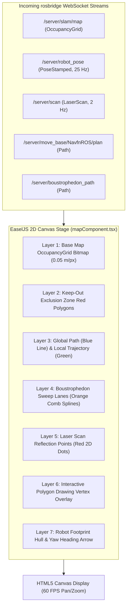

# Kanvas Frontend & Saluran Visualisasi React

<RoleBadge role="developer" />

Dokumen ini merinci pipeline rendering 2D, konversi ruang koordinat, arsitektur penumpukan lapisan, dan integrasi siklus hidup React yang diterapkan di `ROS-dashboard-next-ts` menggunakan HTML5 Canvas, EaselJS, dan `ROS2D.js`.

## Arsitektur Pipa Rendering Kanvas



---

## Transformasi Koordinat: Ruang Metrik ke Piksel Layar

Bingkai koordinat ROS adalah metrik (meter, dengan $(0, 0)$ di asal peta), sedangkan HTML5 Canvas menggunakan koordinat piksel asal kiri atas $(p_x, p_y)$.

Mengingat resolusi peta $r$ (meter per piksel), tinggi gambar $H$ (piksel), dan asal peta $\mathbf{o} = [x_0, y_0]^T$:

### 1. Konversi Metrik ke Piksel Kanvas:
$$p_x = \frac{x - x_0}{r}$$

$$p_y = H - \frac{y - y_0}{r}$$

*(Sumbu $y$ terbalik karena ROS $Y$ naik ke atas sedangkan Canvas $Y$ naik ke bawah).*

### 2. Konversi Piksel Kanvas ke Metrik (Untuk Pengiriman Sasaran):
$$x = x_0 + (p_x \cdot r)$$

$$y = y_0 + ((H - p_y) \cdot r)$$

---

## Patch `createjs.Stage.prototype` (`rosScriptLoader.ts`)

Dalam kerangka React SPA modern (seperti Next.js 14+), komponen dipasang dan dilepas dengan cepat selama transisi halaman. Standar `ROS2D.js` mengikat fungsi konversi koordinat ke tahapan instance pada pembuatan, yang dapat hilang saat React DOM dirender ulang, sehingga menyebabkan kesalahan `TypeError: this.stage.globalToRos is not a function` yang fatal.

Untuk menjamin ketahanan visualisasi tanpa kerusakan, `rosScriptLoader.ts` melakukan patch secara dinamis pada `createjs.Stage.prototype` sebelum pembuatan instance kanvas:

```typescript
// scripts/rosScriptLoader.ts
export function patchEaselJSStage(): void {
  if (typeof window === "undefined" || !(window as any).createjs) return;

  const StageProto = (window as any).createjs.Stage.prototype;

  if (!StageProto.globalToRos) {
    StageProto.globalToRos = function (x: number, y: number) {
      const rosX = (x - this.x) / (this.scaleX * this.ros2dViewer.scaleToDimensions);
      const rosY = -(y - this.y) / (this.scaleY * this.ros2dViewer.scaleToDimensions);
      return { x: rosX, y: rosY };
    };
  }

  if (!StageProto.rosToGlobal) {
    StageProto.rosToGlobal = function (rosX: number, rosY: number) {
      const x = rosX * this.scaleX * this.ros2dViewer.scaleToDimensions + this.x;
      const y = -rosY * this.scaleY * this.ros2dViewer.scaleToDimensions + this.y;
      return { x, y };
    };
  }
}
```

---

## Mesin Gambar Poligon Interaktif

Saat operator menentukan poligon sapuan cakupan area atau zona larangan masuk:
1. **Penempatan Vertex**: Mengklik koordinat metrik catatan kanvas $(x_i, y_i)$.
2. **Pengikat Karet Dinamis**: Saat mouse bergerak, garis tepi sementara yang dinamis ditampilkan ke posisi kursor.
3. **Closing Snapping**: Jika kursor masuk ke dalam $15\text{ piksel}$ dari titik awal, poligon akan menutup dan melakukan rasterisasi ke dalam `/msd700/keepout_grid` atau batas cakupan.

## Dokumentasi Terkait

- [rosbridge Protocol](/id/development/rosbridge-protocol): Operasi WebSocket JSON dan topik streaming.
- [Cakupan Boustrophedon](/id/development/boustrophedon-and-alignment): Perhitungan sapuan geometri ganda.
- [Referensi API](/id/development/api-reference): Peta dan rute titik akhir REST.