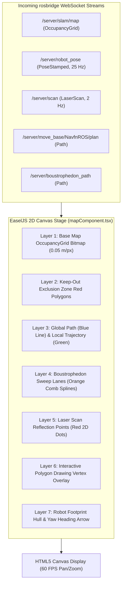

# Frontend Canvas & Pipeline Visualisasi React

<RoleBadge role="developer" />

Dokumen ini merinci pipeline rendering 2D, konversi ruang koordinat, arsitektur penumpukan layer, dan integrasi lifecycle React yang diimplementasikan di `ROS-dashboard-next-ts` menggunakan HTML5 Canvas, EaselJS, dan `ROS2D.js`.

## Arsitektur Pipeline Rendering Canvas



---

## Transformasi Koordinat: Ruang Metrik ke Piksel Layar

Frame koordinat ROS bersifat metrik (meter, dengan $(0, 0)$ pada origin peta), sedangkan HTML5 Canvas menggunakan koordinat piksel dengan origin di kiri atas $(p_x, p_y)$.

Diberikan resolusi peta $r$ (meter per piksel), tinggi gambar $H$ (piksel), dan origin peta $\mathbf{o} = [x_0, y_0]^T$:

### 1. Konversi Metrik ke Piksel Canvas:
$$p_x = \frac{x - x_0}{r}$$

$$p_y = H - \frac{y - y_0}{r}$$

*(Sumbu $y$ dibalik karena ROS $Y$ bertambah ke atas sedangkan Canvas $Y$ bertambah ke bawah).*

### 2. Konversi Piksel Canvas ke Metrik (Untuk Pengiriman Goal):
$$x = x_0 + (p_x \cdot r)$$

$$y = y_0 + ((H - p_y) \cdot r)$$

---

## Patch `createjs.Stage.prototype` (`rosScriptLoader.ts`)

Pada framework SPA React modern (seperti Next.js 14+), komponen di-mount dan di-unmount dengan cepat selama transisi halaman. `ROS2D.js` standar mengikat fungsi konversi koordinat ke instance stage saat pembuatan, yang dapat hilang saat React DOM di-render ulang, menyebabkan error fatal `TypeError: this.stage.globalToRos is not a function`.

Untuk menjamin resiliensi visualisasi tanpa crash, `rosScriptLoader.ts` secara dinamis mem-patch `createjs.Stage.prototype` sebelum instantiasi canvas:

```typescript
// scripts/rosScriptLoader.ts
export function patchEaselJSStage(): void {
  if (typeof window === "undefined" || !(window as any).createjs) return;

  const StageProto = (window as any).createjs.Stage.prototype;

  if (!StageProto.globalToRos) {
    StageProto.globalToRos = function (x: number, y: number) {
      const rosX = (x - this.x) / (this.scaleX * this.ros2dViewer.scaleToDimensions);
      const rosY = -(y - this.y) / (this.scaleY * this.ros2dViewer.scaleToDimensions);
      return { x: rosX, y: rosY };
    };
  }

  if (!StageProto.rosToGlobal) {
    StageProto.rosToGlobal = function (rosX: number, rosY: number) {
      const x = rosX * this.scaleX * this.ros2dViewer.scaleToDimensions + this.x;
      const y = -rosY * this.scaleY * this.ros2dViewer.scaleToDimensions + this.y;
      return { x, y };
    };
  }
}
```

---

## Engine Penggambaran Poligon Interaktif

Ketika seorang operator mendefinisikan poligon sweep coverage area atau zona keep-out:
1. **Penempatan Vertex**: Mengklik canvas mencatat koordinat metrik $(x_i, y_i)$.
2. **Rubberbanding Dinamis**: Saat mouse bergerak, sebuah garis edge sementara yang dinamis dirender ke posisi kursor.
3. **Snapping Penutupan**: Jika kursor memasuki jarak $15\text{ piksel}$ dari vertex awal, poligon snap tertutup dan dirasterisasi ke dalam `/msd700/keepout_grid` atau batas coverage.

## Dokumentasi Terkait

- [Protokol rosbridge](/id/development/rosbridge-protocol): Operasi JSON WebSocket dan topik streaming.
- [Coverage Boustrophedon](/id/development/ros/boustrophedon-and-alignment): Kalkulasi sweep dual-geometri.
- [Referensi API](/id/development/api-reference): Endpoint REST peta dan rute.
