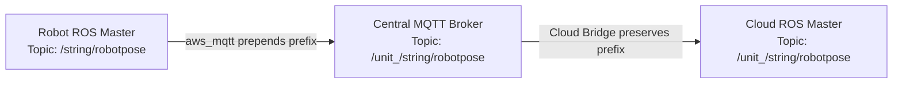
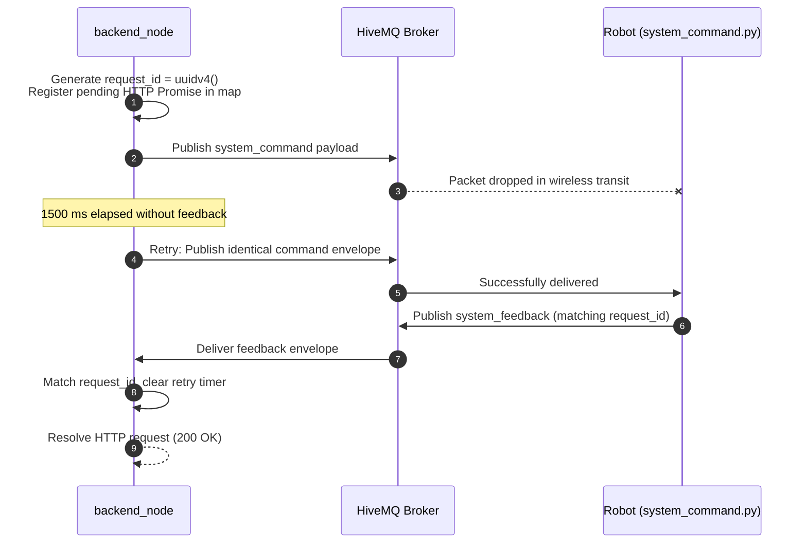
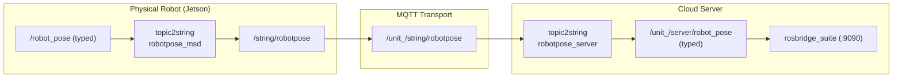
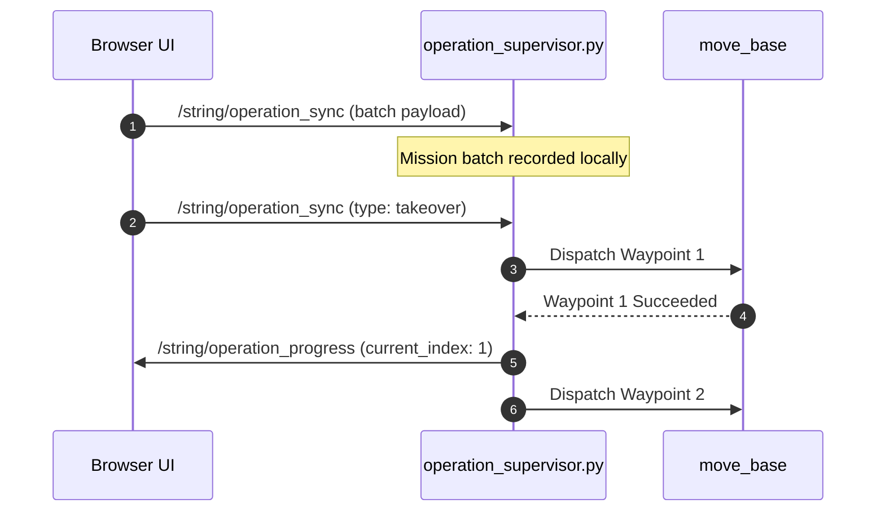
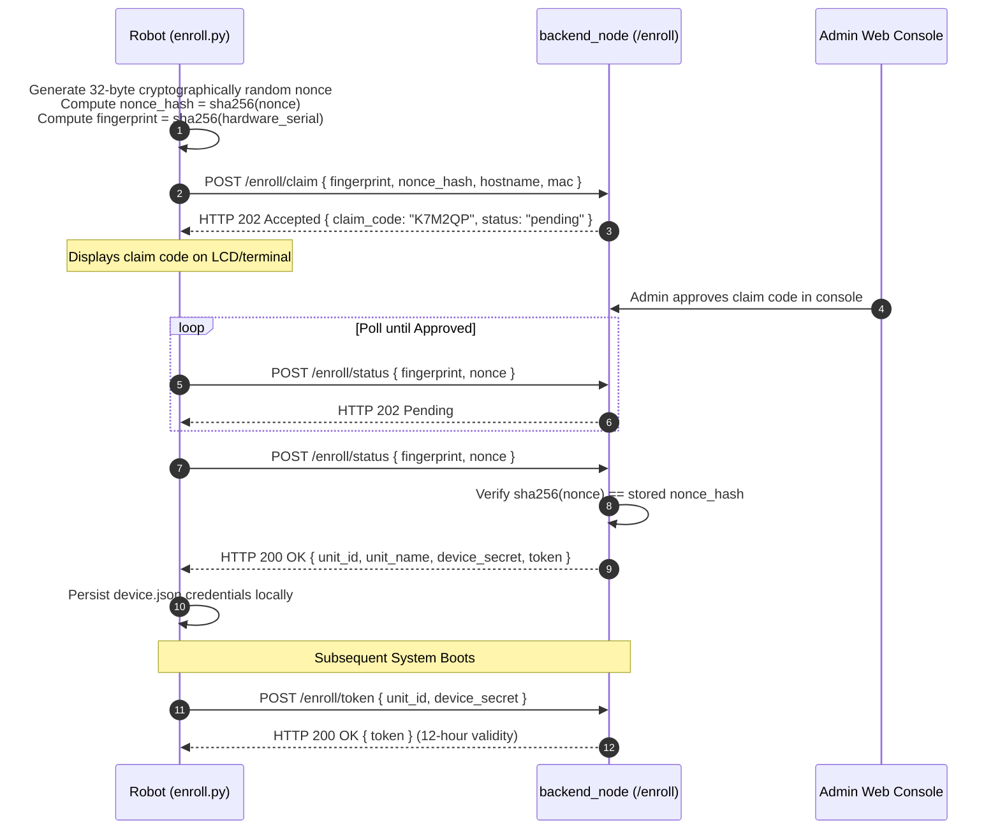

# Kontrak Pesan

<RoleBadge role="developer" />

Dokumen ini memberikan spesifikasi lengkap dan resmi untuk semua muatan data mesin-ke-mesin dalam sistem MSD700. Ini mencakup saluran perintah dan umpan balik MQTT, topik streaming ROS berseri, protokol sinkronisasi pengawas operasi, pensinyalan WebRTC, dan pertukaran pendaftaran perangkat keras.

Untuk permukaan HTTP, lihat [Referensi API](/id/development/api-reference). Untuk mesin negara terbatas, lihat [Status dan Perilaku](/id/development/state-and-behavior). Untuk desain sistem secara keseluruhan, lihat [Arsitektur](/id/development/architecture).

::: info Contract Verification Notice
Bentuk muatan diturunkan langsung dari kode sumber aktif (`backend_node`, `system_command.py`, `operation_supervisor.py`, `topic2string`, `enroll_api.js`). Setiap perubahan bidang dalam basis kode harus diperbarui di sini dalam penerapan yang sama.
:::

## Skema Pengalamatan Armada

Setiap robot fisik dialamatkan dengan awalan unik: `/unit_<ULID>/...`. ULID (Universally Unique Lexicographically Sortable Identifier) ​​adalah kunci utama yang ditetapkan ke robot di tabel database pusat `units` pada saat registrasi.



| Lokasi Lompatan | Format Topik | Tujuan Rekayasa |
| --- | --- | --- |
| **Robot Master ROS Lokal** | `/string/robotpose` | Namespace lokal tanpa cakupan (satu robot per roscore onboard). |
| **Broker MQTT Pusat** | `/unit_<ULID>/string/robotpose` | Namespace topik cakupan armada yang menggandakan semua robot melalui HiveMQ. |
| **Master Cloud ROS** | `/unit_<ULID>/string/robotpose` | Topik dengan namespace digunakan oleh relay cloud per unit dan rosbridge. |

::: warning Mandatory `unit_` Prefix Rule
Nama resource grafik ROS harus diawali dengan karakter alfabet, tanda gelombang, atau garis miring. Karena ULID dimulai dengan angka (misalnya `01JZ...`), `/01JZ.../string/map` sintaksnya tidak valid dan ditolak oleh ROS. Awalan `unit_` memastikan kepatuhan ROS yang ketat sambil mempertahankan pemetaan 1:1 dengan topik MQTT.
:::

## Saluran Perintah dan Kontrol

Dua topik MQTT khusus menangani semua permintaan dua arah dan interaksi respons antara server cloud dan unit fisik:

| Topik MQTT | Arah | Node Produser | Node Konsumen | Deskripsi |
| --- | --- | --- | --- | --- |
| `/unit_<ULID>/system_command` | Awan ke Robot | `backend_node` (Ekspres) | `system_command.py` (ROS) | Mengirimkan perintah kontrol, tujuan navigasi, dan perubahan mode. |
| `/unit_<ULID>/system_feedback` | Robot ke Awan | `system_command.py` (ROS) | `backend_node` (Ekspres) | Mengembalikan status eksekusi, pesan kesalahan, dan ping telemetri. |

### Amplop Muatan Perintah

```json
{
  "header": "navigation",
  "command": "pointstamped",
  "config": {
    "resource": {
      "X": 3.1416,
      "Y": -1.2,
      "Z": 0.0
    }
  },
  "metadata": {
    "timestamp": "2026-08-12T04:11:52.913Z",
    "request_id": "0b0d1f4e-6a2c-4c7e-9a51-1f1b6f7a2f10"
  }
}
```

| Nama Bidang | Ketik | Wajib | Deskripsi |
| --- | --- | --- | --- |
| `header` | tali | Ya | Penangan subsistem target: `hardware`, `navigation`, `mapping`, `boustrophedon`, `manual`, `autopilot`, `emergency_stop`, `autoalign`. |
| `command` | tali | Ya | Kata kerja tindakan spesifik dalam pawang. Kata kerja yang tidak dikenal akan dicatat dan dihilangkan. |
| `config` | objek | Bersyarat | Parameter perintah (biasanya di dalam `config.resource`). |
| `data` | objek | Bersyarat | Blok parameter alternatif yang digunakan oleh `hardware.ping`. |
| `metadata.request_id` | UUID v4 | Ya | Token korelasi unik dihasilkan per permintaan HTTP oleh `backend_node`. |
| `metadata.timestamp` | ISO 8601 | Ya | String stempel waktu pengirim untuk pelacakan diagnostik. |

### Amplop Muatan Umpan Balik

```json
{
  "header": "navigation",
  "command": "pointstamped",
  "data": {
    "status": true,
    "message": "Goal published to move_base"
  },
  "metadata": {
    "timestamp": 1786503112.913,
    "request_id": "0b0d1f4e-6a2c-4c7e-9a51-1f1b6f7a2f10"
  }
}
```

| Nama Bidang | Ketik | Deskripsi |
| --- | --- | --- |
| `data.status` | boolean | `true` menunjukkan perintah diterima/dieksekusi; `false` menunjukkan penolakan eksekusi. |
| `data.message` | tali | Deskripsi diagnostik yang dapat dibaca manusia dari robot. |
| `metadata.timestamp` | mengapung | Jam dinding detik-detik (`rospy.get_time()`) dari robot. |
| `metadata.request_id` | UUID v4 | Cocok dengan `request_id` asli dari amplop perintah. |

### Korelasi Perintah dan Coba Ulang Arsitektur



| Parameter | Nilai Bawaan | Lokasi Konfigurasi | Tujuan |
| --- | --- | --- | --- |
| `DEFAULT_TIMEOUT` | `30000` ms (30 detik) | `backend_node` | Durasi maksimum permintaan HTTP menunggu umpan balik sebelum merespons dengan `504 Gateway Timeout`. |
| `COMMAND_RETRY_INTERVAL` | `1500` ms (1,5 detik) | `backend_node` | Kirim ulang periode sementara perintah yang bermutasi tetap tidak diakui. |

::: danger Ping Heartbeat Exclusion
`header: "hardware", command: "ping"` ditransmisikan secara ketat **sekali** per interval dan tidak pernah dicoba ulang. Hilangnya detak jantung adalah pemicu utama pengawas keselamatan robot. Mencoba kembali ping yang hilang akan menutupi putusnya jaringan dan menggagalkan mekanisme penghentian darurat otomatis.
:::

## Katalog Referensi Perintah

### 1. Subsistem Perangkat Keras (`header: "hardware"`)

```json
// Command: "check"
{ "header": "hardware", "command": "check", "metadata": { ... } }

// Command: "idle"
{ "header": "hardware", "command": "idle", "metadata": { ... } }
```

| Kata Kerja Perintah | Konten Muatan | Tujuan |
| --- | --- | --- |
| `ping` | Lihat [Bagian Ping Detak Jantung](#heartbeat-ping-and-lease-contract) | Detak jantung, akuisisi sewa, pengambilan telemetri, dan penyegaran pengawas. |
| `check` | Tidak ada | Kueri status driver motor tingkat rendah dan mikrokontroler. |
| `init` | Tidak ada | Menginisialisasi antarmuka perangkat keras dan saluran listrik. |
| `stop` | Tidak ada | Mematikan periferal perangkat keras dan tahapan daya. |
| `idle` | Tidak ada | Meruntuhkan node navigasi/pemetaan yang berjalan sambil menjaga tenaga robot. |
| `battery_update` | `{ "config": { ... } }` | Memperbarui tingkat telemetri daya secara manual. |

### 2. Subsistem Navigasi (`header: "navigation"`)

```json
// Command: "init"
{
  "header": "navigation",
  "command": "init",
  "config": {
    "resource": {
      "map_name": "01JZ8QK2H0000000000000MAP",
      "default_save_path": "/home/ubuntu/ros_maps",
      "homebase_x": 1.25,
      "homebase_y": -0.5,
      "homebase_z": 0.0,
      "homebase_ox": 0.0,
      "homebase_oy": 0.0,
      "homebase_oz": 0.0,
      "homebase_ow": 1.0
    }
  },
  "ensure_unpaused": true
}

// Command: "pointstamped" (Single Goal)
{
  "header": "navigation",
  "command": "pointstamped",
  "config": {
    "resource": { "X": 3.1416, "Y": -1.2, "Z": 0.0 }
  }
}
```

- `map_name`: Pengidentifikasi ULID peta yang sesuai dengan `<ULID>.pgm` dan `<ULID>.yaml` pada disk.
- `ensure_unpaused: true`: Memerintahkan robot untuk secara otomatis membersihkan semua kunci `/emergency_pause` saat meluncurkan navigasi.
- `command: "deactivate"`: Menghentikan tumpukan navigasi aktif (tidak memerlukan muatan).

### 3. Subsistem Pemetaan (`header: "mapping"`)

```json
// Command: "stop" (Save and Upload Map)
{
  "header": "mapping",
  "command": "stop",
  "config": {
    "resource": {
      "map_name": "01JZ8QK2H0000000000000MAP",
      "display_map_name": "Production Hall Level 1",
      "map_ulid": "01JZ8QK2H0000000000000MAP",
      "created_by": "01JZ7YV5CQUSER00000000000",
      "unit_id": "01JZ8P9WZ0UNIT00000000000",
      "homebase_x": 1.2,
      "homebase_y": 0.5,
      "homebase_z": 0.0,
      "homebase_ox": 0.0,
      "homebase_oy": 0.0,
      "homebase_oz": 0.0,
      "homebase_ow": 1.0
    }
  }
}
```

Menyimpan peta SLAM membutuhkan waktu lebih lama daripada batas waktu HTTP standar 30 detik. Oleh karena itu, `mapping stop` segera mengembalikan HTTP 200 dengan `{ request_id, map_ulid }`. Frontend terhubung ke aliran SSE di `GET /api/mapping/progress/:request_id` untuk memantau kemajuan.

#### Umpan Balik Kemajuan Pemetaan (`header: "mapping_progress"`)

```json
{
  "header": "mapping_progress",
  "command": "stop",
  "data": {
    "status": true,
    "progress": 100,
    "stage": "completed",
    "message": "Saved on the robot and the server.",
    "terminal": true,
    "outcome": "completed"
  },
  "metadata": {
    "timestamp": 1734000000.0,
    "request_id": "..."
  }
}
```

| Nilai Hasil | Deskripsi |
| --- | --- |
| `completed` | Berhasil ditulis ke server media Unit lokal dan server cloud. |
| `cloud_pending` | Ditulis hanya untuk server media Unit lokal. Replikasi cloud akan selesai pada interval sinkronisasi berikutnya. |
| `failed` | Penyimpanan pemetaan gagal. Sesi tetap terbuka untuk dicoba lagi. |

### 4. Cakupan Area Boustrophedon (`header: "boustrophedon"`)

```json
// Command: "init"
{
  "header": "boustrophedon",
  "command": "init",
  "config": {
    "use_autocover": false,
    "polygon": [
      { "x": 0.0, "y": 0.0 }, { "x": 10.0, "y": 0.0 },
      { "x": 10.0, "y": 5.0 }, { "x": 0.0, "y": 5.0 }
    ],
    "areas": [
      [ { "x": 0.0, "y": 0.0 }, { "x": 10.0, "y": 0.0 }, { "x": 10.0, "y": 5.0 }, { "x": 0.0, "y": 5.0 } ]
    ],
    "exclusions": [
      [ { "x": 3.0, "y": 2.0 }, { "x": 5.0, "y": 2.0 }, { "x": 5.0, "y": 4.0 }, { "x": 3.0, "y": 4.0 } ]
    ],
    "ensure_unpaused": true
  }
}
```

- `areas`: Susunan poligon yang diurutkan membentuk daftar putar operasi target.
- `exclusions`: Zona penghalang yang dikurangi dari cakupan cakupan.
- `command: "pause"`: Menerima `{ "pause": true }` atau `{ "pause": false }`.
- `command: "deactivate"`: Menghentikan perencanaan cakupan.

## Ping Detak Jantung dan Kontrak Sewa

Pesan ping detak jantung mengatur sewa pengoperasian robot, pengatur waktu pengawas keselamatan, dan telemetri status.

### Permintaan Muatan (`data` blok)

```json
{
  "session_id": "8b1c3f2a-605d-4871-bc01-e28a9b3d1f04",
  "user_id": "01JZ7YV5CQUSER00000000000",
  "claim": true,
  "release": false,
  "page": "navigation",
  "origin": "cloud",
  "force_takeover": false
}
```

| Parameter | Sumber | Deskripsi |
| --- | --- | --- |
| `session_id` | tab peramban | UUID unik per tab browser. |
| `user_id` | JWT bagian belakang | Diekstrak secara ketat dari token JWT yang diautentikasi oleh backend server. |
| `claim` | Peramban | `true` dari halaman operasional (Navigasi, Pemetaan); `false` saat menelusuri daftar armada read-only. |
| `release` | Peramban | Secara eksplisit melepaskan sewa operasi setelah halaman keluar. |
| `page` | Peramban | Halaman asal: `dashboard`, `login`, `navigation`, `mapping`. |
| `origin` | Lingkungan backend | `cloud` atau `local`, ditentukan oleh konfigurasi server. |
| `force_takeover` | Peramban | `true` ketika operator mengonfirmasi pengambilalihan sewa yang ada. |

### Respon Payload (`data` blok)

```json
{
  "status": true,
  "robot_activity": "navigation_point_published",
  "active_page": "navigation",
  "battery": 87.5,
  "uptime": 42.3,
  "hw_status": "ready",
  "manual_override": false,
  "autopilot": false,
  "active_map_id": "01JZ8QK2H0000000000000MAP",
  "in_use": false,
  "in_use_by": null,
  "origin_conflict": false,
  "origin_conflict_side": null
}
```

| Bidang Respon | Deskripsi |
| --- | --- |
| `robot_activity` | Status aktivitas yang difilter (misalnya `idle`, `navigating`, `mapping`, `stuck`). |
| `active_page` | Halaman aktif mentah sebelum evaluasi detektor macet, memastikan perutean yang benar. |
| `battery` | Persentase status pengisian daya baterai (mengambang). |
| `uptime` | Waktu aktif sistem dalam hitungan menit. |
| `hw_status` | Status dilaporkan oleh subsistem pemantauan perangkat keras (`ready`, `fault`). |
| `manual_override` | `true` ketika mode teleop manual diaktifkan. |
| `autopilot` | `true` ketika sequencer autopilot otonom aktif. |
| `in_use` | Kunci tingkat akun: menunjukkan akun pengguna lain memegang sewa. |
| `origin_conflict` | Konflik tingkat sesi: menunjukkan tab lain dari akun yang sama sedang aktif. |

## Topik Telemetri Streaming

Telemetri streaming diserialkan ke string JSON pada unit melalui `topic2string`, dirutekan melalui MQTT, dan dikonversi kembali ke pesan ROS yang diketik di server untuk `rosbridge`.



### Definisi Aliran Telemetri

| Topik Robot | Topik Server Cloud | Tingkat Pembaruan | Deskripsi Konten |
| --- | --- | --- | --- |
| `/string/robotpose` | `/unit_<ULID>/server/robot_pose` | 25Hz | Posisi dan orientasi robot dalam bingkai `map` (`geometry_msgs/PoseStamped`). |
| `/string/map` | `/unit_<ULID>/server/slam/map` | Sedang diperbarui | Jaringan hunian terkompresi (`base64(zlib(JSON))`). |
| `/string/laserscan` | `/unit_<ULID>/server/scan` | 2Hz | Data pemindaian laser 2D terkompresi (`sensor_msgs/LaserScan`). |
| `/string/move_base/NavfnROS/plan` | `/unit_<ULID>/server/move_base/NavfnROS/plan` | Sesuai rencana | Koordinat jalur global (`nav_msgs/Path`). |
| `/string/move_base/TebLocalPlannerROS/local_plan` | `/unit_<ULID>/server/move_base/TebLocalPlannerROS/local_plan` | Terus menerus | Lintasan lintasan lokal (`nav_msgs/Path`). |
| `/string/boustrophedon_path` | `/unit_<ULID>/server/boustrophedon_path` | Sesuai rencana | Koordinat garis sapuan cakupan (`nav_msgs/Path`). |
| `/string/operation_snapshot` | `/unit_<ULID>/string/operation_snapshot` | Terkunci | Cuplikan misi aktif penuh untuk pemulihan koneksi kembali. |

## Sinkronisasi Pengawas Operasi

`operation_supervisor.py` mengelola pelaksanaan misi otonom pada robot sehingga misi terus berlanjut tanpa gangguan jika tab browser ditutup.



### Muatan Sinkronisasi Operasi (`/string/operation_sync`)

```json
{
  "type": "batch",
  "operation": "multi_pinpoint",
  "route_mode": "round-trip",
  "waypoints": [
    {
      "position": { "x": 1.0, "y": 2.0, "z": 0.0 },
      "orientation": { "x": 0.0, "y": 0.0, "z": 0.0, "w": 1.0 }
    },
    {
      "position": { "x": 4.5, "y": 2.0, "z": 0.0 },
      "orientation": { "x": 0.0, "y": 0.0, "z": 0.0, "w": 1.0 }
    }
  ],
  "current_index": 0,
  "map_name": "01JZ8QK2H0000000000000MAP",
  "coverage": null,
  "timestamp": 1786503112.913
}
```

| Jenis Tindakan (`type`) | Tujuan |
| --- | --- |
| `batch` | Mengunggah urutan titik jalan lengkap saat misi dimulai. |
| `progress` | Memperbarui indeks titik jalan saat ini selama pengoperasian yang dipandu operator. |
| `takeover` | Mengaktifkan mode Autopilot, menyerahkan pengurutan titik jalan kepada supervisor. |
| `release` | Menonaktifkan mode Autopilot, mengembalikan kontrol ke loop browser. |
| `pause` | Menjeda eksekusi sambil mempertahankan antrian titik jalan. |
| `stop` | Menghentikan misi dan menghapus kumpulan titik arah. |
| `resync` | Meminta siaran ulang segera dari cuplikan misi. |

## Jabat Tangan Pendaftaran Robot

Robot yang belum terdaftar mendaftarkan dirinya ke server cloud melalui jabat tangan kriptografi tiga tahap yang aman.



::: tip Nonce Security Purpose
Nonce rahasia 32-byte menjamin bahwa spoofing alamat MAC tidak dapat membajak registrasi robot yang disetujui saat robot fisik dimatikan. Rahasia perangkat ditransmisikan hanya ketika robot asli mengungkapkan nonce teks biasa asli yang cocok dengan hash yang telah didaftarkan sebelumnya.
:::

## Dokumentasi Terkait

- [Referensi API](/id/development/api-reference): Titik akhir REST API dan skema data.
- [Status dan Perilaku](/id/development/state-and-behavior): Mesin status terperinci dan transisi kegagalan.
- [Arsitektur](/id/development/architecture): Topologi sistem tingkat tinggi dan batasan kepercayaan.