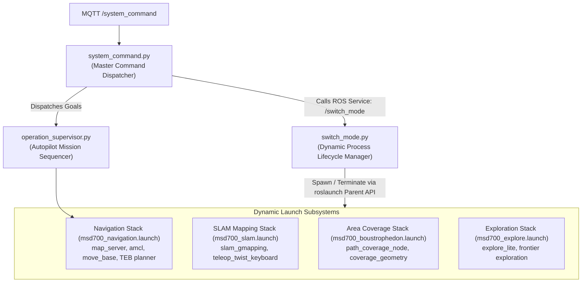
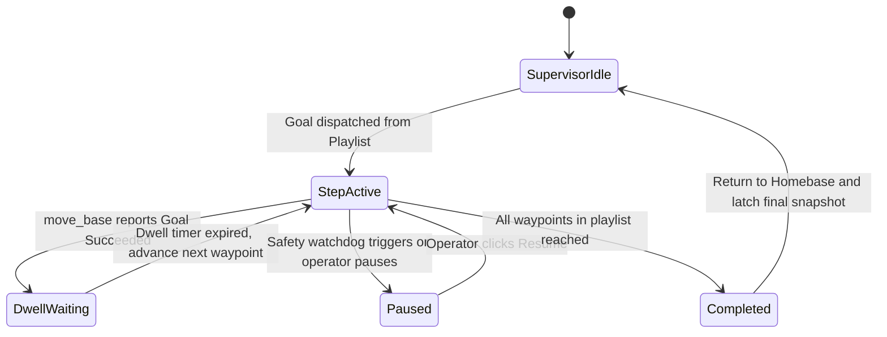

# Arsitektur Node Dinamis dan Peralihan Mode

<RoleBadge role="developer" />

Dokumen ini merinci bagaimana robot MSD700 secara dinamis beralih antara mode operasional (`idle`, `navigation`, `mapping`, `coverage`, dan `exploration`) saat runtime menggunakan `switch_mode.py`, `system_command.py`, dan `operation_supervisor.py` tanpa memulai ulang inti ROS utama.

## Topologi Orkestrasi Mode



---

## Mode Pengoperasian dan Tumpukan Node Aktif

| Modus Operasional | Node ROS Aktif | Node Tidak Aktif / Menuai | Memori & Jejak CPU |
| --- | --- | --- | --- |
| **`idle`** | `roscore`, `serial_node`, `imu_filter`, `robot_state_publisher`, `aws_mqtt`, `camera_client`. | `move_base`, `amcl`, `slam_gmapping`, `path_coverage_node`. | Minimal (sekitar 5% CPU, 200 MB RAM). |
| **`navigation`** | Semua node `idle` + `map_server`, `amcl`, `move_base`, `costmap_2d`. | `slam_gmapping`, `explore_lite`. | Navigasi Standar (sekitar 25% CPU). |
| **`mapping`** | Semua node `idle` + `slam_gmapping`, `teleop`. | `amcl`, `map_server` (sebagai gantinya membaca peta langsung). | Sedang (sekitar 35% CPU). |
| **`coverage`** | Semua node `navigation` + `path_coverage_node`. | `explore_lite`. | Beban Misi Penuh (sekitar 40% CPU). |
| **`exploration`** | Semua `mapping` node + `explore_lite` pencarian perbatasan. | `amcl`. | Beban Algoritma Tinggi (sekitar 45% CPU). |

---

## Siklus Hidup Proses Dinamis melalui `roslaunch` API Induk

Daripada menjalankan perintah shell seperti `system("roslaunch ...")` yang membiarkan proses zombie terpisah, `switch_mode.py` menggunakan API asli Python `roslaunch.parent.ROSLaunchParent`:

```python
import roslaunch
import rospy

class ModeSwitcher:
    def __init__(self):
        self.current_mode = "idle"
        self.active_launch_parent = None

    def transition_to(self, target_mode, launch_file_path):
        # 1. Gracefully terminate active launch stack
        if self.active_launch_parent is not None:
            rospy.loginfo(f"Stopping active stack for mode: {self.current_mode}")
            self.active_launch_parent.shutdown()
            self.active_launch_parent = None

        # 2. Instantiate and start new launch parent
        if target_mode != "idle":
            uuid = roslaunch.rlutil.get_or_generate_uuid(None, False)
            roslaunch.configure_logging(uuid)
            self.active_launch_parent = roslaunch.parent.ROSLaunchParent(
                uuid, [launch_file_path]
            )
            self.active_launch_parent.start()

        self.current_mode = target_mode
        rospy.loginfo(f"Successfully transitioned to mode: {target_mode}")
```

### Pembongkaran yang Anggun dan Pencegahan Zombi:
1. **Pengiriman SIGINT**: `launch_parent.shutdown()` mengirim `SIGINT` ke semua proses anak yang dikelola dalam urutan ketergantungan terbalik.
2. **Jendela Tenggang 5 Detik**: Node diberikan waktu hingga 5 detik untuk mengosongkan buffer disk (misalnya `map_saver` menulis `.pgm` dan gambar `.yaml`).
3. **Eskalasi**: Jika sebuah node gagal keluar dengan bersih dalam masa tenggang, proses induk akan meningkat ke `SIGTERM` dan `SIGKILL`, memastikan tidak ada node zombie yang tersisa di grafik master ROS.

---

## Urutan Misi Autopilot (`operation_supervisor.py`)

`operation_supervisor.py` mengelola eksekusi mandiri rute titik jalan multi-langkah dan daftar putar cakupan area:



### Kemampuan Supervisor Utama:
- **Snapshot Operasi Terkunci**: Publikasikan `/string/operation_snapshot` dengan QoS yang terkunci. Ketika operator mana pun membuka tab browser, status penuh misi aktif (indeks titik jalan aktif, pin rute yang tersisa, pengatur waktu diam) dipulihkan dalam milidetik.
- **Pengecualian Keamanan Autopilot**: Saat Autopilot diaktifkan, supervisor menekan jeda pemutusan operator selama 10 detik, sehingga misi penyisiran yang sudah berjalan lama dapat dilanjutkan tanpa pengawasan.

## Dokumentasi Terkait

- [ROS Package Registry](/id/development/ros-packages): Struktur paket dan definisi file peluncuran.
- [Status dan Perilaku](/id/development/state-and-behavior): Mesin status terbatas dan tingkatan pengawas yang terperinci.
- [Kontrak Pesan](/id/development/message-contracts): MQTT dan muatan pesan sinkronisasi operasi.