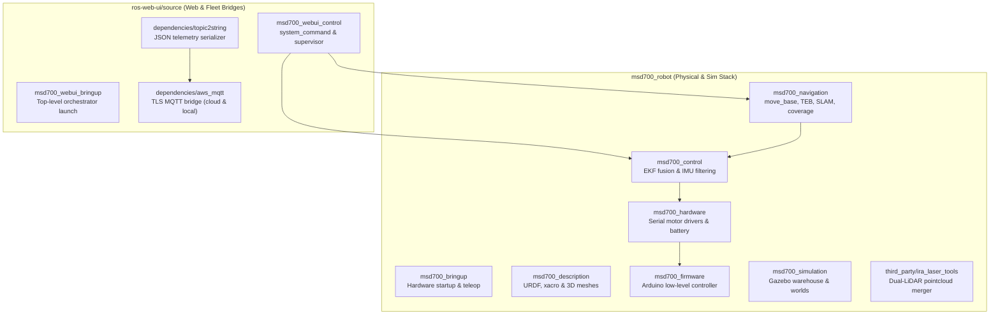

# Registri Paket ROS

<RoleBadge role="developer" />

Dokumen ini menyediakan registri komprehensif semua paket ROS 1 Noetic dalam ruang kerja MSD700 di `msd700_robot` dan `ros-web-ui/source`, merinci peran paket, file peluncuran utama, node aktif, topik yang diterbitkan/dilanggankan, dan parameter.

## Tata Letak Paket Ruang Kerja

## Direktori Paket: `msd700_robot`

### 1.`msd700_navigation`
Gerakan inti otonom, pemetaan SLAM, dan paket cakupan wilayah.

- **Node Utama**:
  - `move_base`: Server tindakan navigasi ROS standar yang memanfaatkan `navfn/NavfnROS` untuk perencanaan jalur global dan `teb_local_planner/TebLocalPlannerROS` untuk optimalisasi lintasan.
  - `path_coverage_node.py`: Perencana sapuan Boustrophedon menghitung jalur berkelok-kelok dan menangani perencanaan ulang rintangan secara real-time menggunakan `libs/coverage_geometry.py`.
  - `slam_gmapping`: Node pemetaan SLAM berbasis laser 2D yang menghasilkan jaringan hunian.
  - `amcl`: Filter partikel Lokalisasi Monte Carlo Adaptif untuk lokalisasi peta statis.
- **File Peluncuran Kunci**:
  - `msd700_navigation.launch`: Tampilan navigasi lengkap dengan server peta, AMCL, dan move_base.
  - `msd700_boustrophedon.launch`: Tumpukan eksekusi cakupan area dengan `path_coverage_node`.
  - `msd700_slam.launch`: Peluncuran Gmapping SLAM dengan teleoperasi.
  - `msd700_explore.launch`: Eksplorasi perbatasan SLAM otonom (`explore_lite`).

### 2.`msd700_control`
Mengelola estimasi keadaan, mengoordinasikan hierarki transformasi, dan fusi sensor.

- **Node Utama**:
  - `ekf_localization_node` (`robot_localization`): Odometri encoder roda sekering Kalman Filter yang diperluas (`/wheel/odom`) dan data sensor IMU (`/imu/data`) menjadi topik `/odometry/filtered` yang stabil.
  - `imu_filter_node` (`imu_tools`): Filter sensor Madgwick AHRS mengubah laju sudut mentah dan percepatan menjadi angka empat orientasi.
- **File Peluncuran Kunci**:
  - `robot_localization.launch`: Mengonfigurasi dan meluncurkan fusi EKF dengan pemuatan parameter dari `ekf_localization_config.yaml`.
  - `imu_filter.launch`: Meluncurkan estimasi orientasi Madgwick.

### 3.`msd700_description`
Mendefinisikan struktur kinematik fisik, geometri tumbukan, dan penempatan sensor menggunakan URDF dan Xacro.

- **Model URDF Utama**:
  - `urdf/msd700_field.urdf.xacro`: Model robot produksi skala sebenarnya (0,90 x 0,70 m, 4 roda, poros penggerak di tengah, tiang Velodyne).
  - `urdf/velodyne/VLP_16.urdf.xacro`: Model LiDAR 3D 16 saluran dengan ketelitian tinggi dan plugin sensor Gazebo.
  - `urdf/turtlebot3_waffle.urdf.xacro`: Model prototipe skala kecil yang lama.

### 4. `msd700_hardware` & `msd700_firmware`
Menangani antarmuka perangkat keras tingkat rendah, aktuasi motor, penghitungan pulsa encoder, dan status baterai.

- **Arsitektur Perangkat Keras**:
  - `serial_launch.launch`: Menghubungkan port serial host ke mikrokontroler Arduino/Teensy tingkat rendah melalui `/dev/ttyUSB*` pada 115200 baud.
  - Firmware Arduino mengeksekusi kontrol kecepatan PID loop tertutup, mendengarkan perintah kecepatan `/cmd_vel`, dan menerbitkan jumlah tick encoder roda.

### 5.`msd700_simulation`
Lingkungan simulasi gazebo untuk menguji algoritma navigasi dalam perangkat lunak.

- **Lingkungan Utama**:
  - `msd700_warehouse_nav.launch`: Meluncurkan Gudang Kecil AWS RoboMaker berukuran 14 x 21 m dengan model robot `msd700_field` skala sebenarnya.
  - `scripts/fetch_sim_worlds.sh`: Pengunduh sesuai permintaan untuk jerat simulasi 3D (12 MB) dari cabang GitHub `ros1`.

### 6.`third_party/ira_laser_tools`
Menggabungkan beberapa pemindai LiDAR 2D atau mengubah pointclouds 3D menjadi pemindaian planar virtual.

- **Node**:
  - `laserscan_multi_merger`: Menggabungkan LiDAR planar ganda menjadi satu topik `/scan` 360 derajat.

## Direktori Paket: `ros-web-ui/source`

### 1.`msd700_webui_control`
Menjembatani perintah web dan telemetri dasbor ke perangkat keras robot fisik.

- **Node Kunci**:
  - `system_command.py`: Berlangganan MQTT `/system_command`, mengelola sewa operasi eksklusif, mengirimkan tindakan, dan menerbitkan `/system_feedback`.
  - `operation_supervisor.py`: Urutan misi otonom yang mengelola kemajuan titik jalan Autopilot dan mengunci `/string/operation_snapshot`.
  - `switch_mode.py`: Orkestra layanan ROS secara dinamis beralih antara tumpukan peluncuran mode `idle`, `navigation`, dan `mapping`.
  - `hardware_monitor.py`: Pengawas latar belakang memverifikasi bahwa proses sensor penting dan perangkat USB tetap sehat.

### 2.`dependencies/topic2string`
Lapisan serialisasi berkinerja tinggi mengonversi jenis pesan ROS berat menjadi string JSON.

- **Node Kunci**:
  - `robotpose_from_string.py` / `robotpose_to_string`: serializer telemetri pose 25 Hz.
  - `laserscan_to_string.py`: Serializer pemindaian laser terkompresi 2 Hz.
  - `map_compression_node` / `map_decompression_node`: Kompresi zlib Base64 untuk jaringan hunian SLAM langsung.

### 3.`dependencies/aws_mqtt`
Jembatan transportasi terenkripsi yang menghubungkan topik ROS lokal ke broker HiveMQ pusat.

- **Luncurkan File**:
  - `nakayama_msd.launch`: Jembatan sisi robot yang menghubungkan topik ROS onboard ke cloud HiveMQ pada port 8883 (TLS).
  - `nakayama_cloud.launch`: Jembatan sisi server menerjemahkan topik MQTT menjadi topik cloud ROS per unit.
  - `local_msd.launch`: Jembatan sisi unit yang menghubungkan ke broker Mosquitto lokal (`127.0.0.1:1883`).

## Dokumentasi Terkait

- [Arsitektur](/id/development/architecture): Struktur dan lapisan sistem tingkat tinggi.
- [Penggabungan dan Kontrol Sensor](/id/development/sensor-fusion-and-control): Pengaturan EKF dan pipeline sensor yang mendetail.
- [Status dan Perilaku](/id/development/state-and-behavior): Mesin status terperinci untuk semua node kontrol.